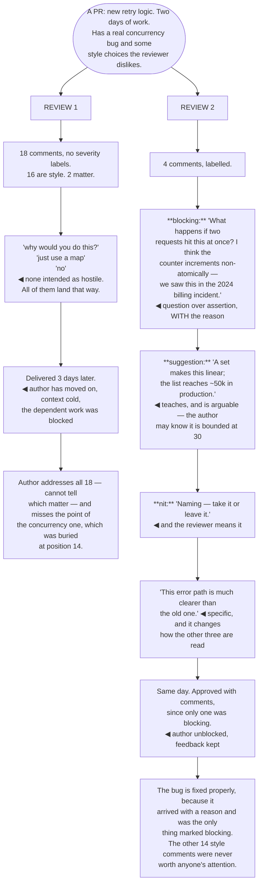

## The model

A code review comment is the most frequent writing most engineers do, and it has an unusual set of
properties: it is feedback on someone's work, delivered asynchronously, in text, with no tone, often
to someone you have never spoken to.

Every one of those makes it easy to land badly. The same sentence that would be neutral in
conversation reads as curt in a comment box, and the author — who spent two days on this — reads it
in the state of someone whose work is being judged. Getting the content right is the easy half.

## When to use it

You are reviewing, and about to leave a comment.

1. **Is this blocking or optional?** The author cannot tell, and the ambiguity is the single
   largest cause of review friction.
2. **Is this a fact or a preference?** "This will deadlock under concurrent writes" and "I would
   have used a map here" deserve very different framings.
3. **Would you say it this way out loud?** If not, rewrite it. The comment box strips the tone that
   would have made it fine in person.

## Speedrun

**What** — comments that say what to change, how strongly, and why, without making the author
defend themselves.

**How to write them**

1. **Label the severity.** A convention that says which comments block — `nit:`, `question:`,
   `blocking:` — removes the guessing, and it is the cheapest improvement available.
2. **Say why, not just what.** "Use a set here" is an instruction; "this is O(n²) on a list that
   reaches ~50k in production" is a reason that also teaches.
3. **Ask rather than assert when you are unsure.** "What happens if this is called twice?" is
   better than "this is not idempotent" when you have not checked — and it is right more often than
   the assertion.
4. **Praise specifically and rarely.** A comment noting a genuinely good decision costs nothing and
   changes how the rest of the review is read.
5. **Review fast.** **Review latency** is felt more than review quality; a same-day review with two
   comments beats a thorough one three days later.
6. **Take it to a conversation after two rounds.** If the same point is being restated, text has
   failed and five minutes of talking will resolve it.

**Why it works** — the author's uncertainty is the expensive part: which comments matter, whether
the reviewer is annoyed, whether disagreement is allowed. Labelling severity and giving reasons
removes all three.

**The convention worth adopting first** — severity prefixes. It is a one-line team agreement and it
removes most review friction immediately.

## Going deeper

### Severity, and why ambiguity is expensive

**Comment severity** is the information the author most needs and most reviews omit.

Without it, every comment is potentially blocking, so authors either address all of them — including
the ones the reviewer barely meant — or guess, and guess wrong sometimes. Both are worse than the
reviewer spending four characters.

The convention that works is short and shared:

- **`nit:`** — a preference, take it or leave it, not blocking.
- **`question:`** — genuinely asking, not a disguised objection.
- **`suggestion:`** — worth considering, author decides.
- **`blocking:`** — I think this must change before merge, and here is why.

What makes it work is that reviewers use `nit:` honestly. A reviewer who marks everything blocking
has removed the signal; a reviewer who marks a real correctness problem as a nit has removed it in
the other direction.

The related discipline is proportion. A review with eighteen comments, sixteen of which are style
preferences, buries the two that matter — and the author's attention is finite in exactly the way
the [[the skim test|skimming reader]]'s is.

Google's practice adds a useful default: approve with comments where the remaining points are
non-blocking. It unblocks the author, keeps the feedback, and trusts them to act on it — which is
also a statement about the relationship.

### Reasons, and the teaching effect

"Say why" is the difference between a comment that changes one line and a comment that changes how
someone writes code.

"Use a set here" gets the line changed. "This is O(n²) and the list reaches about 50k in production
— a set makes it linear" gets the line changed *and* leaves the author able to spot the next one
themselves. The second costs fifteen extra words.

The reason also makes the comment arguable, which is a feature. An instruction can only be complied
with or resisted; a reason can be examined, and sometimes the author knows something that makes it
wrong — the list is bounded at 30, the code runs once at startup.

Linking beats explaining for anything general. A comment pointing at the style guide, an ADR or a
previous discussion is shorter, more authoritative, and does not re-litigate a settled question in
someone's pull request.

And separate the objective from the subjective explicitly. "This will deadlock" is a fact and the
author should change it. "I would have structured this differently" is a preference and should be
marked as one — presenting a preference in the voice of a fact is the most common way reviews turn
adversarial.

### Tone, without the tone

Text strips prosody, and the same words that are neutral in speech read as sharp in a comment box.

The specific patterns that read badly are recognisable: bare imperatives ("change this"), rhetorical
questions ("why would you do this?"), "just" ("just use a map"), "obviously", and the unadorned
"no". None of them is intended as hostile, and all of them land that way at 9am to someone who spent
two days on the work.

Two reframes fix most of it. **[[question over assertion]]** — "what happens if this is called
twice?" instead of "this is not idempotent" — is genuinely more accurate when you have not checked,
and it invites explanation rather than defence. And commenting on the code rather than the person:
"this function does three things" rather than "you made this do three things".

Hedging has a real role here, unusually. In most writing, reflex hedging costs credibility; in
review comments, "I might be missing context, but…" is often literally true and it materially
changes how the point lands.

Greiler's research on review anxiety is worth knowing about: a substantial fraction of engineers
report significant stress around having code reviewed, and it correlates with slower, more defensive
authoring. The reviewer's tone is one of the few variables anyone controls.

Specific praise is the cheapest available correction. One comment noting a genuinely good decision —
not "nice!", but "this error path is much clearer than the old one" — changes how every other
comment in the review is read.

### Latency, size, and knowing when to stop

**Review latency** is the thing authors feel most and reviewers optimise least.

A same-day review with two useful comments beats a thorough review three days later, because the
author has moved on, the context is cold, and everything downstream was blocked in the meantime.
Google's guidance is to respond within one business day, and the reasoning is throughput rather than
politeness.

Size is the reviewer's leverage over their own workload. Review quality falls sharply past a few
hundred lines — reviewers approve large diffs at higher rates while finding fewer defects — so
asking for a change to be split is usually the highest-value comment available.

The stopping rule matters as much as the starting one. After two rounds on the same point, text has
failed: switch to a call, resolve it in five minutes, and record the outcome in the thread so the
next reader knows how it ended.

And the reviewer's job is not to produce the code they would have written. It is to ensure the code
is correct, maintainable and consistent with the codebase — a different and much smaller standard.
Every comment that is only "I would have done it differently" spends the author's attention and the
reviewer's credibility at the same time.

## See it work

One pull request, reviewed twice.

Review one is not written by an unkind person. "Why would you do this?" and "just use a map" are
things engineers say to each other constantly in conversation, where tone and a shrug carry most of
the meaning — and the comment box delivers neither.

Burying the concurrency bug at position fourteen is the substantive failure. Sixteen style comments
consumed the author's attention before the one that mattered, and attention is finite in a review
exactly as it is in a document.

Three days of latency costs more than the review quality gained. The author has moved on, the
context is cold, dependent work was blocked, and the whole exchange now takes longer than it would
have with two comments on the same day.

Review two's blocking comment does three things in two sentences: it asks rather than asserts, which
is more accurate since the reviewer has not run it; it gives the reason; and it cites a real
incident, which makes it checkable rather than an opinion.

And the praise line is doing more work than it looks. One specific observation about the error path
costs seven words and changes how the author reads the blocking comment above it — from "this person
is picking at my work" to "this person read it carefully".

## Next

Writing under pressure closes the group: incident updates, outage comms, and the writing that
happens when you have no time to edit.
