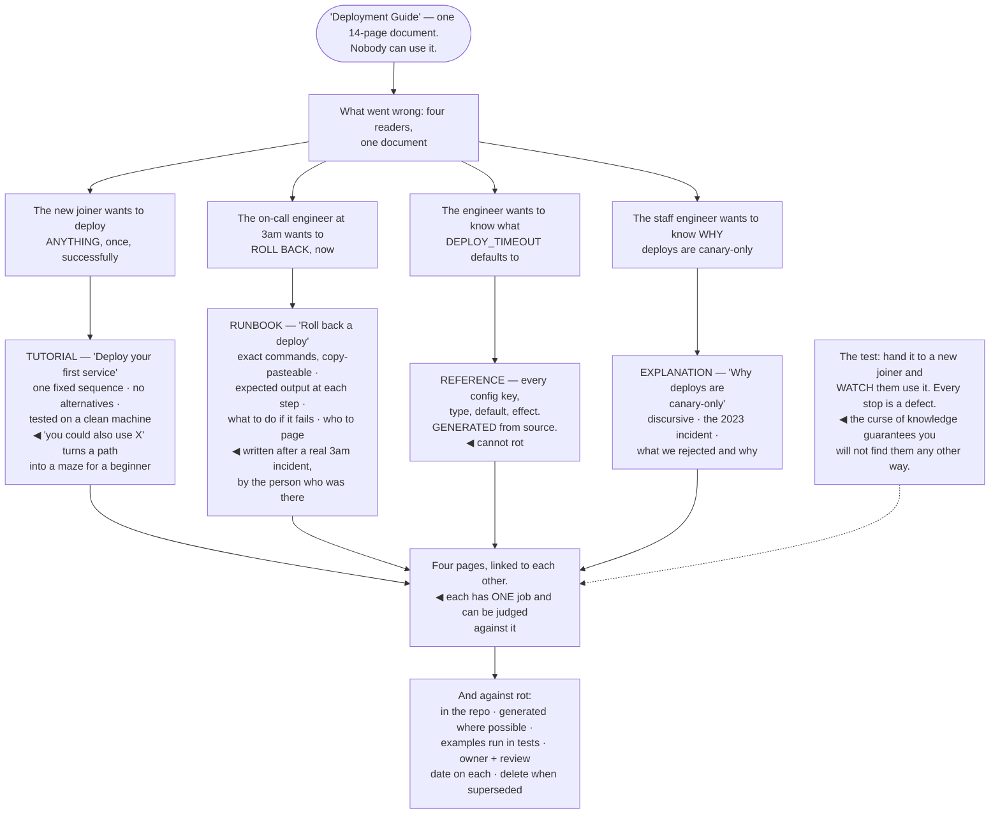

## The model

Most documentation fails not because it is badly written but because it is four different documents
mixed together. Someone learning, someone with a specific task, someone looking up a parameter and
someone trying to understand why it works this way all need different things, and a page that
serves all of them serves none.

Procida's **four kinds** is the most useful correction available: a **tutorial** teaches, a
**how-to guide** solves a specific problem, a **reference** describes, and an explanation gives
understanding. They have different structures, different voices, and mixing them is the single most
common documentation failure.

## When to use it

You are writing something someone will read while trying to do something.

1. **What did they come here to do?** Learn, accomplish a task, look something up, or understand
   why. Each is a different document.
2. **What do they know?** Documentation is read by a first-day joiner and a five-year veteran, and
   the entry points for those two are different.
3. **What will make this wrong in six months?** Documentation that describes something that changes
   frequently will rot, and rotted docs are worse than none.

## Speedrun

**What** — four separable kinds, each with its own shape:

| | Serves | Shape | Voice |
|---|---|---|---|
| **Tutorial** | a beginner learning | a guaranteed-to-work sequence | "we will" |
| **How-to guide** | someone with a task | steps for one goal | "to do X, do Y" |
| **Reference** | someone looking up | complete, consistent, dry | descriptive |
| **Explanation** | someone wanting to understand | discursive, with reasons | "the reason is" |

**How to write it**

1. **Decide which kind you are writing**, and do not mix. A tutorial with reference tables in it
   loses the beginner; a reference with narrative loses the person looking something up.
2. **Start from the reader's task**, not the system's structure. Nobody reads documentation for
   pleasure — they arrived with a problem.
3. **Make every tutorial actually work**, start to finish, on a clean machine. One broken step
   destroys trust in the whole document.
4. **Keep reference material next to the code**, so it changes when the code changes. Distance
   causes [[doc rot]].
5. **Write the runbook from a real incident**, at 3am, by the person who was there. Runbooks
   written in the abstract omit the step everyone forgets.
6. **Date it and own it.** A page with a name and a last-reviewed date is one someone can trust or
   distrust; an anonymous undated page is neither.

**Why it works** — separating by reader intent means each document has one job and can be judged
against it. Merged documentation cannot be judged at all, which is why it degrades unnoticed.

**The failure that costs the most** — a subtly out-of-date document. It is trusted, it is wrong, and
it costs more than the absence of documentation would have.

## Going deeper

### The four kinds, and why mixing fails

Each kind serves a different reader in a different state, and the mismatch is what makes merged
documents unusable.

**Tutorials** teach by doing. The reader is a beginner who does not yet know what they do not know,
so the tutorial makes every choice for them: a fixed sequence, guaranteed to work, with no options.
The common mistake is adding alternatives — "you could also use X" — which the beginner cannot yet
evaluate, and which turns a path into a maze.

**How-to guides** solve one problem for someone who already has context. "How to rotate the signing
key." They assume competence, skip the teaching, and get to the steps. The mistake here is
explaining background the reader already has.

**Reference** describes what exists: parameters, endpoints, configuration, return values. Complete,
consistently structured, dry, and optimised for lookup rather than reading. The mistake is
narrative — nobody reads reference material in order, so prose is wasted effort that also makes
scanning harder.

**Explanation** gives understanding: why the design is this way, what the alternatives were, how
the pieces relate. Discursive, and it is the only one that can be opinionated. The mistake is
putting it in the reference, where the person looking up a timeout value has to read past it.

The practical rule that follows: one page, one kind, with links between them. A tutorial that links
to the reference is serving both readers; a tutorial with the reference inlined is serving neither.

### Runbooks, which are their own thing

A runbook is a how-to guide written for someone under pressure, and that changes what belongs in
it.

The reader is at 3am, possibly not the person who built the system, possibly frightened. They need
steps they can follow without understanding, in order, with the expected output at each one so they
know whether it worked.

What makes a runbook good is specificity that would be excessive anywhere else:

- exact commands, copy-pasteable
- what the output looks like when it worked
- what to do if it did not
- who to escalate to, by name and channel, and at what point

The way to get one is to write it during or immediately after a real incident, by the person who
was there. Runbooks written in the abstract, by someone imagining the failure, consistently omit
the step everyone forgets — the VPN, the credential, the thing that has to be restarted first.

And it has to be tested. The SRE practice of running a game day, or simply having someone
unfamiliar follow the runbook on a non-production system, finds the missing step before the
incident does. An untested runbook is a hypothesis.

### Doc rot

**Doc rot** is documentation that describes a system that no longer exists, and it is worse than
missing documentation because it is trusted.

The mechanism is straightforward: code changes and documentation does not, because nothing forces
them to change together. Every day of drift makes the document slightly more wrong, and nothing in
the document announces this.

The structural defences are the ones that work. Keep documentation in the repository with the code,
so it appears in the same pull request. Generate reference material from the source where possible —
generated docs cannot drift. Put runnable examples in tests, so a broken example fails the build.

The behavioural defences are weaker and still worth having. A named owner per document. A
last-reviewed date, visible at the top. A periodic review of the small number of documents that
matter, which is the key qualifier — reviewing everything is a commitment nobody keeps.

And delete aggressively. A page describing a system that was replaced two years ago is a trap for
the next person, and deleting it is a strictly positive act. Volume of documentation is not the
measure; the measure is whether the things people actually look up are correct.

### Writing for the reader who arrives with a problem

Nobody reads documentation for pleasure. Every reader arrives mid-task, mildly frustrated, looking
for one specific thing.

That shapes the entry point. The top of any documentation set should be a router — "what are you
trying to do?" — rather than an architectural overview, because the architectural overview is what a
writer wants to write and almost never what a reader came for.

Searchability matters more than organisation. Most readers arrive from a search rather than by
browsing, so headings should contain the words people would actually search for — including the
error message text, which is what someone with a problem will paste.

Examples do more work than explanation. A copy-pasteable snippet that works is worth several
paragraphs describing the parameters, and a reader will try the snippet before reading anything.

The onboarding test is the cheapest quality measure available: give the documentation to a new
joiner and have them use it without help, while you watch. Every place they stop is a defect, and
you will not find those defects any other way — the curse of knowledge guarantees it.

## See it work

One page, split into four.

The fourteen-page deployment guide is the natural output of writing everything you know about
deploys in one place. Every reader can technically find their answer in it, and every one of them
has to read past three other readers' material to get there.

The 3am reader is the one the merged document fails worst. They need copy-pasteable commands and
expected output, and instead they get a tutorial's teaching voice and an explanation's discussion of
alternatives — at exactly the moment when reading comprehension is at its lowest.

Generating the reference from source is what makes one of the four immune to rot. Config keys,
types and defaults change with the code, and any hand-written version of that page starts drifting
the day it is written.

The explanation page is the one people are most likely to skip writing and the one that answers
"why is it like this" two years later. It is also the only one of the four that can be opinionated,
which is why it does not belong inside the reference.

And the onboarding test is the only reliable quality measure. Watching a new joiner use the
documentation surfaces every assumed step in an afternoon — asking them afterwards whether it was
clear surfaces almost none of them.

## Next

Code review comments cover the highest-frequency writing in most engineering jobs, and the one where
tone changes the outcome most.
