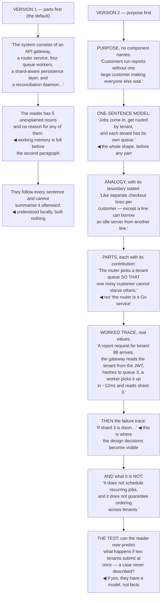

## The model

The instinct when explaining a system is to describe its components in order, because that is how
it is built. Readers cannot hold components they do not have a reason for, so the description slides
off.

**Purpose before parts** is the correction. Say what the system is for and what would be worse
without it, then give the shape in one sentence, then descend into the parts. A reader with a
purpose has somewhere to attach each detail; a reader without one is memorising.

## When to use it

You are writing an explanation someone will read to understand rather than to decide.

1. **What is this for?** If you cannot say it in a sentence without naming any component, you do
   not yet have the explanation.
2. **What does the reader already have to attach it to?** An analogy to something they know is
   worth several paragraphs of description.
3. **How deep do they need to go?** Most readers need the shape; a few need the mechanism. Both can
   be served by ordering, and neither is served by averaging.

## Speedrun

**What** — a layered explanation: purpose, shape, parts, and one worked trace.

**How to write one**

1. **State the purpose first**, in terms of what the system does for someone. No component names.
2. **Give [[the one-sentence model]]** — the whole shape compressed. "Requests come in, get routed
   by tenant, and each tenant's work runs on its own queue."
3. **Then the parts**, each introduced by what it contributes rather than what it is.
4. **Use [[progressive disclosure]].** Complete at every level: the summary is true, the section is
   true with more detail, the deep dive is true with all of it.
5. **Include one [[worked trace]]** — a single real request followed end to end. It does more than
   any diagram.
6. **Say what it is not.** Boundaries and non-responsibilities prevent the wrong mental model,
   which is much harder to fix later than a missing one.

**Why it works** — understanding is attaching new information to existing structure. Purpose
supplies the structure, so the parts have somewhere to go instead of accumulating.

**The test that catches a bad explanation** — can the reader now predict what happens in a case you
did not describe? If not, they have facts rather than a model.

## Going deeper

### Purpose, then shape, then parts

The order is doing the work, and it is the reverse of how systems get built and described.

**Purpose** is what the system does for a person, stated without naming any of its components.
"Customers see their order status without contacting support" is a purpose. "The order-status
service exposes a REST API" is a part, dressed as one.

**Shape** is the whole thing in one sentence — what goes in, what comes out, and the one structural
fact that makes it what it is. If you cannot compress it to a sentence, either you do not understand
it well enough yet, or it genuinely has two systems in it and should be explained as two.

**Parts** come last and each is introduced by its contribution. "The router picks a tenant queue so
that one noisy customer cannot starve the others" is a part with a reason attached; "the router is a
Go service using consistent hashing" is an implementation detail with no anchor.

The reason the order matters is cognitive load. Sweller's work is about the limits of working
memory: a reader holding six unexplained components has nothing left for the seventh, whereas a
reader holding one purpose can attach twelve parts to it because each one collapses into the
structure as it arrives.

The tell for a purpose-last explanation is a reader who follows every sentence and cannot summarise
it afterward. They understood locally and built nothing.

### Analogy, and its limits

An analogy is the cheapest way to give someone structure they already have, and it is worth the
effort of finding a good one.

"A queue is a line at a counter" is doing real work — it carries ordering, waiting, service rate,
and what happens when arrivals outpace service, all for free. Several paragraphs of description
would deliver less.

The cost is that every analogy is wrong somewhere, and readers extend them past where they hold. So
state the boundary explicitly: "like a line at a counter, except anyone can be served out of order
if they are marked urgent". Naming the break is what prevents the wrong model.

Prefer analogies from ordinary life over analogies from other technical systems. "It works like
Kafka" only helps readers who know Kafka, and it silently excludes everyone else while sounding
precise.

The Feynman technique is the same idea pointed at yourself: explain it to someone with no
background, notice exactly where you reach for jargon, and go back to the source for those parts.
The places you cannot make simple are the places you do not yet understand.

### Progressive disclosure

**Progressive disclosure** means every level is complete and true, with more detail at each depth,
rather than the shallow version being a simplification you later contradict.

- **Level one, a paragraph** — what it does, for whom, and the one-sentence shape.
- **Level two, a page** — the main components, what each contributes, how a request flows.
- **Level three, the details** — failure modes, edge cases, configuration, and the parts that only
  matter when something is wrong.

The property that makes it work is that a reader can stop at any level with a correct model. A
summary that is subtly false, corrected two pages later, is worse than no summary — the reader has
built something they now have to unbuild.

This also serves the two audiences a technical explanation always has. Most readers need level one
and some of level two; a small number need all of it. Averaging into a single medium-depth document
serves neither, and it is what most system documentation does.

Headings do the navigation, which is why finding-headings matter here. A reader who wants failure
modes should reach them in ten seconds without reading the components section.

### The worked trace

A **worked trace** — one real request, followed end to end — is the highest-value element in any
system explanation, and it is routinely omitted in favour of a diagram.

A diagram shows the static structure. The trace shows the dynamics: what actually happens, in what
order, with real values. "A GET for order 4471 arrives at the gateway, which reads the tenant from
the JWT, hashes it to queue 3, where a worker picks it up in about 12 ms and reads from the tenant's
shard" carries the architecture *and* the behaviour.

Use real values rather than placeholders. `order_id=4471` and `12 ms` are absorbed differently from
`<order_id>` and `<latency>`, for the same reason that concrete beats abstract everywhere else.

One trace of the normal path, then one of an interesting failure, is usually the whole explanation.
The failure trace is where the design decisions become visible — what happens when the shard is
down is the part that explains why the queue exists.

And it is the test as much as the explanation. If you cannot write the trace without checking, you
do not know the system well enough to be explaining it — which is a useful thing to discover while
writing rather than in review.

## See it work

Explaining a multi-tenant job runner, two ways.

Version one is what almost every system document does, and the failure is not in any individual
sentence. Five accurate nouns arrive before any of them has a reason, and by the second paragraph
the reader is holding items rather than building structure.

The purpose statement is deliberately free of component names, which is harder than it sounds.
"Customers run reports without one large customer making everyone else wait" is a fact about people;
every attempt to write it with the word "queue" in it slides back into describing the parts.

The analogy with its boundary named is what stops the wrong model forming. Separate checkout lines
carries ordering, waiting and starvation for free — and "except a line can borrow an idle server" is
the one sentence that prevents a reader extending it into a wrong prediction later.

The worked trace with real values does more than the diagram it replaces. Tenant 88, queue 3, twelve
milliseconds — a reader following one concrete request understands both the structure and the
behaviour, and the failure trace afterward is where the queue's existence finally makes sense.

And the prediction test is the only honest check. A reader who can say what happens when two tenants
submit simultaneously — a case nobody described — has a model. One who can recite the components
has a list.

## Next

The status update covers the highest-frequency writing most engineers do, and the one where the
audience model changes most between readers.
