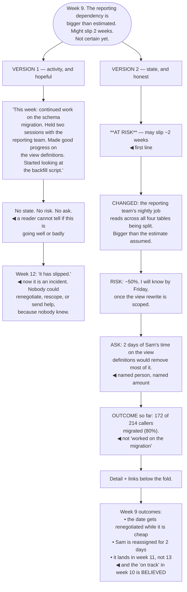

## The model

Most status updates report activity — what people worked on this week. Nobody reads those, because
activity is not what anyone needs to know.

A **status update** exists so that people who depend on you do not have to ask, and so that
problems arrive while they are still decisions. That means the useful content is: are we on track,
what changed, and what needs someone else. Everything else is optional, and the list of tasks
completed is usually the least useful part of it.

## When to use it

Anything spanning more than a couple of weeks, or that other people are planning around.

1. **Who depends on this?** They are your audience, and what they need is whether their own plan
   still holds.
2. **What has changed since last time?** The delta is the content. A status update that repeats
   last week's is training people not to read it.
3. **What is at risk?** If nothing, say so plainly. If something is, say it early — that is the
   whole reason the format exists.

## Speedrun

**What** — a short, regular, skimmable note whose job is to remove the need to ask and to surface
risk early.

**How to write one**

1. **Lead with the state.** On track, at risk, or blocked, in the first line. Everything else is
   support.
2. **Report outcomes, not activity.** "Reconciliation breaks are down from 40 to 12 a week" beats
   "worked on reconciliation".
3. **Say what changed since the last one.** New risks, resolved risks, changed dates. The delta is
   why anyone opens it.
4. **Raise risk early and specifically.** "The schema split may slip two weeks; I will know by
   Friday" is a decision someone can make. Certainty arrives too late to be useful.
5. **Name what you need**, from whom, by when. An update with no asks usually means the asks are
   being absorbed silently.
6. **Keep it short and on a fixed rhythm.** Same day, same shape, five to ten lines. Predictable
   beats comprehensive.

**Why it works** — the value is in the interruptions that do not happen and the problems that
arrive early. Both are removed by an update that reports activity instead of state.

**The line that makes an update valuable** — the honest "at risk" three weeks before the date. It
is uncomfortable to write and it is the entire point.

## Going deeper

### Activity versus outcome

**Activity vs outcome** is the distinction that separates an update people read from one they
archive.

Activity is what you did: attended meetings, wrote code, investigated a bug. Outcome is what changed
in the world: the breaks are down, the migration is 60% through, the deploy takes a day instead of a
week.

Activity feels safer to report, especially in a bad week, because it demonstrates effort. It is also
unreadable — a reader cannot tell from a list of tasks whether things are going well, which means
they have to ask, which is what the update was for.

The reframing is to write for the question people would otherwise ask. Not "what have you been
doing?" but "should I still plan around this date, and is there anything I need to do?"

Where a week produced no outcome — which happens, particularly in investigation phases — say that
plainly and say what it ruled out. "No progress on the fix; we eliminated the connection pool as a
cause" is honest, useful, and much better than a paragraph of activity implying more.

### The early warning

**The early warning** is the highest-value thing a status update produces, and the hardest to
write.

The arithmetic is simple. A risk raised three weeks out is a decision — scope can change, help can
arrive, expectations can be reset. The same risk raised in the final week is an incident, and the
only remaining option is disappointment.

What makes it hard is that it is uncomfortable and it feels premature. You are not certain it will
slip; saying so feels like admitting failure; and there is a real hope it recovers. So the natural
behaviour is to wait for certainty, which arrives exactly when it stops being useful.

The form that makes it easy to write is a probability and a date. "The schema split may slip about
two weeks — the risk is the reporting dependency, and I will know by Friday" commits to nothing
false, communicates the risk, and gives a point at which it resolves.

The cost of the alternative falls on other people. A manager who cannot renegotiate a date they do
not know is at risk, a dependent team that plans around a slipping commitment, a stakeholder who
finds out last. Absorbing it privately protects nobody, as the [[managing up]] argument covers.

And the trust effect compounds. An engineer whose "on track" is reliable, because their "at risk" is
also reliable, gets believed — and that is worth more than any individual project landing on time.

### The shape

The specific format matters less than consistency, and a workable default is short.

**State**, first line: on track, at risk, or blocked. Colour codes work if everyone means the same
thing by them, which requires saying what they mean — **red-amber-green** with undefined thresholds
degenerates into "amber means I am worried" and stops carrying information.

**What changed** since the last update. Two or three lines. This is the part that is actually read.

**Risks**, with a probability and a resolution date where possible.

**Asks**: what you need, from whom, by when. Explicit, because an ask embedded in a paragraph does
not get actioned.

**Detail**, at the bottom or linked, for the people who want it. Nobody senior reads this section
and its existence is what lets the top stay short.

Rhythm beats richness. The same day each week, the same shape, even when there is little to say —
predictability is what makes people read it, and a skipped update is read as bad news whether or not
it is.

### Audience, and the multi-reader problem

A status update usually has several audiences with different needs, and trying to average them
produces something nobody uses.

The dependent team wants to know whether their plan holds. Your manager wants risks and asks. A
stakeholder wants the outcome and the date. The team itself wants the details.

The resolution is layering rather than separate documents: the first three lines serve everyone who
only needs the state, and the detail below serves the people who want it. That is [[progressive
disclosure]] applied to a recurring note.

Where audiences genuinely diverge — an executive summary versus an engineering update — two
documents is the honest answer, and the executive one is usually three sentences.

The failure mode to avoid is the update written to look good. Optimism in status reporting is
detected quickly and destroys the signal permanently: once "on track" has meant "probably not", every
future update is discounted, including the accurate ones.

## See it work

Week nine of a migration, reported two ways.

Version one is not dishonest, and that is what makes it a good example. Every sentence is true, the
work described genuinely happened, and a reader finishes it unable to answer the only question they
had.

The absence of an ask is the most expensive omission. Two days of Sam's time would have removed most
of the risk in week nine, and nobody could offer it because nobody knew it was needed — the cost was
absorbed silently and paid publicly three weeks later.

The fifty-percent-with-a-date form is what makes the warning writable. It commits to nothing false,
it communicates the actual state of knowledge, and Friday is a point at which the ambiguity
resolves — which is what makes it a decision for someone rather than an anxiety.

Leading with the state and putting the outcome number in — 172 of 214, not "worked on the
migration" — is what lets a reader stop after four lines with everything they needed. The detail
below the fold serves the one person who wants it.

And the last line is the compounding return. An engineer whose "at risk" is reliable has an "on
track" that is believed, and that credibility is worth more over a career than any single project
landing on schedule.

## Next

Documentation covers writing for a reader you will never meet, arriving in six months with a
problem you did not anticipate.
