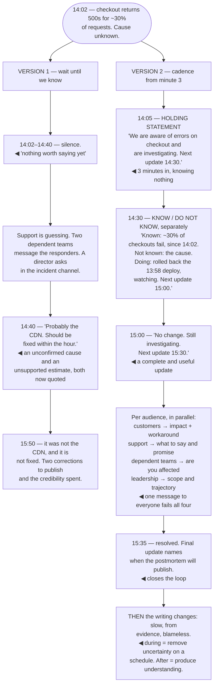

## The model

During an incident, the writing has one job: stop people from wondering. Not to explain, not to
reassure, and certainly not to be well crafted.

That inverts most writing advice. An **incident update** is written fast, on a fixed rhythm, saying
what is known and what is not — and an update that says "still investigating, nothing new, next
update in 30 minutes" is doing its job perfectly. **Cadence over content** is the rule, because the
cost being avoided is the six people who interrupt the responders to ask what is happening.

## When to use it

Something is broken, or something is about to be, and other people are affected.

1. **Who is wondering?** Customers, support, dependent teams, leadership. Each needs a different
   update and none of them needs the technical detail.
2. **What is actually known?** Separate it from what you suspect. Publishing a suspicion as a fact
   is how a bad hour becomes a bad week.
3. **When is the next update?** Every update should say when the next one comes. That single
   sentence removes most of the anxiety.

## Speedrun

**What** — short, frequent, honest updates on a fixed schedule, aimed at people who cannot see what
you can.

**How to write them**

1. **Publish a [[holding statement]] fast.** "We are aware of errors on checkout and are
   investigating. Next update at 14:30." Within minutes, before you know anything.
2. **Say what you know and what you do not.** Separately, explicitly. Confusing the two is the
   single most damaging thing you can do.
3. **Commit to the next update time**, and keep it even when there is nothing new. "No change,
   still investigating" is a complete and useful update.
4. **Describe impact in the reader's terms** — what they cannot do — rather than in system terms.
   "Refunds are not processing" beats "the payment worker is degraded".
5. **Do not speculate about cause**, and do not estimate resolution time you do not have. Both get
   quoted back at you.
6. **Separate the response from the analysis.** During: mitigate and communicate. After: the
   [[blameless postmortem]], written properly and slowly.

**Why it works** — uncertainty is what generates interruptions, escalations and panic. A predictable
stream of honest updates removes the uncertainty even while the problem persists.

**The sentence that buys the most** — "next update at 14:30." It converts an open-ended worry into
a wait, and people can work while they wait.

## Going deeper

### Cadence over content

The instinct is to wait until you have something worth saying. That instinct is wrong, and it is
the most common failure in incident communication.

Silence is read as absence. Someone watching a broken system with no updates concludes that nobody
is on it, and their reasonable response is to find out — which means messaging the responders, who
are the people least able to afford the interruption.

A regular update that contains nothing new still carries information: it says someone is on this, we
are still working, and here is when you will hear again. That is most of what the reader needed.

Fifteen to thirty minutes is a common rhythm for an active incident, and shorter early on. The exact
interval matters less than that it is stated and kept — a promised update that does not arrive is
worse than never having promised one.

The practical structure is a named communications role, separate from the people fixing it. An
engineer switching between debugging and writing updates does both badly, and the switching cost
lands at the worst moment.

### What we know, and what we do not

**What we know and do not know**, stated separately, is the discipline that protects everything
afterward.

Early in an incident the temptation is to publish the current hypothesis, because it is the only
thing you have. Do not: a suspicion published as a fact gets quoted, planned around, and repeated
by people who did not read the caveat — and correcting it costs more credibility than the silence
would have.

The form that works is explicit separation. "What we know: checkout returns 500 for about 30% of
requests, starting 14:02. What we do not know: the cause. What we are doing: rolled back the 13:58
deploy, watching for recovery."

Uncertainty stated plainly is reassuring rather than alarming, which surprises people. "We do not
yet know the cause" reads as competence; a confident wrong cause reads as competence for twenty
minutes and then as unreliability for a year.

Two specific things not to publish: a cause you have not confirmed, and a resolution time you
cannot support. "We expect this fixed within the hour" is the most quoted sentence in any incident,
and it is almost always wrong.

### Audience, during

Incident communication has more distinct audiences than almost any other writing, and they need
genuinely different things.

**Customers** need impact and workaround, in product terms. What they cannot do, what they can do
instead, and when they will hear more. No system names, no technical detail, no speculation.

**Support** needs the same plus a little more: what to tell people who ask, what is safe to promise,
and what to escalate. They are the ones absorbing the volume, and equipping them is what stops the
volume reaching the responders.

**Dependent teams** need to know whether their own systems are affected and whether to take action.
Specific and technical, and short.

**Leadership** needs scope, trajectory, and whether anything is needed from them. Not the technical
narrative — and the update they get should let them answer questions without asking you.

**The responders** need a shared channel where everything is narrated as it happens, which is a
different artifact entirely — it is the raw material for the timeline afterward, and writing it
during costs almost nothing.

The failure is one message sent to everyone. It is too technical for customers, too vague for
dependent teams, and it generates a second round of questions from each group.

### After: the switch to slow writing

The moment the incident is mitigated, the writing changes completely, and holding the distinction
is what makes both work.

During, you are removing uncertainty on a schedule. After, you are producing understanding, and the
constraints invert — take time, build the timeline from evidence rather than memory, and let the
analysis be as long as it needs.

The handover between the two is worth doing deliberately. A final incident update says: it is
resolved, here is what happened at a high level, here is when the postmortem will be published. That
last clause closes the loop for everyone who was following.

The public-facing version is a separate document again, and it has a specific shape that has become
standard: what happened, in plain language; what the impact was, specifically; what caused it; what
you are doing so it does not recur. Honest, unhedged, no blame — and the absence of defensiveness is
what makes it read as trustworthy.

The thing to resist is minimising. "A brief degradation affected a small number of users" when it
was two hours and 40% is a sentence that costs more than the outage did, because customers can
measure the first part themselves.

## See it work

A checkout outage, communicated two ways.

Thirty-eight minutes of silence is the natural behaviour and the expensive one. Nobody had anything
worth saying, and the absence was read as absence — which produced exactly the interruptions the
responders could least afford.

The 14:40 update is where a bad hour becomes a bad week. A suspected cause and an invented
resolution time, both published as statements, both wrong, and both now quoted by people who did not
read them as provisional.

Version two's first update is three minutes in and contains no information at all. That is the
point: "we know, we are on it, next update at 14:30" converts an open-ended worry into a wait, and
people can work while they wait.

The 15:00 update saying nothing changed is the one people are tempted to skip, and it is doing the
same job as the first. A promised update that arrives with no news maintains the contract; one that
does not arrive breaks it, and the interruptions resume immediately.

And the switch at the end is worth naming explicitly. During the incident the writing is fast,
plain and scheduled; afterwards it is slow, evidence-based and blameless — two different disciplines
that share a subject and nothing else.

## Next

The Speaking group moves from text to rooms: presentations, meetings, and explaining something at a
whiteboard with no time to edit.
