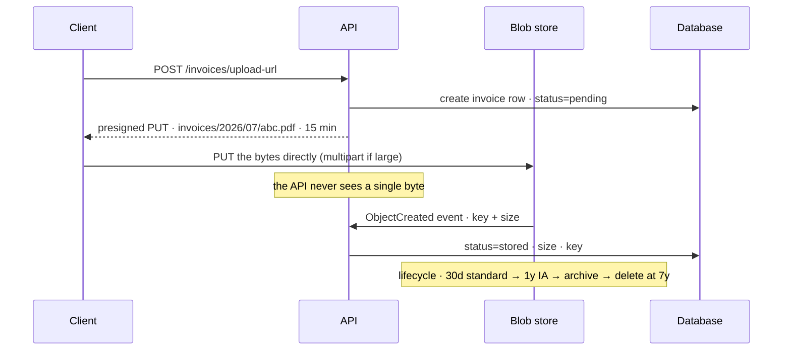

## The model

**Blob storage** — S3, GCS, Azure Blob — stores whole objects addressed by a key, inside a
**bucket**. Put an object, get an object, delete an object. There is no querying by content
and no partial update.

It is the cheapest durable storage available by a wide margin, it scales without you doing
anything, and it is designed to be read directly by clients. That last property is the one
that shapes designs: a file uploaded through your application costs you the bandwidth, the
memory and the request slot, and none of that is necessary.

## When to use it

You have data that is large, whole, and not something you query into.

1. **Is the object read and written whole?** Images, video, backups, exports, logs — yes.
   Anything you need to update a field inside belongs in a database.
2. **Would this bloat your database?** A 5 MB image in a row makes every backup, replica and
   buffer pool carry it. The object goes to blob storage and the row keeps the key.
3. **Do clients need it directly?** If users upload or download it, route them straight to
   the store with a **presigned URL** rather than through your servers.

## Speedrun

**What** — a flat key-value store for large values, with HTTP as the interface. Eleven nines
of durability, effectively unlimited size, and pennies per gigabyte per month.

**How to use it in a design**

1. **Store the key in your database, the bytes in the bucket.** The row holds
   `s3://bucket/orders/2026/07/invoice-abc.pdf` and metadata; the object holds the file.
2. **Upload direct from the client.** Your server issues a **presigned URL** — a
   time-limited, signed link authorising one operation — and the client uploads straight to
   the store. Your application never sees the bytes.
3. **Download direct too**, presigned for private objects or via a [[CDN]] for public ones.
4. **Use a [[multipart upload]] above about 100 MB**, so a failure retries one part rather
   than the whole file.
5. **Set a [[lifecycle policy]]** moving objects to colder **storage classes** on a schedule
   and deleting them at the end. Storage is cheap until you keep everything forever.
6. **Design keys as a path with a date in it** — `type/YYYY/MM/DD/id` — so listing is
   bounded and lifecycle rules can target prefixes.

**Why it works** — the store is built for exactly one access pattern and refuses everything
else, so it can be replicated across facilities, priced near cost, and scaled without
coordination. Your application stops being a pipe for bytes it does not need to inspect.

**The design smell** — a file upload endpoint that reads the whole body into memory. At 100
concurrent 50 MB uploads that is 5 GB of RAM doing nothing but forwarding, and it is the
reason presigned URLs exist.

## Going deeper

### Why it is not a filesystem

The name "object storage" is doing real work, and treating it as a disk produces most of the
mistakes.

**There are no directories.** An **object key** is one flat string: `2026/07/invoice.pdf`
contains slashes and that is all, since the store presents a flat namespace and consoles fake
folders by grouping on prefixes.
So "move a folder" is copy-then-delete of every object, and "rename" does not exist.

**There is no partial update.** Changing one byte means uploading the whole object again.
Append-only workloads that feel natural on a filesystem — a growing log file — are wrong
here, and the shape that works is many small objects rather than one that grows.

**Listing is expensive and paginated.** Listing a prefix with ten million objects is a slow,
paged scan. If you find yourself listing to answer a question, the answer belonged in your
database — which is the general rule: **the bucket holds bytes, the database holds
knowledge of them.**

**Latency is tens of milliseconds**, not microseconds. It is a network service, and first-byte
latency is much larger than a local disk read even though throughput is excellent.

### Presigned URLs, and the architecture they enable

A **presigned URL** carries a signature proving your server authorised a specific operation
on a specific key, expiring after a set time. The client uses it directly and the store
verifies the signature without ever asking you.

The flow is worth memorising because it comes up in almost every design involving uploads.
The client asks your API for permission; your API checks who they are, decides the key, and
returns a presigned `PUT`; the client uploads directly to the store; then it tells your API,
or the store fires an event, and you record the object.

What this buys is that bytes never traverse your infrastructure. No bandwidth cost, no memory
held, no request slot occupied for the length of an upload on a bad mobile connection. A
service handling a thousand concurrent uploads needs no more capacity than one handling a
thousand ordinary requests.

The one subtlety worth naming: the client tells you it finished, and clients lie or crash.
The robust version listens for the store's own object-created event instead, so your record
is written on evidence rather than on a claim.

### Multipart upload, and why size changes the mechanism

A **multipart upload** splits a large object into parts, uploads them independently, and
completes with a manifest. The store reassembles.

Three things follow. A failed part retries alone, instead of restarting a 5 GB upload that
was 90% done — which on a mobile connection is the difference between possible and not.
Parts upload in parallel, so throughput multiplies. And uploads can exceed whatever
single-request size limit the API imposes.

The operational catch that surprises people: an abandoned multipart upload leaves its parts
in the bucket, invisible to normal listing, and you are billed for them indefinitely. A
lifecycle rule aborting incomplete uploads after a few days is standard hygiene, and its
absence is a genuinely common source of mysterious storage bills.

A **byte-range request** is the read-side counterpart. Fetching bytes 5,000–10,000 of an
object without downloading it is what makes video seeking and columnar formats like Parquet
work — you read the footer, learn where the column you want lives, and fetch only that.

### Storage classes and lifecycle, where the cost actually is

A **storage class** trades retrieval speed and cost against storage price. Standard is
instant and dearest. Infrequent-access is roughly half the storage price with a per-retrieval
fee. Archive tiers are a tenth or less, with retrieval measured in minutes to hours.

A **lifecycle policy** moves objects between them by age, and deletes at the end. The shape
that fits most data: standard for 30 days while it is actively read, infrequent-access for a
year, archive for the legal retention period, then deleted.

Two cost traps are worth knowing because both are invisible until the bill arrives. Early
deletion from a cold tier is charged as though the object stayed the minimum period, so
cycling short-lived data through archive costs more than leaving it in standard. And egress —
data leaving the provider — is often the largest line, which is why serving public objects
through a [[CDN]] is a cost decision as much as a latency one.

The habit worth building is to decide the deletion date when you decide to store something.
"Keep forever" is a decision with a compounding cost, and it is almost never the one anybody
would make deliberately.

### Consistency and durability, said precisely

Durability figures like "eleven nines" describe the probability of losing an object to
hardware failure, because objects are replicated across facilities automatically. It says
nothing about you deleting the wrong thing, which is what versioning and object-lock exist
for — the same distinction as [[replication]] not being a backup.

Consistency used to be the notable caveat, and the modern answer is worth stating because
older material is misleading. S3 has offered read-after-write consistency for new objects and
for overwrites since 2020; a `PUT` followed by a `GET` returns what you just wrote.

What is not instant is listing. A newly created object can take a moment to appear in a
prefix listing, which is another reason to track objects in your database rather than by
listing the bucket.

## See it work

Users upload invoice PDFs, averaging 2 MB, occasionally 200 MB for bulk exports.

The API issues a presigned URL and a database row, then steps out of the way. At a thousand
concurrent uploads this service needs no more capacity than for a thousand ordinary requests,
because the 2 MB — or 200 MB — never passes through it.

The completion is driven by the store's event rather than by the client saying so. A client
that crashes after uploading would otherwise leave a row stuck at `pending` forever with the
object sitting there unclaimed; the event means the record follows the evidence.

Large exports use multipart automatically, so a dropped connection at 180 MB retries one
part rather than the whole thing. The lifecycle rule that aborts incomplete uploads after
seven days is what stops those abandoned parts becoming a bill nobody can explain.

The database holds the key, the size, the owner and the status. The bucket holds bytes.
Answering "how many invoices did this customer file last quarter" is a query, never a listing
— which is the division of labour the whole design rests on.

Retrieval is presigned too, because invoices are private. Were these public assets they would
sit behind a CDN instead, and the egress line on the bill would drop by more than the CDN
costs.

## Next

Search is what to do when you need to find things by content rather than by key, and
distributed locks are what happens when two workers try to process the same object at once.
