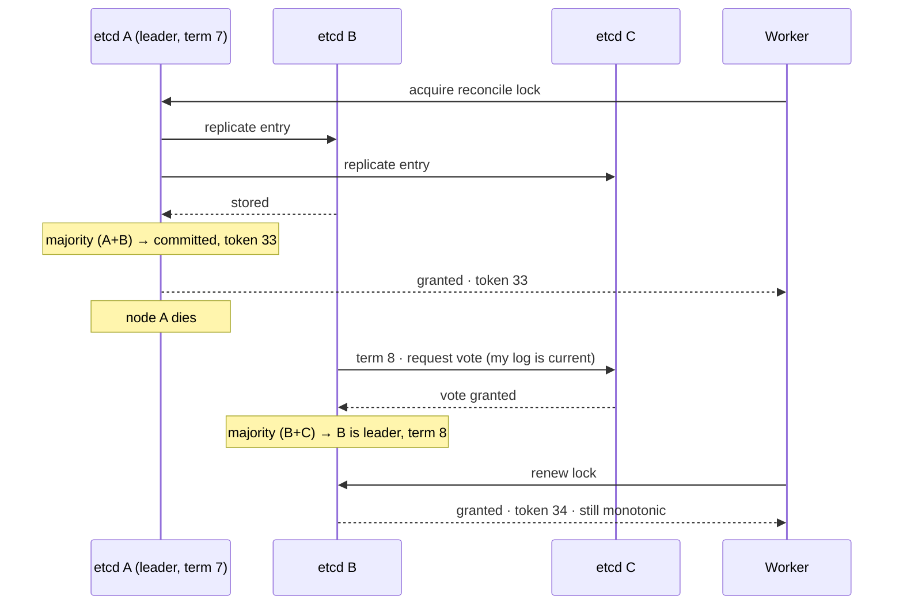

## The model

**Consensus** is a group of machines agreeing on one value — or, more usefully, on one
ordered sequence of values — even though some of them can crash and the network can drop or
delay anything.

The core mechanism is a **majority quorum**. Any decision requires more than half the nodes,
and since two majorities of the same group must overlap in at least one node, two conflicting
decisions cannot both be accepted. That single overlap property is what makes agreement
possible, and everything else is machinery around it.

## When to use it

Something must have exactly one answer across the whole system, and being wrong is not
recoverable.

1. **Does this need one truth or eventual agreement?** Who is the leader, which configuration
   is live, who holds this lock — one truth. Counts, feeds, caches — eventual is fine and
   vastly cheaper.
2. **Is it on the data path?** Consensus costs a round trip to a majority on every write.
   That is affordable for decisions made occasionally and ruinous for a write path taking
   thousands of operations a second.
3. **Are you about to implement it?** Do not. Use etcd, ZooKeeper or Consul, or a database
   that embeds one. Hand-rolled consensus is the canonical example of a thing that appears
   to work in testing and fails in ways you cannot debug.

## Speedrun

**What** — a **Raft** or **Paxos** cluster keeps a replicated log. Clients submit entries, a
leader orders them, and an entry is committed once a majority has stored it. Every node then
applies the same entries in the same order, so all of them reach the same state.

**The arithmetic that decides your cluster size**

| Nodes | Majority | Failures tolerated |
|---|---|---|
| 3 | 2 | 1 |
| 4 | 3 | 1 |
| 5 | 3 | 2 |
| 7 | 4 | 3 |

Four nodes tolerate no more failures than three, so cluster sizes are odd. Three or five is
essentially always the answer.

**How to use consensus in a design**

1. **Name what needs agreeing** — leader, configuration, membership, lock ownership. Keep the
   list short, because everything on it pays the cost.
2. **Put it in a dedicated cluster** of 3 or 5 nodes, not spread across every service.
3. **Keep application data out of it.** The consensus store holds decisions and metadata;
   your database holds records. A consensus system used as a database will be slow in a way
   no tuning fixes.
4. **Take the [[fencing token]] it offers.** A consensus-backed counter is genuinely
   monotonic across failures, which is what makes locks from it safe.
5. **Place nodes in separate failure domains** but close together in latency terms. Every
   write waits for a majority, so a cross-continent cluster has cross-continent writes.
6. **Expect unavailability without a majority.** Lose two of three nodes and the cluster
   correctly refuses to proceed — this is the C in [[CAP theorem]], chosen deliberately.

**Why it works** — any two majorities of the same set share at least one member. That node
remembers the earlier decision and refuses to contradict it, so conflicting decisions cannot
both succeed. Overlap, not communication, is what provides the guarantee.

**The cost, stated plainly** — every committed write is a round trip from the leader to a
majority. Consensus buys certainty and charges latency for it, on every operation.

## Going deeper

### Why it is hard: the two generals and FLP

Two results explain why this took decades and why the answer is subtle.

The **two generals problem**: two armies must attack simultaneously and can only communicate
by messengers who may be captured. General A sends "attack at dawn" and needs an
acknowledgement. B sends one — and now B cannot know it arrived, so B needs an
acknowledgement of the acknowledgement. The regress has no end.

The conclusion is that **certainty about a shared decision is unachievable over an unreliable
channel**. This is the same result that makes exactly-once delivery impossible and makes the
[[ambiguous outcome]] unavoidable — three problems from one root.

**FLP impossibility** (Fischer, Lynch, Paterson, 1985) is the sharper version: in an
asynchronous network, no deterministic protocol can guarantee consensus if even one node may
fail. The reason is that you cannot distinguish a crashed node from a slow one, so any
protocol either waits forever or eventually decides without it — and deciding without it can
be wrong.

Real systems escape by weakening the guarantee rather than beating the theorem. Raft and
Paxos are always *safe* — they never produce two conflicting decisions — and only
*eventually* live, making progress once the network behaves. That trade is the whole design,
and knowing which half is sacrificed is the thing worth carrying.

### Majority quorums, and the overlap that does the work

With N nodes, a majority is more than N/2. The property that matters is that any two
majorities intersect.

Take five nodes. One majority is {A,B,C} and another is {C,D,E}, and they share C.

If {A,B,C} accepted a value then C knows it, so when {C,D,E} tries to accept a different one,
C refuses. No coordination between the groups is needed — the overlap is structural.

This explains the odd-number rule immediately. Four nodes need three for a majority, which
tolerates one failure, exactly like three nodes. The fourth adds cost and latency and no
resilience at all.

It also explains why losing a majority means losing availability. Two nodes out of five
cannot form a majority, so they cannot commit anything — and this is correct behaviour, not
a bug. A minority that kept accepting writes would be exactly the [[split brain]] the
protocol exists to prevent.

### Raft, which is the one to be able to describe

Raft was designed to be understandable, and being able to walk through it is a genuinely
useful interview capability. It has two halves.

**Leader election.** Time is divided into **terms**, each with at most one leader. A follower
that hears nothing from a leader for a randomised timeout becomes a candidate, increments the
term, and requests votes; a node votes once per term, so a candidate with a majority becomes
leader.

The randomised timeout is what breaks a **split vote** — if two candidates start together,
different timeouts mean one of them retries first next time.

**Log replication.** Every client write goes to the leader, which appends it to its log and
sends it to followers. Once a majority has stored it, the leader marks it committed, applies
it, and tells the followers to do the same. A follower whose log has diverged is overwritten
by the leader's — the leader's log is authoritative by construction.

Two properties fall out and are worth stating because they are what makes it safe. A node
only votes for a candidate whose log is at least as up to date as its own, so a leader can
never be missing a committed entry. And the term number increases monotonically, so a
recovering old leader sees a higher term and steps down immediately.

That term number is the same idea as the [[fencing token]] from the previous page. A stale
leader's writes carry an old term and are rejected — the protocol does not need it to know it
was deposed.

**Paxos** solves the same problem, predates Raft, and is notoriously harder to follow.
Multi-Paxos and Raft are close enough in practice that the honest summary is: Raft is Paxos
made teachable, and that turned out to matter enormously for how many correct implementations
exist.

### What it is actually for

Consensus systems are used for a small, specific set of jobs, and knowing the list keeps you
from proposing one for the wrong thing.

**Leader election.** Which replica is the primary, which scheduler is active. The output is
a lease plus a term, and this is the most common use.

**Configuration and membership.** Which nodes are in the cluster, what the current sharding
map is, which feature flags are live. Small, rarely changed, catastrophic if two nodes
disagree.

**Locks with fencing.** As on the previous page — the token is a consensus-backed counter,
which is why locks built on etcd are safe in a way locks built on a single Redis are not.

**Coordination primitives.** Barriers, queues, service discovery registries.

What it is not for is your application's data. A consensus write costs a round trip to a
majority, so throughput lands in the thousands per second rather than the hundreds of
thousands, and it never improves by adding nodes — more nodes make the majority larger and
the write slower. The rule to carry: **consensus for decisions, replication for data.**

### The fault model, and Byzantine failures

Raft and Paxos assume crash faults: a node stops, or messages are lost, delayed or
reordered. Nodes never lie.

A **Byzantine fault** is a node behaving arbitrarily — sending different answers to different
peers, forging messages, actively misleading. Tolerating that requires more nodes (3f+1
rather than 2f+1 to survive f faults) and much more expensive protocols, which is what
blockchains are for.

Inside your own datacentre, crash-fault tolerance is the right assumption: the machines are
yours and a corrupted one is an incident, not a design parameter. Being able to say why you
are *not* choosing Byzantine fault tolerance is a better answer than knowing what it is.

## See it work

A three-node etcd cluster holds the leader lease and the fencing counter for the
reconciliation job from the previous page.

The lock is granted only after a majority has stored the entry. Node A alone is never enough,
which is precisely what stops a partitioned A from handing out a lock the rest of the cluster
knows nothing about.

When A dies, B and C elect a new leader without it. They are a majority of three, so they can
proceed; A is a minority of one and could not, which is why a partitioned A cannot continue
granting locks. The randomised election timeout is what keeps B and C from splitting the vote
by campaigning simultaneously.

The token stays monotonic across the leadership change, and that is the property the whole
previous page depended on. Token 34 comes after 33 even though a different machine issued it,
because the counter lives in the replicated log rather than in any one node's memory. A single
Redis could not promise this, since a failover to a replica that had not yet received the
latest increment would reissue a token already handed out.

Losing a second node stops everything. One surviving node cannot form a majority, so the
cluster refuses to grant or renew any lock. That is the correct answer — availability
sacrificed to keep the guarantee — and it is the [[CAP theorem]] choice made explicitly rather
than discovered during an incident.

Notice what this cluster is *not* doing: it holds a lease and a counter, a few hundred bytes
that change occasionally. The reconciliation itself reads and writes the ledger in Postgres,
because putting millions of ledger rows through a consensus log would be slow in a way no
amount of tuning could fix.

## Next

That completes the building blocks. The canonical designs assemble these pieces against whole
problems — a URL shortener, a news feed, a chat system — where the work is choosing which of
them to use and defending the choice.
