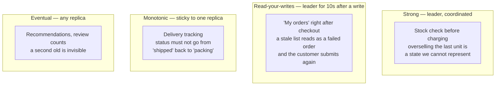

## The model

A **consistency model** is the promise a system makes about which values a read is allowed
to return once copies exist.

The strongest promise, **strong consistency**, is that every read sees the most recent
write, as if there were one copy. The weakest useful one, **eventual consistency**, is that
if writes stop, the copies converge. Everything interesting sits between, and the choice is
paid for in latency on every single request rather than only when something fails.

## When to use it

You have replicas or shards, and you are deciding what to promise about a particular read.

1. **Would a stale answer be visibly wrong, or merely old?** A follower count that lags a
   second is old. A bank balance that lags a second, checked before a withdrawal, is wrong.
   Only the second kind needs a strong promise.
2. **Is the reader the person who just wrote?** That is **read-your-writes**, it is the
   anomaly users actually notice, and it is far cheaper to provide than strong consistency
   everywhere.
3. **Does anything downstream act on this read?** A human seeing a stale number shrugs. A
   job that reads a stale number and then writes based on it turns staleness into
   corruption.

## Speedrun

**What** — the models, strongest first, with what each one costs:

| Model | Promise | Cost |
|---|---|---|
| Strong (linearizable) | Every read sees the latest write | Coordination on every operation |
| Causal | Related events are seen in order | Track causality between writes |
| Read-your-writes | You always see your own writes | Route or pin per session |
| Monotonic reads | Time never goes backwards for you | Sticky routing to one replica |
| Eventual | Copies converge if writes stop | Almost nothing |

**How to choose one per operation**

1. **Do it per read, not per system.** One product wants strong reads on checkout and
   eventual reads on a feed. Choosing globally is choosing wrong for most of the traffic.
2. **Start at eventual and justify upgrades.** For each read, ask what a user does when the
   value is a second old. Most answers are "nothing".
3. **Add read-your-writes wherever a user sees their own action reflected.** Profile edits,
   posting, placing an order. This single guarantee removes most complaints.
4. **Reserve strong consistency for reads that gate a decision** — inventory before a sale,
   balance before a transfer, uniqueness before a signup.
5. **Say the staleness bound in seconds.** "Followers within two seconds" is a promise; "not
   too stale" is a hope you will discover the meaning of during an incident.
6. **Write down what a stale read costs** in the one place it can be expensive, and check
   that the cost is recoverable rather than permanent.

**Why it works** — a strong promise requires the replicas to agree before answering, which
costs at least one round trip and blocks when a replica is unreachable. A weak promise lets
any replica answer immediately from what it already has. You are buying certainty with
latency, and the exchange rate is fixed by the speed of light between your machines.

**The one to know by name** — [[PACELC]]: during a partition choose availability or
consistency, and *else*, in normal operation, choose latency or consistency. The second half
is the one you pay every day.

## Going deeper

### Strong consistency, and what it actually costs

**Strong consistency** — the precise form is [[linearizability]] — means the system behaves
as if there were a single copy. Once a write completes, every subsequent read anywhere
returns it or something newer.

Getting that with replicas requires agreement before answering. Either reads go to the
leader only, which throws away the read capacity replication bought, or replicas run a
consensus protocol per operation, which costs a round trip between them.

That round trip is the whole cost, and it is not small when the replicas are far apart. Two
datacentres 150 ms apart cannot offer strongly consistent reads faster than 150 ms, and no
amount of engineering changes that — it is the speed of light. This is exactly the "else"
branch of PACELC, and it is why globally strong systems like Spanner are notable enough to
have papers written about them.

The practical consequence: strong consistency is affordable within one region and expensive
across regions. Designs that need it globally usually restructure to need it locally instead
— partitioning by region so each record has a home where the strong decision is made.

### Eventual consistency, and what it does not promise

**Eventual consistency** promises only convergence: stop writing, wait, and the copies will
agree. It says nothing about how long, and nothing about what you see in the meantime.

That "nothing about the meantime" is the part that surprises people, and it is where the
anomalies from the replication page live. Successive reads can go backwards. You can fail to
see your own write. You can see an effect before its cause.

Those are permitted, not bugs. Which is why a bare "we'll use eventual consistency" is a
weak answer in an interview — the interesting question is which of those anomalies your
product can actually tolerate, and the middle models exist precisely to rule out specific
ones cheaply.

### The session guarantees, which are where the value is

Between strong and eventual sit the **session guarantees**: promises made to one user's
session rather than globally. They are dramatically cheaper than strong consistency and they
remove almost every anomaly a user can perceive.

**Read-your-writes.** You always see your own writes. Implemented by routing a user to the
leader for a few seconds after they write, or by recording the write's log position in their
session and requiring any replica serving them to have reached it. This is the one that
stops "did my save work?"

**Monotonic reads.** You never see time run backwards. If you saw a comment, a later read
still shows it. Implemented by pinning a session to one replica, so lag is consistent rather
than jumping between replicas of different freshness.

**Consistent prefix reads.** You see writes in an order consistent with causality — never an
answer before its question. This one matters across partitions, where two related writes can
take different paths.

The reason to know these by name is that they are the cheap answer to the expensive question.
When someone asks "how do you handle replication lag", the weak answer is "we use strong
consistency" and the strong answer is "read-your-writes for the author's own content,
eventual for everyone else's, and here is what that costs."

### Causal consistency, the strongest cheap model

**Causal consistency** promises that operations which are causally related appear in the same
order to everyone, while unrelated ones may be seen in any order.

If Alice posts and Bob replies, nobody sees Bob's reply before Alice's post. If Alice and
Carol post independently, different people may see them in different orders — and nobody
cares, because nothing connects them.

This is close to the strongest model achievable without giving up availability during a
partition, which makes it theoretically important. It costs tracking causality — version
vectors or explicit dependencies attached to writes — and that bookkeeping grows with the
number of participants, which is the practical reason it is less common in production than
its elegance deserves.

### Where the model has to be strong

The honest list is short, and being able to give it is worth more than a general preference
for strong consistency.

**Uniqueness.** Two people registering the same username at the same moment. Eventual
consistency lets both succeed and discovers the conflict later, when both accounts exist.

**Anything that must not go negative.** Inventory on the last item, a balance before a
withdrawal, seats on a flight. Two concurrent reads of "1 remaining" both succeed and you
have sold something twice.

**Authorisation revocation.** A permission removed must not still be readable, because the
window is an actual security hole rather than an inconvenience.

Notice what unites them: a read that *gates a write*, where being wrong creates a state the
system cannot represent. Everything else — counts, feeds, timelines, recommendations,
search results, analytics — tolerates staleness, and treating it as though it does not is
how systems get slow for no benefit.

There is also a third path worth knowing, because it is often the best answer. Rather than
making the read strong, make the outcome recoverable: accept the double booking and
compensate, take the payment and refund on conflict, allow the overdraft and charge for it.
Airlines and banks both do this deliberately. Coordination is expensive; apologies are
cheap, and choosing which to pay for is a design decision rather than a compromise.

## See it work

The order service, now replicated and sharded. Four reads, four different promises.

The stock check is the only genuinely strong read, and it earns it: two customers reading "1
remaining" at the same instant both proceed, and the system has sold an item that does not
exist. That is a state with no valid representation, so it is worth a leader round trip on
the one read that gates it.

"My orders" immediately after checkout needs only read-your-writes. Routing a customer to
the leader for ten seconds after they write costs about 1% of read traffic and removes the
complaint that generates the most support tickets. Strong consistency would also fix it, at
roughly a hundred times the cost.

Delivery tracking needs monotonic reads and nothing more. Nobody minds that the status is a
few seconds behind; everybody minds if it goes from "shipped" back to "packing" because two
reads hit replicas with different lag. Pinning the session to one replica fixes it for free.

Recommendations and review counts are eventual, from any replica. A second of staleness is
literally invisible, and this is the overwhelming majority of the traffic — which is the
point of choosing per read. One global promise would either make the cheap 95% expensive or
make the dangerous 1% wrong.

## Next

Caching strategies is the same staleness question one layer further out, where the copy is
not a replica you control but a cache with its own expiry, and CAP and PACELC is the razor
that names the tradeoff this page keeps paying.
