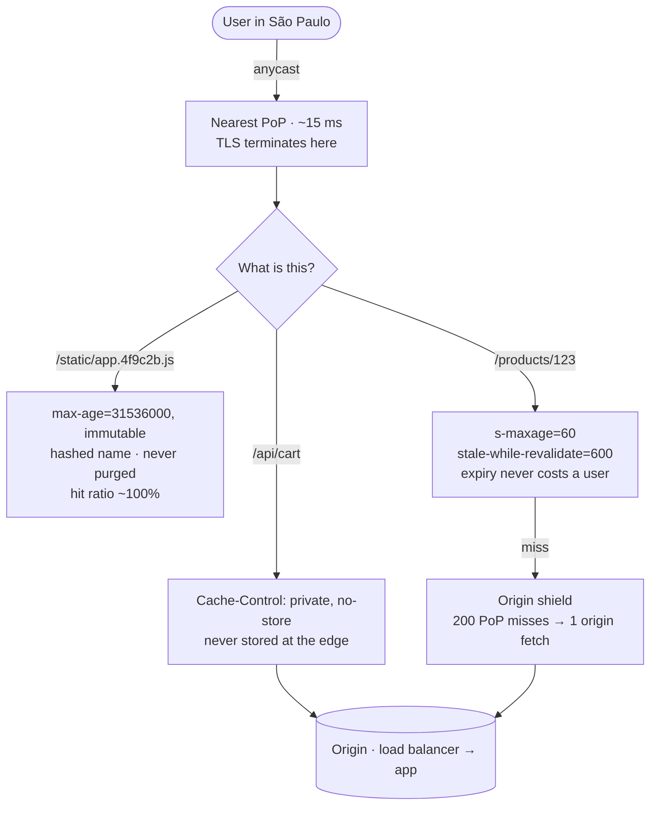

## The model

A **CDN** is a network of servers in hundreds of locations, each holding copies of your
content. A user's request goes to the nearest one rather than to you.

It removes two costs at once. Distance, because a hit is served from perhaps 20 milliseconds
away instead of 150. And load, because a hit never reaches your infrastructure at all — no
app server, no database, no bill. The thing you give up is control: content sitting in
someone else's network in two hundred cities is not something you can reliably un-publish in
a hurry.

## When to use it

You are serving anything over the public internet to users who are not all in one city.

1. **Is this identical for many users?** Static assets, images, video, public pages — yes,
   and they belong at the edge. Anything varying per user stops at a [[reverse proxy]] or
   below.
2. **How fast must a change take effect?** A **purge** propagates in seconds to minutes. If
   the honest requirement is "instantly", version the URL instead so nothing needs purging.
3. **Is the payload big or the audience far?** A CDN's value scales with both. For a small
   JSON response served to one country, the win is real but modest.

## Speedrun

**What** — the CDN sits between users and your **origin**. On a miss it fetches from you,
stores the response, and serves everyone else from the copy. The headers you send decide
what it stores and for how long.

**The headers that do the work**

| Header | Says |
|---|---|
| `Cache-Control: max-age=N` | any cache may keep it N seconds |
| `s-maxage=N` | N seconds for shared caches only, overriding max-age |
| `no-store` | never keep this anywhere |
| `private` | browsers may cache, the CDN may not |
| `stale-while-revalidate=N` | serve stale for N seconds while refreshing behind it |
| `ETag` / `If-None-Match` | revalidate cheaply; a 304 sends no body |
| `Vary: Accept-Encoding` | cache separately per value of that header |

**How to put content behind a CDN**

1. **Split by cacheability, not by file type.** Immutable assets, public-but-changing pages,
   and per-user responses are three different policies that happen to share a domain.
2. **Hash the filenames of immutable assets** and give them `max-age=31536000, immutable`.
   Nothing is ever invalidated, because a deploy changes the name.
3. **Give changing public content a short `s-maxage`** plus `stale-while-revalidate`, so
   expiry never costs a user a slow request.
4. **Mark per-user responses `private` or `no-store`.** A personalised page cached at the
   edge is a data leak, and it is the single most expensive mistake on this page.
5. **Set `Vary` deliberately and minimally.** Every header you vary on multiplies the number
   of stored copies and divides your **cache hit ratio**.
6. **Enable an origin shield** so a global expiry produces one origin request rather than
   two hundred.

**Why it works** — a cache hit near the user removes every cost beyond it: the round trip
across the world, your load balancer, your app, your database. It is the only optimisation
that improves latency and reduces load at the same time, which is why it is usually the
first thing to reach for on a read-heavy public service.

**The mistake that ends careers** — caching a response containing someone's name, and
serving it to the next person. Any endpoint whose output depends on who asked must be
`private`, and it must be impossible to get wrong by default.

## Going deeper

### What a point of presence actually does

A **point of presence** is a CDN location: a rack of caching servers — **edge caches** — in
a datacentre near a population. A large CDN has hundreds of them.

Getting you to the near one is [[anycast]]. The same IP address is advertised from every
location, and internet routing delivers your packets to whichever is closest in network
terms. No DNS trickery, no client logic, and failure handling is fast — a location that
withdraws its route stops receiving traffic in seconds.

The **origin** is your own infrastructure. Requests reach it only on a miss, which is why
the metric that matters is the **cache hit ratio**: at 95%, one request in twenty reaches
you, and your origin capacity requirement drops by twenty times. Moving the ratio from 90%
to 95% halves your origin traffic, which is a much bigger lever than it sounds.

Modern CDNs also terminate TLS at the edge. **TLS termination at the edge** means the
handshake — several round trips — happens 20 milliseconds away instead of 150, which is a
large latency win before any content is cached at all. It also means the CDN holds a
certificate for your domain and can read every request, which is a real trust decision even
though everyone makes it.

### The cache key, and how hit ratio quietly dies

The CDN decides "is this the same request" by a key, normally the URL plus whatever `Vary`
declares.

Every dimension you vary on multiplies the copies stored. `Vary: Accept-Encoding` is two or
three copies and is worth it. `Vary: Accept-Language` multiplies by your language count.
`Vary: User-Agent` multiplies by thousands, because user agent strings are nearly unique,
and it drives the hit ratio to approximately zero — at which point the CDN is pure overhead,
paying a lookup that never pays back.

The other quiet killer is query parameters. Marketing tags like `utm_source` change the URL,
so the same page caches under a hundred different keys. Every CDN can be told to ignore
named parameters, and doing so is often the single largest hit-ratio improvement available.

The discipline is subtractive: start from the URL, add a dimension only when you can name a
response that would genuinely differ, and strip everything else.

### Invalidation, and why versioning beats purging

Two ways to change what the edge is serving.

**Purge** tells the CDN to drop a key. It works, and it is not instant — propagation across a
global network takes seconds to minutes, and during that window different users see different
versions. For a wrong price or a leaked document, that window is exactly when you care.

**Versioning** changes the name when the content changes: `app.4f9c2b.js` rather than
`app.js`. Nothing is ever invalidated, because the new URL was never cached and the old one
is simply abandoned. It is immediate, free, and has no propagation window.

The rule that falls out is worth carrying beyond CDNs. **Long expiry only on things whose
name changes when their content does.** Everything else gets a short expiry, because you are
choosing to keep the ability to intervene.

`stale-while-revalidate` is the refinement that makes short expiries affordable. Without it,
the first request after expiry waits for a full origin fetch — so a popular resource makes
one unlucky user pay for everyone's refresh, once per TTL. With it, that user gets the
slightly stale copy immediately and the refresh happens behind them.

### The origin shield, and the herd at the edge

Expiry is a synchronisation event. When a popular resource expires, every point of presence
misses at once, and two hundred locations all fetch from your origin in the same second.
That is a [[thundering herd]] with the CDN's own topology as the amplifier.

An **origin shield** designates one location as the only one allowed to talk to your origin.
Everyone else fetches through it. Two hundred simultaneous misses become one origin request
and 199 fetches from the shield, which is the difference between a spike your origin absorbs
and one it does not.

The complementary defence is jittered TTLs, so resources do not all expire on the same
second. Both are the same idea seen elsewhere in this section — collapse duplicate concurrent
work, and desynchronise anything that would otherwise happen simultaneously.

### What else the edge can do now

CDNs stopped being only caches some time ago, and the capabilities are worth knowing because
they change where work belongs.

**Edge compute** runs small functions at the point of presence — Cloudflare Workers, Lambda@Edge.
A/B assignment, auth checks, redirects, header rewriting and personalisation of otherwise
cacheable pages can all happen 20 milliseconds from the user without a round trip to origin.
This is how you keep a page cacheable that would otherwise be per-user: cache the shell
globally, personalise at the edge.

**Image transformation** resizes and re-encodes on the fly, so one stored original serves
every device without a build step.

**Origin failover and DDoS absorption** matter more than they sound. A CDN sitting in front
of your origin means a volumetric attack hits a network built to absorb it rather than your
load balancer, and many CDNs will serve stale content when your origin is entirely down —
which converts a hard outage into a degraded but functioning site.

That last one has an availability consequence worth stating: the CDN can be a dependency that
*raises* your availability rather than lowering it, which is unusual for something in series
on the request path.

## See it work

The order service's public site: a product page, its assets, and a per-user cart badge.

Three kinds of content on one page, three policies. The assets are hashed and immutable, so
they get a one-year expiry and are never invalidated — a deploy renames them, which is
versioning rather than purging and has no propagation window at all.

The product page changes every few minutes and is identical for everyone, so it gets a
60-second shared expiry with `stale-while-revalidate=600`. That combination is what keeps a
short TTL affordable: without it, one unlucky user per minute pays for a full origin fetch,
and with it nobody ever waits.

The cart is per-user and is marked `private, no-store`. This is the line that must never be
wrong, because a cached cart served to the next visitor is a data breach rather than a
performance bug — which is why the safe default is to make personalised paths uncacheable by
configuration rather than by remembering.

The origin shield exists for the seam. Every point of presence expires the product page at
roughly the same second, and without a shield two hundred locations would fetch from origin
simultaneously — the CDN amplifying a thundering herd rather than absorbing one.

What the origin actually sees is the point of all of it. At a 95% hit ratio the load balancer
from two pages ago handles a twentieth of public traffic, and the app fleet behind it is
sized for that twentieth. The CDN did not make the origin faster; it made most requests never
arrive.

## Next

Blob storage is where the large objects a CDN serves actually live, and the canonical designs
assemble the pieces from this whole group against real problems.
