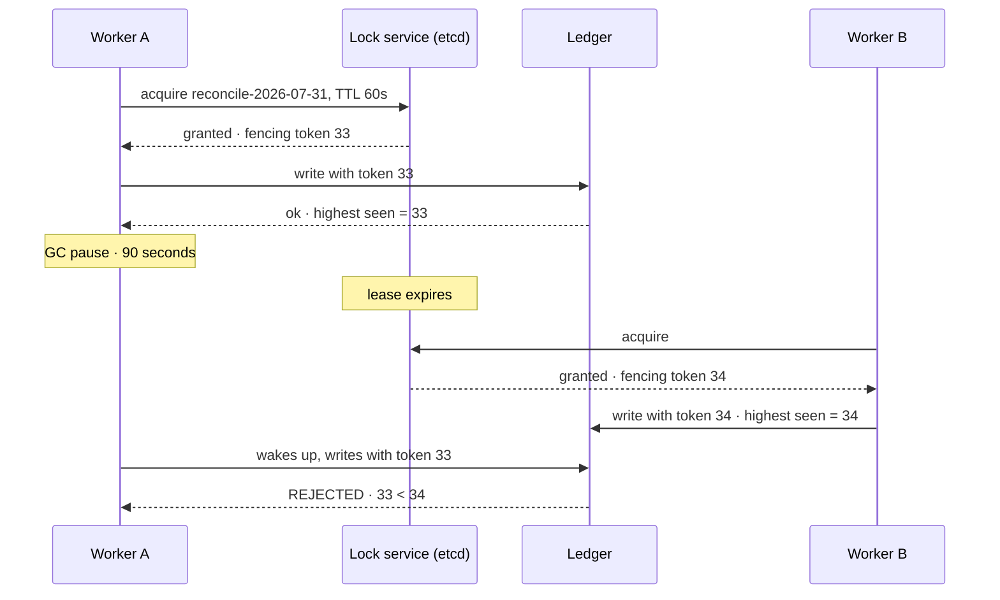

## The model

A **distributed lock** gives one process exclusive access to something across many machines
— **mutual exclusion** where the participants share no memory.

The reason it is hard is a single fact: the holder can stop existing at any instant, without
telling anyone. A crashed holder would keep the lock forever, so locks expire — they are
**leases**. But a lease that expires while its holder is merely paused means two processes
now believe they hold it, and neither is wrong from where it is standing.

## When to use it

Two workers might do the same job at once, and doing it twice is not acceptable.

1. **Can you avoid needing one?** Partition the work so each key has exactly one owner, or
   make the operation [[idempotency|idempotent]] so duplication is harmless. Both are cheaper and more
   reliable than a lock.
2. **Is this for correctness or for efficiency?** An efficiency lock stops duplicated work
   and a duplicate is merely wasteful. A correctness lock protects something that breaks if
   violated, and only that case needs the full machinery.
3. **Can the protected resource reject stale writers?** If yes, a **fencing token** makes the
   lock safe. If not — a third-party API, an email send — no lock can make it safe, and you
   need idempotency at the far end instead.

## Speedrun

**What** — a shared store holds a key. Whoever creates it holds the lock; it expires after a
TTL so a crash cannot hold it forever. `SET key value NX PX 30000` in Redis is the whole
primitive: set if not exists, expire in 30 seconds.

**How to use one safely**

1. **Try to avoid it first.** Ask whether partitioning or idempotency solves the same
   problem, and say so out loud — an interviewer is often testing whether you reach for a
   lock reflexively.
2. **Acquire atomically with a TTL.** Never check-then-set; that is the same race as a
   [[lost update]] and it defeats the entire purpose.
3. **Store a unique holder id in the value**, so you can only release a lock you still own.
4. **Release with a compare-and-delete**, atomically. Deleting by key alone will cheerfully
   delete a lock someone else acquired after yours expired.
5. **Get a monotonically increasing [[fencing token]] with the lock**, and pass it to the
   protected resource, which rejects anything lower than the highest it has seen.
6. **Set the TTL longer than your worst-case work**, then treat it as a hint rather than a
   guarantee — because it is one.

**Why it works, and where it stops** — the atomic set gives you mutual exclusion while
everything behaves. The TTL prevents a crash from deadlocking forever. Neither handles a
holder that pauses past its lease and then wakes up, which is why the token is the part that
provides actual safety.

**The distinction that decides how careful to be** — an efficiency lock's failure costs you
duplicate work. A correctness lock's failure costs you corrupted data, and only a fencing
token prevents it.

## Going deeper

### Why the lease is both necessary and insufficient

A lock with no expiry deadlocks the first time a holder dies. A lock with an expiry can be
held by two processes at once. Those are the only two options, and there is no third.

The scenario is worth walking through, because it is the reason this page exists:

1. Process A takes a 30-second lease.
2. A's runtime enters a **stop-the-world pause** — garbage collection, an over-committed
   hypervisor, a slow disk — lasting 40 seconds.
3. The lease expires, and process B acquires the lock legitimately.
4. A wakes up, unaware that any time passed, and continues as though it still holds it.

Both are now writing. Neither has misbehaved: A never crashed, B never violated the protocol,
the lock service is working exactly as specified.

There is no timeout that fixes this, because you cannot bound how long a process can be
paused. Multi-second garbage collection pauses are ordinary in large heaps, and a virtual
machine can be suspended for arbitrarily long. Any argument of the form "we set the TTL high
enough" is a probability argument dressed as a correctness argument.

### Fencing tokens, which are the actual answer

A **fencing token** is a number the lock service hands out, strictly increasing with every
grant. The holder passes it with every write, and the protected resource refuses any write
carrying a token lower than the highest it has already accepted.

Replay the pause with tokens:

1. A acquires the lock and gets token 33, then pauses.
2. B acquires it and gets token 34, writes, and the storage records 34 as the highest seen.
3. A wakes and writes with token 33 — the storage sees 33 < 34 and rejects it.

A is still confused about the state of the world. It no longer matters, and that is the
crucial property — safety no longer depends on every participant having an accurate view. The
resource enforces the ordering rather than trusting the client.

The catch is that **the resource must participate**. Fencing works when writes go somewhere
you control — your database, your storage layer — and it does not work when the effect is a
call to Stripe or an email provider, because they have no notion of your tokens. There, the
only defence is [[idempotency]] at the far end.

This is also the same mechanism as the term number in leader election, which is why the next
page is the natural continuation: a fencing token is a consensus system's log position
handed to a client.

### Safety, liveness, and which one you are trading

Two properties, and every lock design trades between them.

**Safety** is "nothing bad happens" — never two holders at once. **Liveness** is "something
good eventually happens" — the lock is eventually acquirable, no permanent deadlock.

A lock with no expiry has perfect safety and no liveness: one crash and it is held forever.
An expiring lock has liveness and imperfect safety, for exactly the pause reason above.

Being able to name which you have chosen is the difference between a considered design and a
hopeful one. Most systems take the second and add fencing to recover safety at the resource,
which is a good trade because it puts the enforcement where the truth is.

### Redis locks and the argument about them

The single-instance version is genuinely simple, and simple is worth a lot:

```
SET lock:job-42 <holder-id> NX PX 30000     -- acquire
-- release: delete only if we still own it (atomic, via script)
if redis.call("GET", KEYS[1]) == ARGV[1] then return redis.call("DEL", KEYS[1]) end
```

The `NX` makes acquisition atomic and the compare-in-release stops you deleting a successor's
lock. It also has a single point of failure: if that Redis dies, nobody can acquire anything.

**Redlock** is the multi-instance proposal — acquire on a majority of N independent Redis
nodes, with the lock valid only if you got a majority within the TTL. It became the subject
of a well-known exchange between Martin Kleppmann and Salvatore Sanfilippo, and the useful
takeaway is not who won.

It is this: Redlock depends on bounded clock drift and bounded pauses, and neither is
guaranteed by anything. If you need efficiency, a single Redis lock is simpler and about as
good. If you need correctness, you want a system built on [[consensus]] — ZooKeeper, etcd,
Consul — where a fencing token comes with the lock by construction.

The practical decision rule falls out cleanly. Duplicate work is merely expensive: Redis,
one instance, move on. Duplicate work corrupts data: etcd or ZooKeeper with fencing, or
redesign so no lock is needed.

### Designing the lock away

The best distributed lock is usually the one you did not need, and there are three standard
routes.

**Partition by key.** Route all work for an entity to one consumer, using the same key you
[[sharding|shard]] on. If only one worker ever handles order 42, nothing needs excluding. This is why
partitioned logs are such a common answer — the ordering guarantee *is* the mutual exclusion.

**Make it idempotent.** If running twice is indistinguishable from running once, concurrent
duplicates stop being a correctness problem and become a cost problem.

**Use the database's own locking.** Within one database, `SELECT ... FOR UPDATE` is a real
lock with real transactional guarantees, and no lease can expire mid-transaction. If the work
is one database's rows, this is strictly better than anything external.

The general principle is worth carrying: a distributed lock is coordination, coordination is
what distributed systems are worst at, and the strongest designs arrange not to need it. A
candidate who reaches for the lock immediately has skipped the question the interviewer was
asking.

## See it work

A nightly job reconciles payments. Two schedulers exist for redundancy, so both may fire.



Both workers held the lock legitimately, at different moments, and neither broke the
protocol. A was paused rather than dead, so there was no signal anyone could have used to
distinguish the two cases — which is the whole difficulty in one picture.

The TTL alone does not save this. It bounds how long a crash blocks progress, and it creates
the overlap window as a side effect. Raising it to five minutes makes the overlap rarer and
the deadlock-after-crash longer; there is no setting that removes both.

The token is what makes it safe. The ledger tracks the highest token it has accepted and
rejects anything lower, so A's late write is refused on arrival. Notice that A is still
wrong about the world when it wakes — it believes it holds the lock — and the design does not
require it to be right. Correctness lives at the resource.

This is a correctness lock, so etcd rather than a single Redis: the token comes from a
consensus-backed counter that is genuinely monotonic even across the lock service's own
failures, and that is precisely the guarantee a lease cannot provide by itself.

The better design, worth saying aloud, is upstream of all of this. Reconciliation partitioned
by account, with each partition owned by one consumer, needs no lock at all — the ordering
guarantee replaces the mutual exclusion, and the failure mode goes away rather than being
managed.

## Next

Consensus is where the fencing token and the lock service themselves come from — how a group
of machines agrees on anything at all when any of them can fail.
