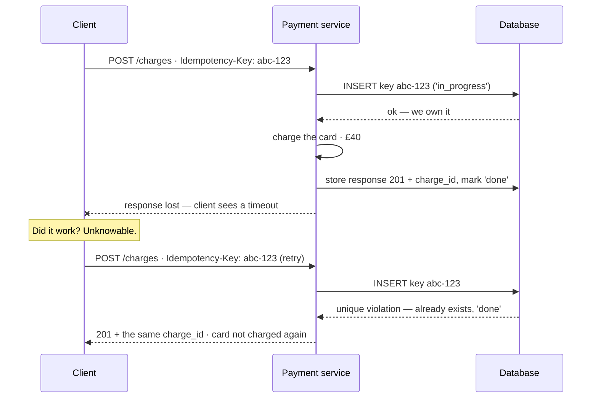

## The model

An operation is **idempotent** when performing it twice leaves the system in the same state
as performing it once. Setting a value is idempotent; adding to it is not.

The reason this matters is a fact about networks rather than a preference. When a request
times out, you cannot tell whether it succeeded, failed, or succeeded with a lost response.
That is the **ambiguous outcome**, and the only two responses to it are retry or give up.
Retrying is safe exactly when the operation is idempotent, so idempotency is what turns an
unanswerable question into a non-question.

## When to use it

Anything that can be retried — which, once a network is involved, is everything.

1. **Can this operation reach the server twice?** A client retry, an at-least-once queue, a
   user double-clicking, a load balancer resending. If any of those is possible, assume it
   happens.
2. **Is the effect additive or absolute?** "Set status to shipped" is safe to repeat.
   "Charge £40" and "increment the counter" are not, and they need a key.
3. **Is the duplicate cheap or expensive?** A duplicate search index write is invisible. A
   duplicate charge is a refund, a support ticket and a trust problem.

## Speedrun

**What** — two routes to idempotency. **Natural idempotency**, where the operation is
inherently repeatable: absolute assignment, deletes, "ensure this exists". And a
**deduplication** layer, where the caller supplies an **idempotency key** and the server
remembers what it already did with it.

**How to make an endpoint idempotent**

1. **Make the client generate the key**, once, before the first attempt — a UUID per logical
   operation. Every retry of that operation reuses it. A key generated per *request* defeats
   the whole mechanism.
2. **Insert the key first, atomically.** `INSERT` into a table with a unique constraint on
   the key. Do not check-then-act: two concurrent duplicates both pass the check and both
   proceed, which is the [[lost update]] problem wearing different clothes.
3. **If the insert conflicts, the operation is already known.** Either return the stored
   response, or wait if it is still in flight.
4. **Store the response, not just the key.** A retry should return the original 201 and the
   same order id — not a 409 the client has to interpret.
5. **Do the work and the key update in one [[transaction]]** where possible, so you never
   record success for work that did not commit.
6. **Set a deduplication window and say what it is.** Keys cannot be kept forever.
   Twenty-four hours is typical, and it must comfortably exceed your longest retry schedule.

**Why it works** — the key gives one logical operation a stable identity across attempts.
Without it, the server sees two indistinguishable requests and has no basis for treating them
differently. With it, the second one is recognisable as the same intent and can be answered
from what already happened.

**The rule that follows from delivery guarantees** — [[at-least-once]] delivery plus an
idempotent consumer equals **effectively-once** processing. That combination is the only
achievable version of "exactly once", and it is achievable everywhere.

## Going deeper

### The ambiguous outcome, which is the whole reason

A client sends a request and the connection times out. Four things could have happened: the
request never arrived; it arrived and failed; it arrived, succeeded, and the response was
lost; or it is still running right now.

The client cannot distinguish them, and no amount of engineering makes it able to. This is
not a gap in the protocol — it is the two generals problem in practical dress, and it
is why "did my payment go through?" is a question systems must be designed to answer rather
than avoid.

Given that, there are only two strategies. Retry and risk duplication, or do not retry and
risk loss. Every real system chooses retry, because loss is worse and silent. Idempotency is
what makes that choice free rather than a trade.

Once you see it this way, the design rule inverts. The question is not "should this be
idempotent" but "what happens the second time", asked of every endpoint that mutates
anything.

### Natural idempotency, which is free

Some operations are idempotent by construction, and reaching for one is cheaper than building
a dedup layer.

**Absolute assignment.** `SET status = 'shipped'` is repeatable; `status = next(status)` is
not. Prefer writing the target state rather than a transition.

**Delete.** Deleting an already-deleted thing leaves the same state. This is why `DELETE` is
idempotent in HTTP even though it changes things.

**Upsert.** "Create this if absent" converges on the same row however many times it runs.

**Set membership.** Adding to a set twice yields one member. This is the trick behind most
deduplication: model the effect as a set rather than a counter.

HTTP's method semantics encode exactly this, and knowing them is worth a sentence in an
interview. `GET`, `PUT` and `DELETE` are defined as idempotent; `POST` is not. That is why
`POST /payments` needs an idempotency key and `PUT /orders/123/status` does not — and why
retry logic in clients and proxies will happily retry the second and not the first.

The design lever is that many non-idempotent operations can be restated as idempotent ones.
"Increment balance by 40" becomes "record transaction abc-123 for 40", where the transaction
id makes the second write a duplicate the database itself rejects. The counter becomes a set,
and the problem dissolves.

### The dedup table, and the race that ruins it

The naive implementation has a race, and it is the single most common bug in this area:

```
if (not exists(key)) {   // ← two concurrent requests both pass here
    do_the_work()
    store(key)
}
```

Two duplicates arriving simultaneously both find no key, both do the work, and both store it.
Check-then-act is not atomic, and this is the same defect as a [[lost update]] — the check
and the write are separate, so the two interleave.

The fix is to make the insert itself the check. A unique constraint on the key means the
database decides the race, and exactly one insert wins:

```
INSERT INTO idempotency_keys (key, status) VALUES (?, 'in_progress')
-- unique violation → someone else owns this operation
```

The loser now has a decision to make, and getting it right is what separates a correct
implementation from a plausible one. If the winner has finished, return its stored response.
If it is still in flight, the honest answers are to wait briefly or return `409 Conflict`
with a retry-after — but *not* to return success, because the work may still fail.

That is why the table stores a status and a response rather than only a key. A key alone tells
you the operation was seen; it does not tell you what it produced, and a retry that gets a
different answer from the original is a correctness bug in its own right.

### What the key must cover, and for how long

The key identifies a logical operation, so where it is generated decides whether the scheme
works at all.

Generated by the client, before the first attempt, reused for every retry — correct.
Generated per HTTP request, or by the server on arrival, or derived from a timestamp — all
useless, because each attempt gets a different key and every duplicate looks new.

The **deduplication window** is how long keys are retained, and it is a real tradeoff. Too
short and a late retry escapes deduplication entirely, which is the failure that finds you
during an incident when queues have backed up for hours. Too long and the table grows without
bound. Twenty-four hours is the common answer, and the rule is that it must exceed your
longest possible retry schedule — including the queue's dead-letter replay.

One more property worth stating: the key should be scoped to the caller. A globally unique
key space lets one client's key collide with another's, which is a security problem rather
than merely a bug. Scope by `(client_id, key)`.

A subtler failure comes from what you do *not* store. If the request body can differ between
two calls with the same key — the same key sent with a different amount — you have to decide
whether that is a retry or a mistake. Storing a hash of the request and rejecting mismatches
is the safe answer, and it is what Stripe does.

### Where idempotency is not enough

It makes an operation safe to repeat. It does not make a *sequence* safe to repeat, and the
difference matters once ordering is involved.

Two idempotent operations applied out of order can still produce the wrong state: "set status
to shipped" then "set status to cancelled" is not the same as the reverse. Idempotency
protects against duplication, not reordering, and reordering is exactly what a partitioned log
permits across keys. The fix is ordering within a key, or a version number the consumer uses
to ignore stale updates.

And it does not extend past your boundary. Your consumer can be perfectly idempotent and
still send two emails, because the email provider has no idea the two calls were the same
intent. Any effect leaving your system needs its own idempotency key on that call, which is
why good third-party APIs offer one.

[[Hyrum's Law]] applies to your own endpoint too: once clients notice it tolerates retries,
that tolerance is part of your contract whether you documented it or not.

## See it work

A payments endpoint. The client's connection drops after sending, and it retries.



The first attempt succeeds completely. The card is charged, the response is stored, and then
the response is lost on the way back. From the client's side this is indistinguishable from a
total failure, which is the ambiguous outcome — and it is why the client must retry rather
than guess.

The retry carries the same key, because the key was generated once for the logical operation
rather than per attempt. The insert hits the unique constraint, so the service knows
immediately that this operation is not new, without needing to reason about it.

The stored response is what makes the retry useful. The client gets the original `201` and
the original `charge_id`, so it can proceed exactly as if the first response had arrived.
Returning a bare `409` here would be correct and unhelpful — the client would still not know
whether it had a charge.

Two failure modes this design handles that a simpler one does not. Concurrent duplicates: if
both requests arrive at once, one wins the insert and the other sees `in_progress` and waits
rather than charging twice. And a crash mid-charge: the key is stuck at `in_progress`, so a
retry does not blindly re-charge — it waits or reports conflict, and a human or a reconciler
resolves it against the card network.

The window ties it together. Keys live 24 hours, comfortably longer than any retry schedule
including a dead-letter replay, so no legitimate retry ever escapes deduplication by arriving
late.

## Next

Publish-subscribe is how one event reaches many independent consumers, each of which needs
the property above, and rate limiting is the other half of surviving a client that retries.
