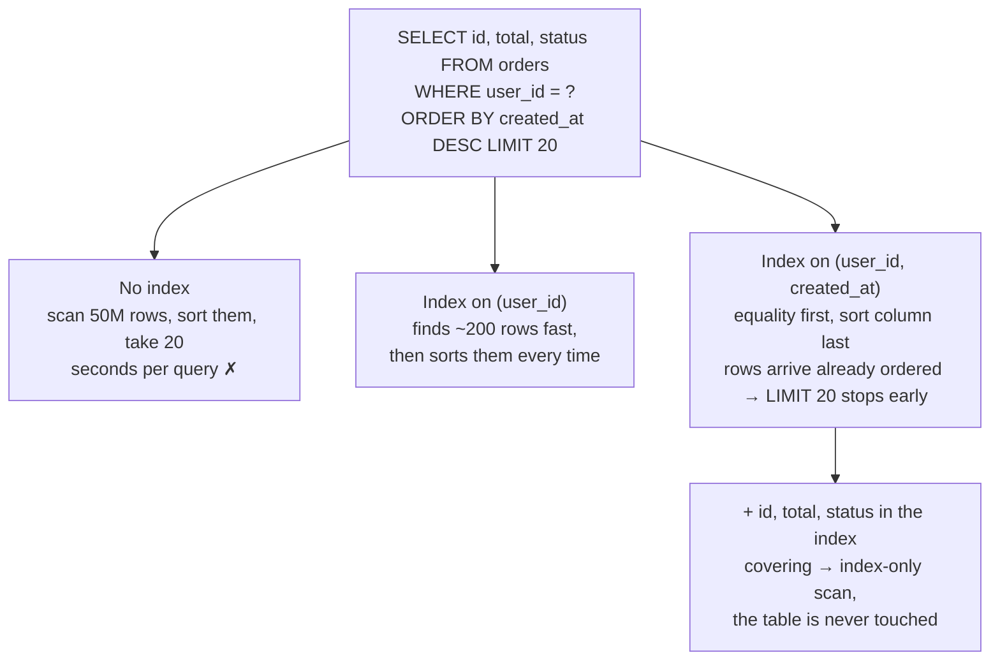

## The model

An **index** is a second copy of a few columns, kept sorted, with a pointer back to each
row. The database can binary-search it instead of reading the table.

That turns a query proportional to the table size into one proportional to the depth of a
tree — millions of rows in a handful of reads. The cost is symmetric and easy to forget:
every index must be updated on every insert, update and delete of the columns it covers, so
indexes make reads cheap by making writes more expensive.

## When to use it

You have a query that is too slow, and you are deciding whether an index fixes it.

1. **Does the query filter or sort on a column?** Only `WHERE`, `JOIN`, `ORDER BY` and
   `GROUP BY` clauses can use an index. A column you merely return is never the reason to
   add one.
2. **Does the filter eliminate most of the table?** An index that narrows a million rows to
   fifty is transformative. One that narrows them to four hundred thousand will be ignored
   by the planner, correctly, in favour of a **full table scan**.
3. **How write-heavy is this table?** On a table taking thousands of writes a second, each
   index is a real tax. On a table written once an hour, add whatever helps.

## Speedrun

**What** — an index is a sorted structure mapping column values to row locations. Almost
always a **B-tree index**: a balanced tree that supports equality, ranges, prefixes and
sorted retrieval. A **hash index** is faster for exact equality and useless for everything
else, which is why B-trees are the default.

**The rule that matters most** — a **composite index** on `(a, b, c)` can be used for a
filter on `a`, on `a` and `b`, or on all three. It cannot be used for a filter on `b` alone.
The columns are sorted left to right, like a phone book sorted by surname then first name:
finding every "Zambrano" is instant, finding every "Camilo" means reading the whole book.

**How to design an index for a query**

1. **Write the query out**, with its `WHERE`, `JOIN` and `ORDER BY` clauses visible.
2. **Put equality columns first**, in the composite key. Everything filtered by `=` belongs
   at the left, in any order among themselves.
3. **Put the range or sort column last.** `WHERE user_id = ? ORDER BY created_at DESC`
   wants `(user_id, created_at)`. A range column in the middle stops every column after it
   from being usable.
4. **Consider adding the returned columns** to make it a **covering index** — one holding
   everything the query needs, so the database never touches the table at all.
5. **Run `EXPLAIN` and read whether the index was used.** A planner ignoring your index is
   telling you something true about **selectivity**, not making a mistake.
6. **Count the indexes on the table.** More than four or five on a write-heavy table is
   usually one query's convenience being paid for by every writer.

**Why it works** — a table scan reads every row, so its cost grows linearly with the table.
A B-tree lookup costs the height of the tree, which grows logarithmically: a billion rows is
about thirty comparisons. That gap is what an index buys, and it widens as the table grows.

**The cost nobody mentions in interviews** — five indexes on a table means every insert
does six writes. This is **write amplification**, and it is why "just add an index" is a
tradeoff rather than a fix.

## Going deeper

### What a B-tree actually gives you

A B-tree keeps keys in sorted order in a shallow, wide, balanced tree. Sortedness is where
all the capabilities come from, and they are worth listing because each one is a query shape
you can now serve:

**Equality.** `WHERE email = ?` — descend the tree, one path.

**Range.** `WHERE created_at > ?` — find the start, then walk sideways along the leaves,
which are linked. This is why range queries are cheap on an indexed column and hopeless
without one.

**Prefix.** `WHERE name LIKE 'cam%'` — a prefix is a range. `LIKE '%ilo'` is not, which is
why leading wildcards cannot use an index and need full-text search instead.

**Sorted retrieval.** `ORDER BY created_at` — the index is already in that order, so the
database can stream rows out without sorting them. On a large result set this is often a
bigger win than the filtering.

**Uniqueness.** A unique index is how the database enforces that constraint, because
checking is a lookup rather than a scan.

A hash index gives you the first of those and none of the rest. That is the whole
comparison, and it is why you rarely choose one deliberately.

### The leftmost prefix rule, which decides most index questions

A composite index on `(a, b, c)` sorts rows by `a`, then by `b` within equal `a`, then by
`c` within equal `b`. So the usable filters are `a`, `(a, b)`, and `(a, b, c)` — always a
prefix, never a suffix.

The phone book is the honest analogy. Sorted by surname then first name, you can find every
Zambrano instantly, and every Zambrano called Camilo just as fast. Finding everyone called
Camilo regardless of surname means reading the entire book, because the Camilos are
scattered across every page.

One consequence surprises people: `(a, b)` and `(b, a)` are different indexes, and having
one does not help a query that needs the other. Another: a range condition consumes the
sortedness. In `WHERE a = 1 AND b > 5 AND c = 3`, the index can use `a` and `b`, but `c` is
useless — beyond a range, rows are no longer ordered by the next column.

This is why the ordering rule is *equality columns first, range or sort column last*. It is
also the single most common thing to get wrong on a whiteboard, and getting it right is
noticed.

### Selectivity, and why the planner ignores you

**Selectivity** is the fraction of rows a condition eliminates. **Cardinality** is how many
distinct values a column has. High selectivity means the filter leaves few rows.

Using an index is not free. The database descends the tree, gets row pointers, then jumps
to each row in the table — and those jumps are random reads. Reading the table
front-to-back is sequential, which is dramatically faster per row.

So there is a crossover. Below roughly 5–10% of the table, the index wins easily. Above it,
the random jumps cost more than just reading everything, and a good planner picks the scan.

That explains a result that looks like a bug: an index on a boolean, or on a status column
where 95% of rows say `active`, will simply never be used. There is no point indexing a
column that cannot narrow anything. The fix is a composite index leading with something
selective, or a partial index covering only the rare value.

### Covering indexes and the second lookup

Normally an index lookup has two steps: find the row pointer in the index, then read the
row from the table to get the columns you asked for. That second step is the random read.

A **covering index** contains every column the query touches, so the second step disappears
entirely. The database answers from the index alone — an **index-only scan**, and often
several times faster than the same query with an ordinary index.

For `SELECT id, status FROM orders WHERE user_id = ? ORDER BY created_at DESC`, an index on
`(user_id, created_at)` finds the rows and then fetches each one. An index on
`(user_id, created_at, id, status)` answers without touching the table.

The price is size. A covering index duplicates those columns, so it is larger, slower to
update, and more of your memory budget. It is worth it for a query that runs thousands of
times a second and not worth it for one that runs hourly — which is the general shape of
every indexing decision.

### What indexes cost on the write path

Every index is a structure that must stay correct. An insert writes the row and then adds an
entry to each index. An update to an indexed column removes and re-adds an entry. A delete
removes from all of them.

**Write amplification** is the ratio: one logical write becoming N physical ones. Six
indexes means roughly seven writes per insert, plus the tree rebalancing that occasionally
follows, plus the memory each index consumes that is then unavailable to cache the table.

There is a subtler cost. Indexes on randomly-distributed columns — a UUID primary key is the
classic — scatter writes across the whole tree, so each insert dirties a different page and
the [[buffer pool]] stops helping. The same table keyed on a time-ordered id appends to one
place. This is a real and frequently-measured difference, and it is the practical argument
for time-sortable identifiers.

The habit worth building is to treat an index as a standing cost rather than a one-time
change. Before adding one, ask which query needs it, how often that query runs, and whether
an existing index could be extended to serve both.

## See it work

The orders table from the previous page: 50 million rows, serving "a user's newest 20
orders" 5,000 times a second.

With no index the database reads all 50 million rows, discards almost all of them, sorts
the survivors and returns twenty. At 5,000 queries a second this does not degrade
gracefully; it stops working.

An index on `user_id` alone fixes the filtering and leaves the sort. It finds one customer's
two hundred orders quickly, then has to order them by date on every single execution.
Better, and still doing avoidable work five thousand times a second.

The composite index on `(user_id, created_at)` is the answer, and the column order is the
whole point. Equality first, sort column last, so rows come out of the index already in
date order and the `LIMIT 20` stops after twenty entries rather than after two hundred.

Making it cover `id`, `total` and `status` removes the last step: twenty random reads into
the table, replaced by nothing. The trade is a wider index on a table taking 500 writes a
second, which is worth stating out loud rather than assuming — at 50,000 writes a second the
answer might well go the other way.

## Next

Replication is how the read traffic above gets served without the writes competing for the
same machine, and partitioning and sharding is what happens when one machine stops being
enough for either.
