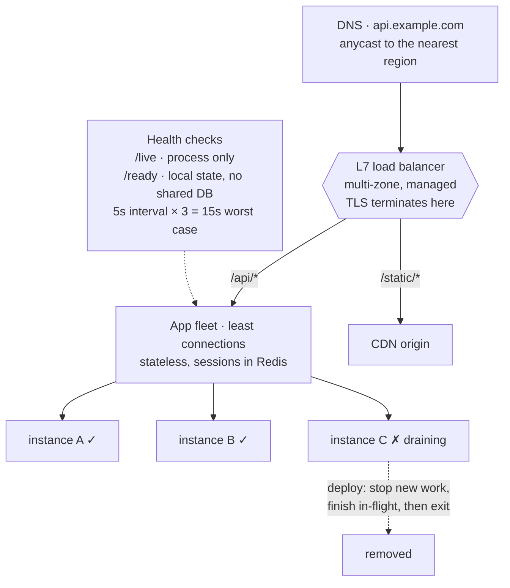

## The model

A **load balancer** sits in front of several identical servers and decides which one gets
each request. Clients address the balancer; the balancer addresses the fleet.

It does two jobs, and the second is the one people forget. It spreads load, so one machine's
capacity stops being the system's capacity. And it removes failed machines from rotation, so
a dead server stops receiving traffic within seconds rather than returning errors until
someone notices. The second job is why a load balancer sits in front of a single server
often enough to be worth mentioning.

## When to use it

You have more traffic than one machine can serve, or you cannot afford one machine's failure
to be visible.

1. **Do you need to look inside the request?** Routing `/api` to one fleet and `/images` to
   another, or terminating TLS, requires **layer 7**. Pure throughput with no inspection is
   cheaper at **layer 4**.
2. **Are the servers actually identical?** Load balancing assumes any server can serve any
   request. If a server holds session state in memory, that assumption is false and you need
   **sticky sessions** or, better, to move the state out.
3. **How fast must a dead server leave rotation?** That is a **health check** interval and
   threshold, and the arithmetic is worth doing: 5-second checks with 3 failures means 15
   seconds of errors.

## Speedrun

**What** — the balancer accepts connections, picks a healthy backend, and forwards. Two
layers, named for the OSI layer they understand:

| | Layer 4 | Layer 7 |
|---|---|---|
| Sees | IP and port | URLs, headers, cookies, method |
| Can route by | connection only | path, host, header, anything |
| Can do | forward packets fast | TLS termination, retries, rewrites |
| Cost | very low, millions of connections | parses every request |
| Examples | AWS NLB, IPVS | AWS ALB, nginx, Envoy |

**How to place one in a design**

1. **Say which layer and why.** "L7, because we route by path and terminate TLS there" is
   one sentence and it settles the question.
2. **Pick an algorithm.** **Round robin** for uniform requests, **least connections** when
   request durations vary widely. Least connections is the safer default for anything
   calling a database.
3. **Define the health check** — what it hits, how often, how many failures remove a
   backend. Point it at an endpoint that actually exercises dependencies, not one that
   returns 200 unconditionally.
4. **Make the servers stateless**, so any backend can serve any request. Sessions go to
   Redis or a signed cookie, never to a server's memory.
5. **Set connection draining** on deploy: stop new requests to a backend, let in-flight ones
   finish, then kill it. Without this every deploy drops the requests in flight.
6. **Put the balancer itself in more than one zone.** A single load balancer is a single
   point of failure sitting in front of your redundancy.

**Why it works** — it turns capacity into something you buy by adding machines rather than
by making one machine bigger, and it makes machine failure a routing event instead of an
outage. Both properties depend on the servers being interchangeable, which is why
statelessness is the actual prerequisite.

**The trap** — a health check that only proves the process is running. If it returns 200
while the database connection is dead, the balancer keeps sending traffic to a server that
fails every request.

## Going deeper

### Layer 4 and layer 7, and what each one costs

**Layer 4 load balancing** works at the TCP level. It sees a connection — source IP, port,
destination — and forwards packets without reading them. It cannot know what the request
asks for, because it never parses one.

That ignorance is the point. There is no parsing, no buffering, no TLS work, so a modest
machine handles millions of concurrent connections and adds well under a millisecond. It
also passes traffic through unmodified, which matters for protocols that are not HTTP.

**Layer 7 load balancing** terminates the connection, parses the request, and makes a new
one to the backend. Now it can route on path, host or header; terminate TLS once at the
edge; retry a failed request against another backend; rewrite, compress, or add headers.

Those capabilities are why L7 is the common answer for web traffic. The costs are real:
every request is parsed, TLS is decrypted and often re-encrypted, and the balancer is now a
stateful participant that can itself be a bottleneck.

The pattern in large systems is both — L4 at the edge for raw connection handling, L7
behind it for routing. Being able to say why you would use each is worth more than picking
one.

### The algorithms, and when the simple one is wrong

**Round robin** sends each request to the next backend in turn. Perfect when every request
costs about the same, and it is the default almost everywhere.

It fails when request costs vary. Ten servers, one receives a request that takes 30 seconds,
and round robin cheerfully sends it nine more during that window. The queue on that machine
grows while others idle, and this is exactly the [[queueing delay]] curve doing its work:
one overloaded backend's latency does not degrade gently.

**Least connections** sends to whichever backend currently has fewest open connections. It
adapts automatically to varying request cost, because a slow server accumulates connections
and stops being chosen. For anything backed by a database — where one query can be a hundred
times another — this is the better default.

**Weighted** variants let you give bigger machines more traffic, which matters during a
migration between instance types.

**Hash-based** routing sends the same key to the same backend, using [[consistent hashing]]
so adding a machine does not reshuffle everything. This is how you get cache locality — each
backend caches a stable subset — and it is the right choice in front of a cache tier. The
cost is that it reintroduces the [[hot key]] problem.

Two more worth knowing by name. **Random with two choices** picks two backends at random and
sends to the less loaded of the two; it performs almost as well as least connections with
none of the coordination, which is why it appears in distributed proxies. And
**latency-based** routing prefers backends responding fastest, which is [[the tail at scale]]
being managed rather than suffered.

### Health checks, which are where this actually goes wrong

A **health check** is the balancer periodically asking a backend whether it is alive.
Passive checks watch real traffic for errors; active checks probe an endpoint on a schedule.

The failure that recurs is a check that proves too little. `GET /health` returning a
hardcoded 200 proves the process is running and the port is open. It does not prove the
database is reachable, the disk has space, or the dependency the service exists to call is
answering. A server failing every real request will pass that check indefinitely.

The opposite failure is a check that proves too much. If `/health` checks a shared database
and that database blips, *every* backend fails its check simultaneously and the balancer
removes the entire fleet. A dependency-checking health check turns a degraded dependency into
a total outage, and it converts an independent failure into a [[correlated failure]] by
construction.

The resolution most mature systems use is two endpoints. A liveness check that only asks "is
this process wedged, should it be restarted" and touches nothing external. A readiness check
that asks "should this instance receive traffic right now" and may consider local state. Hard
dependencies stay out of both, and their failure is handled by degrading the response rather
than by removing servers.

Then the arithmetic: interval times threshold is your error window. Checks every 5 seconds
with 3 consecutive failures means up to 15 seconds of traffic to a dead machine. Tightening
it shortens outages and increases the chance of evicting a healthy server that had one slow
moment.

### Sticky sessions, and why they are a smell

A **sticky session** pins a client to one backend, usually with a cookie, so their session
state in that server's memory stays reachable.

It works, and it undoes much of what the balancer is for. Load is no longer balanced; it
follows whoever happens to be assigned where, and a backend dying takes its users' sessions
with it.

Deploys also become disruptive, because draining now means waiting for sessions rather than
requests, and scaling out helps only new users since existing ones stay pinned.

The fix is nearly always to move the state rather than route around it: a session store in
Redis, or a signed token carrying the state to the client. Then any backend serves any
request and the balancer's assumption is true again.

There is one legitimate use, worth knowing so you do not reject it reflexively: long-lived
connections. A WebSocket is a connection to one specific machine by nature, and stickiness
there is inherent rather than chosen.

### Getting traffic to the load balancer

The balancer removes the servers as a single point of failure and becomes one itself. Three
mechanisms resolve that, and they operate at different levels.

**DNS load balancing** returns several IPs for one hostname, and clients pick. It is free and
coarse: DNS is cached by resolvers that ignore your TTL, so removing a failed address takes
minutes to hours. Adequate for spreading across regions, useless as a failure response.

**Anycast** advertises the same IP address from many locations, and the internet's routing
protocol delivers each client to the nearest one. Failure handling is genuinely fast — the
route withdraws and traffic reroutes in seconds — and it is how CDNs and public DNS
resolvers work.

**A managed balancer** — ALB, Cloud Load Balancing — is redundant internally across zones and
is what most systems actually use, because the provider has solved this and it is not where
your effort belongs.

**Service discovery** is the same question one layer in: how does the balancer know which
backends exist? A registry that instances join and leave, with health state attached. In
Kubernetes this is a Service; in an interview it is worth one sentence, because "how does it
know about new instances" is a natural follow-up and "static config" is the wrong answer.

## See it work

The order service at 5,000 requests a second, deploying several times a day.

TLS terminates at the balancer, which is the main reason this is layer 7 rather than layer
4 — one certificate in one place rather than on every instance. Path routing comes free once
you are parsing anyway, so `/static` leaves for the CDN without the app fleet ever seeing it.

Least connections rather than round robin, because these requests hit a database and their
costs differ by an order of magnitude. Round robin would keep feeding a backend already stuck
behind a slow query, and the queueing curve makes that degrade sharply rather than gently.

The health checks are split deliberately. `/live` answers "is this process wedged" and
touches nothing external, so a database blip cannot make the fleet appear dead. `/ready`
considers local state only. If the shared database is genuinely down, every instance returns
errors — but they stay in rotation and return a useful error, rather than being evicted and
leaving nothing to serve at all.

Instance C is mid-deploy and draining: removed from rotation, still finishing the requests
it already accepted. Without draining, every deploy at 5,000 requests a second would drop
whatever was in flight — a few hundred requests, several times a day, which is a real error
budget spent on nothing.

The balancer is managed and spans zones, because the alternative is putting a single machine
in front of a fleet built to survive machine loss.

## Next

Rate limiting is how the same front door protects itself from a client sending more than its
share, and CDNs are what happens to the `/static` branch above.
