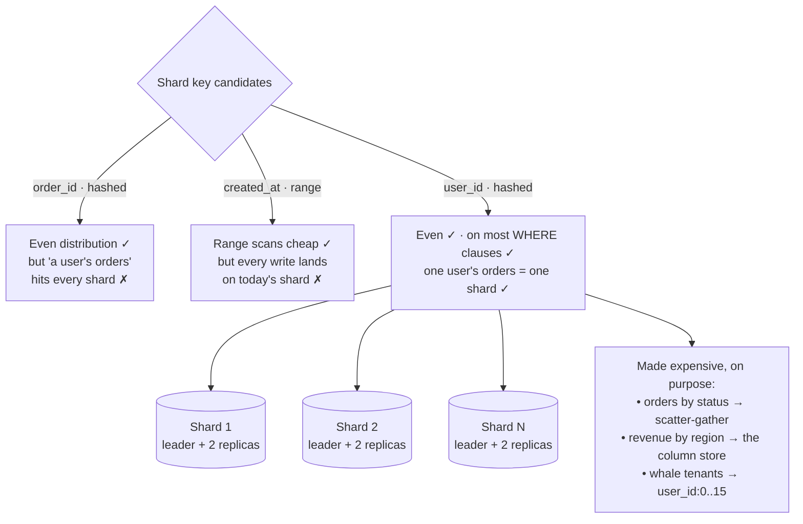

## The model

**Partitioning** splits one dataset into pieces so each machine holds a subset.
**Sharding** is the same idea when the pieces sit on separate machines. Every row belongs
to exactly one partition, chosen by its **shard key**.

This is the move that scales writes, which replication cannot: ten shards accept ten
leaders' worth of writes. The price is that the shard key becomes the only cheap way to
find anything. Queries naming it hit one machine; queries not naming it hit all of them.

## When to use it

Writes or data volume have outgrown one machine, and you are deciding how to split.

1. **Is one machine genuinely the limit?** A single Postgres primary handles a few thousand
   writes a second and terabytes of data. Sharding below that buys complexity you will pay
   for daily and capacity you will not use.
2. **What is on almost every query's `WHERE` clause?** That is your shard key candidate. If
   no single column appears on most queries, you are not ready to shard — you will build
   **scatter-gather** for everything.
3. **Is any single key value enormous?** One customer with 40% of the rows, one celebrity
   with 90 million followers. A **hot partition** cannot be fixed by adding machines, so
   find it before you choose the key, not after.

## Speedrun

**What** — rows are assigned to partitions by a function of the shard key. Two schemes:

| | Range partitioning | Hash partitioning |
|---|---|---|
| Assignment | key falls in a range | hash of key modulo N |
| Range scans | cheap, one partition | impossible, hits all |
| Distribution | uneven if keys cluster | even by construction |
| Classic failure | today's data all on one shard | no efficient "last 24 hours" |

**How to shard a dataset**

1. **Confirm one machine is actually the limit**, with the [[back-of-envelope]] arithmetic.
   Write it down. Most designs that shard did not need to.
2. **Pick the shard key from the queries, not the schema.** The column that appears in the
   most `WHERE` clauses. For a per-tenant product it is nearly always the tenant id.
3. **Check the key for skew.** Sort your entities by row count and look at the largest. If
   the top one is orders of magnitude above the median, the key needs a suffix to split it.
4. **Choose hash unless you need range scans.** Hash distributes evenly and kills range
   queries; range keeps them and invites hot spots. Say which you chose and why.
5. **Use consistent hashing or virtual nodes** rather than modulo N, so adding a
   machine moves a small fraction of the data instead of nearly all of it.
6. **Name the queries this makes expensive** before anyone asks. Every design has some, and
   volunteering them is the difference between having chosen and having guessed.

**Why it works** — a write touches exactly one partition, so N partitions accept N times the
writes with no coordination. That is the only mechanism that scales writes horizontally, and
it works precisely because the partitions never have to agree.

**The trap** — a shard key you cannot change. Re-sharding a live system is a migration
measured in weeks, so this is a [[one-way door]] and deserves the deliberation one gets.

## Going deeper

### Range and hash, and what each one destroys

**Range partitioning** assigns by where the key falls: users A–F on shard 1, G–M on shard 2.
Timestamps are the common case, one partition per day or month.

It keeps range scans cheap — "everything in March" is one partition — and that is a genuine
capability, which is why time-series systems use it universally. What it destroys is even
distribution, and it does so in the worst possible way: if you partition by time, every
write lands on today's partition. You have built N machines and are using one.

**Hash partitioning** assigns by hashing the key, so distribution is even regardless of what
the keys look like. What it destroys is ordering. Adjacent keys land on different machines,
so "the last 24 hours" or "users A through F" becomes a query against every partition.

The composite trick recovers some of both: hash on one column, range within it. Cassandra's
partition-key-plus-clustering-key is exactly this. Partition by `user_id` (hashed, even),
sort by `created_at` within the partition (ranged, scannable). One user's recent activity is
one partition, read in order — and that combination is why the pattern shows up in almost
every feed design.

### Choosing the shard key, which is the whole decision

Everything downstream follows from this choice, and it is close to irreversible. Three
properties matter, and they conflict.

**High [[cardinality]].** Enough distinct values to spread across every machine and every
machine you will add. Sharding by country gives you about two hundred partitions with wildly
uneven sizes; sharding by user id gives you millions of even ones.

**Even distribution.** No value should be dramatically more common than the others.

**Present in your queries.** A query that does not name the shard key must ask every
partition. If the key is absent from most queries, sharding made everything worse.

A key satisfying all three is usually the entity your product is organised around — the
tenant in B2B, the user in consumer. When those conflict, the resolution worth knowing is
that queries win: a perfectly distributed key nobody queries by is worse than a slightly
uneven key on every `WHERE` clause.

### Hot partitions, and why more machines do not help

A **hot partition** is one receiving disproportionate traffic. It is the characteristic
failure of sharding, and the reason it hurts is structural: a partition lives on one
machine, so a hot partition is a single machine's limit reappearing after you paid to
remove it. Adding shards does nothing, because the hot key still hashes to one of them.

Three shapes recur.

**The celebrity.** Shard by user and one user has ninety million followers. Every write
fanning out to them lands on one partition.

**The append point.** Shard by time and all writes go to now.

**The whale tenant.** Shard by customer and your largest customer is 40% of the data.

The fixes all amount to splitting the key artificially. Append a bucket number — `user_id`
becomes `user_id:0` through `user_id:15` — so one logical key spans sixteen partitions and
reads gather from all sixteen. That trades read cost for write distribution, and you apply
it only to the keys that need it rather than universally.

The other fix is not sharding that data at all. Celebrity accounts are often handled by a
separate path entirely: fan-out on read instead of write, which is a design decision the hot
partition forced rather than a workaround.

### Rebalancing, and why modulo N is a trap

**Rebalancing** is moving data when the number of machines changes. The naive scheme —
`hash(key) % N` — is the thing to avoid, and the reason is worth being able to state.

Going from 4 machines to 5 changes the modulus, so `hash(key) % 4` and `hash(key) % 5`
disagree for roughly 80% of keys. Adding one machine moves almost the entire dataset.
During that migration the cluster is both serving traffic and copying everything.

**Consistent hashing** fixes it by mapping both keys and machines onto a ring and assigning
each key to the next machine clockwise. Adding a machine takes over only the arc between it
and its predecessor, so about $1/N$ of the data moves rather than $(N-1)/N$.

The refinement in practice is virtual nodes: each physical machine claims many small arcs
rather than one large one. That evens out the distribution — with one arc each, a few
machines get unlucky and hold much more than their share — and it makes removing a machine
spread its data across all the others instead of dumping it on one neighbour.

Many systems use a simpler alternative worth knowing: a fixed large number of partitions,
say 1024, assigned to machines by a lookup table. Partitions never split; they just move.
Adding a machine reassigns some of the 1024, and the mapping is explicit rather than
computed. Kafka and Elasticsearch work this way.

### The queries sharding makes expensive

**Scatter-gather** is querying every partition and merging results. It is the cost of any
query that does not name the shard key, and its shape is bad in two ways: the work is N
times larger, and the latency is the slowest of N responses rather than the average — which
is [[the tail at scale]] arriving by design rather than by accident.

The **secondary index problem** is the sharpest version. An index on a non-shard-key column
can be local to each partition, which means every lookup is a scatter-gather. Or it can be
global, partitioned by the indexed value, which makes lookups cheap and every write a
distributed write touching two partitions. There is no third option, and picking one out
loud is a strong answer.

Two more things get expensive. Transactions across partitions need two-phase commit or a
saga, because no single machine can commit both — most sharded systems simply refuse them.
And joins across partitions largely stop working, which is why sharded designs denormalise
aggressively and why "we shard" and "we do ad-hoc analytics on the live database" are
rarely both true.

## See it work

The order service has grown: 50,000 writes a second, far past one leader, so the write path
from the replication page is now the limit.

Hashing `order_id` distributes perfectly and is the wrong answer, because the most common
query is "this user's recent orders" and that would now ask every shard. Even distribution
is worthless if it is not the distribution your queries want.

Range partitioning on `created_at` keeps date scans cheap and fails the other way: all
50,000 writes a second are for right now, so they all land on one partition. The cluster
would be N machines with one of them on fire.

Hashing `user_id` satisfies all three properties. Millions of distinct values, roughly even,
and present in nearly every query. One user's orders live together on one shard, so the
5,000-per-second read from the indexing page stays a single-shard query with the same
`(user_id, created_at)` index doing the same work — just on a tenth of the rows.

Then the costs, said out loud rather than discovered later. "All pending orders" no longer
names the shard key, so it is scatter-gather across every shard and should be served from
the column store instead. Cross-user transactions no longer commit atomically. And the
largest tenants get a bucket suffix, `user_id:0` through `user_id:15`, so one enormous
customer spans sixteen partitions rather than melting one.

Each shard still carries a leader and two replicas from the replication page. The two
mechanisms compose and solve different problems: sharding gives write capacity, replication
gives read capacity and survival, and a design at this scale needs both.

## Next

Consistency models makes precise what "a moment stale" means across the replicas and shards
above, and caching strategies is the layer that sits in front of all of it.
