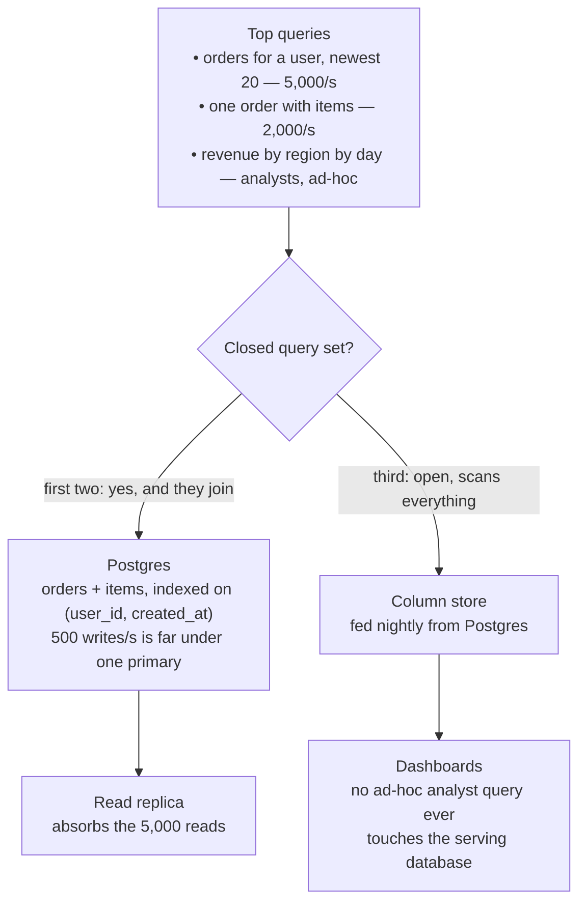

## The model

An **access pattern** is the set of reads and writes a system actually performs: which
queries, how often, returning how much, filtered by what.

Databases differ mostly in which access patterns they make cheap. A relational database
makes arbitrary joins cheap and horizontal writes expensive; a key-value store makes
lookups by one key cheap and everything else impossible. So the choice is decided by
writing the queries down first. Naming a product before that is a guess wearing a
justification.

## When to use it

You know the entities and roughly the volume, and you are choosing where the data lives.

1. **Can you name every query in advance?** If yes, a store optimised for those exact
   lookups is safe. If the queries will keep arriving from people you have not met, you
   want a **relational database**, because ad-hoc joins are the thing it is for.
2. **Do writes exceed what one machine will take?** Below a few thousand a second, a
   single relational primary is a complete answer. Above it, you are choosing a
   partitioning story, and that is what a **wide-column store** sells you.
3. **Is the interesting question about relationships or about records?** "Friends of
   friends who bought this" is a traversal, and traversals are what a **graph database**
   makes cheap and everything else makes expensive.

## Speedrun

**What** — the five families, by the access pattern each makes cheap:

| Family | Cheap | Expensive | Reach for it when |
|---|---|---|---|
| Relational | Joins, ad-hoc queries, transactions | Horizontal write scaling | The queries are not all known yet |
| Document | Fetching one nested object whole | Joins across documents | The object is read and written as a unit |
| Key-value | Lookup by one key | Anything else | You have a cache, a session, a counter |
| Wide-column | Huge write volume, queries by partition key | Ad-hoc anything | Writes exceed one machine, queries are fixed |
| Graph | Multi-hop traversal | Aggregates over everything | The relationships *are* the data |

**How to choose one**

1. **Write down the top five queries** the system must serve, with rough frequencies. Not
   entities — queries. "Get a user's last 20 orders, 5,000 times a second."
2. **Write down the write volume and the size of one record**, from the
   [[back-of-envelope]] arithmetic. This decides whether one machine is in play at all.
3. **Ask whether the query set is closed.** Closed means you can enumerate it and it will
   not grow sideways. Open query sets need a relational database; closed ones free you to
   pick something specialised.
4. **Ask what must be atomic.** If money moves, or two rows must change together or
   neither, you want real transactions and you should say so before comparing anything.
5. **Default to Postgres and argue yourself out of it.** It does relational, JSON
   documents, full-text search, and geospatial competently. Starting there and naming
   what forces you off it is a better argument than starting from a preference.
6. **Say the trade out loud when you choose.** "Cassandra, because 50k writes a second
   past one machine, and I accept losing ad-hoc queries" is the sentence being graded.

**Why it works** — every database is a set of decisions about what to make fast at the cost
of what else. Sorted storage makes range scans cheap and random writes expensive.
Partitioning by key makes writes scale and cross-key queries impossible. Once you know
which costs you are willing to pay, the field narrows to one or two candidates on its own.

**The trap** — choosing by scale you do not have. The volume that justifies Cassandra is
rare, and the cost of it is paid every day by everyone who has to query the data.

## Going deeper

### Relational, and why it is still the default

A **relational database** stores rows in tables with a fixed schema and lets you combine
them at query time with joins. Postgres and MySQL are the ones you will meet.

Its real advantage is not the tables. It is that the query and the storage are decoupled:
you did not have to know, when you designed the schema, what questions people would ask.
Someone can arrive two years later with a query nobody anticipated and get an answer, which
is the property every other family trades away first.

It also gives you transactions across multiple rows, foreign keys that make certain broken
states unrepresentable, and a query planner that will use an index you added yesterday
without any code changing.

The genuine limits are worth stating precisely, because they are narrower than folklore
suggests. Writes go through one primary, so write throughput is bounded by one machine —
that is a real ceiling, and it sits in the low thousands per second for typical rows. Joins
across very large tables get expensive. And the schema is a coordination cost: changing it
means a migration.

None of those bite at the volume most systems ever reach, which is why
[[boring technology]] is a stronger argument here than almost anywhere else in a design.

### Document stores, and the question they answer

A **document store** keeps self-contained nested objects, usually JSON, addressed by id.
MongoDB and DynamoDB in its document mode are the common ones.

The pattern that fits is an object read and written as a whole: a product with its
variants, a form with its answers, a config blob. You avoid five joins on every read
because the nesting already did the joining, once, at write time.

The pattern that does not fit is data other things need to join against. The moment two
documents both embed a copy of the same customer name, you own an update problem that the
database will not help you with — and that problem does not appear until the day the
customer changes their name.

A useful test: if you find yourself writing application code that fetches documents in a
loop to stitch them together, you have rebuilt joins by hand, badly, and a relational
database was the answer.

### Key-value stores, and their honesty

A **key-value store** does exactly two things: put a value at a key, get the value at a
key. Redis, Memcached, and DynamoDB in its simplest mode.

There is nothing else. No querying by value, no joins, no scans that are not a bad idea.
That severity is the point — the data structure is a hash map, so the operations are O(1)
and the implementation has almost nothing to get wrong.

It is the right answer for sessions, caches, feature flags, rate-limit counters and
leaderboards: things addressed by an id you already have. It is the wrong answer for
anything you will later want to ask a question about, and "later" arrives reliably.

### Wide-column stores, and what they actually buy

A **wide-column store** — Cassandra, ScyllaDB, HBase — partitions rows across many machines
by a partition key, and within a partition stores them sorted by a clustering key.

What that buys is write throughput that scales by adding machines, because there is no
single primary that every write must pass through. Hundreds of thousands of writes a second
is ordinary. That is genuinely unavailable from a relational database at any price.

What it costs is that the partition key becomes the only efficient way in. A query that
does not name the partition key has to touch every machine, which is not a slow query so
much as a denial-of-service against your own cluster. You design the table *per query*, and
you accept storing the same data several ways because a new question means a new table.

That is the trade, and it is a big one. Take it when the write volume genuinely forces it —
metrics, events, feeds, time series — and not because the word "scale" appeared in the
prompt.

### Graph databases, and the narrow case

A **graph database** stores nodes and edges and makes walking edges cheap. Neo4j is the
reference.

The case is multi-hop traversal: "people who follow someone I follow", "components affected
if this service fails", "shortest path through these dependencies". In a relational database
each hop is another self-join, so a three-hop query is three joins and a six-hop query is
usually unshippable. In a graph database a hop is a pointer.

The case is narrower than it sounds, though. One or two hops — a user's friends, a post's
tags — is a perfectly ordinary join and needs nothing special. Reach for a graph only when
the traversal depth is genuinely variable and the relationships are the product rather than
an attribute of it.

### OLTP and OLAP, the split that resolves most arguments

**OLTP** is online transaction processing: many small reads and writes touching a few rows
each, which is what an application does. **OLAP** is online analytical processing: few
enormous queries scanning huge fractions of the data, which is what a dashboard does.

They want opposite physical layouts. OLTP wants rows stored together, so fetching one
order is one disk read. OLAP wants columns stored together, so summing one column does not
drag ninety unused ones through memory. This is why a column store — Snowflake, BigQuery,
ClickHouse — can be a hundred times faster at analytics and useless at serving an app.

Recognising which one you are being asked about resolves a lot of interview confusion.
"Design analytics for this" is not a variation on "design this"; it is a second system, fed
from the first, with a different store and different guarantees. Saying that out loud is
usually worth more than whatever you propose next.

### Normalisation, and when to abandon it

**Normalisation** stores each fact exactly once and joins to assemble answers.
**Denormalisation** stores copies so reads do not have to join.

Normalised is correct by construction: one copy means no way to disagree with yourself.
Denormalised is fast by construction: the assembly already happened. The trade is
consistency work — every copy is a thing that can drift, and keeping them together is code
you now own.

The rule that holds up: normalise until a measured read pattern hurts, then denormalise
that one path deliberately and write down how the copies are kept in step. Denormalising
first, on the theory that joins are slow, produces systems that are both wrong and not
noticeably faster.

## See it work

An order service: 5,000 order reads a second, 500 writes, plus a dashboard nobody has
finished specifying.

The first two queries join orders to users and items, run constantly, and touch few rows
each. That is textbook OLTP, and 500 writes a second is nowhere near a single Postgres
primary's ceiling — so the honest answer is one relational database, with an index on
`(user_id, created_at)` serving the newest-20 query directly.

The third query is the one that changes the design, and it does so by being *open*. Nobody
can enumerate what analysts will ask, and whatever they ask will scan months of rows. Run
that against the serving database and a single unbounded query can saturate the primary
that customers depend on.

So it becomes a second system: a column store fed from Postgres on a schedule. The access
patterns were incompatible, and the resolution is two stores rather than one compromise —
which is also the honest answer to "can Postgres do analytics." It can, right up until the
query someone writes at 4pm takes the checkout path down with it.

Notice what did not happen. Five thousand reads a second never justified leaving relational;
a read replica absorbs it. Reaching for Cassandra here would have bought write scaling
nobody needs and paid for it by making the analyst's query impossible rather than merely
inconvenient.

## Next

Indexing is how the relational answer above actually serves 5,000 reads a second, and
replication is how the read replica in that diagram stays close enough to current to be
useful.
