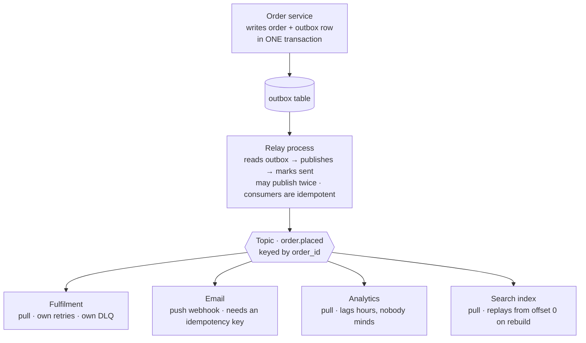

## The model

**Publish-subscribe** routes one message to every interested consumer. The publisher writes
to a **topic** and knows nothing about who reads it; **subscribers** register interest and
receive everything on that topic.

The point is not delivery — a queue delivers too. The point is that the publisher's list of
consumers is empty. Adding a fourth team that reacts to orders changes nothing on the
publishing side, which is what lets parts of a system evolve at different speeds.

## When to use it

An event has happened and more than one thing should follow, or will eventually.

1. **Does the publisher need to know the outcome?** If it must act on the result, this is a
   request-response call and pub-sub will make it worse by hiding the failure. Pub-sub fits
   when the publisher is genuinely finished.
2. **Is the consumer list open?** One consumer forever is a queue. A list you expect to grow,
   from teams you have not met, is the case pub-sub exists for.
3. **Does the consumer need the data, or just the fact?** Sending an id makes consumers call
   back for details. Sending the whole record does not, but freezes your schema into
   everyone's code.

## Speedrun

**What** — publishers write to a topic; every subscriber gets every message. Compare with a
queue, where consumers *compete* and each message goes to exactly one.

| | Queue | Pub-sub topic |
|---|---|---|
| Message goes to | one consumer | every subscriber |
| Adding a consumer | splits the work | adds a full copy |
| Publisher knows consumers | often, implicitly | never |
| Use it for | work to be done | facts worth announcing |

**How to design a pub-sub flow**

1. **Publish facts in the past tense**, named for what happened rather than what should
   follow. `order.placed`, not `send-confirmation-email` — the second is a command wearing an
   event's clothes, and it has smuggled the consumer list back into the publisher.
2. **Decide what the message carries.** An **event notification** carries an id and little
   else. **Event-carried state transfer** carries the whole record. Choose deliberately; see
   below.
3. **Version the schema from day one** and only ever add optional fields. Every subscriber
   parses this, and you cannot deploy them together.
4. **Give each subscriber its own retry and [[dead letter queue]].** Failure must be isolated
   per subscriber, or a broken consumer becomes everyone's outage.
5. **Make every subscriber idempotent.** Delivery is [[at-least-once]] per subscriber, so
   duplicates are certain rather than likely.
6. **Publish inside the same transaction as the state change**, using an outbox table. A
   commit that succeeds without publishing, or a publish without a commit, is the defect this
   pattern is famous for.

**Why it works** — the topic inverts the dependency. Without it, the order service imports
and calls email, analytics and search, so it must know all three exist and it fails when any
of them does. With it, all three depend on the topic and none depends on the others. That is
[[Conway's Law]] used deliberately: the message boundary is where the team boundary is.

**The cost, stated plainly** — nobody can tell you what happens when an order is placed by
reading the order service. The behaviour is now distributed across repositories.

## Going deeper

### Notification or state transfer, and the coupling you pick

Two message shapes, and the choice determines who is coupled to whom.

An **event notification** says only that something happened: `{ order_id: "abc" }`. It is
tiny, it leaks no schema, and every consumer that needs details calls back to fetch them.

That costs a request storm — N subscribers means N calls back to the publisher, at exactly
the moment it is already busy. It also costs a race: by the time they call, the order may
have changed, so the consumer sees a state that never coexisted with the event.

**Event-carried state transfer** puts the whole record in the message. Consumers need no
callback, they can work while the publisher is down, and they see the state as it was at that
moment. The cost is that your internal schema is now in everyone's code, and removing a field
means finding every consumer — which is [[Hyrum's Law]] arriving through a message bus.

The middle position most mature systems land on: carry the fields consumers actually need,
version the schema, treat it as a published contract rather than a database dump, and accept
that this is a real interface requiring real deprecation.

### Push and pull, and why it decides your failure modes

**Push delivery** has the broker call the subscriber — a webhook, an HTTP callback. Latency
is low and the subscriber needs no polling infrastructure, but the broker must now handle a
subscriber that is slow, down, or has changed address, and a subscriber that cannot keep up
has no way to say so. Push has no natural [[backpressure]].

**Pull delivery** has subscribers ask for messages when ready. They control their own rate,
so backpressure is inherent, and the broker's job stays simple. The costs are polling latency
and the subscriber owning its own consumption loop.

Kafka is pull; SNS and most webhook systems are push; SQS is pull and is frequently paired
behind SNS precisely to convert one into the other. That SNS-to-SQS pattern is worth knowing
by name: SNS fans out to N queues, and each subscriber then pulls from its own queue at its
own pace, with its own retries and its own dead letter queue. It is the standard way to get
fan-out and backpressure at once.

### The dual write problem, and the outbox

The **dual write problem** is the bug this pattern is known for. A service must save an
order and publish `order.placed` — two systems, no shared transaction:

Commit first, then publish — if the publish fails, the order exists and nobody downstream
knows. Publish first, then commit — if the commit fails, consumers react to an order that
does not exist. There is no ordering of two independent writes that is safe, and retrying does
not help, because the crash can land between them.

The **transactional outbox** resolves it by removing the second system from the critical
moment. The publish is written to an `outbox` table *in the same database transaction* as the
order, so both commit or neither does. A separate process then reads the outbox and publishes,
marking rows sent.

That process may publish twice — it can crash after publishing and before marking — which is
fine, because at-least-once was already the guarantee and consumers are already idempotent.
You have converted an unsolvable atomicity problem into a duplicate, and duplicates you know
how to handle.

Change-data-capture is the same idea using the database's own replication log instead of a
table, which avoids the extra write at the cost of tying you to the storage engine.

### Ordering, and why fan-out makes it harder

Every subscriber gets its own copy and processes at its own speed, so two subscribers can see
the same events in the same order and reach different states at any given instant. That is
normal and usually fine.

What is not fine is a subscriber that assumes ordering it was never promised. Across
partitions there is no order, so `order.updated` can arrive before `order.placed` if they
were keyed differently.

Two fixes, and it is worth knowing both. Key by the entity, so all events for one order share
a partition and stay ordered. Or include a version on each event and have consumers discard
anything older than what they have already applied — which also makes them robust against
duplicates and replays, and is the more forgiving of the two.

### What pub-sub costs you operationally

Everything above is the upside. The bill arrives in three places, and naming them is what
separates having chosen the pattern from having defaulted to it.

**Traceability.** The answer to "what happens when an order is placed" is no longer in any
one repository. Without distributed tracing and a schema registry, nobody can answer it, and
new engineers cannot form a mental model of the system at all.

**Debugging.** A failure is now asynchronous and somewhere else. The publisher succeeded; a
consumer three services away silently dead-lettered. Alerting must live per subscriber,
because the publisher has no idea anything went wrong.

**Schema drift.** Every subscriber parses your message, and they deploy on their own
schedules. Adding an optional field is safe; anything else is a coordinated migration across
teams who do not report to you.

None of these argue against pub-sub. They argue for using it where the decoupling is worth
paying for — genuinely independent reactions, several of them, likely to grow — and not for
two services that could simply call each other.

## See it work

`order.placed` fans out to four teams, each of whom owns its own failure.

The order service writes the order row and an outbox row in a single transaction, so there is
no moment where one exists without the other. This is the whole reason the outbox is there:
without it, a crash between the commit and the publish leaves an order that four teams never
hear about.

The relay publishes and marks the row sent. If it crashes in between it will publish again,
which is acceptable precisely because every subscriber is idempotent — the unsolvable
atomicity problem was traded for a duplicate, and duplicates are a solved problem.

Four subscribers, four independent failure domains. Analytics can lag by hours without anyone
noticing, search can rebuild from offset zero on a schema change, and email dead-letters
after three attempts without touching fulfilment. None of them is a dependency of order
placement, so none appears in the checkout availability calculation.

Email is push, over a webhook, and that is where the idempotency key from the previous page
becomes load-bearing. Push has no backpressure and a redelivered webhook is indistinguishable
from a new one, so without a key the customer gets a second confirmation email.

The thing this design gives up is legibility. Nobody reading the order service can tell you
that placing an order sends an email — that fact lives in a different repository owned by a
different team. That is the trade, and volunteering it is what makes the choice look
deliberate rather than fashionable.

## Next

Load balancing and rate limiting cover the synchronous side of the same traffic, and the
canonical designs put these pieces together against whole problems.
