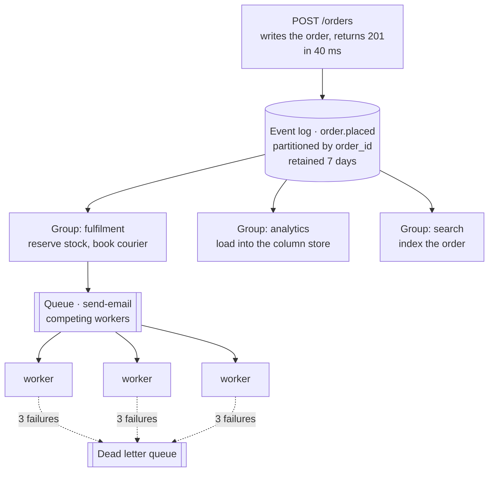

## The model

A **message queue** hands out work. Many workers compete for each message — the
**competing consumers** pattern — one of them wins it, and it is gone once acknowledged.
SQS and RabbitMQ are **message brokers** that work this way.

An **event log** keeps an ordered, retained record. Readers each hold their own position and
read independently, and nothing is consumed away — a second reader can start from the
beginning tomorrow. Kafka does this.

The distinction that matters: a queue holds *work to be done*, a log holds *what happened*.

## When to use it

Something should not happen inside the request, and you are choosing how to hand it off.

1. **Is this a task or a fact?** "Send this email" is a task and wants a queue. "An order was
   placed" is a fact, and three teams will want it, which wants a log.
2. **Will anyone else want this later?** A queue's message is gone once handled, so a second
   consumer means a second copy. A log is read by as many independent consumers as you like,
   including ones that do not exist yet.
3. **Does order matter, and across what?** Global ordering costs a single partition and caps
   your throughput at one consumer. Per-key ordering is usually what you actually need and
   is nearly free.

## Speedrun

**What** — both put a durable buffer between producer and consumer, which decouples their
speeds and lets the producer return immediately. They differ in what happens after a message
is read.

| | Queue | Log |
|---|---|---|
| After reading | deleted | retained for a fixed window |
| Consumers | compete; one gets each message | independent; all get everything |
| Replay | impossible | rewind the **offset** |
| Ordering | weak or per-queue | strict per partition |
| Scaling reads | add workers to the same queue | add **consumer groups** |
| Reach for it | work to be done | events that happened |

**How to put work behind a broker**

1. **Decide task or fact**, and pick accordingly. Getting this wrong is the expensive
   mistake — a queue you later need to replay cannot be replayed.
2. **Accept the message and return.** The producer's job ends at "durably buffered", which
   is what takes the work off the [[critical path]].
3. **Assume every message arrives more than once.** **At-least-once** is the practical
   default, so consumers must be idempotent. This is not optional.
4. **Choose a partition key if order matters.** Messages sharing a key keep their order;
   different keys do not. `order_id` gives you per-order ordering and full parallelism.
5. **Set a retry policy and a dead letter queue.** A message that fails forever must
   leave the queue, or it blocks the ones behind it and retries forever.
6. **Alarm on consumer lag, not queue depth alone.** Lag is the gap between what has been
   produced and what has been consumed, and it is the number that says whether you are
   falling behind.

**Why it works** — the buffer converts a peak into a backlog. Five thousand requests a
second arriving at workers that handle five hundred is an outage; the same load into a queue
is a queue that grows and then drains. You trade latency for survival, which is almost always
the right trade for work nobody is waiting on.

**The number to carry** — [[Little's Law]]. If messages arrive at 1,000/s and each takes
200 ms, you need 200 concurrent workers just to keep even. Fewer means the queue grows
without bound, and no amount of tuning changes it.

## Going deeper

### Why "exactly-once delivery" does not exist

Three delivery guarantees get named, and only two of them are real.

**At-most-once.** Acknowledge before processing. If the consumer dies mid-work, the message
is gone. Fast, lossy, and appropriate for metrics where a missing sample is invisible.

**At-least-once.** Acknowledge after processing. If the consumer dies after doing the work
but before acknowledging, the message is redelivered and the work happens twice. This is what
essentially every broker gives you.

**Exactly-once** delivery is not achievable across a network, and the reason is worth being
able to state. The consumer must either acknowledge before or after doing the work. Before
risks loss; after risks duplication. There is no third moment, and no protocol invents one,
because the acknowledgement itself can be the message that is lost.

What is achievable is exactly-once *effects*: at-least-once delivery plus a consumer that
produces the same result when run twice. Kafka's "exactly-once semantics" is this — a
transaction spanning the read, the processing and the write of the offset, which works
inside Kafka and not when your side effect is charging a credit card.

So the design rule is unconditional: assume duplicates and make the consumer idempotent.

### Partitions, ordering, and the throughput they cost

A log is split into partitions, and ordering is guaranteed only within one. Messages with the
same partition key land on the same partition and keep their order relative to each other.
Across partitions there is no order at all.

That is not a limitation to work around; it is the mechanism that makes parallelism possible.
Global ordering would require every message through one partition and one consumer, which
caps throughput at whatever one machine can do.

The practical move is to pick the narrowest key that preserves the ordering you actually
need. Ordering per order, per user, per account is nearly always sufficient, and it lets you
run as many consumers as you have partitions. Someone asking for global ordering has usually
not been asked what would break without it.

Two consequences follow. A partition is consumed by exactly one member of a consumer group,
so **your parallelism is capped by your partition count** — twenty partitions means at most
twenty useful consumers, and adding a twenty-first does nothing. And a hot key produces a hot
partition exactly as it does in [[sharding]], with the same fix of adding a suffix.

### Consumer groups, offsets and lag

An **offset** is a consumer's position in the log. A **consumer group** is a set of consumers
sharing one set of offsets, between which the partitions are divided.

This is the mechanism behind the log's headline property. The analytics team's group, the
search indexer's group and the audit team's group each hold their own offsets over the same
data, so all three see every message and none of them affects the others. Adding a fourth
consumer six months later costs a new group and no change to anybody.

**Consumer lag** — produced offset minus consumed offset — is the health metric that matters.
Queue depth tells you how much is waiting; lag tells you whether you are falling behind, and
it is the one that predicts an incident. Lag growing steadily means arrival rate exceeds
processing rate, and Little's Law says the only fixes are more consumers or faster processing.

Because offsets are just numbers, a bad deploy is recoverable in a way it never is with a
queue: rewind the offset and reprocess. That single property — replay — is the strongest
argument for a log, and the thing you lose permanently by choosing a queue for events.

### Retries, poison messages and the dead letter queue

A consumer that fails should retry, and a message that always fails must eventually stop.
Without that stop, one bad message is retried forever, and on an ordered partition it blocks
every message behind it. This is a poison message, and it is a full outage of one partition
caused by one row.

The **dead letter queue** is where messages go after N failures: out of the main flow,
retained for inspection, alarming to a human. The count is usually three to five, with
exponential backoff between attempts.

Backoff deserves the emphasis. Retrying immediately turns a downstream outage into a
[[thundering herd]] — every consumer hammering a service that is already failing. Exponential
backoff plus jitter is the difference between a dependency that recovers and one that is held
down by your retries.

### Backpressure, and what happens without it

**Backpressure** is a slow consumer's ability to make the producer slow down. Without it,
the buffer between them grows until something breaks.

An unbounded in-memory queue is the classic version of this failure. It looks like it is
absorbing the load right up until the process runs out of memory and dies, taking every
buffered message with it. A durable broker is better because the buffer is on disk and
survives, but disk is also finite, and a log that fills its retention starts dropping the
oldest messages — silently, since dropping is what retention means.

Real mechanisms are bounded queues that reject when full, and rate limiting at the producer.
Both are ways of saying no early rather than failing late, and "what happens when the
consumer cannot keep up" is one of the highest-signal questions in a design discussion —
because the honest answer is usually that nobody has decided.

### Log compaction, and the log as a table

**Log compaction** retains only the most recent message per key rather than a time window.
The log stops being a history and becomes a snapshot of current state, with the update
history for each key collapsed to its latest value.

That makes a log usable as a durable key-value store you can subscribe to. A new service
reads the compacted log from the beginning, rebuilds current state, then follows live
updates — which is the mechanism behind change-data-capture and most event-sourced designs.

It is worth knowing because it dissolves an apparent dichotomy. A compacted log is a table
and a stream at once: the log is the sequence of changes, the compacted view is the current
state, and each is derivable from the other.

## See it work

An order is placed. Three things must follow, and they are not the same kind of thing.

The API writes the order and returns in 40 milliseconds. Everything downstream is off the
[[critical path]], which is the entire reason for the broker — and it is also why the
availability arithmetic improves, since none of those three consumers is a dependency of the
checkout request any more.

`order.placed` is a **fact**, so it goes to a log. Three teams consume it in three consumer
groups, each with its own offsets, and none of them knows the others exist. When a fourth
team wants order events next quarter, they add a group and read the last seven days of
history — which a queue could never have offered, because those messages would have been
consumed away.

Partitioning by `order_id` gives ordering where it matters. Every event for one order is
processed in sequence; different orders proceed in parallel across every partition. Global
ordering would have meant one partition, one consumer, and a throughput ceiling nobody wanted.

"Send the confirmation email" is a **task**, so it goes to a queue. Workers compete, each
email is sent by one of them, and scaling is just adding workers. A message that fails three
times lands in the dead letter queue rather than blocking the ones behind it.

The email worker must be idempotent, because delivery is at-least-once and a worker that
dies after sending but before acknowledging will be handed the same message again. Without a
deduplication check the customer gets the email twice — which is the subject of the next page.

## Next

Idempotency is the property every consumer above has to have before at-least-once delivery
is survivable, and publish-subscribe is the routing pattern the log is implementing.
