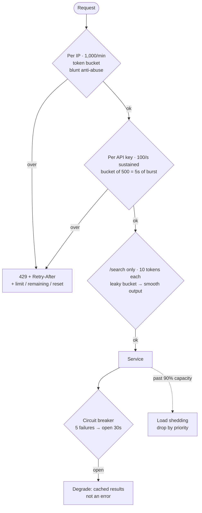

## The model

**Rate limiting** caps how many requests a caller may make in a period. Over the cap, you
refuse — normally with `429 Too Many Requests` and a `Retry-After` header. **Throttling** is
the same idea applied as delay rather than refusal, and the two words are used
interchangeably in practice.

Refusing is the feature. A system with no limit accepts work until it collapses, and a
collapsed system serves nobody; a system that refuses 5% of requests still serves 95%. So
the question is never whether to shed load but which load to shed, on what key, and how much
bursting to forgive before you do.

## When to use it

Any endpoint reachable by someone who is not you, and any dependency you can overwhelm.

1. **What is the limit protecting?** Your capacity, a downstream service, or a cost you pay
   per call. Each implies a different key and a different number, and naming it stops the
   limit from being arbitrary.
2. **What is the unit of fairness?** Per API key for a paid product, per user for an
   authenticated one, per IP for anonymous traffic — knowing IP is shared by offices and
   shared by nobody behind CGNAT.
3. **Is bursting acceptable?** A client that saves up quota and spends it at once is fine
   for an API and terrible for something calling a fragile dependency. That single answer
   picks your algorithm.

## Speedrun

**What** — a counter per key per window, and a decision when it is exceeded. The algorithms
differ in how they handle the boundary between windows:

| Algorithm | Memory | Bursts | Boundary problem |
|---|---|---|---|
| **Fixed window counter** | 1 number | allows 2× at the seam | yes, badly |
| **Sliding window log** | every timestamp | exact, none | none |
| **Sliding window counter** | 2 numbers | approximately exact | negligible |
| **Token bucket** | 2 numbers | allows a saved-up burst | none |
| **Leaky bucket** | queue | none, smooths output | none |

**How to add a limit**

1. **Pick the key.** API key, user id, IP, or a tuple of them. This is the fairness decision
   and it matters more than the number.
2. **Pick the number from capacity, not from feeling.** If the service handles 5,000 a
   second and you have 100 customers, a 100-per-second cap each is defensible arithmetic.
3. **Choose token bucket unless bursts are dangerous.** It is the common default: it allows
   a saved-up burst, which real clients need, and it is two numbers to store.
4. **Return `429` with `Retry-After`**, plus headers saying the limit, the remaining
   allowance and the reset time. A client that cannot see its budget cannot respect it.
5. **Fail open, deliberately.** If the limiter's Redis is down, allow the request. A limiter
   that rejects everything when it breaks is worse than the overload it prevents.
6. **Add jitter to client backoff** — a random offset on each retry delay — or every
   rejected client retries in the same second and you have built a [[thundering herd]] out
   of your own defence.

**Why it works** — capacity is finite and demand is not, so something has to give. Refusing
early converts a total collapse into a partial, chosen degradation — and being explicit about
the choice means you decide who loses rather than discovering it during an incident.

**The distinction worth holding** — rate limiting is per caller and about fairness. **Load
shedding** is global and about survival: when the system is past capacity, drop requests
regardless of who sent them.

## Going deeper

### The algorithms, and the boundary that breaks the simplest one

**Fixed window counter** keeps one count per key per clock window. Under 100 in this minute,
allow; over, reject. One number, trivially cheap, and wrong at the seam.

The failure is worth working through, because it is the reason nobody serious ships it. A
client sends 100 requests at 11:00:59 and another 100 at 11:01:00. Both windows are within
limit, and your service received 200 requests in one second against a 100-per-minute cap. A
fixed window permits double its own limit across every boundary.

**Sliding window log** stores a timestamp per request and counts those inside the trailing
window. Exact, no boundary effect — and it stores every timestamp for every key, which at a
million users and a 1,000-per-hour limit is a billion entries. Correct and rarely affordable.

**Sliding window counter** approximates the log with two counters. Keep this window's count
and the previous one, then weight the previous by how much of it still falls inside the
trailing period: 25% into the current minute, count the previous minute at 75%. Two numbers,
error typically under 1%, no meaningful boundary problem. This is what most production
limiters actually do.

**Token bucket** holds a bucket of capacity B refilled at rate R. Each request removes a
token; an empty bucket means rejection. The bucket size is the burst you will forgive and
the refill rate is the sustained limit, which makes it the most expressive of the five —
two numbers that separately control "how fast" and "how much at once".

**Leaky bucket** is the inverse. Requests enter a queue and leave at a fixed rate, so the
*output* is perfectly smooth regardless of how bursty the input was. Use it when the thing
downstream cannot absorb bursts at all, and accept that it adds latency by design — it is a
[[queueing delay]] you have chosen.

### Where the counter lives, and why that is the hard part

A single server's in-memory counter is easy and wrong the moment there are ten servers: each
enforces the limit independently, so the effective limit is ten times what you configured.

The usual answer is a shared store, Redis, with an atomic increment. Every request now costs
a network round trip to the limiter — half a millisecond, and it is on the [[critical path]]
of every single request including the ones you allow.

That cost buys correctness, and the standard optimisation trades a little of it back: each
server takes a batch of allowance from Redis and spends it locally, refilling when it runs
low. Far fewer round trips, slightly fuzzy enforcement at the edges, and for a limit whose
purpose is protection rather than billing that trade is nearly always right.

The failure mode to decide in advance is what happens when Redis is unreachable. **Fail
open** — allow everything — risks overload during an incident. **Fail closed** — reject
everything — guarantees an outage caused by the component that exists to prevent one. Almost
everyone chooses fail open, and saying so out loud is the sign you have thought about it.

### Choosing the key, which is the fairness decision

The number is arithmetic. The key is policy, and it is where limits actually go wrong.

**Per API key** is right for a paid product: it maps to a customer, a plan and a bill, and it
is not spoofable.

**Per user** works for authenticated traffic and is the honest unit of "one person's share".

**Per IP** is the only option for anonymous traffic and is blunt in both directions. An
office, a university or a mobile carrier's NAT shares one address, so a per-IP limit throttles
thousands of unrelated people. And an attacker with a botnet has as many addresses as they
need, so it barely inconveniences the case it was built for.

**Per endpoint** matters because costs differ by orders of magnitude. One limit across
`/search` and `/health` is either too tight for the cheap one or too loose for the expensive
one. Weighting requests by cost — a search costs ten tokens, a health check costs one — is
the refinement that resolves it.

The layered answer used in practice is several limits at once: a generous per-IP limit to
blunt crude abuse, a per-user limit for fairness, a tight per-endpoint limit on the expensive
paths, and a global circuit breaker behind all of them.

### Telling the client, and the retry storm you cause otherwise

A rejected client will retry. What it does next is largely determined by what you told it.

`429` with `Retry-After` is the contract. Alongside it, three headers let a well-behaved
client stay inside its budget without ever being rejected: the limit, the remaining
allowance, and the reset time. Clients that can see their budget mostly respect it, and that
is cheaper for both sides than rejection.

Without backoff, rejection makes things worse. Every client rejected at the same instant
retries at the same instant, so the load arrives in synchronised waves — the limiter is now
generating the [[thundering herd]] it was installed to prevent.

Exponential backoff with **jitter** — a random offset added to each delay, so two clients
rejected together do not return together — is what breaks the synchronisation. The jitter is
the half people omit, and without it the backoff only moves the spike later.

The related mechanism is the **circuit breaker**: after N consecutive failures against a
dependency, stop calling it entirely for a cooldown, then let one probe through. Rate
limiting protects you from your callers; a circuit breaker protects your dependencies from
you, and protects you from waiting on something already known to be broken.

### Limiting, shedding and degrading

Three responses to too much load, and they answer different questions.

**Rate limiting** is per caller, applied always, and about fairness. It is in force at 10%
utilisation as much as at 90%.

**Load shedding** is global, applied only under pressure, and about survival. Past a
threshold, drop requests — ideally by priority, so a checkout survives while a
recommendations call does not. The important property is that shedding is cheap: rejecting
must cost far less than serving, or the shedding itself consumes the capacity it was
protecting.

**Graceful degradation** keeps serving with less. Skip personalisation, serve a stale cache,
return fewer results. It is the best of the three when available, because the user gets an
answer rather than an error, and it removes the dependency from the [[availability]]
multiplication entirely.

A design that names all three, and says which applies where, is describing an operational
posture rather than a feature. That is the difference in how it reads.

## See it work

A public API: 5,000 requests a second of capacity, a few hundred customers, and one
expensive search endpoint backed by a fragile service.

Three limits in series, each answering a different question. The per-IP limit is deliberately
generous, because IP is a bad identity — an office shares one and an attacker has thousands —
so it blunts crude abuse without punishing legitimate shared addresses.

The per-key limit is the real one, and its numbers come from arithmetic rather than instinct.
Five thousand a second across a few hundred customers makes 100 per second each defensible.
A token bucket of 500 lets a client save up five seconds of quota and spend it at once, which
is what a batch job legitimately needs, while the refill rate holds the sustained average.

Search gets its own treatment because it costs ten times a normal call, and weighting it at
ten tokens means one limit can express both. The leaky bucket in front of the fragile
dependency is chosen for its one distinctive property: the output is smooth no matter how
bursty the input, which is exactly what something that cannot absorb bursts needs. It adds
latency, and that is the point rather than a side effect.

The circuit breaker sits the other way round — it protects the dependency from us, and
protects us from waiting on something already known to be down. When it opens, the response
is degraded rather than failed: cached results instead of a 500, which keeps that dependency
out of the availability calculation.

Load shedding is the last resort and answers a different question from all of it. The three
limits are about fairness between callers and are in force at any load; shedding only engages
past 90% capacity and ignores who you are, because at that point survival outranks fairness.

## Next

CDNs move the read traffic off this path entirely, which is a better answer than limiting it,
and the error budgets razor is where the "how much failure can we spend" number comes from.
