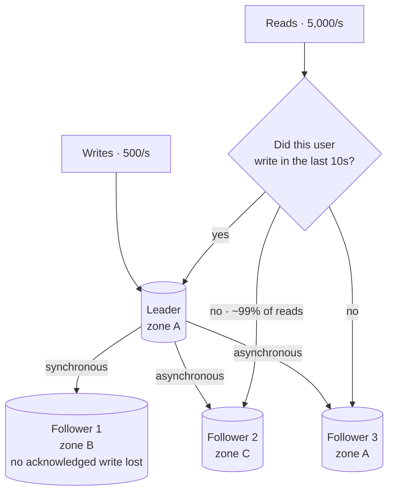

## The model

**Replication** keeps copies of the same data on several machines. Writes go to one place
and propagate; reads can be served from any copy.

It buys two different things that are easy to confuse. Read capacity, because ten copies
can answer ten times the reads. And survival, because a machine can die without the data
dying with it. What it costs is that the copies are not identical at every instant, so a
read from a **replica** can return a value that was true a moment ago.

## When to use it

You have decided where the data lives and now need it to survive a machine and serve more
reads than one can handle.

1. **Are reads or writes the pressure?** Replication multiplies read capacity and does
   nothing for write capacity — every write still passes through one leader. If writes are
   the ceiling, you need partitioning, not replication.
2. **Can this read tolerate being a moment stale?** Almost all can. The ones that cannot —
   a user reading back what they just wrote, a balance check before a transfer — must be
   routed to the leader deliberately.
3. **Must a committed write survive losing the leader immediately?** If yes you want
   **synchronous replication** and will pay for it on every write. If "almost always" is
   enough, asynchronous is faster and standard.

## Speedrun

**What** — one **leader** takes writes and streams them to **followers**, which serve
reads. This is **leader-follower** replication and it is what Postgres, MySQL, MongoDB and
almost everything else does by default.

**The two knobs**

| | Synchronous | Asynchronous |
|---|---|---|
| Write returns | after a follower confirms | as soon as the leader has it |
| Write latency | leader + slowest confirming follower | leader only |
| If the leader dies | no committed write is lost | recent writes can be lost |
| Common default | one sync follower, rest async | all followers |

**How to use replication in a design**

1. **Send all writes to the leader.** One leader per dataset, no exceptions, or you have
   invented conflict resolution without meaning to.
2. **Send reads to followers by default**, and say what that buys: read capacity that
   scales by adding machines.
3. **List the reads that cannot be stale** and route those to the leader. Naming this list
   is the part interviewers are watching for.
4. **Pick a lag budget and monitor it.** "Followers within two seconds" is a number you can
   alarm on. "Followers are usually fine" is not.
5. **Decide what happens when the leader dies** — automatic **failover** or manual — and
   accept that automatic failover can lose asynchronous writes.
6. **Put replicas in different failure domains.** Three followers in one availability zone
   are one [[correlated failure]] away from zero followers.

**Why it works** — reads vastly outnumber writes in most systems, often a hundred to one.
Replication attacks the large number and leaves the small one alone, which is why it is
almost always the first scaling move and why it runs out exactly when writes become the
problem.

**The failure everyone meets** — a user updates their profile, the page reloads from a
follower that has not caught up, and the old value comes back. They assume the save failed
and do it again.

## Going deeper

### Replication lag, and the anomalies it produces

**Replication lag** is how far behind a follower is. Usually milliseconds; under write bursts
or long transactions, seconds or worse.

That window produces three anomalies with standard names, and knowing the names is worth
more than knowing the fixes, because naming one tells an interviewer you have operated a
replicated system.

**Reading your own writes.** You write, then read from a lagging follower and see the old
value. Users read this as data loss. The fix is to route a user's reads to the leader for a
short window after they write, or to remember the write position and require any replica
serving them to have reached it.

**Monotonic reads.** Two successive reads hit two followers with different lag, so time
appears to move backwards — a comment you just saw disappears. The fix is stickiness: route
one user consistently to one replica.

**Consistent prefix.** You see an answer before the question, because two related writes
took different paths. This one only arises with partitioning, and it is the reason causally
related data should share a partition.

### Synchronous, asynchronous, and the honest middle

**Asynchronous replication** returns as soon as the leader has durably written. It is fast
and it has a real hole: if the leader dies before shipping the last writes and you promote a
follower, those acknowledged writes are gone. The user was told it saved. It did not.

**Synchronous replication** waits for at least one follower to confirm before returning.
Nothing acknowledged is lost. But the write now costs the leader plus a round trip plus the
follower's own write, and — worse — if that follower is slow or unreachable, writes block
entirely. A synchronous replica is a dependency in series, so it *lowers* availability while
raising durability.

The standard resolution is semi-synchronous: one follower synchronous, the rest
asynchronous. You lose nothing acknowledged as long as both the leader and that specific
follower do not fail together, and you pay one round trip rather than the slowest of many.
Being able to say why that middle exists is a strong signal, because it shows you have seen
both failure modes rather than read about one.

### Failover, and how it goes wrong

**Failover** is promoting a follower when the leader dies. It sounds like a solved problem
and is the source of a disproportionate share of real outages.

Two things break badly. An asynchronously replicated leader that dies holds writes nobody
else has, and promoting a follower discards them — worse still when those ids get reused.

And deciding the leader is actually dead is genuinely hard: one that is merely slow or
network-partitioned looks identical to a dead one. Promote a second while the first still
accepts writes and you have **split brain**, two divergent histories to reconcile by hand.

The timeout is a third tradeoff with no comfortable answer. Too short and you fail over
during an ordinary garbage-collection pause, turning a hiccup into an outage. Too long and
you are down for the length of the timeout every time the leader genuinely dies.

The mechanism that makes this tractable is fencing: the promoted leader takes a strictly
higher term number, and anything still holding the old term is refused. If you can say
"fencing token" in this conversation you have said the thing that matters.

### Multi-leader and leaderless, and why they are rarer than they sound

**Multi-leader** replication accepts writes at several leaders, typically one per region, and
replicates between them. It buys local write latency and survival of a whole region.

It costs conflicts, and the cost is not incremental. Two regions writing the same record at
the same time produce two versions with no principled way to choose — last-write-wins picks
by clock and silently discards real data, and clocks across datacentres disagree. Anything
better means application-level merge logic, per data type, forever.

**Leaderless** replication — Dynamo, Cassandra, Riak — sends every write to several replicas
at once and reads from several too. Correctness comes from overlap: with N replicas, writing
to W and reading from R, if $W + R > N$ then any read set intersects any write set and sees
the latest value. A **quorum** of $N=3, W=2, R=2$ is the usual configuration.

That formula is worth carrying, because it makes the tuning obvious. $W=1$ gives fast writes
that can be missed by reads. $R=1$ gives fast reads that can be stale. And the guarantee it
provides is weaker than it looks: overlap tells you a fresh copy was *seen*, not that
concurrent writes were ordered, so conflict resolution is still yours to own.

Both models trade a simple failure mode for a complicated one. Reach for them when
geography or write availability genuinely demands it, and expect the conflict question
immediately — because it is the question.

### What replication does not solve

It does not increase write capacity. Every write goes through the leader in the common
model, so a write-bound system gains nothing. This is the single most useful sentence to say
when someone proposes replication as the answer to a write bottleneck.

It does not replace backups. Replication faithfully copies a `DELETE FROM orders` to every
follower in milliseconds. It protects against hardware failure, not against you.

And it does not remove the [[CAP theorem]]: during a partition, a replicated system either
refuses writes or accepts divergence. Replication is how you meet that choice, not how you
avoid it.

## See it work

The order service: 5,000 reads a second, 500 writes, and a requirement that a customer sees
their order immediately after placing it.

One leader takes all 500 writes, which is comfortably inside one machine. Three followers
absorb the 5,000 reads, and adding a fourth is how this design grows — read capacity scales
by adding machines, which is the whole reason replication is the first move.

Follower 1 is synchronous and in a different zone, so no acknowledged write is lost if zone
A disappears. That costs one round trip on every write, roughly a millisecond, which against
a 500-per-second write load is invisible. The other two are asynchronous, so a slow follower
cannot block the write path.

The routing rule is where the design earns its keep. Order placement is exactly the
read-your-own-writes case: a customer who submits an order and is shown a stale list will
submit it again. So a user who wrote in the last ten seconds reads from the leader, and
everyone else reads from a follower. That is about 1% of reads going to the leader — cheap
insurance against the one anomaly users actually notice.

Two things this does not do, worth volunteering. It does nothing for write capacity: at
50,000 writes a second every arrow into the leader is the same arrow, and the answer becomes
partitioning. And follower 3 sits in zone A with the leader, so it is not redundancy against
losing that zone — it is read capacity only, which is fine as long as nobody counts it twice.

## Next

Partitioning and sharding is what to do when the write path in that diagram becomes the
limit, and consistency models makes "a moment stale" into precise guarantees you can
promise a user.
