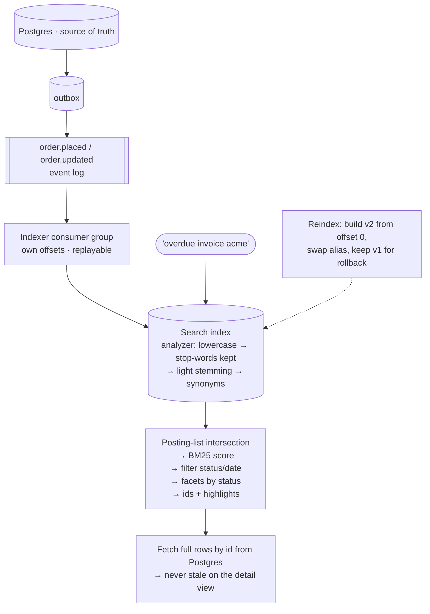

## The model

An **inverted index** turns the question inside out. Rather than storing documents and
scanning them for a word, it stores each word once with the list of documents containing it.

Looking up "invoice" is then a single lookup returning a ready-made list, and combining
"invoice" with "overdue" is an intersection of two lists. That is why search is fast on
volumes no `LIKE '%...%'` scan could survive, and it is also why search is a separate system:
the index is built for a different question than your database answers.

## When to use it

Users need to find things by what is in them rather than by an identifier you already hold.

1. **Do you know the key?** If yes this is not search — it is a lookup, and a [[B-tree
   index]] on your existing database is the answer.
2. **Does the query need ranking?** Ten thousand matching documents are useless without an
   order. If "best match first" is the requirement, you need **relevance** scoring, and a
   database has none.
3. **Is a few seconds of staleness acceptable?** Search indexes are **near-real-time**. A
   document is searchable a second or so after it is written, which rules search out of any
   path that must read its own write instantly.

## Speedrun

**What** — text is broken into terms and each term stores a **posting list** of the documents
containing it, with positions and frequencies.

```
"overdue"  → [ doc3(pos 4), doc7(pos 1), doc9(pos 12) ]
"invoice"  → [ doc1(pos 2), doc3(pos 1), doc9(pos 3)  ]
                            ↑ intersection: doc3, doc9
```

**How to add search to a system**

1. **Keep the database as the source of truth**, and treat the index as a derived copy you
   can rebuild. Never let the index be the only place something exists.
2. **Feed it from the [[event log]]** rather than by dual-writing. The search indexer becomes
   another [[consumer group]], and a rebuild is a replay from offset zero.
3. **Choose the analyzer before the schema.** **Tokenisation** and **stemming** decide what
   "matches" means, and changing them later means reindexing everything.
4. **Index only what is searched or displayed.** Every indexed field costs write throughput
   and memory, and an index that no longer fits in RAM falls off a performance cliff.
5. **Return ids, then fetch from the database** — or store display fields in the index to
   avoid a second round trip, accepting they can now be stale.
6. **Say your staleness budget out loud.** "Searchable within two seconds" is a promise a
   design can be built against.

**Why it works** — the intersection of two short posting lists is dramatically cheaper than
scanning every document. The index does the expensive work once, at write time, so that
reads are cheap — which is the same trade as [[denormalisation]], applied to text.

**The mistake** — `WHERE description LIKE '%overdue%'` cannot use an index, because a leading
wildcard is not a prefix and a B-tree can only seek by prefix. It is a full scan on every
query, and it is the thing search exists to replace.

## Going deeper

### The analyzer, which decides what "matching" means

Before anything is indexed, text passes through an analyzer, and its stages are where search
quality is actually determined.

**Tokenisation** splits text into terms. Trivial for English spaces, hard everywhere else —
Chinese has no spaces, German compounds words, and "C++" or "COVID-19" break naive splitting.

**Lowercasing** makes matching case-insensitive, which is nearly always wanted.

**Stop words** — "the", "a", "of" — were historically dropped to save space. Modern engines
usually keep them, because removing them makes the phrase "to be or not to be" unsearchable.

**Stemming** reduces words to a root so "running", "runs" and "ran" match "run". Aggressive
stemmers over-merge — "university" and "universe" collapsing to "univers" is the classic
example — and the tradeoff is recall against precision, dialled by choosing a stemmer.

**Synonyms** map terms together: "laptop" finds "notebook".

The critical property is that **the same analyzer must run at index time and at query time**.
If documents are stemmed and queries are not, a search for "running" looks for a term that
was never stored. This is the single most common cause of "search returns nothing and I
cannot see why".

And because the analyzer determines what is in the index, changing it requires reindexing
every document. That makes it close to a [[one-way door]], and worth deliberating before the
schema rather than after launch.

### Relevance, and why BM25 rather than counting

Ranking needs a score, and the intuition builds in three steps.

**Term frequency** — a document mentioning "invoice" eight times is probably more about
invoices than one mentioning it once.

**Inverse document frequency** — a term appearing in every document tells you nothing, so
rare terms should count for more. Together these are **TF-IDF**, and it was the standard for
decades.

**BM25** is the refinement everything modern uses, and it fixes two real problems with naive
TF-IDF. Term frequency saturates: the tenth mention of "invoice" adds far less than the
second, because a document is not ten times more relevant for repeating a word. And length
is normalised: a 10,000-word document mentioning a term five times is less focused on it than
a 100-word document doing the same.

Knowing the name is worth something in an interview; knowing that it saturates and normalises
is worth more, because it explains why keyword stuffing stopped working and why long
documents do not dominate results.

Relevance is also where the business lives. Recency, popularity, stock availability and paid
placement all get blended with the text score, and deciding those weights is a product
decision that engineers routinely inherit by accident.

### What search buys beyond matching

Three capabilities that are difficult in a database and native here.

**Faceting** returns counts per category alongside results — "Electronics (243), Books (89)"
— computed from the posting lists during the same pass. Doing this in SQL is a `GROUP BY`
per facet over the matching set, which is exactly the query shape that gets slow.

**Fuzzy matching** finds terms within a small edit distance, so "recieve" finds "receive".
The mechanism worth knowing is the **n-gram** — a run of n adjacent characters. Indexing
"search" as "sea", "ear", "arc", "rch" lets misspellings share sub-tokens, which is also how
autocomplete-as-you-type works.

**Highlighting** returns the matching fragment with terms marked, which is possible because
positions were stored in the posting list.

**Aggregations** over matched sets — average price, histogram by date — is why Elasticsearch
gets used for log analytics as often as for search.

### Keeping the index fed, and why not to dual-write

The index is derived data, and how it is kept current decides how it fails.

**Dual writing** — the application writes the database and the index in the same request — is
the obvious approach and has the [[dual write problem]]. Two systems, no shared transaction:
one succeeds, the other fails, and the index silently diverges from the truth with nothing to
detect it.

**Feeding from the log** is the answer, and it is the same outbox pattern from
[[publish-subscribe]]. The database write and an event are committed together; the indexer is
a consumer group reading that log. If the indexer falls behind, search is stale and recovers.
If it breaks entirely, you fix it and replay from the last offset.

That replay property is what makes reindexing tractable. An analyzer change means building a
new index from offset zero, then swapping an alias — old index serving throughout, new index
built behind it, one atomic pointer switch, and a rollback that is just switching back.

**Near-real-time** is the honest name for the freshness. Engines buffer writes and flush
periodically, typically about a second, because committing every document individually would
destroy write throughput. So search is eventually consistent by design, and a user who
creates something and immediately searches for it may not find it — which is why "show me my
new item" should be a database query, not a search.

## See it work

Order search across 50 million orders: free-text over customer, product and notes, filtered
by status and date, sorted by relevance.



Postgres stays the source of truth and the index is a derived copy. That single decision
makes everything downstream recoverable — a corrupt index is rebuilt rather than restored,
because nothing lives only there.

The indexer is a consumer group on the same log the analytics and fulfilment consumers use,
so it inherits their properties: independent offsets, its own lag metric, and no ability to
affect the checkout path. Dual-writing here would have been fewer moving parts and would have
guaranteed silent divergence the first time a write half-failed.

The query intersects three posting lists, scores with BM25 so the most relevant orders come
first, then applies status and date as filters rather than as scoring terms — filters can be
cached and reused across queries in a way scored clauses cannot.

Results come back as ids and are fetched from Postgres for display. That costs one extra
round trip and buys a guarantee worth having: the list may be a second stale, but nothing a
user opens is ever wrong.

The alias is the operational trick that makes analyzer changes survivable. Adding synonyms
means building `orders_v2` from offset zero while `orders_v1` serves every query, then
switching one pointer. If relevance turns out worse, switching back takes a second — which is
the difference between a change you can try and one you have to be certain about.

## Next

Distributed locks are what stops two indexers processing the same document at once, and
consensus is the machinery underneath any lock that has to be correct.
