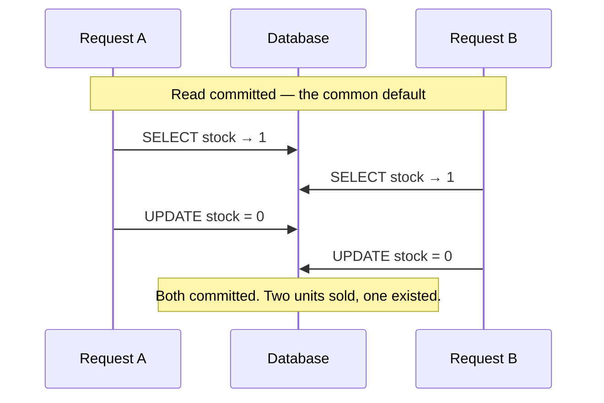

## The model

A **transaction** groups operations so they all take effect or none do. If anything fails
partway, the database rewinds as though nothing happened.

That is the easy half. The hard half is that other transactions are running at the same
time, and the **isolation level** decides how much of their unfinished work yours can see.
Stronger isolation removes more anomalies and permits less concurrency. Most databases
default to a level that permits more strangeness than people expect.

## When to use it

Two operations must both happen, or you have concurrent writers touching the same rows.

1. **Would a partial result be a state the business cannot represent?** Money debited and
   not credited, an order with no line items. If yes you need **atomicity**, and that is
   the easy part to get right.
2. **Are two requests likely to touch the same row at once?** If yes, the default isolation
   level probably permits a **lost update**, and you need an explicit lock or a version
   check rather than a read followed by a write.
3. **Does the invariant span several rows?** "At least one doctor on call", "the sum of
   these must stay positive". That is **write skew**, and it survives every level below
   **serializable**.

## Speedrun

**What** — **ACID**: **atomicity** (all or nothing), consistency (your invariants hold),
isolation (concurrent transactions do not corrupt each other), **durability** (a commit
survives a crash). Isolation is the one with dials.

**The levels, and what each still allows**

| Level | Dirty read | Non-repeatable read | Phantom | Write skew |
|---|---|---|---|---|
| Read uncommitted | allowed | allowed | allowed | allowed |
| **Read committed** (common default) | prevented | allowed | allowed | allowed |
| **Repeatable read** / snapshot | prevented | prevented | mostly prevented | allowed |
| **Serializable** | prevented | prevented | prevented | prevented |

**How to pick and use one**

1. **Wrap operations that must be atomic in one transaction**, and keep it short — a
   transaction holds locks for its whole life.
2. **Name the isolation level you are relying on.** "Read committed" is usually the default
   and it allows more than its name suggests.
3. **For a read-then-write on one row, take a lock**: `SELECT ... FOR UPDATE` is
   **pessimistic locking**, and it is the simple correct answer for inventory and balances.
4. **Or use a version column** — read version 7, write only `WHERE version = 7`, retry if
   zero rows changed. That is **optimistic concurrency control**, better under low
   contention because nothing waits.
5. **For an invariant across rows, use serializable** or take an explicit lock on the thing
   the invariant is about. Snapshot isolation will not save you here.
6. **Never hold a transaction open across a network call.** An HTTP request inside a
   transaction holds locks for its full timeout, and that is how a slow third party takes
   your database down.

**Why it works** — the database can order conflicting operations only if it knows they
conflict. A lock or a version check declares the conflict; a bare read followed by a write
does not, so two of them interleave and one silently overwrites the other.

**The confusion worth clearing up** — the C in ACID is not a consistency model. ACID
isolation is about concurrent transactions on one node. A [[consistency model]] is about
copies on different nodes. A system can be fully ACID and eventually consistent at once.

## Going deeper

### The anomalies, in the order they get expensive

**Dirty read.** You see another transaction's uncommitted write, and it then rolls back, so
you acted on a value that never existed. Every level above read uncommitted prevents this,
which is why read uncommitted is essentially never used.

**Non-repeatable read.** You read a row twice in one transaction and get different values,
because someone committed in between. Fine for a single lookup, wrong for a report that
reads the same data twice and must agree with itself.

**Phantom read.** You run the same query twice and get different *rows*, because someone
inserted one matching your `WHERE` clause. This is the one that breaks "count them, then
act on the count".

**Lost update.** Two transactions read the same value, both compute a new one, both write.
The second overwrites the first, and no error is raised anywhere. This is the anomaly that
actually bites in production, and it is permitted at read committed — the default in
Postgres, Oracle and SQL Server.

**Write skew.** Two transactions read an overlapping set, each checks an invariant that
still holds, and each writes something different — individually valid, jointly wrong.

The canonical case: two doctors are both on call, each checks "is someone else on call?",
sees yes, and each goes off duty. Now nobody is. Snapshot isolation permits this, which is
why the strongest widely-used default is still not enough for cross-row invariants.

### Snapshot isolation and MVCC, which is what you are usually running

**MVCC** — multi-version concurrency control — keeps several versions of each row rather
than overwriting in place. A reader gets the version that existed when its transaction
started, so readers never block writers and writers never block readers.

That property is why MVCC is nearly universal, and it is worth being able to state plainly:
a long analytical read does not stop the write path, because it is reading an older
snapshot rather than waiting for a lock.

**Snapshot isolation** is what MVCC gives you: your whole transaction sees one consistent
point in time. Postgres calls this "repeatable read"; most databases mean the same thing.
It prevents dirty reads, non-repeatable reads and, in Postgres, phantoms too.

What it does not prevent is write skew, and the reason is structural rather than an
implementation gap. Each transaction reads a valid snapshot and writes something valid
against it. Neither wrote what the other read, so no write-write conflict exists to detect —
the conflict is between one transaction's *write* and another's *read*, and only
serializable isolation tracks that.

The cost of MVCC is old versions accumulating. Postgres calls the cleanup `VACUUM`, and a
long-running transaction pins every version created since it started, which is the actual
mechanism behind "one forgotten open transaction bloated the database."

### Pessimistic and optimistic, and when each wins

**Pessimistic locking** takes the lock first: `SELECT ... FOR UPDATE` blocks anyone else
until you commit. Simple, correct, and it serialises everyone touching that row.

**Optimistic concurrency control** takes no lock. Read the row with its version, do the
work, then write conditionally: `UPDATE ... WHERE id = ? AND version = 7`. Zero rows changed
means someone beat you, so you reread and retry.

The choice is decided by contention, and the reasoning is worth carrying. Under low
contention, retries almost never happen, so optimistic is faster because nothing ever waits.
Under high contention, retries happen constantly, and a retry storm on one hot row is worse
than a queue on it — so pessimistic wins by making everyone wait in an orderly line.

The other input is transaction length. A long transaction holding a pessimistic lock blocks
everyone for its whole duration, so long work wants optimistic even under contention, and
short work can afford the lock.

### Two-phase commit, and why services avoid it

**Two-phase commit** makes a transaction span several databases. A coordinator asks every
participant to prepare, and if all say yes, tells them all to commit.

It works, and it has a failure mode people design around rather than accept. Between prepare
and commit, every participant holds its locks and cannot decide alone. If the coordinator
dies in that window, they wait — locks held, rows frozen — until it returns. The
availability of the whole set is now the product of every participant's availability *and*
the coordinator's, which is the [[availability]] arithmetic working against you.

That is why distributed systems generally refuse cross-service transactions and use a saga
instead: a sequence of local transactions, each with a compensating action that undoes it.
Charge the card, reserve the stock, book the courier — and if the courier step fails, run
refund and release rather than rolling back a distributed transaction that was never open.

The trade is that a saga is not isolated. Other transactions can observe the half-finished
state, so the design has to make that state legible — an order marked `pending` rather than
one that briefly does not exist. Saying this out loud is usually the strongest thing you can
say about a multi-service write path.

## See it work

Two customers buy the last unit of stock at the same instant.

Both transactions read `1`, both compute `1 - 1 = 0`, both write `0`. No error is raised at
any point, because read committed permits exactly this — the second write is a lost update,
and the database considers it perfectly legal.

The pessimistic fix is one clause. `SELECT stock FROM items WHERE id = ? FOR UPDATE` makes B
wait until A commits, so B's read returns `0` and it correctly refuses the sale. Under this
kind of contention — one popular item, many buyers — the lock is the right answer, because
the alternative is every request retrying against the same row.

The optimistic fix takes no lock: `UPDATE items SET stock = 0 WHERE id = ? AND stock = 1`.
A succeeds and changes one row; B's update matches zero rows and it knows it lost. This is
better when contention is rare, because nobody ever blocks — the check and the write are the
same statement, which is what makes it atomic.

The wrong fix is worth naming too, because it is the common one: raising the isolation level
to serializable. It works, and it makes every transaction in the system pay for a problem
that lives on one row. The targeted lock costs one query; the global setting costs
throughput everywhere.

Notice this is a different problem from the [[consistency model]] question next door. Both
requests here hit the same node and the same row. Nothing about replicas is involved — this
is concurrency on one machine, and no amount of consistency-model strength addresses it.

## Next

Queues versus streams moves work off the request path entirely, which is the other way to
handle contention, and idempotency is what makes the retries in that world safe.
