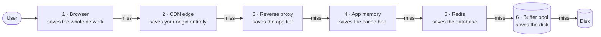
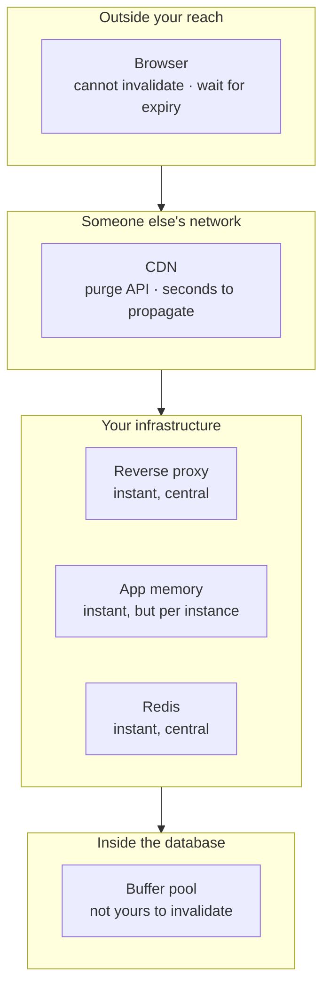
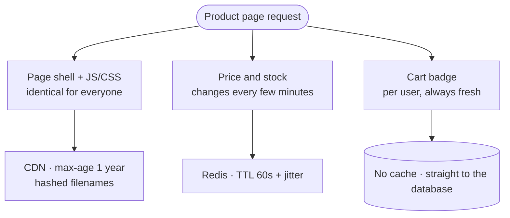

## The model

A request passes through six places that can each hold a copy of what it asked for: the
browser, a CDN at the edge, a reverse proxy, your application's memory, a shared store
such as Redis, and the database's own buffer pool.

A request stops at the first layer that has the data. So the choice is not whether to
cache but *how far out* to push each piece — and the further out it goes, the cheaper
the hit and the weaker your control over it.

## When to use it

You are choosing which layer a given piece of data lives in, or whether it belongs in
none of them.

1. **Is this byte-identical for every user?** If yes it can reach the CDN or the
   browser. If it varies per user, it stops at the reverse proxy or below.
2. **How fast must a change become visible?** Instantly means Redis or lower. Seconds
   to minutes means a CDN with a purge. "Never, really" means the browser with a long
   max-age and a versioned URL.
3. **Is it small, hot, and almost never changing?** Then application memory — accepting
   that you cannot clear it without a deploy.

## Speedrun

**What** — six places between a user and your database can hold a copy: browser, CDN
edge, reverse proxy, application memory, a shared store like Redis, and the database's
[[buffer pool]].

**A hit anywhere saves everything beyond it.** A request stops at the first layer
holding the data, so a CDN hit never touches your infrastructure at all, while an
application-memory hit still costs the user a full round trip to your server. The
further out the hit lands, the more it saves.

**The six, in order**

1. **Browser** — governed by HTTP headers you sent earlier. You cannot invalidate it.
2. **CDN / edge** — same headers, plus a purge API that takes seconds to propagate.
3. **Reverse proxy** (nginx, Varnish) — in your own infrastructure, full control, and
   it coalesces duplicate concurrent requests for free.
4. **Application memory** — sub-microsecond, no network, but every instance holds its
   own copy and there is no central clear.
5. **Distributed cache** (Redis, Memcached) — one network hop, shared by every
   instance, invalidation instant and central.
6. **Database buffer pool** — the database's own RAM cache of pages. You size it; you
   do not manage it.

**The trade that organises all of it** — further out means cheaper hits and weaker
control. A browser cache is free and unreachable; Redis costs a hop and obeys you
immediately. Every layer choice is a point on that line.

**The one failure everyone hits** — shipping a fix and finding users still on the old
version, because a `Cache-Control: max-age=86400` you set last week is still live in
browsers you cannot reach. Version the URL instead of trusting expiry.

## Going deeper

### What a hit at each layer actually saves

Two different quantities get called "latency" here, and conflating them is the usual
source of confusion. There is the cost of the hit itself, and there is what the hit
saves.

An application-memory hit is the fastest possible *lookup* — well under a microsecond,
no network involved. But the user still paid a full round trip to reach your server
before that lookup happened, so the win is modest from where they are sitting.

A CDN hit is far slower as a lookup, tens of milliseconds away over the public internet.
It is also the better outcome, because the request never reached your infrastructure at
all: no app server, no database, no bill.

That is why the ordering is worth memorising in path order rather than speed order.
Optimising the fastest layer is usually not the same as optimising the layer that
matters.

### The six layers, in full

**Browser cache.** Controlled entirely by response headers: `Cache-Control: max-age`,
`ETag`, `Last-Modified`. Once a response is in a user's browser you have no way to
reach it, which makes every `max-age` a promise you cannot take back.

The standard escape is content-addressed URLs — `app.4f9c2b.js` rather than `app.js`.
The file is immutable and cached forever, and a deploy changes the *name*, so nothing
needs invalidating.

**CDN / edge cache.** Geographically distributed copies, governed by the same headers
plus a purge API. Purges are real but not instant; propagation across a global network
takes seconds to minutes, which matters when the thing you are purging is wrong rather
than merely stale.

Two mechanisms are worth knowing by name. `stale-while-revalidate` lets the edge serve
a slightly stale copy while it fetches a fresh one in the background, which removes the
latency spike on expiry. An *origin shield* designates one edge node to talk to your
origin, so a global expiry produces one origin request instead of two hundred.

**Reverse proxy.** nginx or Varnish sitting in front of your application servers. Full
control, instant invalidation, and it can cache whole pages or fragments. Its quiet
superpower is request coalescing: a hundred simultaneous misses for the same key become
one request to the application, which is the [[thundering herd]] fix built into
infrastructure you already run.

**In-process cache.** A map in your application's memory. Nanoseconds to read, no
serialisation, no network — and no way to clear it across a fleet without a deploy or a
message bus. Every instance holds its own copy, so N instances mean N chances to be
stale differently.

That confines it to data that is small, hot, and rarely changing: feature flags,
configuration, currency tables, permission matrices. The moment you find yourself
wanting to invalidate one, you wanted Redis.

**Distributed cache.** Redis or Memcached: one shared store, one network hop, one place
to invalidate. This is what most people mean by "the cache," and it is the default
answer in an interview because it trades a half-millisecond for a coherent view every
instance agrees on.

**Database buffer pool.** The database's own cache of recently-read pages in RAM. You
do not manage it directly, but you do size it, and it explains why a freshly restarted
database is dramatically slower than a warm one. A working set that fits in the buffer
pool is often faster than an application cache in front of a database whose working set
does not.

### Control falls off with distance

Read that diagram as a single sentence: everything cheap is far away, and everything far
away is hard to change.

It also explains a design habit that looks superstitious until you have been burned.
Short `max-age` on anything you might need to fix; long `max-age` only on things whose
name changes when their content does. The rule is not about staleness tolerance — it is
about whether you retain a way to intervene.

### Cache keys, and how they explode

A **cache key** is whatever the layer uses to decide "same request." At the CDN that is
usually the URL plus whichever headers you declared it should vary on.

Every dimension you add multiplies the number of entries. Vary on language and you have
doubled or tripled the key space; vary on `Accept-Encoding` too and you multiply again;
vary on a per-user cookie and you have built a cache with a hit rate of approximately
zero, which is strictly worse than no cache because you pay the lookup and never
benefit.

The practical rule is to strip everything the response does not actually depend on.
Marketing query parameters like `utm_source` are the classic offender: they change the
URL, so they change the key, so the same page caches under a hundred names.

### The invalidation you cannot reach

The failure that ships is almost never "the data was stale." It is "we fixed it and
users still saw the broken version," which is a different problem with a different fix.

Staleness is a tuning question — shorten the TTL. Unreachability is a design question,
and the only reliable answer is to make the name change when the content changes. That
is why asset pipelines hash filenames, why APIs version their paths, and why a cache
key you control beats a TTL you have to guess.

## See it work

One product page, three kinds of data, three different layers.

The page shell and its assets are byte-identical for every visitor and change only on
deploy, so they go as far out as possible: a CDN with a one-year `max-age` and hashed
filenames. Nothing is ever invalidated, because a deploy renames the files.

Price and stock are the same for everyone but change every few minutes. They cannot go
to the browser, because a wrong price is not something you can wait a day to fix. They
sit in Redis behind a 60-second TTL with jitter — one layer in, where invalidation is
instant if a price is genuinely wrong.

The cart badge varies per user and must always be right, so it is not cached at all. It
is also one small query, which is the point: not everything on a page needs the same
answer, and deciding per-fragment is what makes the page fast without making it wrong.

## Next

Consistency models and CDN configuration in depth are the two pages this leans on next —
the first makes "how stale is acceptable" precise, the second covers the header and
purge semantics only sketched here.
