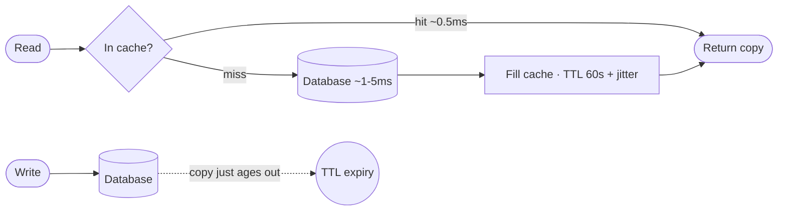

## The model

A cache is a copy of data kept somewhere faster to reach than the place it came from. A
read checks the copy first; when the copy is missing or stale, something has to fetch
the real value.

The caching strategy is the rule for what happens on a write — whether the copy is
updated, deleted, or left to expire. That rule determines how far behind the copy can
fall.

## When to use it

You are choosing between four things: no cache, read-through, write-through, and
write-behind.

1. **Is the miss path an order of magnitude slower, or is the database the contended
   resource?** If neither, no cache — you would take on an invalidation problem to buy
   nothing.
2. **Can a reader tolerate a stale value, and for how long?** If the reader is the
   person who just made the write, usually not — that points at write-through or
   write-around.
3. **Is the write volume high enough that a synchronous cache write hurts?** If yes,
   write-behind, and accept a durability risk you did not have before.

## Speedrun

**What** — a copy of data kept closer than its source, so most reads never travel the
whole distance.

**How** — a read checks the cache first. On a hit it returns the copy; on a miss it
fetches from the source, fills the cache, and returns. On a write you pick one rule:
update the copy, delete it, or let its TTL expire.

**Why it works** — the bet is that reads outnumber writes by enough to pay for keeping
the copy. Fill once, serve many. When the bet is wrong — a key written more often than
it is read — the cache costs more than it saves.

**Numbers to carry** — Redis `GET` ~0.5 ms · indexed Postgres lookup ~1–5 ms ·
same-region cross-AZ hop ~0.5 ms. A cache pays off when the miss path is roughly ten
times slower, or when the database is the contended resource rather than the slow one.

**The one failure everyone hits** — the thundering herd. A popular key expires, every
concurrent reader misses at once, and they all hit the database together. Jitter the
TTL so keys do not expire in lockstep, and coalesce concurrent misses so one request
refills the key.

**Say which one you are doing** — "caching to take load off the primary" and "caching
to save latency" are different designs with different TTLs. Naming it is half the
answer.

## Going deeper

### What write-through's guarantee actually costs

Write-through pays latency on every write to buy exactly one guarantee: the cache is
never behind the database. That guarantee is only worth its price when a read-after-write
is user-visible — your own profile edit, not somebody else's feed.

Turn it around and the rule sharpens. If nobody can perceive the staleness, you are
paying write latency for nothing, and read-through with a TTL is strictly cheaper.

### When the cache ends up newer than the database

Two concurrent writers with no version on the row can leave the cache ahead of the
database. Writer B lands in the cache, then writer A's slower database write lands
after it. The two now disagree, and nothing in the system notices.

The fixes are a compare-and-set against a version column, or invalidating the key
instead of writing it. Invalidation is the boring option: it trades one guaranteed
extra read for never having to reason about write ordering at all.

## See it work

A product feed. Reads outnumber writes by orders of magnitude, and no user can tell
whether a price changed two seconds ago or sixty. That is the staleness budget, and
naming it before picking a strategy is what makes the rest mechanical.

Read-through with a 60-second TTL. On a miss the reader fills the cache; on a write
nothing special happens and the copy simply ages out. No write-path hop, and no
invalidation ordering to reason about.

Then raise the thundering herd before anyone asks. Jitter the TTL so a popular key's
expiry spreads across a window, and coalesce concurrent misses so one request refills
it while the rest wait.

What makes this a good answer is not the choice. It is that the staleness budget was
stated first, so the strategy reads as a consequence rather than a preference.

## Next

Consistency models and hot keys are the two pages this one leans on next — the first
makes "tolerate a stale read" precise, the second explains why a single key can melt a
cache that is sized correctly for the whole key space.
