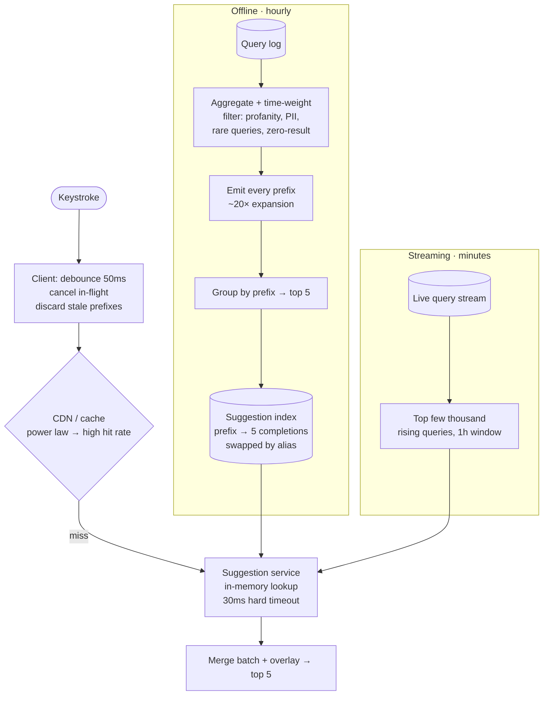

## The model

A user types `res` and expects suggestions before they type `t`. The latency budget is around
50 milliseconds end to end, and a request fires on almost every keystroke.

That budget rules out computing anything. Ranking millions of candidate queries per keystroke
is not achievable at any cost, so the design is precomputation: for every prefix worth serving,
the top few suggestions are computed offline and stored so a request is a lookup. The system is
a read-heavy cache with an interesting build pipeline behind it.

## When to use it

You have the prompt and are choosing which system you are being asked for.

1. **Global or personalised?** Global suggestions are one shared index and can be cached
   everywhere. Personalised ones multiply the key space by your user count and change the
   architecture completely.
2. **How fresh must new queries be?** Hourly rebuilds are simple. "Trending within minutes"
   forces a streaming path alongside the batch one.
3. **Is the corpus queries or documents?** Suggesting popular *searches* is a ranking problem
   over a query log. Suggesting *products* is a prefix search over a catalogue, and they need
   different indexes.

## Speedrun

**What** — a **suggestion index** mapping each prefix to its **top-k** completions, built
offline from a **query log** and served from memory.

**How to design it**

1. **Size it.** 10B searches/day, ~5 keystrokes each ≈ 500k requests/s at peak. The index is
   millions of prefixes × 5 suggestions — small enough to hold in memory, which is the whole
   point.
2. **Build offline.** Aggregate the query log into counts, then for every prefix compute and
   store the top 5 completions. This is a batch job, not a request-time computation.
3. **Serve from memory.** A [[trie]] with top-k cached at each node, or a flat hash map from
   prefix to suggestions. The map is simpler and usually faster.
4. **[[debounce|Debounce]] on the client** — wait ~50 ms after a keystroke before firing — and
   cancel in-flight requests when a new one starts.
5. **Cache aggressively.** Prefix popularity is a power law, so a small [[cache]] covers most
   traffic, and a [[CDN]] can serve the global case entirely.
6. **Add a streaming path only if trending matters.** A batch index plus a small real-time
   overlay is far simpler than making the whole pipeline real-time.

**Why it works** — every expensive thing happens once per rebuild rather than once per
keystroke. The read path is a hash lookup against data already in RAM, which is the only
structure that fits a 50 ms budget at 500,000 requests a second.

**The number that shapes it** — five keystrokes per search means the *suggestion* traffic is
five times the *search* traffic. Autocomplete is the busiest endpoint in a search product.

## Going deeper

### Trie or hash map, and why the obvious answer loses

A [[trie]] is the textbook answer: walk the prefix, then collect the subtree. Collecting is the
problem — the subtree under `a` is enormous, and walking it per request is exactly the
computation the budget forbids.

The fix is to **cache the top-k at every node**, so reaching the node for `res` gives five
answers immediately with no subtree walk. That works, and once you have done it the trie's
structure is no longer earning anything: you are doing a prefix walk to reach a precomputed
list.

A flat hash map from full prefix string to its top-k gives the same answer in one lookup rather
than `L` pointer hops, with better cache locality. It costs more memory, since shared prefixes
are no longer shared — but the values are five short strings, and prefixes worth serving are
bounded by what people actually type.

So the honest answer is: trie if memory is tight or you need the tree for something else, hash
map if latency is the constraint. Being able to argue both, rather than reciting "autocomplete
uses a trie", is the signal.

### Building the index

The source is a **query log**: every search, timestamped. The build is a batch pipeline.

Aggregate queries into counts over a rolling window — usually weighted so recent searches count
for more, since last month's popularity is weaker evidence than yesterday's. Filter aggressively
at this stage: profanity, personally identifying strings, queries below a frequency floor, and
anything that returned no results.

Then, for each query, generate every prefix and emit `(prefix, query, score)`. Group by prefix
and keep the top five. That is one map-reduce, and its output is the entire serving index.

The cost is worth noting because it explains the design. A query of length 20 produces 20
prefixes, so the intermediate data is roughly 20× the query volume — large, and entirely
offline, which is precisely why it can be large.

Swapping the index is the [[inverted index|alias swap]] again: build the new one, verify it, flip a
pointer, keep the old one for rollback. A bad ranking change is then a second to revert rather
than a rebuild.

### Freshness, and the streaming overlay

A batch index rebuilt hourly cannot suggest something that started trending twenty minutes ago,
and during a breaking-news event that gap is exactly when people are searching.

The temptation is to make the whole pipeline real-time, which multiplies the complexity of a
system that is otherwise pleasantly simple. The better shape is a small overlay: a streaming
job maintains counts over a short window — the last hour — for the top few thousand rising
queries only, and the serving layer merges that overlay with the batch index at lookup time.

Two lookups and a merge, both from memory, still inside budget. The batch index stays the
source of truth and the overlay stays small, which keeps the failure mode benign — if the
overlay breaks, suggestions are merely an hour stale.

### The read path, and where the tail hides

At 500,000 requests a second the interesting failure is not average latency but the tail. A
suggestion arriving after the user has typed the next character is wasted, and worse, the
responses can arrive out of order and show suggestions for a prefix already abandoned.

The client fixes both. **Debouncing** waits 50 ms of inactivity before firing, which removes
most requests entirely for a fast typist. Cancelling in-flight requests on a new keystroke, and
tagging responses with the prefix they answer so stale ones are discarded, fixes the ordering.

On the server, this is a [[the tail at scale]] case with an unusual property: a slow response is
worthless rather than merely late. So the right behaviour is a hard timeout of about 30 ms and
an empty response — showing nothing is better than showing suggestions for what the user typed
two characters ago.

Caching does most of the work regardless. Prefix popularity follows a power law, so a modest
cache of the hottest prefixes serves the large majority of traffic, and the global case is
cacheable at the [[CDN]] since it is identical for everyone.

## See it work

A search product: 10 billion searches a day, five keystrokes each, global suggestions with
trending.

Everything expensive is on the left, running hourly. The prefix expansion produces roughly
twenty times the query volume, which is fine precisely because it is offline — and it is the
step that makes the read path a single lookup.

Serving is a hash lookup in memory against an index small enough to fit there. No ranking, no
subtree walk, no database. That is the only structure that survives 500,000 requests a second
inside 50 milliseconds.

The streaming overlay handles what the batch index cannot. A few thousand rising queries over a
one-hour window, merged at lookup time, so trending topics appear within minutes without making
the whole pipeline real-time. If it breaks, suggestions are an hour stale rather than absent.

The client does more work than it appears. Debouncing removes most requests before they exist,
which is cheaper than serving them, and discarding responses for abandoned prefixes fixes an
ordering bug that no amount of server work can address.

The 30 ms server timeout returning empty is the decision to volunteer. Everywhere else a slow
response is still useful; here it is not, because the user has already typed past it. Failing
fast and showing nothing is better than being right about the wrong prefix.

## Next

The job scheduler is the other precomputation-heavy design, and file storage is where the
objects a search index points at actually live.
