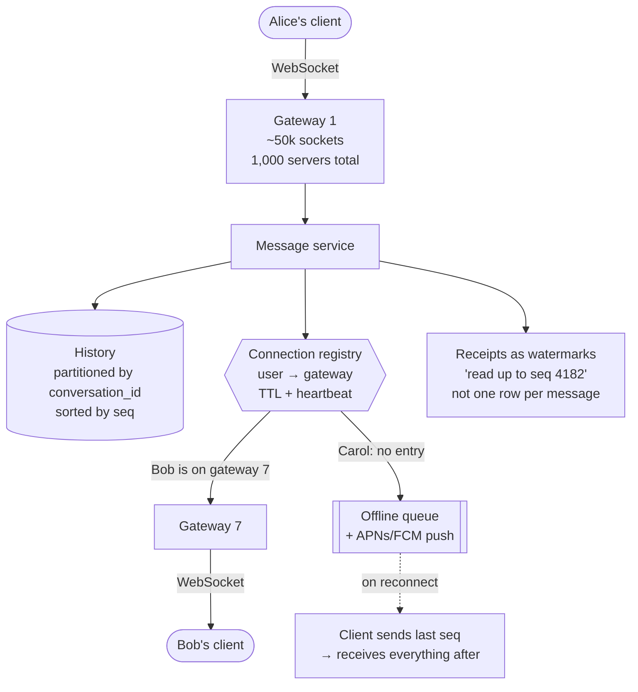

## The model

One-to-one and group messaging, delivered in near real time, with history. Say 500 million
users, 50 million concurrent connections, 100 billion messages a day.

What makes this different from every other design is the connection. HTTP request-response
assumes the server can forget you between requests; chat requires the server to reach *you*,
so every user holds a persistent **WebSocket** and the system must know which of ten thousand
servers holds it. That routing problem is the design.

## When to use it

You are deciding what kind of chat you are being asked to build.

1. **One-to-one, small groups, or broadcast channels?** They have different fan-out
   characteristics — a 10-person group is trivial, a 100,000-member channel is a feed problem
   wearing chat's clothes.
2. **Is delivery ordering required, and across what?** Per-conversation ordering is achievable
   and usually sufficient. Global ordering is not, and nobody needs it.
3. **What guarantees does the product promise?** Sent, delivered and read receipts each add a
   write per message per recipient, and read receipts on a large group multiply.

## Speedrun

**What** — clients hold WebSockets to gateway servers; a **connection registry** maps user to
gateway; messages are persisted then routed to the recipient's gateway, or queued if they are
offline.

**How to design it**

1. **Size the connections.** 50M concurrent at ~50k per server needs about 1,000 gateway
   servers. This is a memory and file-descriptor problem, not a CPU one.
2. **Keep gateways stateless apart from their sockets.** All state — history, registry,
   receipts — lives outside, so a gateway can die and clients reconnect elsewhere.
3. **Maintain a connection registry** in a fast store: `user_id → gateway_id`, written on
   connect, removed on disconnect, with a TTL so crashed gateways expire.
4. **Persist before delivering.** Write the message, then route it. A message delivered but
   not stored is lost on the recipient's next reload.
5. **Partition history by conversation**, sorted by a sequence number. Per-conversation
   ordering is what the product needs and what partitioning gives you for free.
6. **Queue for offline users** and fall back to a **push notification** through APNs
   or FCM. Most recipients are offline most of the time.

**Why it works** — the registry turns "deliver to a user" into "send to one known server",
which is a lookup rather than a broadcast. Everything else is ordinary storage and queueing.

**The number that shapes it** — 50 million idle connections. [[Little's Law]] does not save
you here: these are not requests in flight, they are memory held indefinitely, and the cost is
per connection rather than per message.

## Going deeper

### The connection, and why it changes everything

An HTTP server can forget a client between requests, which is what makes horizontal scaling
easy. A chat server cannot: it must reach a specific user, so it must hold a socket to them.

That inverts the usual [[load balancer]] assumption. Backends are no longer interchangeable —
only the server holding Bob's socket can deliver to Bob. The load balancer's job becomes
connection distribution rather than request routing, and the interesting work moves to
knowing where everyone is.

Connections are also memory rather than CPU. Fifty thousand idle sockets per server is a
tuning exercise in file descriptors, buffer sizes and kernel limits, and it is why gateway
servers are provisioned by memory. The messages themselves are cheap; the waiting is not.

The alternative worth mentioning, because interviewers ask: long polling. It works, it is
simpler, and it costs a request per poll per user plus latency equal to the poll interval. At
this scale it is far more expensive than the connections it replaces. Server-sent events are
one-directional and fine for notifications, wrong for chat.

### The connection registry, and its failure modes

The registry answers "which gateway holds this user". It is written on connect and deleted on
disconnect, and it is the piece most likely to be wrong.

The failure is a stale entry. A gateway crashes without cleaning up, so the registry points at
a dead server and messages route into nothing. The fix is a TTL with a heartbeat: the gateway
refreshes its entries every few seconds, and entries expire on their own if it stops.

That makes the registry eventually consistent, which is acceptable because the recovery path
already exists — a message that fails to route falls into the offline queue and is delivered
on reconnect. The registry being briefly wrong degrades latency rather than losing messages,
and only because persistence happens first.

Multi-device makes it a one-to-many mapping: `user_id → [ (device, gateway) ]`, with delivery
to all of them and per-device read state. This is where the data model usually gets more
complicated than candidates expect.

### Ordering, and what can actually be promised

Messages within one conversation must appear in a consistent order to everyone in it. Across
conversations, nobody notices or cares.

That maps directly onto [[partitioning]]: partition by `conversation_id`, and per-partition
ordering gives per-conversation ordering with full parallelism across conversations. The same
mechanism as every other ordered system in this section.

Sequence numbers per conversation are better than timestamps. Clocks on clients are wrong,
clocks on servers disagree slightly, and a monotonic per-conversation counter sidesteps both
— it also gives clients a cheap way to detect gaps and request a resync.

The client-side subtlety worth raising: a message must appear immediately for the sender,
before the server has confirmed it. That means an optimistic local id, reconciled with the
server's sequence number on acknowledgement, and it is why a **delivery receipt** is one of three
distinct states — sent, delivered, read — rather than a single boolean.

### Offline, which is the common case

Most recipients are not connected. The design has to treat offline as normal rather than
exceptional.

A message to an offline user is persisted and placed in an **offline queue** keyed by
recipient. On reconnect, the client sends its last known sequence number and receives
everything after it. This resync path is also what handles a client that was online but
missed messages during a network blip, so it is exercised constantly rather than rarely.

**Push notification fallback** goes through APNs or FCM, which is a third-party dependency
with its own delivery semantics — at-least-once at best, frequently silent failure. It cannot
be relied on for delivery, only for waking the app, and the message itself comes through the
resync when the app opens.

The queue needs bounds. A user offline for six months should not accumulate a hundred thousand
undelivered messages in a queue; history is in storage, and the queue only needs to cover the
recent window.

### Groups, presence, and what gets expensive

**Groups** are fan-out. A 10-person group is nine deliveries and is free. A 100,000-member
channel is a feed problem, and the answer is the same [[hybrid fan-out]] split: push for small
groups, pull for large ones, where members poll or subscribe rather than being individually
written to.

**Presence** — who is online — is deceptively costly. Naively, every connect and disconnect
notifies everyone who might care, which for a user with a thousand contacts is a thousand
messages for one event, and mobile clients connect and disconnect constantly.

The mitigations are all forms of doing less: only track presence for conversations currently
open on someone's screen, batch changes into periodic updates rather than pushing each one,
and accept staleness of tens of seconds. Presence is a feature people ask for and rarely
budget for.

**Read receipts** multiply the same way. Per-message-per-recipient receipts in a large group
turn one message into thousands of writes, so they are usually collapsed into a per-user
watermark: "Alice has read up to sequence 4,182".

## See it work

The full design at 50 million concurrent connections.

The message is persisted before any delivery is attempted. That ordering is not negotiable —
a message delivered to a live socket but not stored disappears when the recipient reloads,
and the failure is silent and unrecoverable.

The registry turns delivery into a lookup. Bob is on gateway 7, so the message goes to one
known server rather than being broadcast to a thousand. Carol has no entry, so she is offline,
and the message goes to her queue with a push notification to wake her app.

Ordering comes from partitioning by conversation with a per-conversation sequence number.
Everyone in a conversation sees the same order; conversations are independent and parallel.
Client clocks never enter the design, which removes an entire category of bug.

Resync is the workhorse rather than the edge case. Mobile clients disconnect constantly, so
"send me everything after sequence N" runs far more often than the offline path suggests — and
because it exists, a briefly stale registry costs latency rather than messages.

Receipts are watermarks rather than rows. "Alice has read up to 4,182" is one write per read
event per conversation, where per-message receipts in a large group would be thousands. That
substitution is the difference between a feature that scales and one that does not.

## Next

The metrics pipeline is the write-heavy inverse of everything here, and the payment ledger is
where correctness stops being negotiable.
