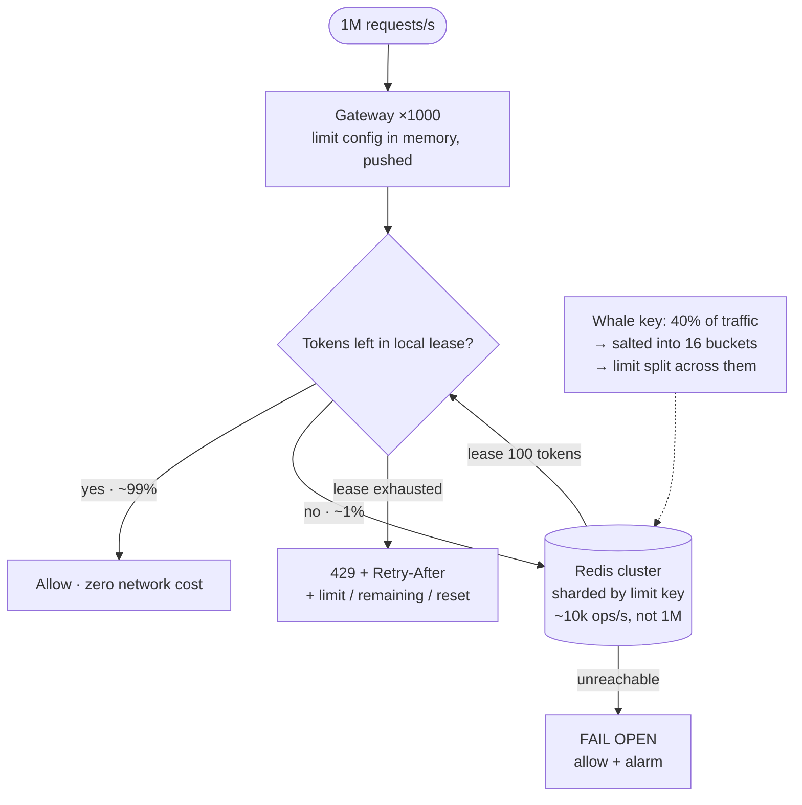

## The model

Enforce "100 requests per second per API key" across a fleet of a thousand servers, at a
million requests per second overall.

The [[rate limiting]] page covers the algorithms. What makes this a *system design* problem is
that the counter is shared state on the hot path of every request. A local counter is wrong by
a factor of a thousand; a remote counter adds a network hop to every call including the ones
you allow. The design is entirely about that tension.

## When to use it

You have the prompt and are deciding what shape of limiter is being asked for.

1. **Is this billing or protection?** Billing needs exact counts and can afford strict
   coordination. Protection needs approximate counts and must never become the bottleneck —
   completely different accuracy budgets.
2. **How many distinct keys?** A thousand API keys fits in memory anywhere. A hundred million
   user keys is a sharding and eviction problem.
3. **What is the blast radius of the limiter failing?** This component sits in front of
   everything, so its own availability must exceed the service it protects.

## Speedrun

**What** — a **limiter service** holding counters in a shared store, consulted by every
gateway. The interesting version pushes most decisions to the gateway and consults the store
rarely.

**How to design it**

1. **Size it.** 1M requests/s × one Redis round trip is 1M Redis ops/s — past a single
   instance, so the counters must be sharded by key.
2. **Put the limiter at the gateway**, before authentication if the limit is per IP and after
   it if per key. Nothing behind it should be reachable without passing through.
3. **Shard counters by the limit key** so one key's traffic lands on one Redis shard, and
   [[hot key|hot keys]] get the salting treatment.
4. **Lease tokens in batches.** A gateway takes 100 tokens from the store and spends them
   locally, refilling when low. One round trip per hundred requests rather than per request.
5. **Fail open.** If the store is unreachable, allow the request. A limiter that rejects
   everything when it breaks is a worse outage than the overload it prevents.
6. **Push limit configuration, do not pull it.** Limits change rarely and are read constantly,
   so they belong in gateway memory, updated by a config push.

**Why it works** — the batch lease breaks the one-to-one coupling between requests and shared
state. Accuracy drops slightly at the edges, which for a protection limiter costs nothing, and
the store's load drops by the batch size.

**The number that forces the design** — an extra round trip on every request. At half a
millisecond and a million requests a second, a naive limiter adds 500 seconds of latency per
second across the fleet, and it is on the [[critical path]] of requests it is going to allow.

## Going deeper

### Where the counter lives, and what each choice costs

**Local, per gateway.** Zero latency, no shared state, and wrong: with a thousand gateways the
effective limit is a thousand times what you configured. Occasionally acceptable — divide the
limit by the gateway count and accept the unevenness — and usually not, because traffic does
not distribute evenly.

**Central store, consulted per request.** Correct and expensive. Every request pays a round
trip, and the store becomes a dependency whose failure is your failure. At a million requests
a second it is also a capacity problem in its own right.

**Batched leases.** The gateway takes a block of allowance and spends it locally. One round
trip per batch, so the store sees a hundredth of the traffic. The cost is that a gateway
holding unspent tokens when traffic shifts elsewhere makes the limit slightly loose, and a
gateway dying loses its unspent tokens, making it slightly tight.

That last option is the one to propose, and the reason is worth stating plainly: **the limit
is a protection mechanism, not an invoice.** Being 3% loose during a redistribution costs
nothing. Adding half a millisecond to every request costs everything.

The exception is billing. If a customer is charged per call, the count must be exact, and the
right design is to enforce approximately on the hot path and reconcile exactly from logs
afterwards — the same split as the [[double-entry]] ledger, for the same reason.

### Sharding the counters

One Redis cannot take a million operations a second, so counters are partitioned by the limit
key. Each key's counter lives on one shard, and a gateway hashes the key to find it.

This inherits the [[hot partition]] problem exactly. One enormous customer sends 40% of your
traffic, so their counter is one key on one shard, and no amount of adding shards helps.

The fix is the same as everywhere else: salt the hot key into buckets, split the limit across
them, and accept the approximation. A customer limited to 10,000 per second gets sixteen
buckets of 625, and the enforcement is slightly uneven at the edges. Reserving that treatment
for keys you have measured as hot, rather than applying it universally, is what keeps it
cheap.

### Fail open, and the availability arithmetic

The limiter sits in series in front of every request, so its availability multiplies with
everything behind it. A limiter at 99.9% caps the whole service at 99.9% however good the
service is.

Failing open removes it from that multiplication entirely. When the store is unreachable, the
gateway allows requests and emits an alarm — the system degrades to "no rate limiting" rather
than to "no service". That is almost always the right call, and saying so unprompted is the
strongest thing you can say about this design.

The residual risk is real and worth acknowledging: an attacker who can take down your Redis
has also disabled your rate limiting. The mitigations are that the local lease still bounds
each gateway for a while, and that a separate crude per-IP limit in gateway memory needs no
shared state at all. Layered defences, so the failure of one is not the failure of all.

### The response, and what the client does next

Returning `429` is not the whole interface. The headers are what let a well-behaved client stay
inside its budget without ever being rejected: the limit, the remaining allowance, and the
reset time, plus `Retry-After` on rejection.

Without backoff and [[jitter]], rejection makes things worse. Every client rejected in the same
second retries in the same second, so the limiter generates the [[thundering herd]] it was
installed to prevent — and this is the failure that turns a busy afternoon into an incident.

The related mechanism worth naming is the [[circuit breaker]], which points the other way.
Rate limiting protects you from your callers; a circuit breaker protects your dependencies
from you.

## See it work

A public API: 1M requests/s across a thousand gateways, per-key limits, one whale customer.

The batch lease is doing the heavy lifting. Ninety-nine percent of requests are answered from a
gateway's local token count with no network call at all, so Redis sees around ten thousand
operations a second rather than a million. That single decision is the difference between a
design that works and one that needs a Redis cluster larger than the service it protects.

The cost is that limits are approximate. A gateway holding unspent tokens while traffic moves
elsewhere makes the effective limit slightly generous, and a gateway dying with tokens in hand
makes it slightly strict. For protection, neither matters; for billing, neither is acceptable,
which is why billing reconciles from logs instead.

The whale customer gets salting, because their single counter would otherwise pin one Redis
shard regardless of how many you add. Sixteen buckets with the limit divided among them, applied
only to keys measured as hot.

Failing open is the decision to volunteer. This component is in series in front of everything,
so its availability caps the service's — and allowing traffic through an unreachable limiter
degrades to "unprotected" rather than "down". The crude per-IP limit held in gateway memory is
the backstop that needs no shared state.

The response headers are the last piece. A client that can see its remaining budget mostly
stays inside it, which is cheaper for both sides than rejection — and `Retry-After` with jitter
is what stops the rejected clients from returning in a synchronised wave.

## Next

Notifications is the other system that must survive a client retrying, and the job scheduler is
where "exactly once" is demanded and cannot be given.
