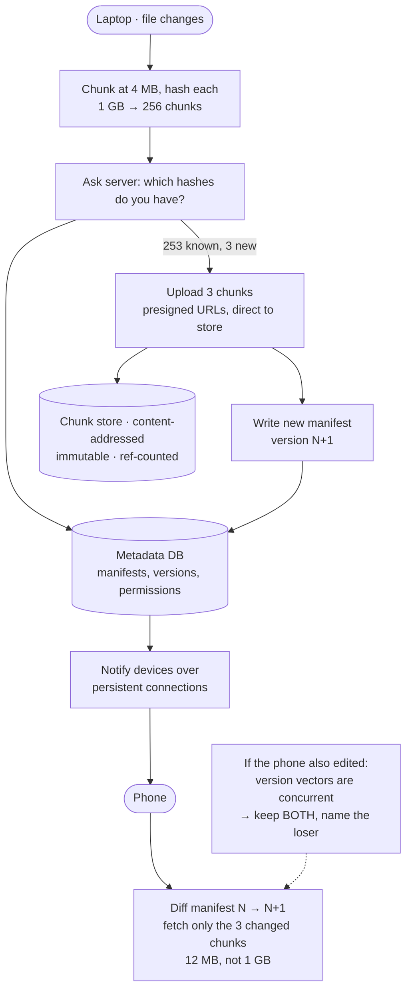

## The model

Users store files, edit them on several devices, and expect every device to converge. Say 500
million users, an average 10 GB each, with files up to several gigabytes.

The move that makes it tractable is **chunking**: split each file into fixed pieces, hash each
piece, and store pieces by their hash. Uploads become resumable, unchanged pieces are never
re-sent, and identical content anywhere in the system is stored once. Sync then stops being
about files and becomes about which chunks a device is missing.

## When to use it

You have the prompt and are deciding which system is being asked for.

1. **Storage or sync?** Upload-and-download is [[blob storage]] with metadata. Keeping several
   devices converged is a distributed state problem, and it is where the difficulty lives.
2. **How are conflicts resolved?** Two devices editing offline will diverge. Last-write-wins,
   both-copies-kept, or merge — and only the second is honest for arbitrary binary files.
3. **Are files shared?** Single-user sync is simple. Shared folders introduce permissions,
   concurrent editors and notification fan-out, which is a much larger product.

## Speedrun

**What** — files split into 4 MB chunks, each stored under its content hash; a metadata service
holds the **chunk manifest** per file version; clients sync by comparing manifests.

**How to design it**

1. **Size it.** 500M users × 10 GB is 5 EB raw. Deduplication and delta sync are not
   optimisations here — they are what makes the number payable.
2. **Chunk and hash on the client.** Split at 4 MB, hash each chunk, and ask the server which
   hashes it already has. Only the unknown ones are uploaded.
3. **Store chunks in [[blob storage]]**, keyed by hash. Content-addressed means immutable,
   cacheable and naturally deduplicated.
4. **Keep the manifest in a database** — the ordered list of chunk hashes making up a file
   version, plus metadata. Small rows, queried constantly.
5. **Upload direct to the store** with a [[presigned URL]], so bytes never traverse your
   application.
6. **Sync by comparing manifests**, not files. A device asks "what changed since version N" and
   downloads only the chunks it lacks.

**Why it works** — content addressing makes chunks immutable and identical content
self-deduplicating. Changing one byte of a 1 GB file re-uploads one 4 MB chunk rather than a
gigabyte, and a file a thousand users have is stored once.

**The number that justifies it** — 5 exabytes raw. Cross-user deduplication on common files and
delta sync on edits cut that by an order of magnitude, and no amount of cheap storage makes the
naive version sensible.

## Going deeper

### Chunking, and where the boundaries go

Fixed-size chunking splits every 4 MB. Simple, and it has a failure that matters: inserting one
byte at the start of a file shifts every subsequent boundary, so every chunk hash changes and
the whole file re-uploads.

**Content-defined chunking** fixes it by choosing boundaries from the content itself — a rolling
hash marks a boundary wherever the hash matches a pattern, so an insertion shifts only the
chunks around it. Chunks become variable-sized, averaging the target, and an edit in the middle
of a large file costs a few chunks rather than all of them.

The trade is complexity for edit efficiency, and which one you want depends on the workload.
Files that are replaced wholesale — photos, videos — gain nothing from content-defined
chunking. Files edited in place — documents, databases, virtual machine images — gain a great
deal.

Chunk size is its own trade. Smaller chunks deduplicate better and produce more metadata; 4 MB
is the common compromise, and being able to say *why* it is a compromise is better than
quoting it.

### Deduplication, and its uncomfortable edge

Storing chunks under their hash means identical content is stored once, automatically. A
company file shared by ten thousand employees occupies one copy.

Two things worth knowing. Hash collisions are theoretically possible and practically ignored —
SHA-256 collision probability is far below the chance of undetected disk corruption, so
treating the hash as identity is sound. And **cross-user deduplication** creates a genuine
privacy problem: if uploading a file completes instantly, you have learned that someone else
already has it. That side channel is why some products deduplicate only within a user's own
account, and naming the tradeoff is a strong signal.

Reference counting is the operational cost. A chunk can be deleted only when no manifest
references it, so deletion becomes a garbage-collection problem rather than a delete — and
getting the counting wrong either leaks storage forever or destroys a chunk someone still
needs.

### Sync, which is the actual problem

A device holds a local state and a last-known server version. Sync is: tell me what changed
since version N, and here is what changed locally.

The server keeps a per-file version history — a monotonic version per file, or a
**file version vector** when several devices edit independently. A device sends its version,
receives the manifests that changed, diffs them against what it holds, and fetches the missing
chunks.

Notification matters as much as the protocol. Polling every thirty seconds across 500 million
devices is enormous and slow; a persistent connection per active device gives immediate updates
and is the [[connection registry]] problem from the chat design. Most products do both — a
connection when the app is open, polling when it is not.

**Delta sync** is what makes an edit cheap. Change one paragraph of a document and the client
uploads one chunk and a new manifest; every other device downloads that one chunk. The
manifest is the unit of change, not the file.

### Conflicts, which cannot be avoided

Two devices edit the same file offline. Both come back online. This is not an edge case — it is
the normal consequence of offline editing, and the design must have an answer.

**Last-write-wins** by timestamp is simple and silently destroys work. Clocks disagree across
devices, so the "last" write may not be the later one, and the loser's edit vanishes with no
trace. Acceptable for a cache, wrong for a user's documents.

**Keep both** creates `report.docx` and `report (conflicted copy from Ana's laptop).docx`. Ugly,
honest, and what Dropbox does — because for arbitrary binary files there is no correct merge,
and pretending otherwise loses data.

**Merge** works only for formats you understand. Text merges reasonably; a spreadsheet or an
image does not, and a system that claims general merging is claiming something it cannot
deliver.

The version vector is what makes the *detection* correct rather than guessed. If device A's
version descends from device B's, A is simply newer and there is no conflict. If neither
descends from the other, they genuinely diverged and a human must decide. Timestamps cannot
distinguish those two cases, which is why they are the wrong mechanism even though they are the
obvious one.

There is a design temptation worth resisting here, and it is [[the wrong abstraction]] in
miniature: building a general conflict-resolution engine for arbitrary file types, when the
honest answer for most of them is "keep both and tell the user".

## See it work

A 1 GB video file, edited on a laptop and synced to a phone.

The chunk-and-ask step is where the design earns everything. Editing a 1 GB video changes three
chunks, so the laptop uploads 12 MB rather than a gigabyte — and the server already had the
other 253 because they were unchanged.

Chunks are content-addressed, which makes them immutable and gives deduplication for free. If
another user has the same video, those chunks already exist and the upload is instantaneous —
which is also the privacy side channel worth mentioning unprompted.

The phone downloads the same three chunks and rebuilds the file from the manifest. Delta sync
means the cost of propagating an edit is proportional to the edit, not to the file, and that is
the property that makes multi-device sync feel instant.

Notification goes over a persistent connection when the app is open and falls back to polling
when it is not — the same split as chat, for the same reason.

The conflict case is handled by version vectors rather than timestamps. If the phone's version
descends from the laptop's, it is simply behind and updates cleanly. If neither descends from
the other, they genuinely diverged, and the answer is to keep both and name the loser — because
no correct merge exists for a video, and a system that picks one silently destroys someone's
work.

## Next

That completes the canonical designs. The ML system design pages apply the same method to
retrieval and ranking problems, linking into the AI Engineering section rather than restating it.
