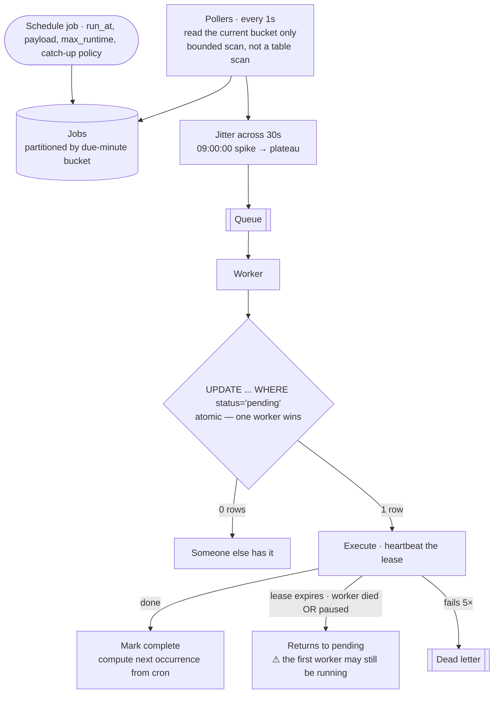

## The model

Accept jobs with a time to run, then run them at that time. Cron for a fleet: scheduled
reports, reminders, retries, billing runs.

Two things make this harder than it sounds. Finding what is due, cheaply, across millions of
pending jobs — that is an index problem. And running each job **once** when the workers
executing them can die mid-flight, which is the [[ambiguous outcome]] again: a worker that
stops responding may have finished, may be paused, and there is no way to tell.

## When to use it

You have the prompt and are deciding what guarantees are being asked for.

1. **At-least-once or at-most-once?** Those are the only two real options, and the choice is
   made by what the job does. A report can run twice; a payout cannot, so it needs
   [[idempotency]] at the job rather than a promise from the scheduler.
2. **How precise is "on time"?** Within a second is a different system from within a minute.
   Precision costs polling frequency and index granularity.
3. **What happens to a job whose time passed while you were down?** Run it late, skip it, or
   run every missed occurrence — a **catch-up policy**, and it must be decided rather than
   discovered.

## Speedrun

**What** — a store of jobs indexed by due time, pollers that find what is due, a queue, and
workers that **claim** each job under a lease before executing.

**How to design it**

1. **Size it.** 50M jobs/day ≈ 580/s average, but scheduled work clusters — most jobs are set
   for the top of the hour, so the peak is what matters.
2. **Index by due time**, partitioned into time buckets. Finding what is due is then a range
   scan over one bucket, not a scan of every pending job.
3. **Claim before executing.** A worker atomically marks the job `running` with a lease and its
   own id. Two workers cannot both claim it, because the update is conditional.
4. **Heartbeat the lease** while working, so a long job is not reclaimed and a dead worker's
   job is.
5. **Make jobs [[idempotency|idempotent]]**, because at-least-once is the only guarantee
   available. The scheduler reduces duplicates; the job must survive them.
6. **Jitter the enqueue** of jobs sharing a due time, or everything scheduled for 09:00
   arrives in the same instant.

**Why it works** — the due-time index turns "what should run now" into a bounded range scan,
and the claim-and-lease turns "who runs it" into one atomic write. Everything else is queueing.

**The promise to refuse** — exactly-once execution. A worker that claims a job and stops
responding has either finished or not, and no protocol distinguishes those. You can have
at-least-once with idempotent jobs, or at-most-once with occasional skips.

## Going deeper

### Finding what is due

The naive query — "every job where `run_at <= now` and `status = pending`" — scans an index
that grows without bound and returns the same overdue rows repeatedly under contention.

The shape that works is **time bucketing**: partition jobs by their due minute, so the poller
reads one small partition per tick. That bounds the scan regardless of how many jobs exist in
total, and it makes retention a partition drop rather than a delete.

Polling frequency sets your precision. A poller running every second gives second-level
accuracy and does 86,400 scans a day; running every minute is cheaper and coarser. Match it to
the promise rather than to instinct — most scheduled work does not need second precision, and
saying so is the cheaper design.

The alternative worth naming is a priority queue keyed by due time, where the head is always
the next job. It gives exact wake-ups with no polling, and it costs you a data structure that
must be durable, distributed and sharded — usually more machinery than bucketing.

Sharding follows the same rule as everywhere else: partition by job id or tenant so pollers
divide the work, and be alert for the [[hot partition]] when one tenant schedules everything at
midnight.

### Claim and lease, which is the correctness core

Two workers must not run the same job. The mechanism is a conditional update:

```
UPDATE jobs SET status='running', owner=:me, lease_until=now()+60s
WHERE id=:id AND status='pending'
```

One worker's update matches a row; the other's matches zero, and it moves on. The database
decides the race rather than a check-then-act, which is the [[lost update]] lesson applied
again.

The lease is what handles a dead worker. If `lease_until` passes without a **heartbeat**, the
job returns to `pending` and someone else claims it. Without a lease, a worker crashing means
the job is stuck in `running` forever; with one, it is retried.

And the lease is exactly where exactly-once dies. A worker that is merely paused — garbage
collection, a slow disk — can have its lease expire while it is still alive, so a second worker
claims a job the first is still executing. That is the [[distributed lock]] problem verbatim,
and the same answer applies: a [[fencing token]] lets the resource reject the stale writer, and
where the effect is external, only [[idempotency]] helps.

The practical guidance is to set the lease comfortably longer than the expected runtime,
heartbeat every fraction of it, and treat "how long can this job take" as a required field
rather than an assumption.

### Cron, recurrence and catch-up

A **cron expression** turns a schedule into a series of due times. The scheduler stores the
next occurrence, and on completion computes the one after.

That "compute the next one" step carries most of the subtlety. Timezones and daylight saving
mean 02:30 daily happens twice on one day a year and not at all on another — real bugs that
bite real billing systems. Storing schedules in UTC and converting for display avoids most of
it, but a user who wants "09:00 local" genuinely means the local wall clock, and that has to be
honoured rather than normalised away.

The **catch-up policy** is the decision people forget. The scheduler was down for two hours and
forty jobs are overdue. Three defensible answers:

**Run them all** — correct for billing, where every occurrence matters.
**Run the latest only** — correct for a refresh, where forty consecutive runs are pointless.
**Skip them** — correct for a reminder whose moment has passed.

None is the obvious default, so it belongs in the job's definition. And a design that names all
three, and says the policy is per job, is describing a system someone has operated.

### The clustered peak

Scheduled work is not uniform. Most jobs are set for the top of the hour, midnight, or 09:00,
so the load arrives in spikes an order of magnitude above the average.

Sizing workers for the spike wastes them the rest of the time. The queue absorbs it instead —
jobs enqueue at their due time and workers drain at their own rate, converting a wall of
concurrent work into a backlog. That is only acceptable if lateness is acceptable, which is why
the promise must be stated as "starts within N seconds of due" rather than "runs at due".

Jittering is the other half. Ten thousand jobs due at exactly 09:00:00 can be spread across
09:00:00–09:00:30 at no cost anyone perceives, and it turns a spike into a plateau — the same
move as the [[thundering herd]] fix everywhere else.

## See it work

Fifty million scheduled jobs a day, second-level precision, mixed workloads.



The due-time bucket is what keeps the poller cheap. Reading one minute's partition is bounded
however many million jobs are pending overall, and it makes retention a partition drop rather
than a delete across a huge table.

The claim is one conditional update, so the database decides which worker wins. Two pollers
handing the same job to two workers is fine — only one update matches a row.

The lease is both the recovery mechanism and the limit of the guarantee. A worker that dies has
its job reclaimed, which is what you want. A worker that is merely paused has its job reclaimed
too, which means two workers can execute the same job — and no lease duration prevents that,
because you cannot bound a pause.

So the honest promise is at-least-once, and the jobs carry the burden. A report that runs twice
is harmless; a payout that runs twice needs an [[idempotency key]] at the payment service, and
the scheduler cannot supply that.

The catch-up policy is stored per job because there is no safe default. And per [[Hyrum's Law]],
once teams notice jobs usually start within a second of their due time, that becomes a contract
you never wrote — which is an argument for stating the real promise loudly and early.

## Next

Ride-sharing is the design where geography enters the index, and file storage is where the
large objects everything else references actually live.
