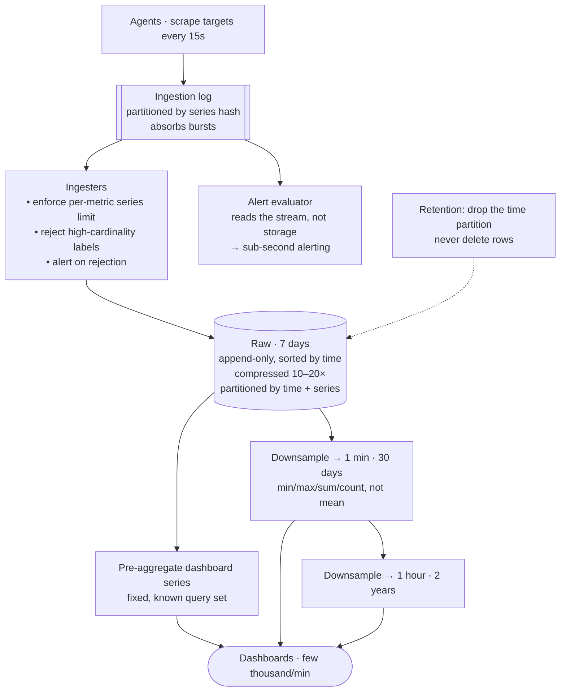

## The model

Collect metrics from a fleet, store them, and serve dashboards and alerts. Say 10 million
data points a second ingested, and a few thousand queries a minute.

This is the mirror image of every read-heavy design. Writes outnumber reads by orders of
magnitude, most data points are never read at all, and the standard moves — caching,
denormalising, indexing generously — are all wrong here. The failure that actually kills these
systems is not volume; it is **label cardinality**.

## When to use it

You have the prompt and are deciding what shape of system it is.

1. **Metrics, logs, or traces?** They look similar and behave differently. Metrics are
   numeric and aggregatable, so they compress enormously. Logs are text and mostly do not.
2. **Are queries known in advance?** Dashboards and alerts are a fixed, small set, which
   makes **pre-aggregation** viable. Arbitrary exploration is a different and much more
   expensive system.
3. **How long must raw resolution be kept?** This single number dominates storage. Full
   resolution for a year costs roughly twenty times full resolution for three weeks.

## Speedrun

**What** — a **time series** is a metric name plus a set of labels, holding
`(timestamp, value)` points. `http_requests_total{service="api", status="500"}` is one
series; changing any label makes a different one.

**How to design it**

1. **Size it.** 10M points/s × 16 bytes ≈ 160 MB/s raw, about 14 TB/day. Compression takes
   this down by 10–20×, which is the single most important property of the storage engine.
2. **Buffer ingestion behind an [[event log|append-only log]].** Agents push to a queue; ingesters consume.
   This absorbs the bursts that make ingestion spiky.
3. **Partition by time and by series.** Time buckets make retention a partition drop rather
   than a delete, and series hashing spreads the write load.
4. **Store append-only, sorted by time.** Points arrive in roughly time order and are queried
   in ranges, so an LSM-style engine fits and a B-tree does not.
5. **Downsample on a schedule.** Raw for days, one-minute rollups for weeks, one-hour rollups
   for years. Each tier is a fraction of the one before.
6. **Bound cardinality at ingestion.** Reject or drop series above a limit per metric, and
   alert on it. This is the guardrail that prevents the outage.

**Why it works** — the access pattern is narrow and known: append points, read ranges. A
storage engine built for exactly that compresses 10–20× and answers range scans cheaply,
which no general-purpose database does.

**The failure that defines this problem** — putting a user id, a request id, or a URL with
parameters into a label. Each distinct value creates a series, and the count multiplies across
labels. This is **cardinality explosion**, and it takes down metrics systems far more often
than volume does.

## Going deeper

### Cardinality, and why it is the whole risk

A series is the unique combination of a metric name and all its label values. The number of
series is the *product* of the distinct values of each label.

`http_requests{service, endpoint, status}` with 50 services, 20 endpoints and 5 statuses is
5,000 series. Entirely fine. Add `user_id` with a million values and it becomes 5 billion,
which is not a bigger version of the same problem — it is a different problem, because every
series carries its own index entry and in-memory state.

The symptom is memory rather than disk. Ingesters hold per-series state, so cardinality growth
shows up as an out-of-memory crash rather than a full disk, and it arrives suddenly when
someone deploys a new label.

The rule to carry: **labels are for dimensions you group by, never for identifiers.** Service,
endpoint, region, status code, instance — bounded and small. User id, request id, session,
full URL, error message — unbounded, and they belong in logs or traces where the storage model
expects high cardinality.

The guardrail is a per-metric series limit enforced at ingestion, with an alert. It is
unglamorous and it is the difference between a bad deploy costing a dashboard and costing the
monitoring system.

### The three metric types, and why they differ

**Counter metrics** only increase — requests served, errors, bytes sent. You never read a
counter directly; you read its rate, and because it is monotonic a reset to zero is detectable
as a process restart. This is why counters are preferred to gauges wherever possible.

**Gauges** go up and down — memory in use, queue depth, temperature. Sampled rather than
accumulated, so a spike between samples is invisible. That aliasing is worth knowing: a queue
that fills and drains between two scrapes never happened, as far as the metrics know.

**Histogram metrics** record a distribution in buckets, which is what makes percentiles
possible. They are also far more expensive: one histogram with twelve buckets is twelve
series, so histograms are where cardinality quietly multiplies.

The percentile subtlety is worth carrying because it catches people out. Percentiles do not
average — the mean of two servers' p99s is not the fleet's p99. Correct aggregation requires
merging the bucket counts and computing the percentile from the merged histogram, which is
precisely why the buckets are stored rather than the percentile.

### Retention tiers, and downsampling

Raw resolution is only interesting for a short window. Nobody debugging an incident from
March needs per-second data; they need the shape.

**Downsampling** computes summaries over intervals and stores those. **Rollups** at
one-minute and one-hour resolution reduce volume by 60× and 3,600× respectively, and each
**retention tier** keeps its own window.

A typical ladder: raw for 7 days, one-minute for 30 days, one-hour for 2 years. Storage
becomes dominated by the raw tier even though it covers the shortest period, which is what
makes the raw retention window the number that controls the bill.

The subtlety is what a rollup stores. Storing the mean loses the peaks, and the peaks are
usually the reason anyone looks. Rollups should keep min, max, sum and count — from which
mean is derivable and extremes survive — and for latency they should keep merged histogram
buckets rather than a precomputed percentile.

### The query path, and pre-aggregation

Queries are range scans: one or more series over a time window, aggregated. Because the data
is stored sorted by time within a series, this is a sequential read, which is the cheapest
thing a disk does.

The expensive queries are the ones spanning many series — "p99 latency across all services"
touches thousands. **Pre-aggregation** handles these by computing common groupings at
ingestion and storing them as their own series, so the dashboard reads one series instead of
aggregating a thousand.

That is only viable because the query set is small and known. Dashboards and alert rules are
a fixed list, and precomputing exactly those is a large win — the same read-heavy trick,
applied to the small read side of a write-heavy system.

Alerting deserves a separate note, because it is the read path with the strictest latency
requirement. Alert rules evaluate continuously, so they are better served by evaluating
against the ingestion stream than by querying storage — which makes alerting a stream
processor rather than a query client.

### Push, pull, and the thing metrics cannot tell you

**Push** has agents send to the pipeline. It works through firewalls and for short-lived jobs,
and it means a runaway client can overwhelm you — so ingestion needs [[rate limiting]].

**Pull** has the system scrape endpoints on a schedule, which is Prometheus's model. Scraping
gives you a free liveness signal — a target that cannot be scraped is down — and it makes the
scrape interval a central, controllable knob. It struggles with short-lived jobs and with
targets it cannot reach.

Large systems use both: pull for infrastructure it controls, push through a gateway for batch
jobs and edge clients.

The limitation worth stating out loud is that metrics are aggregates, and aggregates cannot
answer "why". They tell you error rate rose at 14:02; they cannot tell you which request
failed or what it contained, because the identifying information is exactly what cardinality
forbids. That is what logs and traces are for, and a design that claims metrics alone are
sufficient observability has misunderstood the constraint.

This is also where [[Goodhart's Law]] arrives. Once a dashboard number becomes the team's
target, it stops being a measure of health and becomes a thing people optimise — and the
metric keeps looking good.

## See it work

Ten million points a second across a large fleet.

Ingestion goes through a log first, which absorbs the bursts that make metrics traffic spiky —
a deploy restarting a thousand instances produces a spike no ingester should have to size for.

The ingesters enforce the cardinality limit, and that is the most important box in the
diagram. A rejected series and an alert is a bad afternoon for one team; an unbounded label is
an out-of-memory crash for the monitoring system, during the incident it was supposed to
observe.

Storage is append-only and sorted by time, compressed ten to twenty times, and partitioned by
time so retention is a partition drop rather than a row-by-row delete. At 14 TB a day raw,
deleting by row would consume more capacity than ingesting.

Downsampling keeps min, max, sum and count rather than the mean, so the peaks survive into the
long tiers. Storing only means would make every historical incident look calm, which is the
opposite of what the data is for.

Alerting reads the ingestion stream rather than the store, giving sub-second evaluation and
removing the alert path's dependence on the query path. When storage is degraded — which is
exactly when you want alerts — alerting keeps working.

The one thing to volunteer at the end: this system can tell you the error rate rose and cannot
tell you why, because the identifying detail that would answer that is the same detail that
would explode cardinality. Logs and traces are separate systems for that reason, not for
historical accident.

## Next

The payment ledger is the opposite extreme, where nothing may be approximate and eventual
consistency is not available.
