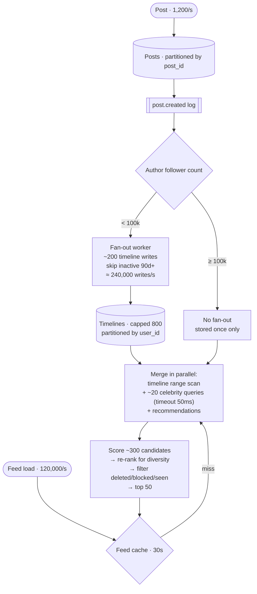

## The model

Users follow each other; a feed shows recent posts from everyone you follow, ranked. Say 500
million users, 100 million posts a day, and 10 billion feed loads.

Two things make this hard rather than tedious. The follower distribution is a power law, so
the fan-out strategy that works for ordinary users cannot work for the largest accounts. And
"ranked" means the feed is not a list — it is a scoring system, and the ranking has different
scaling properties from the storage.

## When to use it

You have the prompt and are deciding which system you are being asked for.

1. **Chronological or ranked?** Chronological is a merge; ranked is a scoring pipeline with a
   model in it. They share storage and nothing else, and confusing them wastes the interview.
2. **How fresh must it be?** Seconds of staleness makes precomputation available. "Instant"
   forces assembly at read time and changes the whole design.
3. **Is the follow graph symmetric?** Friends (bidirectional, bounded at a few thousand) is a
   much easier problem than followers (unidirectional, unbounded), and the celebrity problem
   only exists in the second.

## Speedrun

**What** — precompute a timeline per user by fanning out ordinary posts on write, merge in
large accounts at read time, then rank the merged candidates.

**How to design it**

1. **Size it.** 100M posts/day ≈ 1,200/s; ×200 average followers ≈ 240,000 timeline
   writes/s. 10B reads/day ≈ 120,000 feed loads/s at 2× peak.
2. **Split the fan-out by follower count.** Push below ~100k followers, pull above. This is
   [[hybrid fan-out]] and it is the load-bearing decision.
3. **Cap the precomputed timeline** at ~800 entries, so storage is users × 800 rather than
   users × posts. Deeper scroll falls back to a query.
4. **Merge at read time** — precomputed timeline plus a live query for the few large accounts
   this user follows, combined by timestamp.
5. **Rank the merged candidates.** [[candidate generation]] produces a few hundred; scoring
   orders them; only the top ~50 are returned.
6. **Cache the assembled feed** for tens of seconds. At 120,000 reads a second this collapses
   most of the cost, and the staleness is invisible.

**Why it works** — the expensive work happens once per post rather than once per feed load,
and the [[read-to-write ratio]] is 100:1 in favour of doing exactly that. The hybrid exists
because the follower distribution makes one strategy impossible at the tail.

**The number that forces the hybrid** — a post from an account with 50 million followers is
50 million timeline writes. There is no throughput at which that is acceptable for one post.

## Going deeper

### Fan-out, and the threshold

The arithmetic is on the [[fan-out on write]] page and the conclusion is worth restating in
this context: push for the 99.9% of accounts with ordinary follower counts, pull for the rest.

Ordinary posts fan out asynchronously through the [[event log]], writing a row into each
follower's timeline. Two hundred writes per post, off the [[critical path]], and the author's
`POST` returns as soon as the post is durable.

Large accounts do not fan out at all. Their posts are stored once, and readers pick them up
during the merge. The threshold is a tuned number rather than a principle, and saying "we set
it from measured write capacity, around 100,000 followers" is the answer.

Two refinements that matter at this size. Inactive users should be skipped — fanning out to
accounts dormant for a year is a large fraction of total write volume in a mature product,
and the timeline is rebuilt on their return. And the timeline is capped, so storage is bounded
by a constant per user rather than growing with the product's age.

### Ranking, which is a second system

A chronological feed is a merge. A ranked feed is a pipeline, and it has three stages worth
naming separately.

**Candidate generation** gathers a few hundred plausible posts — the precomputed timeline,
the merged celebrity posts, and often things you do not follow at all: recommended accounts,
trending items, sponsored content. This stage is about recall.

**Scoring** predicts engagement for each candidate. In production this is a model, and its
inputs are the post, the viewer, and their interaction history. It is the expensive stage,
and it bounds how many candidates you can afford — a few hundred, not a few thousand.

**Re-ranking** applies rules the model does not encode: diversity so one author does not fill
the feed, freshness, ads, policy filters, and "you have seen this already".

The architectural consequence is that ranking scales differently from storage. It is
CPU-bound, it wants a model server rather than a database, and it is the natural place for a
latency budget to be blown. Which is why the assembled feed gets cached — one ranking pass
serves many scrolls.

### The read path and its latency budget

A feed load at p99 under 300 ms, assembled from several sources, is a [[the tail at scale]]
problem by construction.

The merge queries the precomputed timeline plus the celebrity accounts the user follows. That
second query is bounded — following twenty large accounts is normal — but it is a fan-out,
and the response is not complete until the slowest part returns.

The defences are the standard ones. Issue the queries in parallel rather than in series. Set
an aggressive timeout on the celebrity merge and serve without it if it is late, because a
feed missing three posts is far better than a feed that is slow. And cache the assembled
result, so scrolling and refreshing do not re-run the pipeline.

That "serve without it" decision is worth volunteering, because it is the difference between
a design that degrades and one that fails. The feed is not a correctness-critical read;
almost nothing in it needs to be complete.

### The parts that are quietly hard

**Deletion and privacy.** A deleted post exists in millions of precomputed timelines. Finding
them all is impractical, so the standard answer is to filter at read time against a small set
of recently-deleted ids. The same applies to a user who blocks another after the fan-out has
happened, and to a post whose visibility changes.

**Backfill.** A new user, or one returning after a year, has no precomputed timeline.
Generating one on demand is a large query at exactly the moment someone is waiting, so it is
usually done asynchronously with a pull-based feed served in the meantime.

**Ordering across the merge.** The precomputed timeline and the celebrity posts have
independent orderings, and merging by timestamp requires clocks that agree well enough. This
is where [[consistent prefix reads]] would bite if events were keyed inconsistently.

**Read receipts and seen state.** Knowing what a user has already seen is a write on every
feed view, which reintroduces the write-heavy path the whole design avoided. It is usually
handled with a client-side watermark and periodic batched writes.

## See it work

The full design at 500 million users.

The write path fans out for ordinary accounts and does nothing for large ones. Two hundred
and forty thousand timeline writes a second sounds enormous and is entirely routine once
[[partitioning|partitioned]] by `user_id` — it is the one number in this design that scales
by adding machines.

The read path assembles from three sources in parallel, with a hard timeout on the celebrity
merge. If those queries are slow the feed ships without them, because a feed missing a few
posts is a better outcome than a slow feed, and nothing here is correctness-critical.

Ranking scores a few hundred candidates rather than everything available, which is what makes
the CPU cost bounded. Then the filters run last: deleted posts, blocked authors, things
already seen. Filtering at read time is what avoids hunting through millions of precomputed
timelines when something is deleted.

The 30-second feed cache is doing more work than it appears. At 120,000 loads a second, most
are refreshes and scrolls from users who just loaded, so a short cache removes the majority of
ranking passes — the most expensive stage — for staleness nobody perceives.

Two things worth volunteering. Storage is bounded by the 800-entry cap, so it grows with users
rather than with time. And the celebrity threshold is the one number that would need retuning
as the product grows, because it is set by write capacity rather than by anything intrinsic.

## Next

Chat is the same real-time problem with delivery guarantees and ordering that actually matter,
and the metrics pipeline is what the analytics behind this feed becomes.
