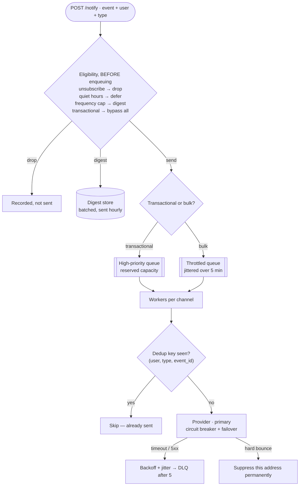

## The model

Other services want to tell a user something. The notification service turns that into an
email, an SMS, a push notification or an in-app message, respecting what the user has agreed to
receive.

Two properties shape everything. Every channel is a **third-party provider** with its own
failure modes, rate limits and delivery semantics — so the design is mostly about surviving
other people's systems. And a sent notification cannot be recalled, which makes duplicates
expensive in a way most duplicate work is not.

## When to use it

You have the prompt and are deciding what you are actually building.

1. **Transactional or marketing?** A password reset must arrive within seconds and ignores
   preferences. A promotion is batchable, throttleable, and legally requires an unsubscribe.
   They share a pipeline and almost nothing else.
2. **Who owns the content?** If callers supply rendered text, you are a delivery pipe. If they
   supply an event and you render it, you own templates, localisation and versioning — a much
   larger system.
3. **What is the volume shape?** Steady traffic is easy. Scheduled sends cluster on the hour,
   and that peak is what the design has to absorb.

## Speedrun

**What** — an API that accepts a notification request, a queue per channel, workers that render
and call providers, and a preference store consulted before anything is sent.

**How to design it**

1. **Size it.** 50M notifications/day ≈ 580/s average, ×10 for scheduled clustering ≈ 5,800/s
   peak. The peak is the number that matters.
2. **Accept and return.** Persist the request, enqueue it, respond. The caller must never wait
   for a provider.
3. **Check preferences and eligibility before enqueuing** — channel opt-outs, quiet hours,
   frequency caps, unsubscribes. Doing it late means work you then discard.
4. **One queue per channel**, because email, SMS and push have different rates, costs and
   failure modes, and a slow provider must not block the others.
5. **Make every send [[idempotency|idempotent]]** with a key derived from the event, and check
   a dedup store before calling the provider. At-least-once delivery plus an un-recallable side
   effect is the core risk.
6. **Retry with backoff into a [[dead letter queue]]**, and treat provider errors by class:
   retry a timeout, never retry a hard bounce.

**Why it works** — the queue converts a spike into a backlog and decouples you from provider
latency. Per-channel queues mean an SMS outage delays SMS only, which is what keeps one
provider's bad day from being yours.

**The property that makes this different** — you cannot unsend. Everywhere else, a duplicate is
wasted work; here it is a second email to a customer, and at scale it is a public incident.

## Going deeper

### Preferences, and why they are the hard part

**User preferences** sound like a lookup and are a rules engine. A user may accept
order updates by email but not SMS, mute marketing entirely, be inside quiet hours in their
own timezone, have hit a frequency cap, or have unsubscribed from one category last week.

The checks compose, and the order matters. Legal opt-outs and unsubscribes are absolute and
checked first. Transactional messages — password resets, security alerts, receipts — bypass
marketing preferences entirely, and getting that wrong in either direction is serious: a
suppressed security alert is a vulnerability, and a promotion sent to an unsubscribed user is a
regulatory problem.

The design consequence is that eligibility is evaluated **before** enqueuing, not in the worker.
Checking late means the queue fills with messages that will be discarded, and a backlog of work
you are about to throw away is the worst kind.

Frequency capping and **digests** are the same idea at different granularity: rather than
sending twenty notifications in an hour, hold them and send one summary. That turns a stream
into a scheduled batch job, which is a different pipeline with different timing — worth naming
as a separate path rather than a flag.

### Providers, and surviving them

Each **delivery provider** is a dependency you do not control. SendGrid, Twilio, APNs and FCM
all have distinct rate limits, error taxonomies and reliability.

The error classification is what separates a working system from one that burns money and
reputation:

**Retryable** — timeouts, 5xx, provider rate limits. Back off with [[jitter]] and try again.

**Permanent** — invalid address, hard bounce, unsubscribed at the provider, blocked number.
Never retry, and record the failure against the user so you stop trying that address entirely.
Retrying a hard bounce damages your sender reputation, which is a shared resource across every
email you send.

**Ambiguous** — the request timed out and you do not know whether it sent. This is the
[[ambiguous outcome]] with an un-recallable side effect, which is why the provider's own
idempotency key matters as much as yours.

The structural defence is a second provider per channel with automatic failover, plus a
[[circuit breaker]] so a dead provider stops consuming worker capacity. Being able to say
"we would fail over to a secondary sender and page someone" is the operational answer.

### Deduplication, because you cannot unsend

At-least-once delivery means a worker that crashes after calling the provider but before
acknowledging will process the message again. Without a check, the customer gets two emails.

The dedup key should be derived from the **event**, not generated per attempt — something like
`(user_id, notification_type, event_id)`. Store it before calling the provider with a unique
constraint, exactly as on the [[idempotency]] page, and let the database decide the race rather
than a check-then-act.

The window matters. A key retained for an hour protects against retries and worker crashes; a
key retained forever prevents a legitimate second notification about a genuinely new event that
happens to hash the same. Twenty-four hours, exceeding your longest retry schedule, is the
usual answer.

There is a subtlety worth raising. The provider may also have sent it despite reporting a
timeout, so your dedup store cannot promise exactly-once — it reduces duplicates rather than
eliminating them. Saying that out loud is more honest than claiming a guarantee the system
cannot make.

### The scheduled-send spike

Notifications cluster. A daily digest at 09:00, a reminder an hour before an event, a marketing
campaign fired at once — all produce a peak an order of magnitude above the average.

Sizing workers for the peak is wasteful, since they idle the rest of the day. The queue is what
lets you size for something closer to the average and let the peak drain — but only if the
promise permits it. A digest arriving three minutes late is fine; a two-factor code is not.

That argues for priority separation rather than one queue. Transactional messages get their own
high-priority path with capacity reserved for them, and bulk sends go through a throttled lane
that drains at whatever rate the providers accept. Mixing them means a marketing campaign can
delay a login code, which is the failure everyone has experienced as a user.

Jittering scheduled sends across a window is the other half. Ten million notifications all
timestamped 09:00:00 is a self-inflicted [[thundering herd]]; spreading them over five minutes
costs nothing anyone notices.

## See it work

Fifty million notifications a day, four channels, with digests and quiet hours.

Eligibility runs before the queue, which is the decision that keeps the backlog honest. Checking
in the worker would mean queuing millions of messages that will be discarded, and during a
backlog that is capacity spent on work you already know to throw away.

Transactional and bulk take separate paths with separate capacity. A marketing campaign of ten
million cannot delay a two-factor code, because the code never enters that queue — and jittering
the campaign across five minutes turns a self-inflicted spike into a flat load.

Deduplication happens immediately before the provider call, keyed on the event rather than the
attempt. The unique constraint decides the race, so two workers handed the same message cannot
both send. It reduces duplicates rather than eliminating them, because a provider that times out
may have sent anyway — and that limit is worth stating rather than glossing.

Error handling splits by class. A timeout retries with backoff; a hard bounce never retries and
suppresses the address permanently, because repeatedly mailing a dead address damages sender
reputation across every email you send.

The thing to volunteer at the end is what this system cannot promise. Delivery is at-least-once
against providers that are themselves at-least-once, so "exactly one email" is not achievable —
only "rarely more than one, and never zero for anything transactional." And per [[Hyrum's Law]],
once callers notice that notifications usually arrive in order, that ordering becomes a contract
you did not write down.

## Next

The job scheduler is the same delivery problem where the trigger is time rather than an event,
and autocomplete is the read-heavy inverse of everything here.
