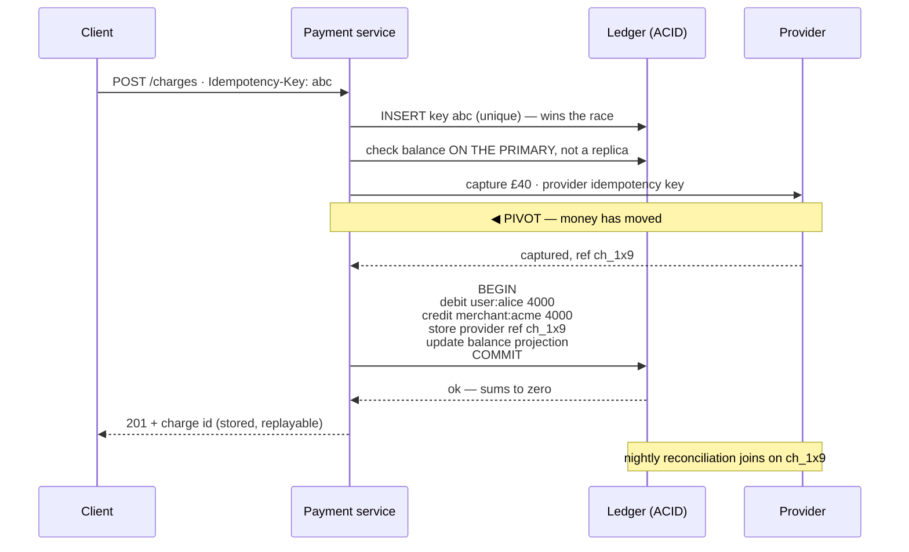

## The model

Record money moving between accounts, accurately, forever. Every other design in this section
tolerates staleness somewhere; this one does not, and that single constraint changes every
choice.

The shape that has survived five hundred years is a **double-entry** ledger: every movement
is recorded twice, as a **debit** on one account and an equal **credit** on another, so the
sum of all entries is always zero. Each half is a **posting**; the pair is one
**journal entry**. Balances are not stored and edited — they are derived from the
entries, which makes disagreement detectable rather than invisible.

## When to use it

You are being asked for anything that moves money: payments, wallets, payouts, refunds.

1. **Is this the ledger or the payment flow?** Recording money is a storage and correctness
   problem. Moving it through a provider is a distributed workflow problem. They are different
   systems and the interview usually wants both.
2. **What currencies, and are there conversions?** Multi-currency means every account is
   denominated, and cross-currency movement needs an explicit exchange step that is itself two
   entries.
3. **What must be immediate?** A balance check before a withdrawal must be strongly
   consistent. A monthly statement can lag by minutes, and conflating the two makes the whole
   system expensive.

## Speedrun

**What** — an append-only table of **journal entries**. Nothing is ever updated or deleted; a
correction is a new entry that reverses the old one.

```
entry_id  txn_id   account          debit    credit
--------  -------  ---------------  -------  -------
1         t-901    user:alice        40.00
2         t-901    merchant:acme               40.00
                                    ------   ------
                          every txn:  40.00 = 40.00
```

**How to design it**

1. **Make postings immutable.** Append only. A refund is a new pair of entries, not an edit,
   and this is what makes the history auditable rather than merely logged.
2. **Enforce balance in one [[transaction]].** Both sides of a movement commit together or
   neither does. This is the one place a real ACID transaction is non-negotiable.
3. **Store amounts as integers in minor units.** Never floats. `4000` cents, with the currency
   in its own column.
4. **Derive balances as a [[projection]]**, kept current incrementally and recomputable from
   the entries. The entries are the truth; the balance is a cache.
5. **Give every money movement an [[idempotency key]]** from the caller, so a retried request
   cannot charge twice.
6. **Reconcile against the provider daily**, because your ledger and the payment processor
   will disagree, and the question is only whether you find out.

**Why it works** — the invariant "every transaction sums to zero" is checkable at any moment
over the whole table. A system where corruption is detectable by arithmetic is a fundamentally
different thing from one where you have to trust that every update was right.

**The rule that makes this design different** — money is the case where [[eventual
consistency]] is not available. A balance read that gates a withdrawal must be strongly
consistent, because two concurrent reads of "£40 available" both succeeding is money that
does not exist.

## Going deeper

### Why double-entry, and what it actually buys

Storing a balance per account and updating it is the obvious design and it has no error
detection. If an update is lost, the balance is simply wrong, and nothing in the data says so.

Double-entry makes every movement two entries that sum to zero. That gives you three
properties for free.

**Detectability.** Sum every entry in the system; it must be zero. A non-zero total means
something is broken, and you learn it from arithmetic rather than from a customer.

**Attribution.** Every entry names the transaction it belongs to, so any balance decomposes
into the movements that produced it. "Why is this £3 lower than expected" is a query.

**Immutability.** Since nothing is edited, the history is the record. Auditors, disputes and
"what did this look like last Tuesday" are all reads.

The cost is that the model is less obvious than a balance column, and every engineer touching
it must understand debits and credits — which are not intuitions people arrive with, and are
worth defining precisely rather than assuming.

### Balances as a projection

Summing every entry for an account on every read is correct and does not scale. The balance
is therefore a **balance projection**: a stored number maintained incrementally, updated in
the same transaction as the entries.

The essential discipline is that the projection is *derived*, never authoritative. It can be
recomputed from the entries at any time, and a periodic job should do exactly that and compare
— a mismatch is a bug, and the entries win.

For accounts with very high entry counts, the recomputation is bounded with a checkpoint:
"balance was X as of entry N", so recomputation sums only entries after N. That is the same
[[snapshot]] idea from event sourcing, applied to the one number that matters.

The read that must be strongly consistent is the balance check gating a withdrawal. Serving
that from a lagging replica permits two concurrent withdrawals of the same funds — so it goes
to the primary, under a lock or a conditional update, exactly as on the [[transactions and
isolation]] page.

### Money movement, which is a saga

Recording money is a database problem. *Moving* it involves a payment provider, and that is a
[[saga]] with an obvious pivot.

Authorise the card, then capture, then post to the ledger, then notify. The provider call is
the pivot step: once the money has actually moved at the network, unwinding means a refund
rather than a rollback, and refunds are visible to the customer and slow.

So the ordering rule from the saga page applies directly. Do everything reversible first —
validate, reserve, check limits — and put the irreversible provider call as late as possible.
After it, prefer forward recovery: retry the ledger posting, alert a human, never
automatically refund a successful capture because a subsequent step failed.

Two-phase commit is not available here, because the provider is not a participant in your
transaction and never will be. This is the canonical case where a saga is not a preference
but the only option.

### Idempotency, and why it is load-bearing

A charge request that times out is the [[ambiguous outcome]] with money attached. The client
must retry, and the retry must not charge twice.

Every money movement therefore carries a client-generated [[idempotency key]], stored with a
unique constraint, with the response recorded so a retry returns the original result rather
than a conflict. The [[lost update]] race applies in full: check-then-act on the key lets two
concurrent duplicates both proceed, so the insert must be the check.

The same discipline extends to the provider. Your call to Stripe carries its own idempotency
key, because a network failure between you and them has the identical ambiguity. Good payment
APIs offer one precisely for this reason.

And it extends to consumers. Any downstream process reacting to `PaymentCaptured` will see it
more than once, so anything that moves money in response must be idempotent too — otherwise
at-least-once delivery becomes at-least-once charging.

### Reconciliation, which is not optional

Your ledger says one thing; the payment provider says another. They will diverge, through
timeouts you resolved differently, refunds processed out of band, fees, chargebacks and their
bugs.

**Reconciliation** is the daily job that fetches the provider's settlement file and compares
it entry by entry. Three outcomes matter: present in both and matching (most), present in
yours and not theirs (you recorded something that did not happen), present in theirs and not
yours (money moved and you missed it — the expensive one).

The output is a list of exceptions for humans, not an automatic correction. Automatically
adjusting a ledger to match an external file is how a reconciliation bug becomes a financial
one.

Designing for reconciliation from the start means storing the provider's reference on every
posting, so matching is a join rather than a heuristic. Retrofitting that is painful, and
volunteering it unprompted is one of the strongest signals available on this problem.

## See it work

A customer pays £40. The flow, and where each guarantee lives.



The idempotency key is inserted first, atomically, so two concurrent duplicates cannot both
proceed. This is the same unique-constraint-as-the-check pattern as everywhere else, and here
its absence means charging a customer twice.

The balance check goes to the primary rather than a replica. A replica lagging by 200
milliseconds permits two withdrawals of the same funds, which is a state the business cannot
represent — this is the read that earns strong consistency, and almost nothing else in the
system does.

The provider capture is the pivot. Before it, any failure unwinds cleanly and costs nothing.
After it, the money has genuinely moved, so a failure to post to the ledger is handled by
retrying and alerting rather than by refunding — automatically refunding a successful capture
because a database write failed would be technically tidy and commercially indefensible.

Both ledger entries commit in one transaction. Not two writes that usually both succeed —
one transaction, so the ledger can never hold a debit without its credit, and the global sum
stays zero as an invariant rather than as a hope.

The provider reference is stored on the posting, which is what makes the nightly
reconciliation a join. Without it, matching your ledger against the settlement file becomes a
fuzzy match on amount and timestamp, and that is exactly the kind of heuristic nobody wants
between them and their money.

## Next

The job scheduler is the other design where exactly-once behaviour is demanded and cannot be
delivered, and the remaining canonical designs reuse the pieces assembled here.
