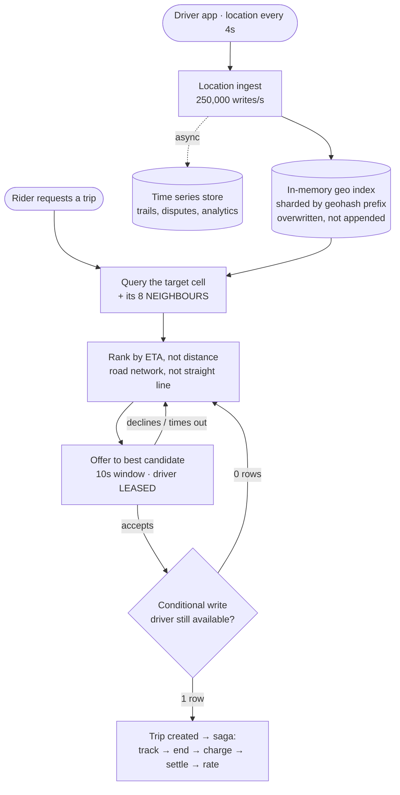

## The model

Riders request trips, drivers accept them, and the system matches them. Say a million active
drivers, streaming location every four seconds, with matches expected in a few seconds.

Two things are new here. **Geography** becomes the query dimension — "which drivers are near
this point" is not something an ordinary index answers, so it needs a **geospatial index**. And
matching is two-sided with a hard exclusivity constraint: one driver, one trip, and a
double-booking is a person standing on a corner.

## When to use it

You have the prompt and are choosing which half is being asked for.

1. **Matching or tracking?** Finding a driver is a search-and-assign problem. Following the trip
   afterwards is a streaming and mapping problem. They share location data and little else.
2. **How fresh must driver locations be?** Four-second updates from a million drivers is 250,000
   writes a second of data that is stale almost immediately — which is what makes this
   write-heavy in an unusual way.
3. **Is pricing in scope?** **Surge pricing** is a separate system computing supply-demand
   ratios per area, and it is a different problem from matching.

## Speedrun

**What** — drivers stream location into a geospatial index; a rider request queries that index
for nearby candidates, ranks them, and offers the trip to one at a time until someone accepts.

**How to design it**

1. **Size it.** 1M drivers ÷ 4s ≈ 250,000 location writes/s. Rider requests are far fewer —
   perhaps 5,000/s — so the write path and the read path are wildly asymmetric.
2. **Index locations by [[geohash]] cell** rather than by coordinates. A proximity query becomes
   a lookup of a few cells rather than a distance computation over a million rows.
3. **Keep current locations in memory.** They are overwritten every four seconds and never read
   historically on the hot path, so durability is not what this data needs.
4. **Offer to one driver at a time**, with a short acceptance window. Broadcasting to ten
   drivers means nine wasted notifications and a race.
5. **Hold the driver with a lease** while an offer is outstanding, so no other match can claim
   them, and release it if they do not respond.
6. **Write the trip to a durable store** the moment it is accepted — from there it is an
   ordinary [[saga]] with payment and rating steps.

**Why it works** — the geohash turns an expensive geometric query into a key lookup, and the
lease turns a two-sided race into one atomic claim. Everything else is ordinary streaming and
queueing.

**The asymmetry to notice** — location updates outnumber ride requests fifty to one, and they
are disposable. Treating them as ordinary durable writes is what makes naive designs collapse.

## Going deeper

### Indexing geography

"Find drivers within 2 km" is not a query a B-tree answers, because proximity is
two-dimensional and an index is one-dimensional. Three approaches map it down.

**Geohash** interleaves latitude and longitude bits into a string, so nearby points usually
share a prefix. `dr5ru` is a cell of a few hundred metres, and a proximity query becomes "give
me everyone in these cells" — a prefix lookup, which every store already does well.

The catch worth knowing: nearby points do **not** always share a prefix. Two locations either
side of a cell boundary can differ from the first character, so a correct query checks the
target cell **and its eight neighbours**. Forgetting that produces a system that mysteriously
misses the closest driver.

**Quadtrees** subdivide space adaptively, so dense cities get fine cells and empty areas get
coarse ones. Better distribution, more machinery, and they must be rebalanced as density
changes.

**S2 cells** — Google's scheme — project the sphere onto a cube and use a space-filling curve,
which handles polar distortion that geohash does not.

Geohash is the right answer to give, with the boundary caveat, because it is simple and every
key-value store supports prefix scans. And the [[hot partition]] problem appears immediately:
a cell covering a city centre holds vastly more drivers than one covering farmland, so cells
need to be split by density rather than by area.

### The location write path

A million drivers reporting every four seconds is 250,000 writes a second, which would be a
serious database problem — except this data has properties that let you avoid the database
entirely.

It is **overwritten** every four seconds, so history is not needed on the hot path. It is
**disposable**, since losing a driver's position for one cycle is invisible. And it is only
ever read by proximity, never by id over time.

So current locations live in memory — Redis, or an in-process index sharded by geohash prefix —
and the durable trail is written asynchronously to a [[time series]] store for analytics,
disputes and mapping. Two paths for the same data, sized for their different requirements.

That split is the answer to the volume, and it is the thing a naive design gets wrong by
treating a position update like an order.

### Matching, and the exclusivity problem

A rider requests; the system finds candidates in the surrounding cells and ranks them by
estimated arrival time rather than raw distance, because a driver 500 m away across a river is
worse than one 2 km away on the same road.

Then the exclusivity question. Two riders requesting simultaneously can both see the same
nearest driver, and only one may have them.

Broadcasting to many drivers is the wrong answer despite being the obvious one: it produces a
race where several accept, and everyone who loses has been interrupted for nothing. Sequential
offers are better — offer to the best candidate, wait ten seconds, move on — and the driver is
held under a **lease** for that window so no concurrent match can take them.

The lease has the same limits as everywhere else in this section. It must expire, or an
unresponsive driver is locked forever; and expiry while the driver is merely slow means two
matches can believe they hold them. The resolution is the same: the trip record is created by
a conditional write, so the database decides, and the loser is offered the next candidate.

This is a genuine [[Type 1 decision]] in the design, worth naming as one. Matching policy is
easy to change; the exclusivity mechanism is load-bearing and hard to retrofit once trips
exist.

### The trip, and what follows

Once accepted, the trip becomes an ordinary distributed workflow — and the [[saga]] page
already covers its shape. Reserve the driver, start the trip, stream locations to the rider,
end it, charge the card, settle the driver's earnings, collect ratings.

The pivot is the charge. Before it, a failure can unwind cleanly; after it, forward recovery is
the only humane option, because refunding a completed ride to fix a rating-service outage is
absurd.

Live tracking is a separate concern with its own shape: the driver's position streams to the
rider over a persistent connection, which is the [[connection registry]] problem from the chat
design. The rider needs one driver's updates, so the routing is simpler, but the mechanism is
the same.

**Surge pricing** deserves one sentence rather than a section: it is a streaming job computing
demand over supply per cell per minute, published to the matching and quoting services. It is
separable from matching, and treating it as part of matching is a common way to overcomplicate
an answer.

## See it work

A million drivers, 5,000 ride requests a second at peak.

The two location paths are the decision that makes the volume tractable. Current positions live
in memory because they are overwritten every four seconds and only ever read by proximity;
the durable trail is written asynchronously for analytics and disputes. Treating 250,000
position updates a second as ordinary durable writes is what sinks the naive design.

Querying the eight neighbouring cells is the detail that is easy to omit and produces a subtle
bug — a driver just across a cell boundary is geographically nearest and lexically distant, so
a query on one cell silently misses them.

Ranking by ETA rather than straight-line distance is the difference between a plausible answer
and a useful one. A driver 500 m away across a river with no bridge is worse than one 2 km away
on the same road, and only the road network knows that.

The sequential offer with a lease is what solves exclusivity without a broadcast race. One
driver is asked, held for ten seconds, and released if they decline — so nobody is interrupted
for a ride they will not get, and two simultaneous riders cannot both be promised the same car.

The conditional write is the backstop. Even with the lease, the trip is created only if the
driver is still available at that instant, so the database decides the race rather than the
application hoping the lease held.

## Next

File storage is the last of these designs, and it is where the photos, documents and video the
others reference actually live.
