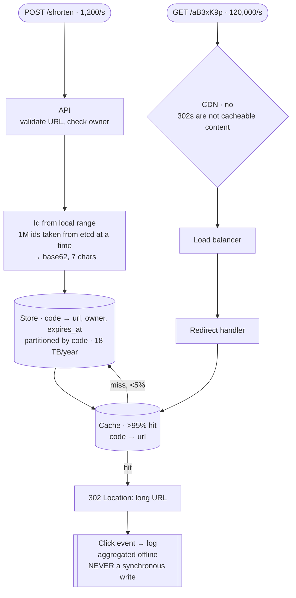

## The model

Take a long URL, return a short one, and redirect anyone who visits it. Roughly 100 million
new links a day and 10 billion redirects — a 100:1 [[read-to-write ratio]].

Almost everything about the design follows from two facts. Reads dominate overwhelmingly, so
work belongs on the write path and the read path should be a single lookup. And the id
generation scheme is the only genuinely interesting decision, because it determines
uniqueness, length, guessability and whether you need coordination.

## When to use it

You have been given this prompt and must decide what you are actually building.

1. **Are custom aliases required?** `/my-campaign` changes everything — it forces a
   uniqueness check on write, which a pure counter scheme avoids entirely.
2. **Must links expire, and can they be deleted?** Expiry makes storage bounded and adds a
   TTL to every layer. Permanent links make storage grow forever.
3. **Is analytics in scope?** "How many clicks" turns a read-only redirect path into a write
   on every read, which is a different system. Cut it or make it asynchronous, and say which.

## Speedrun

**What** — a key-value store from short code to long URL, fronted by a cache, with a redirect
handler that does one lookup.

**How to design it**

1. **Size it.** 100M writes/day ÷ 100,000 s ≈ 1,200 writes/s; 10B reads/day ≈ 120,000
   reads/s, ×2 peak. At 500 bytes a row, 100M/day is 50 GB/day, about 18 TB/year.
2. **Choose the id scheme.** A **counter-based id** encoded in **base62** gives short,
   unique, coordination-light codes. 62⁷ is 3.5 trillion, so seven characters is plenty.
3. **Store it** as `code → long_url, owner, created_at, expires_at`, keyed by code. This is a
   [[key-value store]] access pattern even in a relational database.
4. **Cache aggressively.** At 100:1 reads, a [[cache]] in front of the store handles almost
   everything, and popular links make hit rates very high.
5. **Redirect with 302, not 301.** A 301 is cached by browsers forever, which destroys your
   analytics and removes your ability to change or revoke the link.
6. **Make analytics asynchronous.** Emit a click event to an [[event log]]; never write to
   a database on the redirect path.

**Why it works** — the read path is one cache lookup and an HTTP redirect. Everything
expensive — id allocation, validation, uniqueness — happens once per write, and writes are a
hundredth of the traffic.

**The decision being graded** — how you generate ids. Everything else in this problem is
standard, and this is where an interviewer finds out whether you can reason about
coordination.

## Going deeper

### Id generation, which is the whole problem

Four schemes, and the tradeoffs are the content of the interview.

**Counter-based.** A global counter, base62-encoded. Shortest possible codes, guaranteed
unique, no collision checking. The problem is the counter itself — a single one is a
bottleneck and a single point of failure.

The fix is range allocation: each server takes a block of a million ids from a coordination
service, then hands them out locally with no further coordination. One round trip per million
writes rather than per write, and gaps in the sequence when a server dies, which nobody
cares about.

**Hash-based ids.** Hash the long URL and take the first 7 characters. Deterministic — the same URL
always gives the same code, which deduplicates for free. The costs are collisions, which must
be detected and resolved with a probe or a salt, and the fact that determinism is sometimes
wrong: two users shortening the same URL may want separate analytics.

**Random.** Generate 7 random base62 characters and check for a collision. Simple and
unguessable, which matters if links are private, and the collision probability rises as the
space fills — birthday-bound, so it degrades sooner than intuition suggests.

**Snowflake-style.** Timestamp plus machine id plus sequence. No coordination at all and
time-sortable, which makes it excellent as a database key. The codes are longer, which
undermines the product's whole point.

The considered answer is usually counter-based with range allocation, plus a note: if links
must be unguessable, either randomise within the range or use random ids and accept the
collision checks. Sequential codes are enumerable, and someone will enumerate them.

### Base62, and why the length is what it is

**Base62** uses `[0-9a-zA-Z]` — the characters that survive a URL without encoding.

The arithmetic decides the length. 62⁶ is 57 billion; 62⁷ is 3.5 trillion. At 100 million
links a day, six characters lasts under two years and seven lasts a century. Seven is the
answer, and being able to derive it rather than assert it is the point.

Two practical notes worth raising. Ambiguous characters — `0`/`O`, `1`/`l` — cause real
support problems for anything read aloud or typed, and base58 exists precisely to drop them.
And a short code space should skip anything that spells something unfortunate, which sounds
like a joke and is a real filter list in every production system.

### The read path, and why it is boring on purpose

At 120,000 redirects a second, the read path must be as close to nothing as possible.

A request arrives, the code is looked up in the cache, and a 302 is returned. That is the
entire critical path. The database is touched only on a cache miss, and with a
[[hit rate]] above 95% — which link popularity makes easy, since a small fraction of links
get most of the traffic — the database sees a few thousand reads a second.

The [[hot key]] behaviour here is favourable rather than dangerous. One viral link is the
ideal cache entry: one key, enormous hit rate, and the local cache tier absorbs it entirely.

Redirect status codes are worth being precise about, because it is a common trap. A `301
Moved Permanently` is cached by the browser indefinitely, so subsequent visits never reach
you — no analytics, no revocation, no expiry. A `302 Found` returns to you every time. The
right answer is 302, and knowing why is a small, cheap signal.

### Storage, expiry and the analytics path

At 18 TB a year of small rows, storage is the least interesting constraint here. A single
[[relational database]] handles this for years, and [[partitioning]] by code is trivial when
it does not, because every access names the code.

Expiry is what keeps it bounded. If links expire after a year, a [[lifecycle policy]] or a
partition drop removes them in bulk rather than by row-by-row deletion, and the storage
reaches a steady state.

**Click analytics** is the part that quietly ruins the design if handled naively. Writing a
row per click turns 120,000 reads a second into 120,000 writes a second, and the system is
now write-heavy — the opposite of what everything else was built for.

The answer is to emit a click event to a log and aggregate offline. The redirect path stays
read-only, the analytics pipeline is a separate consumer with its own scaling, and counts are
minutes stale rather than instant. Volunteering that trade is worth more than the counts.

## See it work

The complete design, with the numbers attached.

The write path does all the work. Validate the URL, take an id from the block this server
already holds, encode it, store the row. One coordination round trip per million writes,
which at 1,200 writes a second is one every fourteen minutes.

The read path is one cache lookup and a redirect. At a 95% hit rate the database sees roughly
6,000 reads a second, which one machine with a replica handles comfortably — so the entire
system is a cache, a key-value store and a stateless handler.

Analytics is the trap and it is handled by not doing it inline. The redirect emits an event
and returns; a separate consumer aggregates clicks into rollups. If that consumer breaks,
redirects keep working and counts catch up, which is exactly the [[temporal decoupling]]
argument.

Two things worth volunteering at the end. Sequential base62 codes are enumerable, so anyone
can walk the space and discover every link — if privacy matters, the ids must be randomised
within the allocated range. And a 301 would halve infrastructure cost by letting browsers
cache the redirect, at the price of never being able to revoke or measure a link again, which
is a product decision rather than an engineering one.

## Next

The news feed is the same read-heavy shape with the fan-out problem added, and the metrics
pipeline is what this system's analytics path becomes when it is the product.
