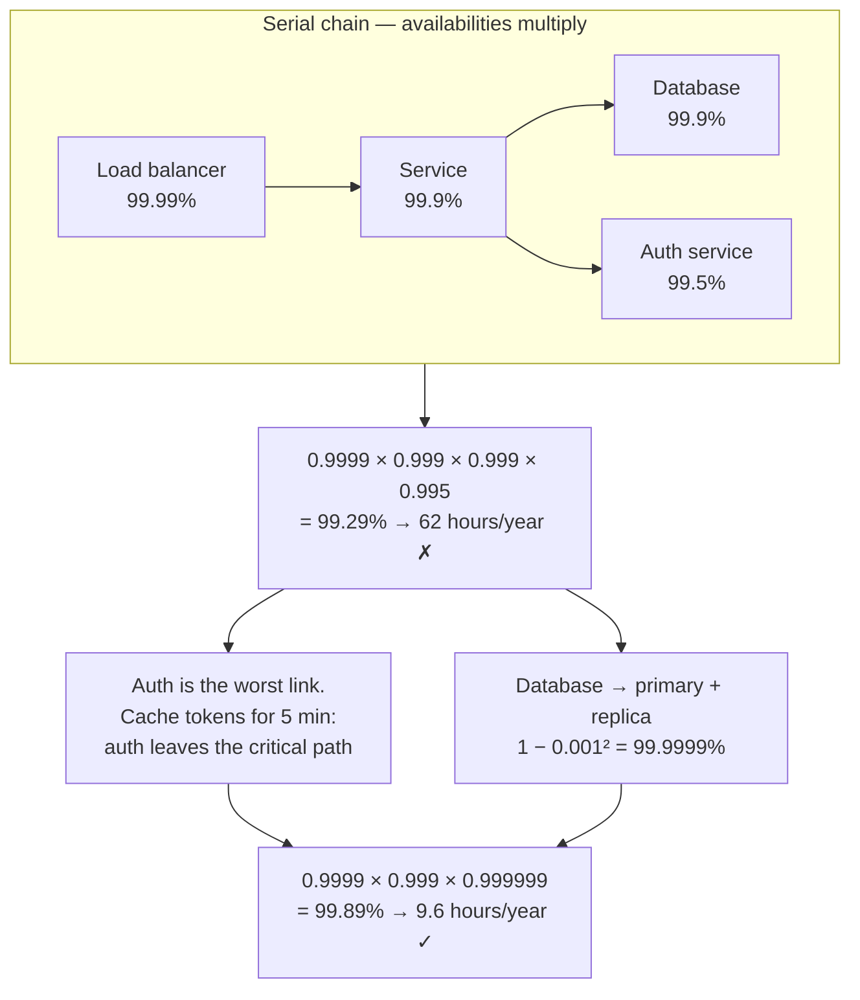

## The model

**Availability** is the fraction of time a system is able to serve requests, written as a
percentage and usually spoken as **nines**: "three nines" is 99.9%.

Two rules govern how it composes. Components the request depends on in series multiply
their availabilities together, so every dependency you add makes the whole worse. Redundant
copies multiply their *failure* probabilities together, so every spare you add makes it
better, fast. Almost every availability design is an argument about which of those two you
are doing.

## When to use it

You have an uptime target and a design with more than one component, and you need to know
whether the target is reachable and where the risk actually sits.

1. **How many things must all work for one request to succeed?** Multiply their
   availabilities. If the answer is below your target, no single component is the problem —
   the chain length is.
2. **Is this component redundant or merely duplicated?** Two instances behind a load
   balancer help. Two instances that share a database, a config push or an availability
   zone fail together, and the arithmetic that promised four nines does not apply.
3. **Would you rather fail less often or recover faster?** These cost very different
   amounts, and for most systems the second is cheaper per nine gained.

## Speedrun

**What** — availability composes by multiplication, in two opposite directions. Serial
dependencies multiply availability: $A_{\text{total}} = A_1 \times A_2 \times \dots$
Redundant replicas multiply unavailability: $A_{\text{total}} = 1 - (1 - A)^n$.

**The table to memorise**

| Nines | Availability | Downtime per year | Per month |
|---|---|---|---|
| Two | 99% | 3.65 days | 7.2 hours |
| Three | 99.9% | 8.8 hours | 43 minutes |
| Four | 99.99% | 53 minutes | 4.3 minutes |
| Five | 99.999% | 5.3 minutes | 26 seconds |

**How to check an availability target**

1. **Draw the serial chain** — everything that must work for one request to succeed.
   Load balancer, service, database, and every dependency each of those calls.
2. **Multiply their availabilities.** Five components at 99.9% each give 99.5%, which is
   43 hours a year. The chain is almost always worse than its worst link.
3. **If it misses the target, shorten the chain or make a link redundant.** Those are the
   only two moves. Two redundant 99% instances give 99.99%, which is why redundancy is the
   strongest lever available.
4. **Then ask what fails together.** Shared zone, shared deploy, shared config, shared
   dependency. Every shared thing collapses your redundancy back toward a single copy.
5. **Convert the target into minutes and say it aloud.** "99.9% means we can be down 43
   minutes a month" is a sentence people can reason about; a percentage is not.
6. **Check the recovery half.** Availability is $\text{MTBF}/(\text{MTBF} + \text{MTTR})$,
   so halving your recovery time buys the same nines as doubling your time between failures
   — usually far more cheaply.

**Why it works** — availability is a probability, and probabilities of independent events
multiply. That single fact produces both rules, and it also produces the standard mistake:
the independence is assumed, not given, and it is usually false.

**The number that surprises people** — a service with ten serial dependencies at 99.9% each
cannot exceed 99% overall, no matter how good the service itself is.

## Going deeper

### Why serial chains decay so fast

Each dependency is a chance to fail, and the chances accumulate. If a request needs five
services and each is up 99.9% of the time, the request succeeds when all five are up:

$$
A = 0.999^5 = 0.9950
$$

That is 99.5%, or nearly 44 hours of downtime a year, built entirely out of components that
individually looked excellent. Nobody's service was at fault. The architecture was.

This is the strongest argument in system design for keeping the critical path short. Every
service you add to a request is a multiplication by something less than one. It is also the
argument for graceful degradation: a dependency you can serve without — recommendations,
personalisation, a decorated badge — should be a timeout and a default rather than a
failure, which removes it from the multiplication entirely.

That move is worth naming precisely, because it is how real systems hit high availability
without heroic components. You do not make the recommendation service more reliable. You
make the page render without it.

### Why redundancy works so well

Redundant copies fail independently, so the system is down only when *all* of them are
down. That is unavailability raised to a power:

$$
A = 1 - (1 - A_{\text{one}})^{n}
$$

A single instance at 99% is down 3.65 days a year. Two of them, either of which can serve
the request, give $1 - 0.01^2 = 99.99\%$ — 53 minutes a year. Three give five nines.

The asymmetry is the whole point. Adding a second copy of a mediocre component buys more
availability than any realistic amount of work on the component itself. This is why the
answer to "how do we make this more reliable" is so often "run two" rather than "fix it,"
and why stateless services are prized: they are the ones you can trivially run two of.

### Correlated failure, where the arithmetic lies

Both formulas assume failures are independent. **Correlated failure** is when they are not,
and it is the reason real systems miss the availability their diagrams promised.

Three replicas in one availability zone are not three independent chances of survival. They
are one power supply, one network, one zone-wide event. The formula says five nines; the
zone outage says zero.

The usual sources are worth memorising, because they recur:

**Shared infrastructure.** Same rack, same zone, same region, same provider. Redundancy only
counts across the boundary that actually fails.

**Shared deploy.** A bad release rolls out to every replica. Identical copies of identical
software fail identically, which is what canaries and staged rollouts exist to break.

**Shared configuration.** A bad config push reaches every instance in seconds, and config
changes are usually not treated with the ceremony of code changes. Several of the largest
public outages on record are this.

**Shared dependency.** Both replicas call the same database, the same auth service, the same
DNS. The redundancy was in the wrong layer.

**Load-induced cascade.** One replica fails, its traffic moves to the others, they exceed
their capacity and fail too. This one is worse than independent — the first failure *causes*
the next, so redundancy makes the system less stable rather than more.

The practical version: when you claim redundancy, name the failure it is redundant *against*.
"Two instances in different zones" survives a zone loss. It does not survive a bad deploy.
Both statements are true, and only the second one is usually left unsaid.

### MTBF, MTTR, and which one to buy

Availability can also be written from the operational side:

$$
A = \frac{\text{MTBF}}{\text{MTBF} + \text{MTTR}}
$$

**MTBF** is mean time between failures — how often it breaks. **MTTR** is mean time to
recovery — how long it stays broken.

Take a service that fails once a month and takes an hour to recover. That is $720/(720+1)$,
about 99.86%.

There are two ways to reach roughly 99.93% from there: make it fail half as often, or
recover twice as fast.

Halving the failure rate means finding and fixing the underlying causes, which is open-ended
work of unknown duration. Halving recovery time means better alerting, a faster rollback, a
runbook, an automated failover — all bounded, buildable, and useful against failures you
have not seen yet.

This is why mature operational practice invests so heavily in the recovery half. You cannot
enumerate every way a system will break, but you can make every breakage shorter. It is also
why "how long to roll back" is one of the highest-signal questions you can ask about any
deployment process.

### Turning the number into a commitment

An availability target is only useful once someone has agreed what it buys and what happens
when it is missed. That is what an [[SLO]] is: the target you have committed to, measured
by an [[SLI]] you have defined.

The gap between the target and 100% is the [[error budget]], and it is the part that changes
behaviour. A 99.9% monthly target is 43 minutes of allowed downtime a month.

Spend it early and the budget says ship less and harden more; reach the last week with it
untouched and the budget says you have been too cautious — which is a thing a conversation
about "quality" never quite manages to say.

That framing also stops the reflex to promise more nines than anyone needs. Each additional
nine costs roughly an order of magnitude more, and the honest question is what the extra
one is worth to the person paying for it. For an internal analytics dashboard the answer is
usually nothing at all.

## See it work

An API needs 99.9% availability. The request path is a load balancer, the service, a
database, and an auth call.

Multiplied out, the chain gives 99.29% — about 62 hours of downtime a year against a target
that allows 8.8. The design misses by a factor of seven, and no component in it is
individually bad.

The arithmetic names the culprit immediately. Auth at 99.5% contributes more downtime than
the other three combined, so it is the only link worth attacking first. The fix is not to
make auth more reliable, which is someone else's roadmap; it is to cache validated tokens
for five minutes, so a brief auth outage stops blocking requests at all. That removes the
term from the multiplication rather than improving it.

The database gets the other treatment. A primary with a replica and automatic failover turns
99.9% into six nines on paper, because both must fail for the request to fail. On paper is
the right caveat — if both sit in one availability zone, the real number is much closer to
99.9%, and the honest version of this design says which zone each one is in.

Together the two changes land at 99.89%, roughly 9.6 hours a year, which meets the target
with very little room. That last observation is the one worth volunteering: the design meets
the number, and it does so with no margin, so the next dependency anyone adds to this path
breaks the commitment.

## Next

Latency and throughput budgets is the same exercise for the speed promise rather than the
uptime promise, and the error budgets razor covers what an organisation actually does with
the gap between the target and 100%.
