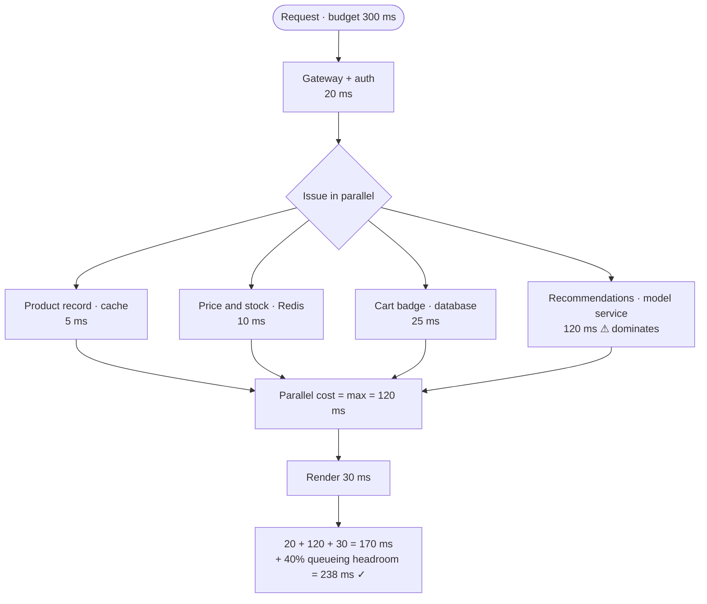

## The model

**Latency** is how long one request takes. **Throughput** is how many requests finish per
second. They are different quantities, and a system can be excellent at one while failing
the other.

A latency target behaves like money. If the promise is 200 ms at the 99th
percentile, every hop on the request path spends part of that 200 ms, and the parts
add up. Writing down what each component may spend turns "make it fast" into a set of
constraints you can check a design against.

## When to use it

You have a latency number from the requirements and a design with several components, and
you need to know whether the design can meet the number at all.

1. **Is this component on the critical path?** If the user waits for it, it spends budget.
   If it happens after the response, it spends none. Moving work across that line is the
   cheapest latency fix available.
2. **Do these calls run in series or in parallel?** Series adds; parallel takes the
   maximum. Two 50 ms calls are either 100 ms or 50 ms, and which one is a design choice.
3. **How loaded will this run?** Below about 70% utilisation queueing is a rounding
   error. Above 90% it dominates everything else, and no amount of per-component tuning
   will save you.

## Speedrun

**What** — a **latency budget** allocates a total latency target across the components of a
request path. Serial calls add their budgets; parallel calls consume the largest one. Any
component with no allowance is either off the critical path or the design does not fit.

**Why averages are useless here** — an average hides the requests that hurt. A **percentile**
is the value below which that fraction of requests fall: a p99 of 200 ms means 99% of
requests finish inside 200 ms and 1% do not. At a million requests a day, that 1% is ten
thousand people, and they are disproportionately your heaviest users.

**How to build a budget**

1. **Write the target as a percentile, not a mean.** "p99 under 200 ms" is a promise; "200
   ms average" is compatible with a tenth of users waiting two seconds.
2. **Draw the critical path only** — the hops that must finish before the user gets a
   response. Everything else goes in a queue and costs nothing here.
3. **Add up the serial hops and take the max of the parallel ones.** Do this before
   assigning any numbers; the shape of the path decides how much budget exists to spend.
4. **Assign each hop an allowance**, starting from the [[back-of-envelope]] figures: a
   same-datacentre round trip is 0.5 ms, an SSD read 0.1 ms, a cross-region call 150 ms.
5. **Reserve 30–40% for queueing and variance.** A budget spent entirely on the happy path
   is a budget that fails under load, and it fails at exactly the moment it matters.
6. **Check the total against the target.** If it does not fit, the fix is structural —
   parallelise, cache, precompute, or move work off the path. Shaving milliseconds off a
   component rarely closes a gap that arithmetic already says is too wide.

**Why it works** — latency composes predictably along a path, so a target can be divided
before anything is built. The alternative is building first and measuring after, which
finds the same answer several weeks later. A budget also names the component that cannot
possibly fit, which is usually the design's real problem.

**The trap** — sizing for average load. The queue is empty at average load and full at
peak, and latency at a full queue is nothing like latency at an empty one.

## Going deeper

### Latency and throughput are not the same axis

A conveyor belt carrying one parcel a second has a throughput of one per second regardless
of whether the belt is ten metres or ten kilometres long. Lengthen it and latency rises;
throughput does not move.

Systems behave the same way, which is why the two get optimised by opposite moves. Batching
raises throughput and raises latency, because a request waits for the batch to fill. Adding
a replica raises throughput and leaves latency alone. A cache lowers latency and raises throughput
at once, which is why everyone reaches for it first.

The relationship between them is [[Little's Law]]: the number of requests in flight equals
arrival rate times the time each one spends inside. That gives you the third quantity for
free. If you need 1,000 requests per second and each takes 200 ms, you have 200 requests in
flight at all times, so you need at least 200 units of **concurrency** — threads,
connections, workers — or the queue grows without bound.

$$
L = \lambda W = 1000/\text{s} \times 0.2\,\text{s} = 200
$$

That number is a design output, not a tuning knob. A connection pool of 50 against this
workload is not conservative; it is a decision to fail.

### Why the tail is the number that matters

The average is the number people quote and the tail is the number people experience.

Consider a service where 99% of requests take 10 ms and 1% take 1,000 ms. The average is
about 20 ms, which sounds excellent. But if a single page makes 100 such calls, the chance
that all of them avoid the slow path is $0.99^{100}$, roughly 37%. Nearly two thirds of
page loads hit at least one 1,000 ms call.

That is [[the tail at scale]], and it is why percentiles rather than means belong in every
requirement you write. It also explains a rule that looks paranoid until you have seen it:
the more calls a request fans out to, the higher the percentile you must care about. Fan
out to 100 services and your p99 becomes the typical user's experience.

Percentiles also do not add. The p99 of a path is not the sum of each component's p99,
because the slow requests at each hop are not the same requests. Summing p99s gives a
pessimistic bound, which is fine for budgeting and wrong if you quote it as a prediction.

### Queueing, and why 90% utilisation is not 90% fine

**Utilisation** is the fraction of time a resource is busy. **Queueing delay** is time spent
waiting for it rather than being served by it. The relationship between them is the least
intuitive thing in performance work, and the most important.

For a simple queue, average wait time relates to utilisation $\rho$ like this:

$$
W_{\text{queue}} = \frac{\rho}{1 - \rho} \times W_{\text{service}}
$$

Put numbers through it:

| Utilisation | Queue wait, in units of service time |
|---|---|
| 50% | 1× |
| 70% | 2.3× |
| 80% | 4× |
| 90% | 9× |
| 95% | 19× |
| 99% | 99× |

A service that takes 10 ms of actual work responds in 20 ms at half load and 100 ms at 90%
load. Nothing about the service changed. The work is identical; the waiting is not.

Two consequences fall out. **Run below 70% if latency matters** — the extra headroom is not
waste, it is what you are buying latency with. And **the last 10% of capacity is the most
expensive**, because going from 90% to 99% utilisation costs you a tenfold latency increase
for an 11% capacity gain.

This is also why load and latency graphs look like a hockey stick rather than a slope, and
why a system can appear healthy right up until it very suddenly is not. The curve is
$\rho/(1-\rho)$; it does not warn you.

### Serial and parallel, the biggest lever on the path

Given a fixed set of calls, how you compose them changes the total more than optimising any
one of them.

Three sequential 50 ms calls cost 150 ms. The same three issued concurrently cost 50 ms plus
a little overhead. That is a 3× improvement bought without touching a single service, and it
is available whenever the calls do not depend on each other's results.

The catch is that parallelism makes your latency the slowest of the group, so it inherits
the worst tail rather than an average one. Three calls each with a p99 of 50 ms give a
combined p99 noticeably worse than 50 ms, because you now lose whenever *any* of them is
slow.

Parallelism buys latency at the cost of tail sensitivity, and past a certain fan-out that
trade stops paying — which is the whole content of [[the tail at scale]].

### Where budget actually comes from

Most latency problems are solved by removing work from the path, not by speeding work up.
Four moves, in rough order of leverage:

**Move it off the critical path.** Fan-out, analytics, notifications, indexing, audit logs.
If the user does not need it to see a response, it should not be spending their budget.
This is the only move that removes latency rather than reducing it.

**Precompute it.** Do the work at write time so the read is a lookup. A timeline assembled
on write costs the reader one fetch; assembled on read it costs a fan-out per view. This
trades write cost and staleness for read latency, which is a good trade whenever reads
outnumber writes — and they usually do by two orders of magnitude.

**Cache it.** The same trade with less control and less consistency. Cheap to add, which is
both its appeal and its risk.

**Parallelise it.** Free when the calls are independent, and it costs nothing but code.

Only after those four is it worth making a component faster. The arithmetic tends to agree:
a 20% improvement to a 30 ms hop saves 6 ms, while moving that hop off the path saves 30.

## See it work

A product page must render at p99 under 300 ms. It needs the product record, price and
stock, the recommendation strip, and the user's cart badge.

Issued in series these four calls cost 5 + 10 + 120 + 25 = 160 ms, and with the gateway and
render that is 210 ms before any allowance for queueing. Adding 40% headroom pushes it to
294 ms — inside the target on paper, with nothing left for a bad afternoon.

Issued in parallel the four calls cost the maximum rather than the sum: 120 ms. Total
becomes 170 ms, and the same 40% headroom lands at 238 ms. The design now has room, and the
change was composition rather than optimisation.

The budget also names the problem. Recommendations at 120 ms consume more than the other
three combined, so it is the only component worth attention — and the useful question is
not "can it be faster" but "does the user need it before the page renders." If the strip can
load a moment later, it leaves the critical path entirely and the budget drops to 75 ms,
which is a different class of design.

That is the habit worth taking: the budget does not just tell you whether the design fits.
It tells you which single component to argue about.

## Next

Availability math does for the uptime promise what this page does for the latency promise,
and the tail at scale explains why fanning out to many services makes the rare slow case
into the normal one.
