## The model

**Back-of-envelope** estimation is arithmetic done in your head, in public, to decide
between designs. It answers questions like "does this fit in memory" and "is one machine
enough" — questions whose answers change the architecture.

It works because the answers only need to be right to within a factor of ten. Whether a
dataset is 8 TB or 20 TB rarely changes anything; whether it is 20 GB or 20 TB changes
everything. So the skill is not calculation. It is knowing a dozen quantities well enough
to reach for them without pausing, and rounding aggressively enough to finish.

## When to use it

You are choosing between two designs and the choice depends on a size you do not have
measured — which is most of the time in an interview and much of the time in real work.

1. **Does this fit in memory on one machine?** Under ~100 GB, one large instance is a
   legitimate answer and you should say so before proposing a cluster. Over a few TB, the
   distribution question is forced.
2. **Is one database enough?** Under a few thousand writes per second, usually yes. Above
   that, you need a sharding story, so do the QPS arithmetic before you claim either.
3. **Is the cost obviously prohibitive?** A number that comes out at petabytes per day
   means you have the requirement wrong, not that you need a bigger cluster. Recheck the
   input before designing for it.

## Speedrun

**What** — a small set of memorised quantities plus aggressive rounding, used to size a
system to the nearest **order of magnitude**: the nearest power of ten. Getting within
10× is enough to decide almost every architectural question, and it is the only accuracy
anyone expects of you at a whiteboard.

**The rounding that makes it work** — a day is 86,400 seconds; call it 100,000. Then one
million per day is about 12 per second, and one billion per day is about 12,000 per
second. Those two conversions cover most prompts you will be handed.

**How to size a system**

1. **Convert per-day to per-second.** Divide the daily count by 100,000. That figure is
   your **QPS** — queries per second, the unit almost every capacity claim is made in.
   Say it out loud so an error gets caught early.
2. **Multiply by the peak factor.** Real traffic is not flat. Use 2× for a global,
   always-on service and up to 10× for anything clustered around business hours or
   scheduled events. Design for the peak, not the average.
3. **Multiply the count by the size of one item** to get bytes per day. Keep the units
   visible in the arithmetic — most errors are unit errors, not multiplication errors.
4. **Multiply by the retention window** to get total storage. A year is roughly 400 days
   if you are rounding, which errs in the safe direction.
5. **Compare against the one-machine thresholds** — about 100 GB of RAM, a few TB of
   local SSD, a few thousand writes per second — and state which side you landed on.
6. **Say the conclusion, not the arithmetic.** "About 4 TB a year, so a single Postgres
   with a read replica is fine for two years" is the sentence that mattered.

**Why it works** — the numbers span such a wide range that being sloppy inside an order of
magnitude cannot flip a decision, while being wrong by an order of magnitude flips almost
every one. Rounding 86,400 to 100,000 introduces 16% of error into an answer whose useful
resolution is 1000%. The rounding is not a shortcut you are getting away with — it is the
correct precision for the question.

**The one habit that separates people** — writing the units next to every number. `50M
notifications/day × 200 bytes/notification = 10 GB/day` is checkable at a glance. The same
arithmetic with bare numbers is not, and unit errors are the ones that survive.

## Going deeper

### The latency numbers, and what they are for

These are the canonical figures, popularised by Jeff Dean and Peter Norvig. Treat them as
ratios rather than measurements — the absolute values drift with hardware, the relationships
do not.

| Operation | Time | In human terms |
|---|---|---|
| L1 cache reference | 1 ns | 1 second |
| Main memory reference | 100 ns | 2 minutes |
| Read 1 MB sequentially from memory | 10 µs | 3 hours |
| SSD random read | 100 µs | 1 day |
| Read 1 MB from SSD | 1 ms | 12 days |
| Round trip in the same datacentre | 500 µs | 6 days |
| Disk seek (spinning) | 10 ms | 4 months |
| Read 1 MB from spinning disk | 20 ms | 8 months |
| Round trip California to Netherlands | 150 ms | 5 years |

The right-hand column is the point of the table. If an L1 reference took one second, a
cross-continent round trip would take five years. That ratio is why a single cross-region
call can dominate a request budget that hundreds of memory accesses barely dent, and why
"just add a cache" and "just add a region" are not comparable moves.

Three consequences worth carrying:

**Memory is roughly a thousand times faster than SSD, which is roughly twenty times faster
than spinning disk.** Any design that turns a disk read into a memory read is buying about
three orders of magnitude.

**A network round trip inside a datacentre costs about as much as five thousand memory
references.** This is the real argument against chatty service-to-service calls: it is not
that each one is slow, it is that they serialise.

**Cross-region is a different regime entirely.** 150 ms is not a slow version of 500 µs; it
is three hundred times worse, and it is bounded by the speed of light rather than by
engineering. No amount of optimisation removes it. Only not making the call does.

### Sizes worth memorising

| Thing | Size |
|---|---|
| ASCII character | 1 byte |
| Integer | 4 bytes |
| Timestamp / long | 8 bytes |
| UUID | 16 bytes binary, 36 as a string |
| Typical database row | 100 bytes – 1 KB |
| A tweet-sized post with metadata | ~300 bytes |
| Thumbnail image | 10–50 KB |
| Full-size photo | 1–5 MB |
| A minute of 1080p video | ~50 MB |

And the powers of two, which are how storage is actually counted:

| Power | Name | Approximate |
|---|---|---|
| 2^10 | kilobyte | 1 thousand |
| 2^20 | megabyte | 1 million |
| 2^30 | gigabyte | 1 billion |
| 2^40 | terabyte | 1 trillion |
| 2^50 | petabyte | 1 quadrillion |

The UUID row earns its place more often than it looks. Storing IDs as 36-character strings
rather than 16 bytes more than doubles the size of your index, and index size is what
decides whether lookups stay in memory.

### Peak-to-average, the multiplier people forget

The **peak-to-average ratio** is how much busier your busiest moment is than your mean.
Capacity that satisfies the average fails at the peak, so the average is the wrong number
to design against — and it is the number the daily-total arithmetic naturally produces.

A global consumer service with users in every timezone might peak at 2× its average. A
service used during one country's working hours peaks around 3–5×, because the day's
traffic is compressed into a third of the clock. Anything driven by a schedule or an event
— notifications sent on the hour, a ticket sale, a sports final — can peak at 10× or worse,
and the peak arrives all at once rather than ramping.

That last case is worth recognising by name, because it changes the design rather than the
sizing. A system whose load arrives in scheduled spikes wants a queue between the spike and
the workers, so the peak becomes a backlog to drain instead of a wall of concurrent
requests. Sizing for the peak is the expensive answer; absorbing it is usually the better
one.

### Working set, and the question that actually matters

Total data size is the number everyone computes. The **working set** — the portion actually
accessed in a given window — is usually the number that decides the design.

A social product might hold 50 TB of posts and serve 95% of its reads from the last
fortnight, which could be 200 GB. That difference is the whole caching argument: you are
not trying to fit 50 TB in memory, you are trying to fit 200 GB, and that is an ordinary
machine rather than a research project.

So when you have computed a total, ask what fraction of it is hot. If the honest answer is
"most of it", you have a genuinely hard problem and should say so. If it is "a few percent",
you have a normal problem with a [[cache]] in front of it, and the 50 TB figure was never
the constraint.

### Where the estimate is allowed to be wrong

An estimate is a claim, and claims can be checked. Two checks catch most bad ones.

**Sanity against something known.** If your design produces more daily writes than
Twitter's public figures, or more storage than YouTube adds in a year, you have almost
certainly mis-multiplied. Recompute rather than proceeding — a wrong estimate propagates
into every decision downstream, and it is much cheaper to catch at the source.

**Sensitivity to the assumption.** Ask which input the answer depends on most. If halving
the retention window changes the storage tenfold, retention is the real design parameter,
and that is worth saying out loud: "this is entirely driven by how long we keep raw events,
so I would push to define that before building."

The second check is the one that reads as senior. It converts an estimate from a number
into an argument about which requirement is expensive.

## See it work

Size the notification service from the scoping page: 50 million notifications a day,
delivered within five seconds of their due time.

```mermaid
flowchart TD
  A["50M notifications/day"] --> B["÷ 100,000 s<br/>≈ 580/s average"]
  B --> C["× 10 peak factor<br/>scheduled sends cluster on the hour<br/>≈ 5,800/s peak"]
  A --> D["× 300 bytes each<br/>= 15 GB/day"]
  D --> E["× 400 days retention<br/>≈ 6 TB/year"]
  C --> F["5,800 writes/s > single-DB limit<br/>→ queue + partitioned store"]
  E --> G["6 TB > RAM, &lt; local SSD<br/>→ one machine could hold it,<br/>durability decides otherwise"]
```

Fifty million a day over 100,000 seconds is 580 per second on average. That number alone
suggests one database is plenty, and that is the trap: scheduled notifications cluster on
the hour, so a 10× peak factor is realistic, putting the real requirement near 5,800 per
second. One Postgres will not take that as sustained write throughput, which forces a queue
in front of the workers — implied by the arithmetic, not by taste.

Storage goes the other way. Three hundred bytes each is 15 GB a day, about 6 TB a year.
That is large enough to rule out keeping it all in memory and small enough that a single
machine's SSD could technically hold it, so the reason to distribute is durability and
availability rather than size. Saying that distinction out loud is worth more than either
number.

Then the sensitivity check. The 6 TB is entirely a function of retention, so the question
worth raising is whether delivered notifications need to be kept for a year at all. If
ninety days is acceptable, the storage problem largely disappears and the design gets
simpler. The estimate did not just size the system — it found the requirement worth
arguing about.

## Next

Latency and throughput budgets takes the per-component numbers here and turns them into an
allowance you can spend across a request path, and availability math does the same for the
uptime promise.
