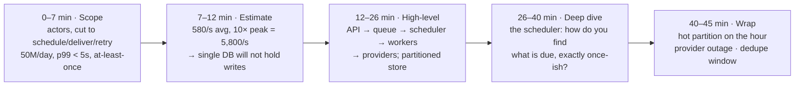

## The model

A system design interview is forty-five minutes with a fixed shape: scope it, size it,
sketch it, go deep on one part, then close. Each phase has an allowance, and the phases
depend on each other in order.

Most people who do badly are not missing knowledge. They spend twenty-five minutes on
requirements and arrive at the design with ten minutes left, or they draw boxes at minute
four and spend the hour defending an unscoped guess. The clock is the part that has to be
managed deliberately, because nothing else will manage it for you.

## When to use it

You are forty-five minutes into a room with a whiteboard, and you have to decide how to
spend them before you know what the problem is.

1. **Have I earned the right to draw yet?** You have if you can state the system in one
   sentence with numbers in it. If you cannot, keep scoping — but check the clock, because
   past minute ten the answer is to state an assumption and move.
2. **Am I picking the deep dive, or waiting to be assigned one?** Choosing it yourself is
   the single strongest signal available in the second half. Pick the component your own
   numbers made interesting.
3. **Am I narrating or just thinking?** Silence is scored as absence. If the reasoning is
   not audible, it did not happen.

## Speedrun

**What** — the interview has five phases and a budget for each. Overspending early is the
default failure, and it is unrecoverable, because the phases that get squeezed are the ones
carrying the most signal.

| Phase | Minutes | What it produces |
|---|---|---|
| Scope | 5–8 | One sentence with numbers in it |
| Estimate | 3–5 | The constraint that shapes the design |
| High-level design | 10–15 | Boxes, arrows, data flow, storage choice |
| Deep dive | 10–15 | One component, taken to the bottom |
| Wrap | 3–5 | Bottlenecks, failure modes, what you would do next |

**How to run it**

1. **Scope until you can say the one sentence.** Actors, two or three actions, a number on
   each, and the [[scope cut]] said out loud. Stop at minute eight regardless.
2. **Do the arithmetic out loud and name the constraint it found.** "5,800 writes a second
   at peak, so a single database will not hold the write path" is the sentence that turns
   estimation into a design input.
3. **Draw the happy path end to end before any component gets detail.** Client, entry
   point, services, storage, and the data flowing between them. Breadth first — a complete
   thin design beats half a deep one.
4. **Name the storage choice and why.** This is the highest-density decision on the board,
   and "Postgres, because the access pattern is relational and the volume fits" takes eight
   seconds.
5. **Pick the deep dive yourself.** Say "the interesting part here is X, can I go deep
   there?" Choose the component your estimate made hard.
6. **Close by attacking your own design.** Name the bottleneck, the failure mode, and the
   thing you would do with another week. Volunteering the weakness reads as judgment;
   waiting to be shown it reads as luck.

**Why it works** — the phases build on each other. Scope produces the numbers, the numbers
produce the constraint, the constraint decides the architecture, and the architecture makes
one component obviously the hard one. Skip a phase and the next one has nothing to stand on
— which is why an unscoped design cannot be defended and an unsized one cannot be justified.

**The recovery line for when you are stuck** — "let me state what I think the hard part is
and work from there." It buys thinking time, it is honest, and it is what you would say in a
real design review.

## Going deeper

### What is actually being graded

The output is not the design. Nobody is going to build it, and the interviewer has seen a
hundred versions of it. What is being read is how you got there.

**Structure.** Did you have a method, or did you free-associate? An audible method is worth
more than a better design arrived at randomly, because the method is the thing that
transfers to problems the interviewer has not thought of.

**Tradeoffs, named as tradeoffs.** Not "I'll use Cassandra" but "Cassandra gives me the
write throughput and costs me ad-hoc queries; I think that trade is right here because the
access pattern is known." One sentence, and it demonstrates more than the choice does.

**Depth in at least one place.** Breadth everywhere and depth nowhere is the most common
staff-level rejection. Somewhere in the hour you have to show that you know how something
actually works, not just what it is called.

**Communication under uncertainty.** Whether you can say "I don't know" and then reason
toward an answer anyway. This is the closest analogue to the actual job, and interviewers
weight it accordingly.

That list explains a result that otherwise looks unfair: a correct design delivered
silently scores below a slightly worse one narrated well. The design is evidence. The
reasoning is the thing.

### Driving, and what it looks like

**Driving the interview** means you decide what happens next, and you check rather than ask.
The difference is small in words and large in signal.

Asking hands the problem back: "What should I focus on?" "Do you want me to talk about the
database?" "Is that enough detail?" Each one transfers the work of deciding to the person
evaluating you.

Checking keeps it: "I'm going to go deep on the fan-out, since the numbers make it the hard
part — does that work for you?" Same collaborative tone, opposite direction of effort. You
have made the choice and offered a veto.

The exception worth knowing: when the interviewer interrupts, stop and follow. An interrupt
is almost always a hint that you are in the wrong place, and candidates who finish their
thought before responding routinely spend five more minutes going the wrong way. Treat every
question as a redirect until proven otherwise.

### High-level design before deep dive, and why the order is not negotiable

The **high-level design** is the complete request path with no component opened up: client,
load balancer, service, queue, storage, and the arrows between them. The **deep dive** is one
of those boxes taken to the bottom — schema, algorithm, partitioning, failure handling.

Breadth has to come first for a structural reason rather than a stylistic one. Until the
whole path exists, you do not know which box is hard, so any component you dive into is
chosen arbitrarily. Candidates who start deep almost always pick the component they know
best rather than the one the problem makes difficult, and that choice is visible.

Complete-then-deepen also protects you against the clock. A thin complete design at minute
twenty-five is a passing answer that you can then improve. Half a design with a beautiful
schema in the corner is not, however good the schema is.

### Where the time actually goes wrong

**Over-scoping** is the most common. The requirements conversation is comfortable, the
interviewer is agreeable, and nothing feels wrong until minute twenty-five. The fix is a
hard stop: at minute eight, state the remaining assumptions and start drawing.

**Under-scoping** is the more expensive one, though it is rarer. Boxes at minute three,
before anyone has said what the system does. Everything built on top is unfalsifiable, and
the interviewer usually spends the rest of the hour trying to find out whether you noticed.

**Uniform depth** is the quiet one. Every component gets the same three sentences, nothing
gets opened up, and the hour ends with a competent-looking diagram that demonstrated
nothing. This is the failure mode of people who have read a lot and built little.

**Silent thinking** is the fixable one. Long pauses while you work something out read as
being stuck. Narrate the search itself — "I'm trying to decide whether to fan out on write
or on read, so let me look at the read-to-write ratio again" — and the same pause becomes
evidence.

### Closing, which is worth more than it costs

The last three minutes are the cheapest signal in the interview, and most people spend them
trailing off.

Attack your own design instead. Name the bottleneck you would hit first at ten times the
load. Name the failure mode that worries you — the [[correlated failure]] your redundancy
does not actually cover, the hot key your partitioning will produce. Name the thing you cut
during scoping that you would build next, and why.

This works because it is what the second half of a real design review sounds like. Someone
who can find the weak point in their own proposal will find it before shipping, and that is
the entire thing anyone is trying to predict about you.

## See it work

Forty-five minutes on "design a notification service," using the numbers from the estimation
page.

The first seven minutes produce one sentence: fifty million scheduled notifications a day,
delivered within five seconds of their due time, at-least-once. Four candidate features are
cut aloud. Nothing has been drawn yet.

The estimate takes five more and earns its place by changing the design. Five thousand eight
hundred per second at peak is past what one database will absorb, so a queue is not a
stylistic preference — it is what the arithmetic requires. That is the constraint the next
fifteen minutes are built on.

The high-level design goes end to end without opening anything: an API that accepts and
acknowledges, a durable queue, a scheduler that decides what is due, workers that call the
providers, a partitioned store for state.

Every box gets a sentence and none gets a paragraph, so at minute twenty-six there is a
complete system on the board.

Then the deep dive, chosen rather than assigned: the scheduler, because "find everything due
in the next second, across a partitioned store, without sending twice" is the part the
numbers made hard. Fourteen minutes goes into time-bucketed partitions, the claim-and-lease
pattern, and what happens when a worker dies holding a lease.

The last five minutes attack it:

- **The hot partition** when everything is scheduled for the top of the hour.
- **The provider outage** that turns retries into a [[thundering herd]].
- **The dedupe window** that makes at-least-once survivable, and how long it has to be.

None of those were asked for, and together they are the strongest three minutes in the hour.

## Next

Scoping the problem, numbers to know cold, latency and throughput budgets and availability
math are the four skills this page schedules — each one is the content of a phase, and this
page is only the clock around them.
