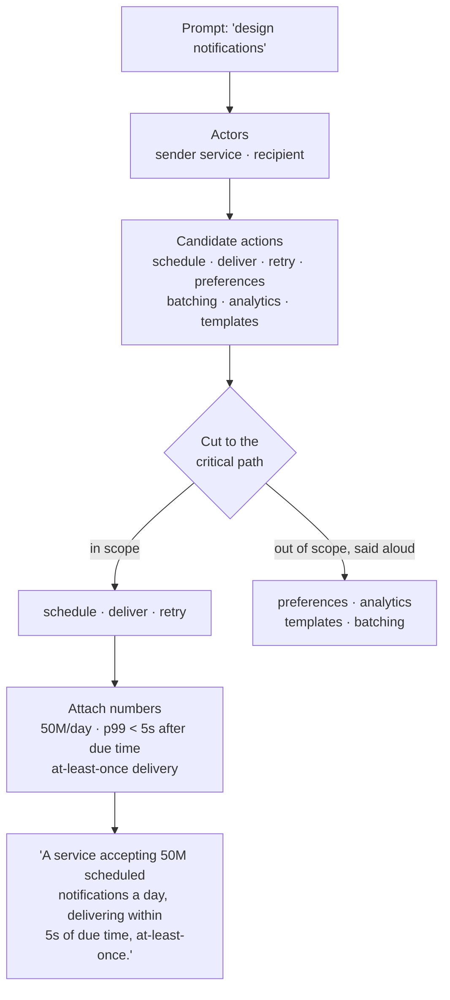

## The model

"Design Twitter" is a topic. A problem is a topic with the ambiguity removed: which
users, doing which actions, at what volume, with what allowed to be slow or wrong.

Scoping is the conversion. You choose a small set of actions to build, attach numbers to
them, and say out loud what you are not building. The interviewer is not withholding the
real question — the prompt is deliberately underspecified, and choosing well inside it is
the first thing being graded.

## When to use it

You have a prompt broad enough to support three or four different systems, and designing
before you cut means designing the wrong one.

1. **Which single action carries the product?** Posting, reading, or ranking are three
   different systems wearing one name. Pick the one whose failure would make the product
   pointless, and say why you picked it.
2. **Read-heavy or write-heavy?** This decides your entire storage story, so decide it in
   minute three rather than minute thirty. If you do not know, state the ratio you are
   assuming and move.
3. **What are you deliberately not building?** Name three things — auth, payments,
   moderation, mobile clients — and put them aside explicitly. An unnamed exclusion reads
   as an omission.

## Speedrun

**What** — scoping converts an open prompt into a bounded problem: a named set of actions,
a number attached to each, and an explicit list of what is out of scope. It takes five to
eight minutes of a 45-minute interview and it determines whether the remaining forty are
spent on something worth designing.

**How to scope a prompt**

1. **Name the actors.** Who uses this? "A user" is usually two or three different people
   — a poster and a reader, a driver and a rider, a buyer and a seller. Their needs
   conflict, and the conflict is the design.
2. **List candidate actions, then cut to three.** Write six or seven things users do, then
   strike all but the two or three that define the product. Say the cut out loud: "I am
   going to build post, follow and timeline, and skip search and DMs."
3. **Attach one number to each survivor.** How many per day, and how large is each one.
   Rough is fine; absent is not. This is where [[back-of-envelope]] estimation starts.
4. **Declare the read-to-write ratio.** State it as a number — "roughly 100 reads per
   write" — because it decides caching, replication and denormalisation all at once.
5. **State what is allowed to be stale, slow, or lost.** Every system tolerates something.
   Naming it early buys you the right to a simpler design later.
6. **Write the scope down where you both can see it** and ask "does this match what you
   had in mind?" You want the correction now, not at minute thirty.

**Why it works** — an unbounded prompt has no wrong answers, which sounds freeing and is
actually the trap: with nothing fixed, nothing you design can be judged as fitting. Fixing
the actors, the actions and the numbers converts opinions into consequences. Once you have
said "100 reads per write", a design that optimises writes is visibly wrong, and a design
that caches aggressively is visibly right.

**The two failure modes**

- **Designing before cutting.** Boxes on the whiteboard at minute four, before anyone has
  said what the system does. Everything after that is unfalsifiable.
- **Cutting silently.** Building only the write path and never mentioning it, which reads
  as not having noticed the read path exists.

**The line that does the most work** — "I am going to assume X; tell me if that is wrong."
It converts a guess into a shared premise, and it costs four seconds.

## Going deeper

### Why prompts are underspecified on purpose

The prompt is not a question with a hidden answer. It is a space, and the interviewer
wants to watch you narrow it.

That reframes what the first five minutes are for. You are not gathering requirements from
someone who has them. You are proposing requirements and checking they are acceptable,
which is the same thing a staff engineer does when a director says "we should do something
about onboarding."

The tell that separates the two is who does the work. A candidate asking "what are the
requirements?" has handed the problem back. A candidate saying "I will assume mobile and
web, reads dominating writes about a hundred to one, and no offline support — sound right?"
has done the work and invited a correction.

### Actors before actions

The first cut is not "what does the system do" but **who is it for**, because most
interesting systems have at least two actors whose interests conflict.

A ride-share has riders who want a car now and drivers who want a fare now, and the
matching system exists precisely because those two are hard to satisfy at once. A feed has
posters who want reach and readers who want relevance. A marketplace has buyers who want
low prices and sellers who want high ones.

Naming both sides early gives you the design's real tension for free. If you can only name
one actor, you have probably described a CRUD app, and the interview will feel thin because
there is nothing to trade off.

### What "critical path" means and why it decides the cut

The **critical path** is the sequence of steps that must complete before the user gets
what they asked for. Everything else can happen after, in the background, or not at all.

This is the sharpest cutting tool available, because it is not a matter of taste. When a
user posts a tweet, the critical path is: accept it, persist it, acknowledge. Fanning it
out to a million followers is not on the critical path — it can happen a second later and
nobody notices. Updating trending topics is further off still.

Once you have said which steps are on the critical path, latency targets become obvious
(they belong to the critical path), asynchrony becomes obvious (everything else), and a
whole class of design argument resolves itself without debate.

### Functional and non-functional, and why the second one is the interview

A **functional requirement** is something the system does: post a message, return a
timeline, match a driver. A **non-functional requirement** is a property of how it does it:
how fast, how available, how consistent, how much it costs.

Candidates over-invest in the first list. It is easy to write and it is largely given by
the prompt — everyone designing a feed will list post, follow and read. It rarely
distinguishes anyone.

The design lives in the second list, because that is where the tradeoffs are. "Timelines
may be up to thirty seconds stale" and "timelines must be current" are the same functional
requirement and two completely different systems: one can precompute and cache freely, the
other cannot. Push the conversation there quickly.

A useful habit is to state each non-functional requirement as a number with a unit
attached. Not "highly available" but "99.9%, so about 43 minutes of downtime a month." Not
"fast" but "p99 under 200 milliseconds." Numbers can be designed against; adjectives
cannot, and the difference shows up immediately in the quality of the next twenty minutes.

### The scope cut, said out loud

A **scope cut** is an explicit statement that something is out of scope. The word "explicit"
is carrying all the weight.

Consider two candidates who both build only the posting path. The first never mentions
reads; the interviewer cannot tell whether they made a choice or missed a requirement, and
has to assume the worse of the two. The second says "I am going to focus on the write path
and treat the read path as a follow-up, because I think the fan-out decision is the
interesting part here." Same design, entirely different signal.

Three or four cuts is the right number. Fewer looks like you have not noticed the problem's
size; many more starts to look like avoidance, and at some point the interviewer will ask
you to design the thing you keep cutting.

### When to stop scoping

Scoping has a stopping condition, and running past it is a real failure mode — pleasant,
collaborative, and fatal, because the clock does not care how good the requirements
conversation was.

Stop when you can state the system in one sentence with numbers in it: "A service that
accepts 5,000 posts per second and serves 500,000 timeline reads per second, where
timelines may be up to thirty seconds stale."

If you cannot say that sentence, you are not ready to draw boxes. If you can, keep drawing
and stop asking. Eight minutes is a reasonable ceiling in a 45-minute interview; past ten
you are spending the design's time on its preamble.

## See it work

Take the prompt "design a system to schedule and deliver notifications."

The prompt names a topic. Two actors fall out immediately: services that ask for a
notification to be sent, and people who receive it. Their interests differ — the sender
wants an acknowledgement fast, the recipient wants delivery on time — and that gap is
where the design will live.

Seven candidate actions get listed, then cut to three. Scheduling, delivering and retrying
are the critical path: without them there is no product. Preferences, analytics, templates
and batching are all real, all sizeable, and all explicitly set aside out loud, which
takes about ten seconds and buys the whole rest of the hour.

Then the numbers. Fifty million notifications a day is about 580 per second average, and
peaks matter more than averages here because scheduled sends cluster on the hour. Delivery
within five seconds of the due time is the promise. At-least-once is the delivery
guarantee, which quietly means the design must make duplicates survivable rather than
impossible.

That last sentence is the scope. It fits in one line, every clause has a consequence, and
a design can now be judged against it.

## Next

Numbers to know cold turns the estimates gestured at here into arithmetic you can do in
your head, and latency and throughput budgets turns the "p99 under five seconds" promise
into a per-component allowance you can actually design against.
