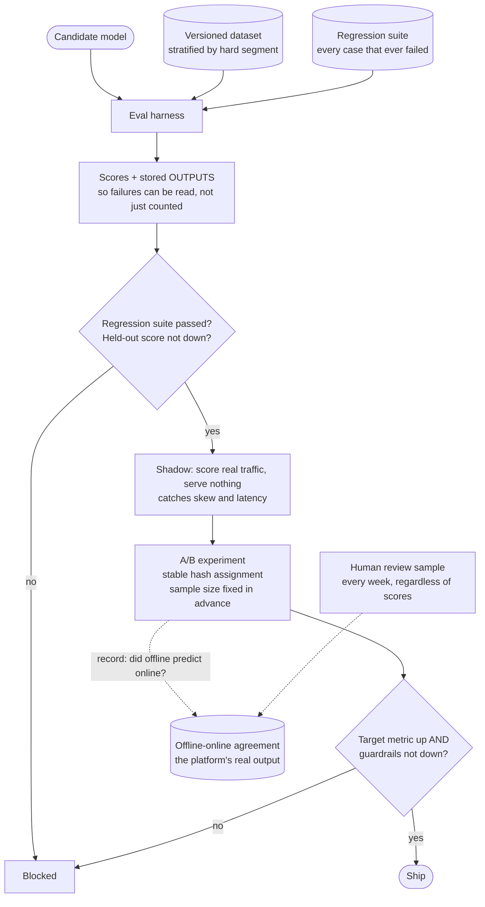

## The model

Every other design in this section produces a model that someone wants to change. The eval
platform is the system that answers whether the change is an improvement, before and after it
reaches users.

It has two halves that answer different questions. **Offline** scoring runs a candidate against
a fixed dataset and gives an answer in minutes, cheaply and repeatably. **Online** experiments
put it in front of real traffic and give the only answer that counts, expensively and slowly.
The platform's job is to make the first predictive enough to be worth trusting, and the second
cheap enough to be routine.

## When to use it

You have the prompt and are deciding what is being asked for.

1. **Deterministic or generative output?** A ranker's output is a score you compare against a
   label. A model producing text has no single right answer, which forces human review or a
   **judge model**, and that is a substantially different system.
2. **How often do models change?** Weekly changes justify a platform. Twice a year does not, and
   a script plus a spreadsheet is the honest answer.
3. **Who decides what ships?** If the answer is "whoever ran the eval", the platform needs to
   make gaming difficult — which is a governance requirement expressed as architecture.

## Speedrun

**What** — a versioned dataset, an **eval harness** that runs a candidate against it, a
regression suite that must not get worse, and an experiment system for online tests.

**How to design it**

1. **Version the dataset.** An [[eval]] whose data changes silently cannot compare two runs, and
   comparing runs is the entire purpose.
2. **Keep a [[held-out set]] nobody tunes against.** The set you iterate on stops measuring
   generalisation within a few weeks of use.
3. **Run every candidate against a [[regression suite]]** of cases that previously failed. New
   capability must not come at the cost of old behaviour.
4. **Store results, not just scores** — the actual outputs, so a regression can be inspected
   rather than merely counted.
5. **Randomise experiment assignment by a stable key**, so a user sees a consistent variant, and
   check the split for balance before trusting the result.
6. **Define [[guardrail metric|guardrails]] before launching.** Metrics that must not degrade,
   agreed in advance, so a win on the target metric cannot quietly cost something else.

**Why it works** — offline gives you a fast, cheap, repeatable signal for iteration; online
gives you truth. Neither substitutes for the other, and a platform that offers only one produces
either slow iteration or confident mistakes.

**The number that makes the platform worth building** — offline runs take minutes and online
experiments take weeks. Anything that moves a decision from the second to the first is the
platform paying for itself.

## Going deeper

### Datasets, and why they rot

An eval dataset is an asset that decays. Two mechanisms do it, and both are quiet.

**Overfitting by iteration.** Every time someone looks at failures and adjusts the model, a
little information leaks from the dataset into the system. After fifty iterations, the score
measures fit to that dataset rather than to the world. The defence is a [[held-out set]]
evaluated rarely and never inspected, so its score stays comparable.

**Distribution drift.** The set was sampled from last year's traffic, and users now ask
different things. The score stays stable while relevance falls, which is the worse failure
because nothing signals it.

The countermeasures are the same in both cases: refresh from current traffic on a schedule,
version every refresh so old results remain interpretable, and keep a fixed core that never
changes so long-term comparisons stay possible.

Stratification matters more than size. A thousand cases covering the hard segments beat a
hundred thousand dominated by easy ones, because the average over an unbalanced set hides
exactly the failures you are looking for.

### Judging generative output

When the output is text, there is no label to compare against, and this is where eval platforms
get genuinely hard.

**Human review** is the ground truth and it is slow, expensive and inconsistent. Two reviewers
disagree often enough that inter-rater agreement must itself be measured — if your
[[annotators]] agree only 70% of the time, no automated judge can be more accurate than that
ceiling.

**A judge model** scores outputs automatically against a rubric. It is fast and cheap and it has
biases worth knowing: judges prefer longer answers, prefer their own family's phrasing, and are
sensitive to option order in comparisons. Position-swapping and length controls mitigate some of
it.

The discipline that makes a judge trustworthy is **calibrating it against humans**. Score a
sample both ways, measure agreement, and report the judge's number alongside how much it can be
trusted.

A judge at 71% agreement with human raters is useful for detecting large regressions and
useless for distinguishing a 2% improvement. Knowing which claim you can make is the whole
point.

Pairwise comparison is usually more reliable than absolute scoring. "Is A better than B" is a
question both humans and judges answer more consistently than "rate this 1–5", and it is what
you actually want to know.

### Online experiments

Offline scores are a proxy. The online experiment is the measurement, and its design is where
results get invalidated.

**Assignment** must be stable per user and independent of anything correlated with the outcome.
Hashing the user id into buckets is standard; assigning by request produces a user who sees both
variants and a result that means nothing.

**Sample size** should be computed before launching rather than after peeking. The temptation to
stop as soon as significance appears inflates false positives dramatically, and the honest
version is a fixed horizon or a sequential test designed for early stopping.

**Guardrail metrics** are agreed in advance and must not degrade. Latency, error rate, session
length, unsubscribes, revenue. A ranking change that raises click-through 3% while raising
unsubscribes 1% is not a win, and without the guardrail nobody looks.

**Novelty effects** are the trap in short experiments. Users engage with anything new, so a
week-long test measures novelty as much as quality. Running long enough for the effect to decay,
or holding back a long-term control group, is what separates a real improvement from a
temporary one.

### Offline-online agreement, and Goodhart again

The platform's most valuable output is not any single score. It is the track record of whether
offline predictions matched online results.

Measure it explicitly: for every change that ran both ways, did the offline metric predict the
sign of the online effect? A platform where offline and online agree 80% of the time lets you
ship small changes on offline evidence alone, which is enormous leverage. One where they agree
55% of the time is a platform whose offline half should not be trusted for decisions, and
knowing that is more useful than not knowing it.

Then the [[Goodhart's Law]] problem, which lands harder here than anywhere else in the atlas. An
eval score is a proxy for quality, and the moment teams are judged on it, the score improves
faster than quality does. Prompts get tuned to the eval's phrasing; models get selected for
cases resembling the set; the number climbs.

The mitigations are the ones the razor recommends:

- Keep a held-out set nobody optimises against.
- Pair the target metric with guardrails that move the wrong way under gaming.
- Sample real outputs for human review on a schedule, whatever the numbers say.
- Treat a large jump in an eval score as a reason for suspicion before celebration.

## See it work

A platform serving a team shipping model changes weekly.

The regression suite is the gate that earns its place first. Every case that ever failed becomes
a permanent test, so a change that fixes one thing and quietly breaks another is caught before
it reaches an experiment — the cheapest place to catch it.

Storing outputs rather than only scores is what makes a regression actionable. "Recall dropped
2%" is a number nobody can act on; the twelve specific cases that changed from correct to wrong
are a bug report.

Shadow scoring sits between offline and online because it catches a category neither does —
feature skew, latency regressions, serving bugs — without exposing a single user.

The guardrails are agreed before launch, which is the part that requires discipline rather than
engineering. Deciding afterwards which metrics counted is how every ambiguous result becomes a
win.

And the agreement record at the bottom is the platform's most valuable artefact. Knowing that
offline predicts online 80% of the time is what licenses shipping small changes without a
two-week experiment — and knowing it is 55% is what stops you doing so on a platform that cannot
support it.

## Next

That completes the Interviews section. The AI Engineering section covers evaluation, retrieval
and deployment as subjects in their own right rather than as parts of a system design.
