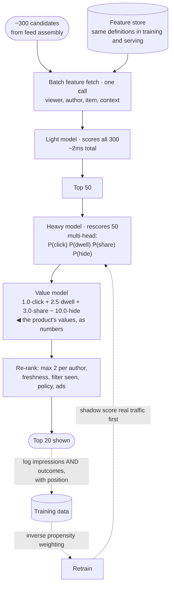

## The model

The [[candidate generation]] section of the news feed design covers how candidates are
assembled. This is about what happens next:
scoring a few hundred candidates for one viewer and returning the best fifty, within the
request.

Two things make it distinct from batch [[collaborative filtering|recommendations]]. It is
**synchronous** — the ranking runs inside a feed load, so the model's cost is a latency budget
rather than a compute bill. And it is **multi-objective**: nobody wants a feed optimised for
clicks alone, so several predictions are combined into one score by weights that encode what
the product is for.

## When to use it

You have the prompt and are deciding which part is being asked for.

1. **Ranking or retrieval?** Retrieval is "which few hundred posts should we consider" and is
   mostly infrastructure. Ranking is "in what order", and it is a modelling and serving problem.
2. **What are you optimising, exactly?** "Engagement" is not an answer. Clicks, dwell time,
   shares and long-term retention conflict, and the weights between them are a product decision
   engineers usually inherit by accident.
3. **How much latency does ranking get?** Ten milliseconds buys a small model over a few hundred
   candidates. Fifty buys something much better. That number decides the architecture.

## Speedrun

**What** — a **ranking model** predicts several outcomes per candidate; a **value model**
combines those predictions into one number; a re-ranking pass applies constraints the model
cannot express.

**How to design it**

1. **Size the budget.** 100k feed loads/s × 300 candidates = 30M scoring operations/s. That
   number decides how big the model can be, before anything else.
2. **Predict several things, not one.** P(click), P(long dwell), P(share), P(hide) — separate
   heads on one model, trained together.
3. **Combine with explicit weights.** `score = w₁·click + w₂·dwell + w₃·share − w₄·hide`. Those
   weights are the product's values, written down.
4. **Correct for [[position bias]]** in training. Items shown at the top get clicked because
   they were at the top, and training on raw clicks teaches the model that being ranked highly
   causes engagement.
5. **Serve features from the [[feature store]]**, batched into one fetch, so serving and
   training see identical values.
6. **Re-rank last** — diversity, freshness, already-seen, policy, ads — because these are
   constraints rather than predictions.

**Why it works** — the model handles what is learnable from data and the re-ranker handles what
is decided by people. Trying to encode "no more than two posts from one author" into a loss
function is how ranking systems become unmaintainable.

**The 30 million per second is the whole constraint.** Every architectural choice — model size,
feature count, candidate count — is downstream of it.

## Going deeper

### Multi-objective ranking, and where the values live

Optimising a single metric produces a predictable failure. Optimise clicks and you get
clickbait; optimise dwell time and you get videos that withhold the point; optimise shares and
you get outrage, which is the most shareable thing there is.

**Multi-objective ranking** predicts several outcomes and combines them. The model has several
heads — click, dwell, share, hide, report — trained jointly because they share most of the
representation.

The **value model** is the combination, and it is the interesting artefact. `score = 1.0·click +
2.5·dwell + 3.0·share − 10.0·hide` is a statement about what the product believes is worth
showing, expressed as numbers. Negative weights matter most: a heavy penalty on "hide" is what
stops the system serving things people actively dislike but reflexively click.

Those weights are a product decision. Engineers frequently inherit them by default, which means
nobody chose them, which means the feed optimises whatever the first version happened to
weight. Being able to say "the weights encode product values and should be owned by someone who
can defend them" is a staff-level observation rather than a technical one.

[[Goodhart's Law]] is the reason all of this exists. Every one of these predictions is a proxy,
and each becomes a worse proxy the moment it becomes a target — which is why you use several
and pair them with guardrails rather than trusting any one.

### Position bias, and why raw logs lie

The top item in a feed gets far more clicks than the fifth, largely because it is at the top.
Train on raw click logs and the model learns that high-ranked items are engaging, which is
circular: it learns to predict its own past decisions.

**Position bias** correction is what makes the training data usable. The common approaches:

**Inverse propensity weighting** — weight each training example by the inverse probability that
it was shown at that position, so items that got clicked despite being ranked low count for
more.

**A position feature at training, zeroed at serving** — the model learns position's contribution
explicitly, and you remove it when scoring so the prediction is about the item rather than the
slot.

**Randomised exploration** — occasionally shuffle positions and collect unbiased data from those
sessions. Expensive and the only genuinely clean signal.

The general form is worth carrying beyond feeds: **any system trained on its own outputs needs
a mechanism for learning things it currently believes are bad.** That is the same argument as
the exploration slot in recommendations and the same failure as the narrowing feedback loop.

### Serving, and the online-offline gap

Thirty million scoring operations a second is the number every decision answers to. A model that
takes one millisecond per candidate cannot run over three hundred of them inside a feed load, so
model size is bounded by arithmetic rather than by ambition.

The standard shape is a two-stage ranking of its own: a small, fast model scores all several
hundred candidates, and a larger model rescores the top fifty. Same recall-then-precision split
as [[reranking]] in RAG, one level down.

The **online-offline gap** is the thing that surprises teams. A model that improves offline
metrics on historical data frequently does nothing — or harm — in production. The reasons are
consistent: the historical data was collected under a different ranking policy, feature values
differ subtly between the batch and serving paths, and the model's own presence changes user
behaviour.

**Shadow scoring** is the mitigation worth naming. Run the new model alongside the current one
in production, score real traffic, log both, and compare — without serving the new results to
anyone. It catches serving bugs, latency regressions and feature skew before any user is
affected, and it is much cheaper than discovering them in an experiment.

Then the experiment itself, because offline metrics do not settle it. An A/B test on real
traffic, measured on the guardrails as well as the target metric, is the only thing that
actually answers "is this better".

## See it work

A feed at 100,000 loads a second, 300 candidates each.

The two-stage split inside ranking is what fits the budget. A light model scores all three
hundred in about two milliseconds; a heavy model rescores only the fifty that survive. Running
the heavy model over three hundred would blow the latency budget, and running only the light one
would leave quality on the table.

The multi-head model predicts four things because optimising one produces a predictable
pathology. The negative weight on `hide` is the most important number in the value model — it is
what stops the feed serving things people click reflexively and resent afterwards.

Logging impressions with their positions, not just clicks, is what makes the training data
correctable. Without position recorded, inverse propensity weighting is impossible and the model
trains on its own past ranking decisions.

Shadow scoring sits between training and serving. A new model runs on real traffic, its scores
are logged, and nothing is shown — which catches feature skew and latency regressions before an
experiment exposes users to them.

The re-ranker holds every rule the model should not learn. "At most two posts from one author"
is a product constraint, not a prediction, and encoding it in a loss function is how ranking
systems become impossible to reason about.

## Next

The eval platform is the system that measures all of this, and it is the one design here that
exists purely to tell you whether the others are working.
