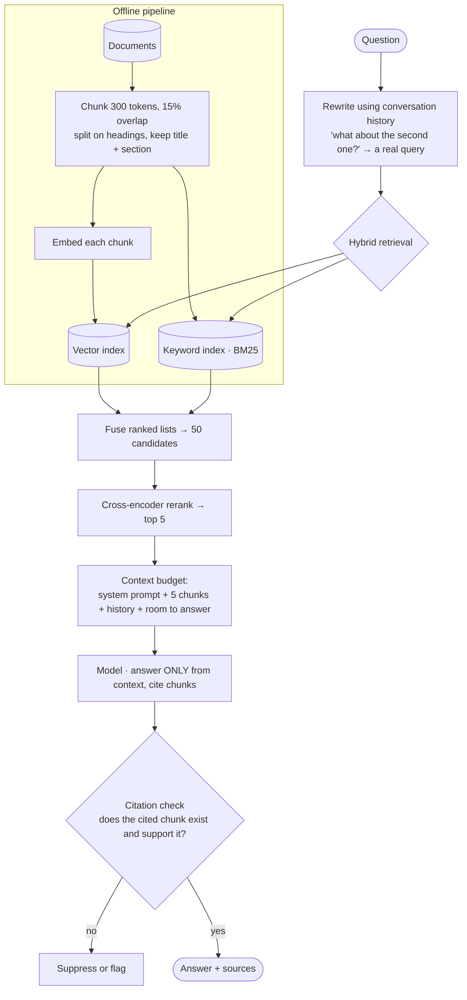

## The model

**Retrieval-augmented generation** answers a question by first finding relevant documents,
then asking a language model to answer using only those documents as context.

The system design instinct is to focus on the model. Resist it — the model is a hosted API
call, and almost every failure in a RAG system is a **retrieval** failure. If the right passage
is not in the context, no model can produce the right answer, and it will produce a confident
wrong one instead. The design is a search system with a generation step bolted on.

## When to use it

You have the prompt and are deciding what is actually being asked for.

1. **Is the corpus yours and changing?** RAG exists because a model cannot know your private,
   current documents. If the knowledge is public and static, fine-tuning or plain prompting may
   be simpler.
2. **Must answers be attributable?** If a user needs to see *where* an answer came from, that
   changes the design — you must carry citations through retrieval into the response.
3. **What is the latency budget?** Retrieval plus generation is seconds, not milliseconds.
   Anything expecting sub-second responses needs streaming and a different product shape.

## Speedrun

**What** — documents are chunked, embedded into vectors and indexed offline. A question is
embedded, the nearest chunks are retrieved, and those chunks plus the question are sent to the
model.

**How to design it**

1. **Chunk deliberately.** 200–500 tokens with overlap is the usual starting point, split on
   semantic boundaries — sections, paragraphs — rather than fixed character counts.
2. **Embed and index offline.** Each chunk becomes a vector in a **vector index**, alongside its
   text and metadata. This is a batch pipeline, rebuilt when documents change.
3. **Retrieve with both methods.** Vector search finds semantic matches; keyword search finds
   exact terms, names and identifiers. **Hybrid retrieval** combines them, and it materially
   beats either alone.
4. **Rerank the candidates.** Retrieve 50, rerank with a cross-encoder, keep the top 5. Cheap
   recall then expensive precision, which is the same shape as [[candidate generation]] in a
   feed.
5. **Budget the context window.** Five chunks, the question, the system prompt and room for the
   answer. Stuffing more in degrades quality rather than improving it.
6. **Require citations.** Instruct the model to answer only from the provided context and to
   name the chunk it used, then verify the citation exists.

**Why it works** — the model is good at reading and terrible at remembering. Retrieval supplies
the memory; generation supplies the reading. Splitting the responsibilities is what makes the
system's failures diagnosable.

**The failure that defines this problem** — a model asked a question with no relevant context
does not say "I don't know". It produces something plausible, which is worse than an error
because nothing signals that it is wrong.

## Going deeper

### Chunking, and why it decides your ceiling

A chunk is the unit of retrieval, so chunk boundaries decide what can ever be retrieved
together.

Too small and a chunk lacks the context to be understood alone — a paragraph referring to "this
approach" is useless when the antecedent is in the previous chunk. Too large and the vector
becomes an average of several topics, matching everything weakly and nothing strongly.

The common starting point is 200–500 tokens with 10–20% overlap, and the overlap exists
precisely so a fact spanning a boundary survives in at least one chunk.

Splitting on **semantic** boundaries beats splitting on character counts. Markdown headings,
document sections and paragraph breaks all carry structure the author put there, and a splitter
that respects them produces chunks that stand alone.

The trick worth knowing: store more context than you embed. Embed the chunk, but attach its
section heading and document title to the text you send the model, so a chunk retrieved out of
context still arrives with its bearings.

Changing the **chunking strategy** means re-embedding the entire corpus, which makes it close
to a [[one-way door]] — the same property as an [[analyzer]] in a search index, for the same
reason.

### Retrieval, and why vectors alone are not enough

An **embedding** maps text into a vector such that similar meanings land near each other. That
gives semantic search: "how do I reset my password" finds a document titled "credential
recovery" with no shared words.

What it fails at is exactness. Product codes, error numbers, people's names, API method names —
embeddings blur precisely the tokens where you needed a literal match. Ask for error `E4021`
and a vector search happily returns documents about errors in general.

So production systems use **hybrid retrieval**: run vector search and keyword search
([[BM25]]) in parallel, then fuse the ranked lists. The fusion is usually reciprocal rank
fusion, which needs no score calibration between two systems that score on different scales.

**Reranking** is the second stage and it is where most of the quality lives. The first stage
optimises recall cheaply — get 50 plausible chunks. A cross-encoder then scores each candidate
against the query jointly, which is far more accurate and far too slow to run over a whole
corpus. Retrieve wide, rerank narrow.

That two-stage shape is the same as feed ranking and for the same reason: precision is
expensive, so you only pay for it on a small candidate set.

### The context budget

The model's context window is a fixed budget shared by the system prompt, the retrieved
chunks, the conversation history and the answer being generated.

More context is not better. Beyond a point, models attend poorly to material in the middle of a
long context, so stuffing 50 chunks in reliably performs worse than 5 well-chosen ones. The
budget is a design constraint, not a limit to work around.

Conversation history competes for the same space, which is why multi-turn assistants need a
strategy — summarise older turns, or re-retrieve based on the whole conversation rather than
the last message alone. "What about the second one?" is unanswerable without knowing what was
being discussed, and it is also a terrible retrieval query, so query rewriting from history is
a real component rather than a nicety.

### Grounding, evaluation, and the metric trap

**Grounding** is the constraint that answers come from retrieved context rather than the
model's parameters. It is enforced by instruction, and instructions are not guarantees — so it
must be verified rather than assumed.

The practical enforcement is citations. The model names which chunk supports each claim, and a
post-check verifies the cited chunk exists and actually contains the claim. An answer that
cannot cite is one to suppress or flag.

Evaluation splits into two questions that need separate measurement, and conflating them is why
RAG systems are hard to improve:

**Did retrieval find the right passage?** Measurable against a [[golden set]] of questions with
known correct sources, using recall at k. This is the half that usually fails.

**Given the right passage, did the model answer correctly?** A separate [[eval]], run with the
correct context supplied, so a generation failure is distinguishable from a retrieval one.

The [[Goodhart's Law]] warning applies sharply here. Optimising a retrieval score — recall at
5, say — will eventually produce a retriever tuned to the eval set rather than to users, and
the number will keep improving while answers get worse. Pair it with a held-out set nobody
tunes against, and with a human review sample.

## See it work

An internal assistant over 500,000 company documents.

Everything expensive is offline. Chunking, embedding and indexing happen once per document
change, so a question costs two index lookups, a rerank over 50 candidates, and one model call.

Hybrid retrieval is the decision that most improves answer quality. Vector search alone misses
`E4021` and employee names; keyword search alone misses "how do I reset my password" against a
page titled "credential recovery". Running both and fusing is strictly better than choosing.

Reranking is where precision is bought. Fifty candidates is cheap recall; a cross-encoder over
those fifty is affordable and far more accurate than the retrieval score. Running it over
500,000 chunks would not be.

Query rewriting from conversation history is easy to omit and breaks multi-turn use entirely.
"What about the second one?" retrieves nothing useful as a literal query, and the fix is a
component rather than a prompt tweak.

The citation check is the honest part. Instructing a model to ground its answer is not a
guarantee, so the system verifies afterwards — and an answer that cannot cite is suppressed
rather than shipped. That is the difference between a demo and something people can rely on.

## Next

Recommendations applies the same retrieve-then-rank shape to items rather than documents, and
the eval platform is how you measure whether any of this is working.
