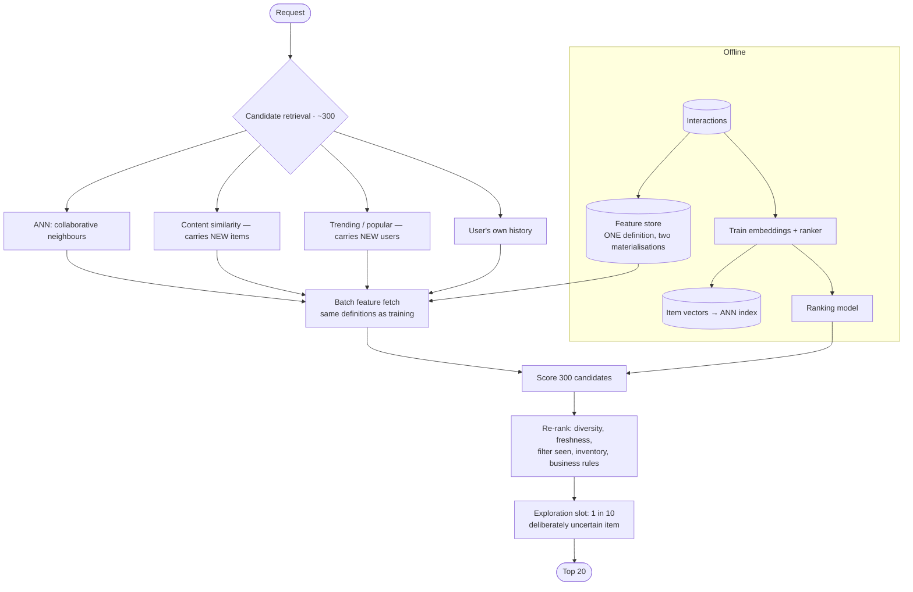

## The model

Given a user, produce a short ordered list of items they are likely to want, from a catalogue of
millions, in under 100 milliseconds.

The shape is the same two stages as [[retrieval-augmented generation]]. **Candidate retrieval**
narrows millions to hundreds cheaply; ranking scores those hundreds expensively and keeps the
top few. Nothing scores a million items per request, and understanding *why* the split exists
is more useful than knowing either half.

## When to use it

You have the prompt and are deciding what you are being asked to build.

1. **What signal do you have?** Explicit ratings are rare and sparse. Implicit signals — clicks,
   watch time, purchases — are abundant and biased, since a user can only click what they were
   shown.
2. **How cold is the start?** A product with rich interaction history is a different problem
   from one launching today, and the answer for new users and new items is not the same as for
   established ones.
3. **What is being optimised?** Clicks, watch time, purchases and long-term retention pull in
   different directions, and picking one without saying so is how recommendation systems go
   wrong.

## Speedrun

**What** — offline pipelines compute item and user representations; online, a request retrieves
candidates from several sources, ranks them with a model, and applies business rules.

**How to design it**

1. **Retrieve from several sources.** Collaborative filtering neighbours, content similarity,
   recent popularity, and the user's own history. Union them into a few hundred candidates.
2. **Rank with a model** scoring `(user, item, context)`. This is the expensive stage and it
   bounds the candidate count.
3. **Re-rank for the things the model does not encode** — diversity, freshness, business rules,
   already-seen filtering, and inventory.
4. **Serve features from a [[feature store]]** so the values used at serving time match the ones
   used at training time.
5. **Handle [[cold start]] explicitly.** New users get popularity or onboarding preferences; new
   items get content-based similarity until they accumulate interactions.
6. **Log what you showed, not only what was clicked.** Without impressions you cannot compute a
   rate, and you cannot train on what was never displayed.

**Why it works** — the funnel matches cost to candidate count. Cheap retrieval over millions,
expensive scoring over hundreds, cheap rules over dozens. Any design that scores everything is
not a design.

**The failure that compounds** — the **feedback loop**. You recommend what people clicked, they
click what you recommended, and the training data narrows to what the system already believed.
Without deliberate exploration, the catalogue collapses to a popular core.

## Going deeper

### The two families, and why you need both

**Collaborative filtering** uses behaviour: people who liked what you liked also liked this. It
needs no understanding of the items at all, which is its strength — it discovers that two films
appeal to the same audience without anyone describing them.

Its weakness is the [[cold start]]. A new item has no interactions, so it is invisible to
collaborative filtering forever, and a new user has no history to match against.

**Content-based filtering** uses attributes: this item resembles that one by genre, text,
[[embedding]] or metadata. It handles new items immediately, and it tends toward the obvious —
recommending more of exactly what someone already consumed, which is comfortable and boring.

Production systems use both, and the reason is the cold start rather than accuracy.
Content-based carries new items until they accumulate signal; collaborative takes over once
they have it. Saying that split out loud is the answer to "how do you handle a new item".

### The retrieval stage

Retrieval must reduce millions to hundreds in tens of milliseconds, which rules out anything
per-item at request time.

The dominant technique is embedding both users and items into a shared vector space offline,
then doing approximate nearest-neighbour search at serving time. The user vector is looked up
or computed from recent activity; the index returns the nearest few hundred items.

Approximate is doing real work in that sentence. Exact nearest-neighbour over millions of
vectors is too slow, so an approximate index trades a little recall for orders of magnitude of
speed — and the recall loss is invisible because the ranking stage reorders everything anyway.

Multiple retrieval sources in parallel is standard, because each has different blind spots.
Collaborative neighbours, content similarity, trending, and the user's own history each
contribute candidates, and the union is what the ranker sees. That union is also the only place
diversity can be injected, since a ranker can only reorder what it was given.

### Serving, and where the subtle bug lives

The ranking model needs features: the user's recent activity, the item's popularity, the time of
day, the device. Those features must be identical at training time and serving time, and the
gap between them is called **training-serving skew**.

It is the defect that quietly destroys model quality, and it is a plumbing problem rather than
a modelling one. Training reads a batch pipeline computing "clicks in the last 7 days"; serving
reads a streaming pipeline computing the same thing with a different window boundary, a
different null handling, or a different timezone. The model was trained on one distribution and
sees another.

A **feature store** exists to solve exactly this: one definition of each feature, materialised
both to a batch store for training and a low-latency store for serving, guaranteeing they agree.
Naming it, and naming skew as the reason, is a strong signal in this design.

The latency budget is the other constraint. A hundred milliseconds covers retrieval, feature
fetch, model inference and re-ranking — so feature fetches are batched into one call, the model
is small enough to score hundreds of candidates in tens of milliseconds, and anything slower
moves offline into precomputation.

### The feedback loop, and Goodhart

Recommendation systems train on data they generated. Users can only interact with what was
shown, so the training set is a record of the system's own past beliefs.

The consequence is narrowing. Items that were never recommended accumulate no positive signal,
so they are never recommended, and the catalogue collapses to a popular core. The metric
improves throughout, because the model is getting better at predicting clicks on the items it
already chooses to show.

That is [[Goodhart's Law]] operating on an unusually short cycle. Click-through rate was a
proxy for "this is useful", and once the system optimises it, the two come apart — clickbait
and outrage both score well, and both are what the system will learn to serve.

The mitigations are all forms of deliberate cost. **Exploration** shows some items the model is
unsure about, accepting worse short-term metrics for better long-term data. **Diversity
constraints** in re-ranking prevent one category dominating. And **guardrail metrics** — session
length, return rate, satisfaction surveys, unsubscribes — move the wrong way when the primary
metric is being gamed, which is the pairing the razor actually recommends.

Being able to say "I would measure click-through and pair it with a metric that catches
clickbait" is the answer that separates a candidate who has read about this from one who has
thought about it.

## See it work

A catalogue of 10 million items, 100 million users, 100 ms budget.

The funnel is the design. Ten million items reduce to three hundred by cheap vector search, then
three hundred are scored by a model that could never run over ten million. Cost matches
candidate count at every stage.

Four retrieval sources exist because each has a different blind spot. Collaborative filtering
cannot see new items; content similarity carries them until they earn interactions. Neither
helps a brand-new user, which is what the popularity source is for — and naming which source
covers which cold start is the answer to the question that always follows.

The feature store is the least glamorous box and the one that prevents the worst bug. One
definition of "clicks in the last 7 days", materialised to both a training store and a serving
store, so the model sees the same distribution in production that it saw in training.

Re-ranking applies everything the model does not know: that a user has seen this already, that
an item is out of stock, that eight of the top ten are from one publisher. The ranker optimises
predicted engagement; the re-ranker enforces the constraints nobody wants to encode in a loss
function.

The exploration slot is the deliberate cost. One in ten positions goes to something the model is
uncertain about, which measurably lowers today's click-through and is the only thing preventing
the catalogue from collapsing to what the system already believed. That trade — worse metrics
now for data that is not self-confirming — is the thing to volunteer.

## Next

Feed ranking is this design with a stronger real-time requirement, and the eval platform is how
any of it gets measured before it reaches users.
