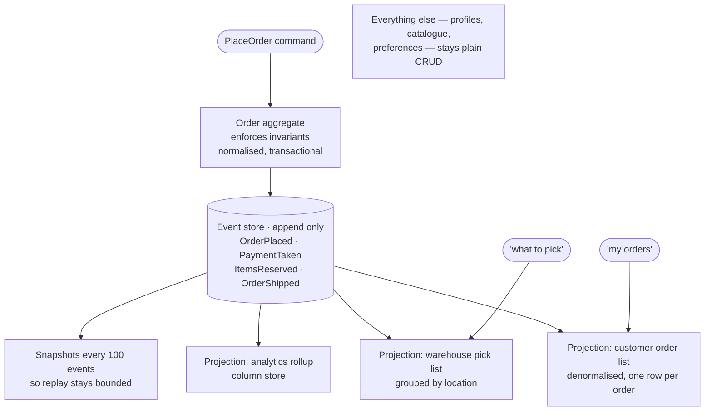

## The model

**CQRS** — command query responsibility segregation — separates the model you write through
from the models you read from. One schema enforces invariants on writes; other schemas, built
from those writes, answer queries.

**Event sourcing** is a different idea often confused with it: store the sequence of events
rather than the current state, and derive the state by replaying them. They combine well and
neither requires the other, and knowing that they are separable is most of what an interview
is checking.

## When to use it

Your reads and writes want genuinely different shapes, and one schema is serving both badly.

1. **Do the two sides have different shapes?** Writes want normalised and constrained; reads
   want denormalised and specific. If one schema serves both fine, you do not need this.
2. **Do they scale differently?** A 1000:1 [[read-to-write ratio]] means the read side needs
   independent scaling, and CQRS makes that possible without touching the write path.
3. **Is history part of the product?** Audit, undo, "what did this look like in March",
   temporal queries — that is the case for event sourcing, and it is much weaker without one.

## Speedrun

**What** — the write side accepts commands, enforces rules and emits events. The read side
consumes those events and maintains **projections**: denormalised views shaped per query.

```
command → command model → event → ┬→ projection A (list view)
                                  ├→ projection B (search index)
                                  └→ projection C (analytics rollup)
```

**How to apply it**

1. **Split reads from writes at the model, not the database.** Two schemas in one Postgres is
   CQRS. Two clusters is an optimisation you may never need.
2. **Build one projection per query shape.** A projection is allowed to be redundant and
   ugly; it exists to answer one question in one read.
3. **Feed projections from the event log**, so each is a [[consumer group]] with its own
   offsets and its own lag.
4. **Accept that reads are stale**, and put a number on it. The projection lags the write by
   however long the consumer takes.
5. **Do not event-source unless history is the point.** Storing current state is simpler and
   right for most systems.
6. **Apply it to one bounded area**, not the whole system. This is a pattern for the part of
   your product where the read and write shapes genuinely conflict.

**Why it works** — a single schema that serves both writes and reads is a compromise, and
compromises get worse as either side grows. Splitting lets each side be shaped for its own
job, at the cost of the copies being behind.

**The confusion to avoid** — CQRS does not mean two databases, does not require event
sourcing, and does not mean every read goes through a projection. It means the read model and
the write model are allowed to differ.

## Going deeper

### What CQRS actually buys

The write side exists to protect invariants. It is normalised, constrained, transactional,
and shaped around the **aggregate** — the unit that must be consistent as a whole.

The read side exists to answer questions fast. It is denormalised, duplicated, shaped per
screen, and has no invariants to protect because it is derived.

Trying to be both produces the familiar compromise:

- Normalise, and every read is a five-way join.
- Denormalise, and every write maintains copies while constraints get harder to enforce.
- Add indexes for the read patterns, and the write path slows.

There is no schema that is excellent at both, which is the observation the pattern rests on.

Splitting also lets the two scale independently. The read side can be replicated widely,
cached hard, or moved to an entirely different technology — an [[inverted index]] for text, a column
store for aggregates — without the write path knowing. And a new query shape becomes a new
projection rather than a migration.

The cost is real and immediate: more moving parts, replication lag between the sides, and
projections that can be wrong in ways the write model cannot. It is a pattern to apply where
the pain is, not everywhere.

### Projections, and treating them as disposable

A **projection** is a read model built by consuming events. The critical property is that it
is *derived* — it can be deleted and rebuilt from the log, and nothing is lost.

That property is what makes the pattern tractable in practice. A bug in a projection is fixed
by correcting the code and replaying, not by writing a data migration. A new screen means a
new projection built from history. A projection whose shape turns out wrong is rebuilt rather
than migrated.

The discipline that keeps this true is that **projections must never be the source of
truth**. The moment something exists only in a projection, you have lost the ability to
rebuild, and the pattern's main advantage with it.

Rebuild in practice looks like the alias swap from the search page: build the new projection
from offset zero while the old one serves, then switch a pointer, keeping the old one for
rollback.

### Event sourcing, and what it is really for

**Event sourcing** stores the sequence of state changes rather than the current state. The
current state is a fold over the events, and the **event store** is append-only — events are
facts, and facts are never updated or deleted.

What that buys is history as a first-class thing:

- An audit trail by construction, rather than by remembering to log.
- Any past state reconstructable, so "what did this look like on March 3rd" is a query.
- Undo, by appending a compensating event.
- Answers to questions nobody thought to ask when the data was written.

What it costs is significant, and interviews reward knowing the costs rather than the
benefits.

**Reading current state means replaying.** Mitigated by a **snapshot** — the folded state at
event N, so replay starts there — but snapshots are cache invalidation with extra steps.

**Schema evolution is forever.** You must be able to read events written years ago in a
format you have since changed, and you cannot migrate them because they are immutable facts.
Versioning and upcasting are permanent obligations.

**Deletion is genuinely hard.** An append-only store and a legal right to erasure are in
direct conflict, and the usual answer — crypto-shredding, where the key rather than the data
is deleted — is real work.

**Querying is unnatural.** "All accounts with a balance over 1000" is not a question an event
log answers, which is precisely why event sourcing almost always comes with CQRS: the
projections are how you query.

### The mistake that makes this famous

Both patterns are frequently applied to systems that do not need them, and the result is a
well-documented category of regret.

The signature is a CRUD application rebuilt with commands, events, an event store,
projections and eventual consistency — where the requirement was to save a form and show it
again. Every query now goes through machinery designed for a problem the product does not
have, and every developer pays the tax on every change.

This is [[the wrong abstraction]] in its most expensive form: a structure that is genuinely
excellent for a class of problem, adopted before anyone confirmed they were in that class.
And it is worse than usual to undo, because the data itself is now in the shape of the
pattern.

The defensible version is narrow. One bounded area — the part with real invariants and real
audit requirements — event-sourced, with the rest of the system a normal CRUD application
that talks to it. Being able to say where you would *not* apply it is the answer that reads
as experienced.

## See it work

An order system where fulfilment needs audit and history, and the rest does not.



The write side is one aggregate enforcing the rules that matter: an order cannot ship before
payment, cannot reserve stock it does not have. It is normalised and transactional, and it is
the only place invariants live.

Three projections answer three different questions, each shaped for its own query. The
customer's order list is one denormalised row per order, read with a single lookup, while the
warehouse pick list groups the same events by location — a completely different shape of the
same facts.

Analytics goes to a column store. None of these could be one schema without making at least
two of them bad.

Event sourcing here earns its place, because fulfilment genuinely needs history — disputes,
audits, and "why did this ship late" are ordinary questions in this domain. Snapshots every
hundred events keep replay bounded so loading an order does not cost a full history read.

The last box is the important one. Profiles, the catalogue and preferences stay plain CRUD,
because none of them has invariants worth an aggregate or a history worth keeping. Applying
the pattern to the whole system would have taxed every one of those for a benefit only
fulfilment collects.

The staleness has to be stated: projections lag the write by however long the consumer takes,
typically under a second. "My orders" showing an order a moment late is fine. If some read
genuinely cannot tolerate it, that read goes to the write side directly — which is allowed,
and is another thing the strict version of the pattern gets wrong.

## Next

Saga is how a workflow spanning several services commits or unwinds without a distributed
transaction.
