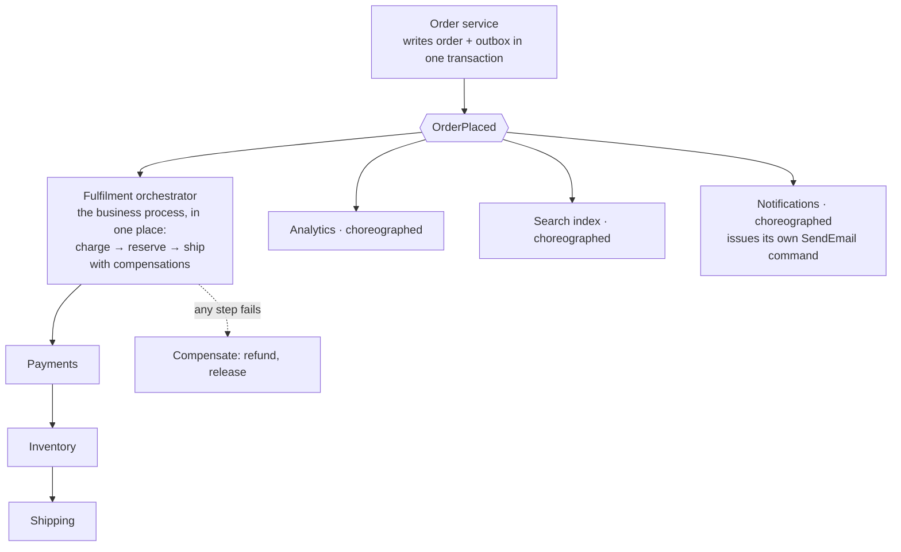

## The model

In a request-driven system, A calls B and waits. In an **event-driven architecture**, A
publishes a fact and stops caring; whoever is interested reacts.

The difference that matters is not asynchrony — it is direction. A calling B means A knows B
exists and fails when B does. A publishing an **event** means B knows about A, and B's
outage is B's problem. Dependencies point backwards, from consumer to producer, which is what
lets teams ship without coordinating.

## When to use it

Something has happened and one or more other parts of the system should respond.

1. **Does the caller need the result to continue?** If yes this is a **command** and should
   be a synchronous call — making it an event hides a failure the caller needed to see.
2. **Is the list of reactions open?** One fixed consumer forever is a direct call. A list
   that grows, from teams you do not control, is what events are for.
3. **Can the work be eventually consistent?** Event-driven means the reaction happens after
   the fact, so any invariant requiring both to be simultaneous cannot be built this way.

## Speedrun

**What** — producers publish facts to a log or topic; consumers subscribe and react. Two
words to keep straight:

| | Command | Event |
|---|---|---|
| Says | do this | this happened |
| Named | imperative — `SendEmail` | past tense — `OrderPlaced` |
| Recipient | one, known | any number, unknown |
| Caller expects | a result | nothing |
| Failure is | the caller's problem | the consumer's problem |

**How to design one**

1. **Name events as facts in the past tense.** `OrderPlaced`, not `SendConfirmation` — the
   second is a command in disguise and it puts the consumer list back in the producer.
2. **Publish through the [[transactional outbox]]**, so the state change and the event commit
   together. This is the defect the pattern is known for.
3. **Give every consumer its own retries and [[dead letter queue]]**, so one broken consumer
   is not everyone's outage.
4. **Make every consumer [[idempotency|idempotent]]** — delivery is [[at-least-once]].
5. **Choose choreography or orchestration deliberately**, and say which. Choreography is
   consumers reacting independently; orchestration is one coordinator directing them.
6. **Budget for tracing before you need it.** Without a correlation id through every event,
   nobody can answer "what happened to order 123".

**Why it works** — it inverts the dependency. The order service imports nothing from email,
analytics or search, so those three can be deployed, broken, or replaced without touching it.
That is [[Conway's Law]] used on purpose: the event boundary is drawn where the team boundary
is.

**The cost, plainly** — no single place describes what happens when an order is placed. The
behaviour is distributed across repositories, and you have traded legibility for independence.

## Going deeper

### Commands and events, and why the distinction is not pedantry

The same message can be modelled either way, and the choice determines who owns the failure.

`SendConfirmationEmail` is a command. The sender has decided what should happen, so it knows
about the email service, and if nothing consumes it the intent is silently lost.

`OrderPlaced` is an event. The sender states a fact and makes no claim about what follows.
Email, analytics and search each decide independently whether they care, and adding a fourth
reaction requires no change to the producer.

The tell that you have a command wearing an event's name is that the producer would be upset
if nobody consumed it. If the order service needs the email sent, it has a dependency on
email whatever the message is called — and modelling it as an event just hides that
dependency rather than removing it.

A useful middle: publish the event, and let a dedicated consumer own the command. The order
service publishes `OrderPlaced`; a notifications service subscribes and issues `SendEmail`
to itself. The dependency now lives in the service that actually cares.

### Choreography and orchestration

Two ways to run a multi-step workflow, and the tradeoff is legibility against coupling.

**Choreography** has each service react to events and emit its own. Order placed → payment
service charges → emits payment succeeded → fulfilment reserves stock → emits stock reserved
→ shipping books a courier. No coordinator, maximum independence.

The cost is that the workflow exists nowhere. To know what happens after an order, you read
five services and hope you found them all. Debugging a stall means asking each one in turn
whether it saw the event, and adding a step means finding the right place in a chain nobody
has drawn.

**Orchestration** has one coordinator that calls each step and holds the workflow state. The
sequence is in one file, readable, testable, changeable. The cost is that the orchestrator
knows about every participant, which is exactly the coupling events were meant to remove, and
it becomes a bottleneck for changes.

The rule that holds up: choreography for reactions that are genuinely independent — analytics,
search indexing, notifications, where nobody needs to know the others exist. Orchestration for
a business process with a defined outcome, where somebody will eventually ask "why is this
order stuck". Most systems need both, and using one for everything is where the pain comes
from.

### Temporal decoupling, which is the real prize

**Temporal decoupling** means producer and consumer do not need to be available at the same
time. The broker holds the message; a consumer that is down catches up when it returns.

The [[availability]] consequence is large and often understated. In a synchronous chain, the
request succeeds only if every service is up, so availabilities multiply — five services at
99.9% give 99.5%. With events, the producer succeeds if the broker is up, and consumers catch
up afterwards. The chain stops being a product.

It also decouples throughput. A producer bursting at 10,000 a second into consumers that
handle 1,000 is an outage synchronously and a queue that drains asynchronously. The buffer
converts a peak into a backlog, which is the same move as [[backpressure]] from the other
direction.

What it does not decouple is correctness. If the reaction must happen before the user is told
the operation succeeded, no amount of buffering helps — you have a synchronous requirement
wearing an asynchronous design.

### What it costs, and the three things to build early

The upside is well advertised. The bill is worth stating precisely, because underestimating
it is the standard failure.

**Traceability.** No single repository describes the flow. Without a correlation id
propagated through every event and a tracing system that assembles it, "what happened to
order 123" is an archaeology exercise across five services and their logs.

**Debugging is asynchronous.** The producer succeeded; something three hops away failed
silently. Alerting must be per consumer, because the producer has no idea anything went
wrong and never will.

**Schema evolution across teams.** Every consumer parses your event and deploys on its own
schedule. Additive changes are safe; anything else is a migration you cannot coordinate. A
schema registry with compatibility checking is not optional at any size.

The practical guidance is to build correlation ids, per-consumer alerting and a schema
registry at the same time as the first event, not after the third incident. They are cheap
at the start and retrofit badly.

### When not to use it

Two services that call each other, owned by the same team, with a fixed relationship. Events
add a broker, a schema contract, idempotency requirements and an observability gap in
exchange for decoupling nobody needs.

Anything requiring a synchronous answer. Authorisation, validation, payment authorisation —
the caller cannot continue without the result, and making it asynchronous means inventing a
way to wait, which is a worse version of a function call.

Small systems generally. The pattern's benefit scales with the number of independent teams
and consumers; below a handful, the legibility loss outweighs the coupling gain.

## See it work

Order placement, with the workflow split deliberately between the two styles.

The producer commits the order and the event together through the outbox, so there is no
window where one exists without the other. Everything downstream is off the [[critical path]],
which is why the checkout's availability no longer multiplies four dependencies.

Analytics, search and notifications are choreographed. They are genuinely independent, none
of them needs to know the others exist, and a fourth team can subscribe next quarter without
anyone's permission. If search breaks, orders keep being placed and search catches up on its
own offsets.

Fulfilment is orchestrated, because it is a business process with an outcome somebody will
ask about. Charging, reserving stock and booking a courier must happen in order, each can
fail, and each needs a compensating action. Written as choreography, "why is order 123 stuck"
would require reading three services; written as an orchestrator, the sequence and its state
are in one place.

Notifications shows the middle path. It subscribes to the event — so the order service knows
nothing about email — and then issues its own command internally. The dependency on the email
provider lives in the service that actually cares about it.

The thing this design gives up is that nobody can read the order service and learn that
placing an order sends an email. That is the trade, and the correlation id threaded through
every event is what makes it survivable.

## Next

CQRS separates the read model from the write model formally, and saga is the compensating
workflow the orchestrator above is running.
