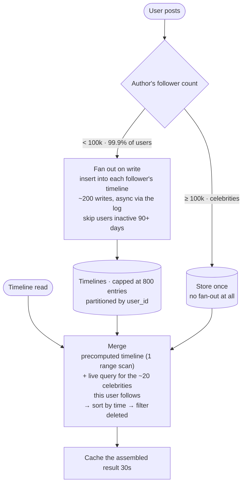

## The model

One person posts and a million people should see it. There are two places to do the work.

**Fan-out on write** copies the post into every follower's **timeline** as it is created, so
a read is one lookup. **Fan-out on read** stores the post once and assembles each timeline
when it is requested, so a write is one insert. The first makes reads trivial and writes
enormous; the second does the reverse.

## When to use it

You have a feed, a timeline, a notification list — anything where one write has many
readers.

1. **What is the read-to-write ratio?** Heavily read-dominated favours fan-out on write,
   because the expensive work then happens on the rare side.
2. **How skewed is the follower distribution?** If the largest account has millions of
   followers, pure fan-out on write cannot work for them — one post becomes millions of
   writes.
3. **How fresh must the timeline be?** Fan-out on write can lag by however long the fan-out
   takes. Fan-out on read is current by construction.

## Speedrun

**What** — push at write time or pull at read time.

| | Fan-out on write (push) | Fan-out on read (pull) |
|---|---|---|
| Write cost | O(followers) | O(1) |
| Read cost | O(1) | O(following) |
| Storage | one copy per follower | one copy total |
| Freshness | lags the fan-out | always current |
| Breaks on | accounts with millions of followers | users following thousands |

**How to choose, and why the answer is both**

1. **Compute the write amplification.** Average followers × posts per second is the number
   of timeline writes you are proposing. Say it out loud before choosing.
2. **Look at the tail of the follower distribution**, not the average. The average is
   irrelevant; the maximum decides whether push is possible.
3. **Use push for ordinary accounts.** Most users have hundreds of followers, so fan-out is
   cheap and reads become a single range scan.
4. **Use pull for the celebrities.** Do not fan out an account with ten million followers;
   store the post once and merge it in at read time.
5. **Merge at read time** — the precomputed timeline plus a live query for the handful of
   large accounts this user follows, combined and sorted.
6. **Set the threshold from your own data** and say what it is. "Above 100,000 followers we
   switch to pull" is a decision; "we handle celebrities differently" is not.

**Why it works** — the two costs are inverses, so the right answer depends on which side is
frequent, and the follower distribution is so skewed that no single answer fits everyone. The
hybrid pays the cheap cost on each side of the distribution.

**The number that decides it** — a post from an account with 50 million followers is 50
million timeline writes. At any realistic write throughput that is minutes of work for one
post, and it produces a [[hot partition]] while it runs.

## Going deeper

### The write amplification, in numbers

Fan-out on write turns one logical write into as many writes as the author has followers, and
the arithmetic is what makes the decision rather than taste.

Take 10 million users, averaging 200 followers, posting twice a day. That is 20 million posts
producing 4 billion timeline writes a day — about 46,000 writes a second sustained, before
any peak factor. Large, and entirely achievable with [[partitioning]].

Now add one account with 50 million followers. A single post from it is 50 million writes. At
50,000 writes a second that one post takes over sixteen minutes to deliver, during which the
account's followers see it at wildly different times, and the partition holding those writes
is saturated.

That is the **celebrity problem**, and the important property is that it is not a scaling
problem. Adding machines does not help, because the work for one post is inherently serial in
the number of followers and the partition it lands on is fixed by the key.

### The read side, and why pull is not free either

Fan-out on read looks elegant — one copy, always fresh — and its cost is proportional to how
many accounts a user follows.

A user following 500 accounts needs 500 queries, or one query across 500 keys, then a merge
and a sort, on every timeline load. At 50,000 timeline loads a second, that is 25 million
underlying reads a second. Reads are cheaper than writes and this is still a very large
number.

It also inherits [[the tail at scale]]. A timeline assembled from 500 sources is not done
until the slowest of them responds, so the p99 of the timeline is far worse than the p99 of
any single query. Fan-out on read has bad tail behaviour by construction.

The saving grace is cacheability: an assembled timeline can be cached for a few seconds, and
at high read volume that collapses most of the cost. Which is to say pull with a cache is
push with a shorter horizon — the two converge more than the clean dichotomy suggests.

### The hybrid, which is what everyone actually builds

The follower distribution is a power law: almost everyone has few followers, a tiny number
have millions. So the design splits on that.

**Ordinary accounts push.** A post fans out to followers' timelines as it is written.
Cheap — a few hundred writes — and the reader gets a precomputed list.

**Large accounts pull.** Their posts are stored once and not fanned out at all.

**Read merges the two.** Fetch the user's precomputed timeline, then query the handful of
large accounts they follow directly, merge by timestamp, sort, and return. Since almost
nobody follows more than a few dozen celebrities, that live query is small and bounded.

The threshold is a tuning parameter, typically in the tens of thousands of followers, and the
right value depends on your write capacity rather than on principle. What matters in an
interview is knowing that the threshold exists and that it is set from measured data.

One refinement worth mentioning: inactive users. Fanning out to accounts that have not opened
the app in a year is pure waste, and skipping them — then backfilling on their return — cuts
a large fraction of fan-out volume in mature products.

### What else the choice decides

The fan-out model reaches further into the design than it first appears.

**Ranking.** A precomputed timeline is written in whatever order the fan-out ran, so
re-ranking it later means rewriting it. If ranking is dynamic and personalised, pull is more
natural, because the ranking happens at assembly.

**Deletion and editing.** With push, deleting a post means finding and removing millions of
copies. With pull, it is one delete. Systems that push usually filter deleted posts at read
time instead — which quietly puts a read-time cost back into the design.

**Storage.** Push stores one row per follower per post, so storage scales with the product of
posts and followers rather than with posts. It is usually bounded by capping timeline length
— keep the newest 800 entries, drop the rest, and accept that deep scrollback falls back to
pull.

That cap is worth knowing as a general move: precomputed views are almost always bounded, and
the boundary is where the other strategy takes over.

## See it work

A social product: 10 million users, average 200 followers, some accounts above 10 million.

Ordinary posts fan out. Two hundred writes per post is cheap, it happens asynchronously off
the [[critical path]] via the event log, and skipping users inactive for ninety days removes a
large share of the volume in a mature product.

Celebrity posts do not fan out at all. Fifty million writes for one post would take minutes
and saturate a partition, and no amount of capacity fixes it — so those posts are stored once
and merged in later.

A read is one range scan against the precomputed timeline plus a small live query for the
celebrities this user follows. That second part is bounded because following twenty large
accounts is normal and following a thousand is not, so the merge stays cheap and the tail
behaviour stays acceptable.

Timelines are capped at 800 entries, which bounds storage at users × 800 rather than at
users × posts. Scrolling past that falls back to a pull query, which is slower and almost
nobody does it.

Deleted posts are filtered at read time rather than removed from every timeline, because
finding millions of copies is worse than one cheap check. That is the read-time cost that
push quietly incurs, and naming it is the difference between having chosen the model and
having inherited it.

## Next

Event-driven architecture generalises the asynchronous delivery this depends on, and CQRS
formalises the split between the write path and the assembled read view.
