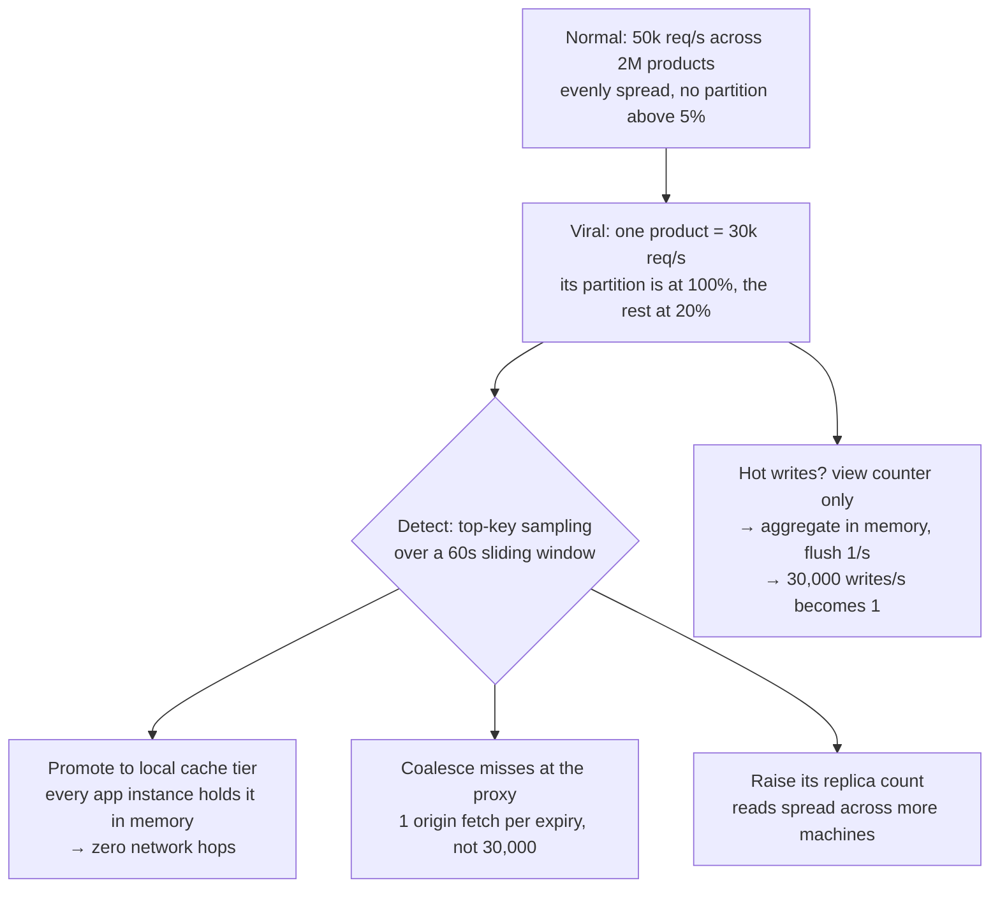

## The model

**Skew** is the gap between how evenly you assumed load was distributed and how unevenly it
actually is. Real distributions follow a **power law**: a few keys get most of the traffic.

That matters because partitioned systems assume rough uniformity. A partition lives on one
machine, so a key receiving a hundred times its share turns that machine into the system's
limit — the exact limit you paid to remove by partitioning. Adding machines does not help,
because the hot key still hashes to one of them.

## When to use it

You are partitioning, caching, or fanning out anything keyed by an entity users choose.

1. **What does the distribution's tail look like?** Sort your entities by traffic and look at
   the top one against the median. A factor of a thousand means uniformity assumptions are
   already false.
2. **Is the hot key hot for reads or for writes?** Reads are fixable by copying — replicas,
   caches. Writes are much harder, because copies must converge.
3. **Is it permanently hot or briefly hot?** A whale tenant is stable and can be handled by
   configuration. A viral post is sudden and needs a mechanism that reacts on its own.

## Speedrun

**What** — one key takes a disproportionate share, and its partition saturates while others
idle. Four shapes recur:

| Shape | Example | Fix |
|---|---|---|
| Celebrity | 50M followers, one post | fan out on read for that account |
| Whale tenant | one customer, 40% of rows | salt the key into buckets |
| Append point | partition by time, all writes are "now" | hash the key, range within it |
| Viral item | one product on the front page | replicate reads, coalesce misses |

**How to handle a hot key**

1. **Find it before you choose the partition key.** Sort entities by volume and look at the
   maximum, not the mean.
2. **For hot reads, add copies.** A [[cache]] in front, more replicas, or a **local cache
   tier** on each application instance for the top few keys.
3. **For hot writes, salt the key.** `user_id` becomes `user_id:0` … `user_id:15`, so one
   logical key spans sixteen partitions. Reads then gather from all sixteen, which is the
   cost you are paying.
4. **Apply salting only to the keys that need it.** Salting everything doubles read cost
   system-wide to fix a problem affecting 0.01% of keys.
5. **Coalesce concurrent misses.** A hundred simultaneous requests for one expired key become
   one origin fetch and 99 waiters — this is the [[thundering herd]] fix.
6. **Handle the extreme case differently rather than better.** Celebrity accounts often get a
   separate code path, and that is a design decision rather than a workaround.

**Why it works** — the fixes all convert one key into many, or one request into fewer. Copies
spread reads across machines; salting spreads writes; coalescing removes duplicate work
entirely. Nothing makes a single partition faster, because that is not available.

**The property that makes this hard** — a hot key is not a capacity problem. Doubling the
cluster leaves the hot partition exactly as hot, which is why it surprises people who have
been scaling successfully by adding machines.

## Going deeper

### Why uniformity is never the reality

Partitioning and load balancing both assume load spreads roughly evenly, and human-generated
distributions almost never do.

Followers, product popularity, tenant size, file access, search terms — all follow a power
law, where the top item is often orders of magnitude above the median. This is not an
anomaly to design around; it is the normal shape of anything people choose.

The practical consequence is that **the average is the wrong statistic for capacity
planning**. Sizing a partition for average load and then discovering the largest key is a
thousand times the median is the standard failure, and it is discoverable in advance by
looking at the maximum instead.

The check worth running before choosing any partition key: sort entities by volume, and
compare the 99.9th percentile to the median. If the ratio is large, you need a plan for the
tail before you ship the key.

### Hot reads, which are the tractable case

Reads are fixable, because a read can be served from any copy.

**Cache it.** One popular key is the ideal cache entry — high hit rate, one entry, enormous
leverage. This alone solves most read hot spots.

**Replicate more.** More replicas of the partition holding the hot key spreads reads without
touching the write path.

**Add a local cache tier.** Each application instance caches the top N keys in its own memory,
so a hot key is served without any network hop at all. Small, bounded, and it removes the
hottest traffic from the shared cache entirely — at the cost of per-instance staleness.

**Coalesce.** When a hot key expires, every concurrent request misses at once. **Request
coalescing** lets one of them fetch while the rest wait for its result, turning a hundred
origin requests into one. A [[reverse proxy]] does this for free, and it is the single most
valuable mechanism here because the moment of expiry is exactly the moment of danger.

### Hot writes, which are genuinely hard

Writes cannot be spread by copying, because the copies would have to agree. The only real
answer is to make one logical key into several physical ones.

**Key salting** appends a bucket: `counter:page-1` becomes `counter:page-1:0` through
`counter:page-1:15`, and a write picks a bucket at random. Sixteen partitions absorb the load
instead of one, and a read must sum all sixteen.

That read cost is the trade, and it is why salting is applied selectively. Salting every key
in the system multiplies every read by the bucket count to fix a problem that affects a
handful of keys — so the mature version keeps a list of known-hot keys and salts only those,
often updated automatically from traffic.

**Batching** is the other lever. If a counter is incremented ten thousand times a second,
aggregate in memory and flush once a second. Ten thousand writes become one, at the cost of
losing at most a second of increments on a crash — usually acceptable for counters and never
for money.

**Not writing** is the best answer when it is available. A view counter does not need to be
exact or immediate, and pushing it through a stream to be aggregated offline removes the hot
write entirely rather than distributing it.

### Detecting it rather than predicting it

Some hot keys are stable and can be configured. Viral content is not — it appears in minutes
and no static configuration anticipates it.

That argues for detection: sample requests, track the top keys by frequency over a sliding
window, and react automatically. Reacting means promoting the key into a local cache tier,
increasing its replication, or turning on salting for it.

**Adaptive replication** is the general name — the system notices a key is hot and creates
more copies of it, without anyone deciding. It is what large key-value stores do internally,
and it is a strong thing to propose in an interview because it addresses the case a static
design cannot.

The monitoring that makes any of this possible is per-key or per-partition metrics rather
than aggregate ones. A cluster at 40% average utilisation with one partition at 100% looks
healthy on every dashboard that averages, which is why "we would alert on partition-level
skew" is worth saying.

## See it work

A product page goes viral: one item takes 60% of all catalogue traffic within ten minutes.

Nothing about the cluster changed — it has the same capacity it had ten minutes earlier, at
40% average utilisation. One partition is saturated and every average-based dashboard says
the system is healthy, which is why per-partition metrics are the prerequisite for noticing
at all.

Adding machines would not help. The hot key hashes to one partition, so doubling the cluster
gives that key exactly the same single machine it had before. This is the property that makes
hot keys feel unfair to teams who have been scaling successfully by adding capacity.

The read fixes are all forms of copying. A local cache tier on each application instance
serves the item with no network hop, which is the strongest available move because it removes
the traffic from the shared infrastructure entirely. Coalescing at the proxy handles the
dangerous moment — expiry, when thirty thousand concurrent requests would otherwise all miss
at once.

The only hot write here is a view counter, and it gets the cheapest answer available: do not
write it. Aggregate in memory, flush once a second, accept losing at most a second's counts
on a crash. Thirty thousand writes a second becomes one.

Notice what was not needed. No salting, because the write was removable rather than
distributable. Salting would have been the answer if this were a shared counter that had to
be exact — and the read amplification it costs is why it was worth checking for the cheaper
option first.

## Next

Multi-region is where the same distribution problems reappear across continents, with the
speed of light added.
