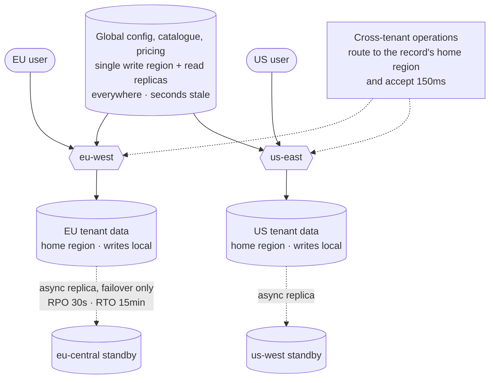

## The model

Running in several regions buys two different things people conflate. **Latency**, because a
user in São Paulo talks to São Paulo rather than to Virginia. And **survival**, because a
region can be lost without the product going with it.

The cost is one number: about 150 milliseconds round trip between continents, set by the
speed of light and not improvable. Any write that must be agreed across regions pays it. So
the entire design question is which operations are allowed to be local.

## When to use it

You have users on more than one continent, or a requirement to survive losing a region.

1. **Latency or survival?** They lead to different designs. Latency needs reads served
   locally everywhere; survival needs a second region that can take over, which can be
   otherwise idle.
2. **Can writes be local?** If each record has a natural home — a user, a tenant, a
   region-scoped account — then **geo-partitioning** gives you local writes. If any record
   can be written from anywhere, you are choosing between conflicts and latency.
3. **What is the actual recovery requirement?** Put numbers on it: how much data may be lost
   (**RPO**) and how long recovery may take (**RTO**). Those two decide the architecture more
   than any preference.

## Speedrun

**What** — three topologies, in increasing order of cost and capability.

| | Active-passive | Active-active | Geo-partitioned |
|---|---|---|---|
| Writes | one region | any region | the record's home region |
| Read latency | far for most users | local | local for local records |
| Conflicts | none | yes, must be resolved | none |
| On region loss | promote the standby | shed traffic to others | that region's data is unavailable |
| Complexity | low | high | medium |

**How to approach it**

1. **Start with reads.** Replicate read-only copies to every region and serve reads locally.
   This is most of the latency win for a fraction of the difficulty.
2. **Keep writes in one region until that hurts.** A single write region has no conflicts,
   and cross-region write latency is only paid by users far from it.
3. **Then geo-partition rather than going active-active.** Give each record a **home
   region** and route its writes there. Local writes with no conflict resolution.
4. **Only go active-active if any record must be writable anywhere**, and budget for conflict
   resolution as a permanent, per-data-type obligation.
5. **State RPO and RTO as numbers**, and check the replication mode matches. Asynchronous
   replication means RPO greater than zero — you will lose the last few seconds.
6. **Test the failover.** An untested failover is a plan, not a capability, and the failure
   rate of first attempts is high.

**Why it works** — reads can be copied freely, so they localise easily. Writes need agreement,
and agreement across regions costs a round trip. Every workable topology is an answer to
"which writes can avoid agreeing".

**The number that governs everything** — 150 ms round trip between continents. A synchronous
cross-region write cannot be faster, no matter what you build.

## Going deeper

### Active-passive, and what failover actually costs

One region serves everything; another holds a replicated copy and waits. On failure, promote
the standby.

It is the simplest topology and it is often the right one, because most systems need survival
rather than global latency. What it does not give you is a latency win — users far from the
active region pay the distance on every request.

The costs live in the failover, and they are the same ones from [[replication]] at larger
scale:

- Asynchronous replication loses whatever had not shipped — that is your RPO, and it is
  not zero.
- Deciding a region is actually dead is hard, and being wrong means [[split brain]] across
  continents.
- DNS and connection draining take minutes.
- A standby that has never served traffic is a standby nobody knows works.

Which is why the discipline that matters is failing over regularly on purpose. A quarterly
planned failover converts an untested plan into a tested capability, and it is a strong thing
to volunteer in a design discussion.

### Active-active, and the conflicts you inherit

Every region accepts writes and replicates to the others. Local writes everywhere, survives
any region, and the price is concurrent writes to the same record in different places.

The price is not incremental. Two regions writing the same record at the same time produce
two versions with no principled way to choose between them. Last-write-wins picks by clock,
clocks across datacentres disagree, and the loser's data is silently discarded — which is
data loss dressed as a resolution strategy.

Doing better means merging at the application level, per data type, forever. Some types merge
cleanly — a set of items, a counter, anything expressible as a CRDT converges by
construction. Others do not: two edits to the same text, two changes to the same address.
Those need a human, or a rule that is a business decision rather than an engineering one.

The honest summary is that active-active is a commitment to owning conflict resolution
permanently. It is right for products where local writes are genuinely required everywhere,
and it is chosen far more often than it is needed.

### Geo-partitioning, which is usually the answer

Most data has a natural home. A user's data belongs to the user, and the user lives
somewhere. A tenant's data belongs to the tenant, and the tenant has a country.

**Geo-partitioning** gives each record a **home region** and routes its writes there. A
European user's writes go to Europe and are local; their reads are local; and no other region
ever writes their data, so there are no conflicts to resolve.

This gets you most of active-active's benefit with none of its hardest problem. It is why the
pattern is so common in practice, and it composes with everything else — the home region is
just another dimension of the [[shard key]].

Two things it does not solve, worth naming. Cross-region operations — a European user
messaging an American one — still cost a round trip somewhere. And losing a region makes that
region's records unavailable rather than merely slow, unless you also replicate across
regions for failover, which most designs do.

Data residency is often what forces this topology anyway. GDPR and similar rules make "this
data stays in this jurisdiction" a legal constraint, and geo-partitioning is the architecture
that satisfies it.

### RPO, RTO, and picking a replication mode

Two numbers that turn "highly available" into something designable.

**Recovery point objective** is how much data you may lose. Zero means synchronous
replication and a write that waits for another region — 150 ms on every write. Thirty seconds
means asynchronous replication, which is fast and loses the tail.

**Recovery time objective** is how long recovery may take. Seconds means automatic failover
with all its split-brain risk. An hour means a human can be involved, which is dramatically
simpler and cheaper.

Most teams say they need RPO zero and RTO seconds, and most products do not. A payment ledger
might. A social feed does not, and paying 150 ms on every write to protect against losing
thirty seconds of feed data during a once-in-three-years regional outage is a bad trade made
by default.

Asking "how much data can we lose, and how long can we take" is the question that makes this
concrete, and the answers usually permit something much simpler than the initial instinct.

### What gets forgotten

**Cost.** Cross-region data transfer is expensive, often more than the compute. A chatty
service replicated across three regions can spend more on egress than on servers.

**The control plane.** Your deployment pipeline, secret store, feature flags and monitoring
are usually in one region. A design that survives losing a region but cannot deploy or observe
during the outage has not survived it in any useful sense.

**Schema migrations.** Rolling a schema change across regions with replication in flight is
substantially harder than doing it in one, and it is where multi-region systems spend
unglamorous engineering time.

**Testing.** Latency and partition behaviour between regions cannot be reproduced on a
laptop. Without deliberate fault injection, the first real partition is the first test.

## See it work

A SaaS product with tenants in Europe and North America, and a legal requirement that EU data
stays in the EU.

Geo-partitioning falls out of the legal requirement rather than the latency one, which is
common. EU tenant data lives in the EU, so writes are local, reads are local, and no
conflict resolution exists because no other region ever writes it.

Within each geography, the topology is active-passive with an asynchronous standby. RPO is
thirty seconds and RTO is fifteen minutes, which are numbers the business agreed to — and
saying them out loud is what makes this a design rather than a hope. Synchronous replication
would give RPO zero and charge every write for it, which nobody wanted once the trade was
stated.

Global data — the catalogue, pricing, configuration — is read-heavy and rarely written, so it
gets one write region and read replicas everywhere. Seconds of staleness on a price list is
invisible, and this is the cheapest possible answer for the most-read data in the system.

Cross-tenant operations pay the 150 ms and are routed to the record's home region. There is
no way around it; the only choice is whether the cost is explicit in the design or discovered
in production.

What this is not is active-active. No record is writable from two regions, so there is no
conflict resolution anywhere in the system — which is a large amount of permanent complexity
avoided by accepting that most data has a home.

## Next

That is the pattern vocabulary. The canonical designs put these together against whole
problems, where the work is choosing among them and defending the choice.
