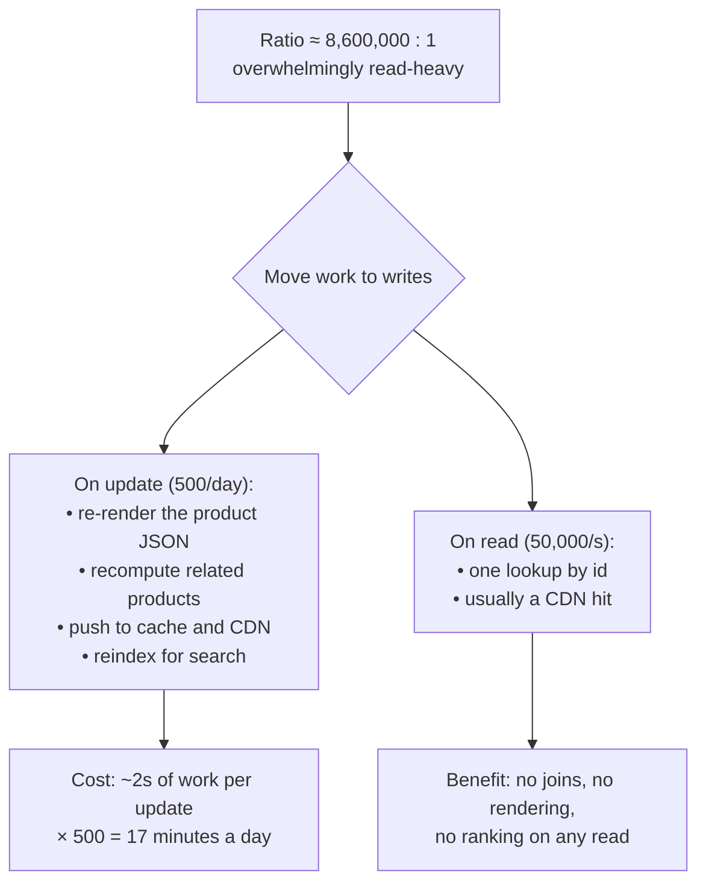

## The model

The **read-to-write ratio** is how many reads happen per write. Social feeds run around
100:1 or higher; a metrics pipeline can be the reverse.

It matters because it tells you which side you can afford to make expensive. Work moved to
the rare operation is paid rarely; work left on the common one is paid constantly. Almost
every architectural move in a design — caching, denormalisation, precomputation, indexing —
is the same trick: make the frequent path cheap by making the rare path do more.

## When to use it

You have scoped the system and are about to choose a storage and caching strategy.

1. **Which side dominates?** State the ratio as a number. 100:1 read-heavy licenses
   aggressive caching and [[denormalisation]]; 1:100 write-heavy makes both counterproductive.
2. **Can the expensive work move to the rare side?** If reads dominate, assemble at write
   time. If writes dominate, store raw and compute on read.
3. **What does that cost in staleness?** Every move to the write side creates a copy that
   can be out of date, so the answer must be a number of seconds you are willing to defend.

## Speedrun

**What** — the ratio decides the direction of every optimisation in the design.

| | Read-heavy (100:1) | Write-heavy (1:100) |
|---|---|---|
| Do work at | write time | read time |
| Storage | denormalised, duplicated | normalised, append-only |
| Indexes | many, generously | few — each one taxes every write |
| Caching | aggressive, high payoff | little payoff, hit rate is low |
| Scaling move | [[replication]] first | [[partitioning]] first |
| Typical | feeds, catalogues, profiles | metrics, logs, IoT, events |

**How to use the ratio**

1. **Compute it during estimation**, from the [[back-of-envelope]] numbers, and say it out
   loud: "roughly 100 reads per write."
2. **Name the read path and the write path separately.** They are two systems sharing
   storage, and conflating them is why designs get muddled.
3. **Push work toward the rare side.** Read-heavy means precompute, denormalise, cache.
   Write-heavy means append cheaply and aggregate later.
4. **Check the ratio per entity, not per system.** A product catalogue is read-heavy and its
   order table is not, inside the same product.
5. **State the staleness you bought.** Precomputation trades freshness for read speed, and
   the trade only counts as deliberate if the number is stated.
6. **Recheck at the peak.** A ratio measured on daily averages hides a write spike that
   inverts it for ten minutes a day.

**Why it works** — total cost is reads × cost-per-read plus writes × cost-per-write. When one
term is a hundred times the other, reducing the large one at the expense of the small one is
almost always a win, and the arithmetic tells you by how much before you build anything.

**The trap** — assuming read-heavy because most systems are. A write-heavy system with a
read-heavy design collapses under index maintenance, and the failure looks like slow writes
rather than like a wrong choice.

## Going deeper

### Where the work can actually move

Only some work is movable, and knowing which kind you have is the whole skill.

**Assembly is movable.** Joining, aggregating, formatting, ranking — anything producing a
view from parts can happen at write time and be stored, or at read time and be computed. This
is where precomputation lives.

**Validation is not.** Checking that a write is allowed must happen at write time by
definition.

**Freshness-critical reads are not.** A balance checked before a transfer cannot be served
from something precomputed an hour ago, whatever the ratio says.

So the move is: identify the assembly work on the read path, and ask whether it can be done
once per write instead of once per read. At 100:1 that is a hundredfold reduction in how
often the expensive thing runs, which is a bigger factor than any amount of tuning.

### Read amplification, and how it hides

**Read amplification** is the number of underlying operations one logical read costs. A
profile page issuing eleven queries has an amplification of eleven, and at 5,000 page views a
second that is 55,000 database operations.

It hides because each query looks cheap in isolation. The N+1 pattern — fetch a list, then
fetch each item's details in a loop — is the standard offender, and it is invisible in code
review while being the largest single cost in the system.

The fixes are the standard ones and they are all the same move:

- Batch the N queries into one.
- Denormalise so the join is unnecessary.
- Cache the assembled result.

Each reduces amplification, and each pays for itself in proportion to the read side of the
ratio.

### Write-heavy, which behaves differently

A write-heavy system inverts most of the received wisdom, and the inversions are worth
knowing because they are counterintuitive.

**Indexes become expensive rather than free.** Every index is another write per write, so the
usual advice to add one for each slow query is actively harmful here. Write-heavy systems
keep few indexes and accept slower reads.

**Caching largely stops working.** A cache helps when the same value is read many times
between writes. If writes outnumber reads, most cached entries are invalidated before anyone
reads them, and the cache is pure overhead.

**Replication does not help.** More replicas serve more reads, and reads are not the problem.
[[Partitioning]] is the move, because it is the only one that scales writes.

**Storage shape changes.** Append-only beats update-in-place, because appends are sequential
and updates are random. This is why time-series and log systems use LSM trees rather than
B-trees — they trade read cost for write throughput deliberately.

The clean example is metrics: millions of writes a second, and most data points are never
read at all. Storing them cheaply and computing aggregates lazily is right, and building a
carefully indexed schema for queries nobody runs is a large amount of wasted throughput.

### When the ratio changes, and designing for it

The ratio is a property of the product, and products change.

A publishing system starts write-heavy during authoring and becomes read-heavy on
publication. An analytics system is write-heavy until someone builds a dashboard. A social
product's ratio climbs as the audience grows relative to the creators.

The practical protection is to keep the read and write paths separable, so one can change
without rewriting the other — which is the argument [[CQRS]] makes formally. You do not need
the full pattern to get the benefit; you need the read path to be a thing you could replace.

## See it work

A product catalogue: 50,000 page views a second, 500 product updates a day.

The ratio here is extreme enough that the answer is not subtle: doing anything at read time
that could be done at write time is a mistake by roughly six orders of magnitude.

So a product update triggers everything expensive. Re-render the full JSON the page needs,
recompute the related-products list, push the result to the cache and the CDN, and reindex
for search. Two seconds of work per update, five hundred times a day, is seventeen minutes of
compute daily.

A read then costs one lookup by id, and usually not even that — most are CDN hits that never
reach the origin. There are no joins on the read path, no ranking, no template rendering.

The staleness this buys has to be stated: a product change is visible within the cache TTL,
say sixty seconds. For a catalogue that is obviously fine, and saying it explicitly is what
makes it a decision rather than an accident.

The inversion is worth noting too. Were this a metrics pipeline at 500,000 writes a second
and a handful of dashboard queries, every one of these moves would be wrong — the precomputed
views would be invalidated before anyone read them, and the CDN would serve almost nothing.

## Next

Fan-out on write versus read is this same trade applied to the hardest case, where one write
must reach millions of readers.
