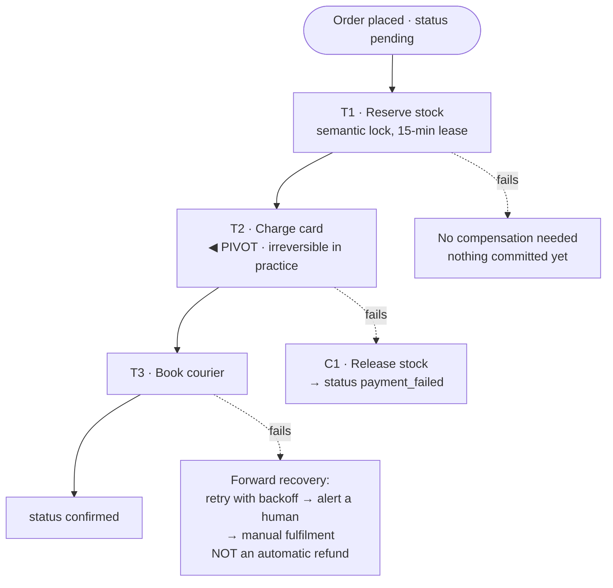

## The model

A business operation spans several services — charge the card, reserve the stock, book the
courier — and there is no transaction that can cover all three.

A **saga** runs them as a sequence of local transactions, each of which commits immediately,
plus a **compensating transaction** for each that undoes its effect. If step four fails, you
run the compensations for three, two and one. The system reaches a consistent state by moving
forward through an undo rather than by rolling back.

## When to use it

An operation must span services, and [[two-phase commit]] is unavailable or unacceptable.

1. **Can this be one transaction?** If all the data lives in one database, use a real
   transaction. Sagas are for when that is genuinely impossible, not for when it is
   inconvenient.
2. **Is every step compensable?** Refunding a charge, releasing a reservation, cancelling a
   booking — yes. Sending an email or firing a missile — no, and those steps determine the
   shape of the whole saga.
3. **Can the intermediate state be visible?** A saga is not isolated. Other transactions will
   observe the half-finished state, so it must be a state your product can represent.

## Speedrun

**What** — N local transactions T₁…Tₙ, each with a compensation C₁…Cₙ. Success runs
T₁…Tₙ. Failure at step k runs C_{k-1}…C₁ in reverse.

```
T1 → T2 → T3 → T4 ✗
          C3 ← C2 ← C1        (reverse order, each undoing its own step)
```

**How to design one**

1. **Order the steps so the reversible ones come first.** The **pivot step** is the one past
   which you cannot undo; everything before it is cheap to unwind.
2. **Write the compensation with the step**, not later. A step whose compensation you cannot
   name is a step you do not understand.
3. **Make every step and every compensation idempotent ([[idempotency]]).** Both will be
   retried, because the coordinator can crash between them.
4. **Model the intermediate state explicitly** — `pending`, `reserved`, `awaiting_payment` —
   so other code reads a real state rather than an inconsistent one.
5. **Choose orchestration for anything anyone will debug.** A [[choreography]]-based
   saga has its workflow in no single place.
6. **Prefer forward recovery past the pivot.** Once you are past the point of no return,
   retry until it succeeds rather than trying to unwind.

**Why it works** — it exchanges atomicity for availability. No participant holds locks
waiting for a coordinator, so nothing blocks and no service's failure freezes the others. The
system is inconsistent in the middle and converges at the end.

**What it is not** — isolated. A saga has no I in ACID. Between steps, other readers see a
partial state, and that is a design input rather than an implementation detail.

## Going deeper

### Why not two-phase commit

Two-phase commit gives real atomicity across services, and its failure mode is why
distributed systems avoid it.

Between prepare and commit, every participant holds locks and cannot decide alone. If the
coordinator dies in that window they wait — rows frozen, locks held — until it returns. The
availability of the operation is now the product of every participant's availability *and*
the coordinator's, which is the [[availability]] arithmetic working against you at exactly
the worst moment.

A saga inverts the trade. Each step commits immediately, so nothing is ever held. The price
is that a failure leaves work already committed that must now be undone deliberately, and
that there is a window where the system is visibly inconsistent.

Stated as a razor: two-phase commit buys consistency with availability, a saga buys
availability with isolation. Being able to say which you chose and why is the answer.

### Compensations are not rollbacks

A rollback erases history. A compensation adds to it, and the difference has consequences
people miss.

A refund is not the absence of a charge. The customer saw the charge, the statement shows
both lines, and the money moved twice. A cancelled booking may have blocked someone else's
reservation for ten minutes. A released stock reservation may have caused an out-of-stock
message to a different customer who has now gone elsewhere.

So compensations must be semantically correct rather than mechanically inverse, and some
effects cannot be compensated at all. An email cannot be unsent — the best available
compensation is a second email saying to disregard the first, which is a product decision
rather than a technical one.

The design rule that falls out is to **order steps so the irreversible ones come last**.
Reserve stock first, book the courier next, charge the card last. Then a failure at any point
before the charge costs only releases, and the step you cannot undo is the one least likely
to be followed by another failure.

### The pivot step, and forward recovery

The **pivot step** is the point past which unwinding is no longer sensible. Before it,
failure means **backward recovery** — run the compensations. After it, failure means
**forward recovery** — keep retrying until the remaining steps succeed.

Charging the card is usually the pivot. Once the money has moved, "undo everything" means a
refund, an apology and a customer who is not coming back. It is nearly always better to keep
trying to fulfil: retry the courier booking, page a human, fulfil manually if necessary.

Naming the pivot in a design is a strong signal, because it shows you have thought about
which failures are recoverable rather than assuming symmetry. And it changes the operational
story: before the pivot, failures are automatic; after it, failures are alerts.

### Semantic locks, and the isolation you have to build

Because sagas are not isolated, another operation can act on data mid-saga. The mitigation is
a **semantic lock**: a status field that tells everyone else this is in flight.

An order in `pending_payment` is visible but not yet fulfillable. Stock marked `reserved`
rather than decremented is unavailable to others but not yet sold. The state is explicit, so
other code can make correct decisions rather than seeing an inconsistent world and guessing.

Two things follow from that. Every consumer of this data must understand the intermediate
states, which is a real coupling cost. And reservations need expiry, or a crashed saga leaves
stock locked forever — a lease, with all the [[distributed lock]] caveats that implies.

The general shape is that a saga converts an isolation problem into a modelling problem. The
half-finished states become part of your domain vocabulary, and that is usually an
improvement in clarity even though it is more work.

### Orchestration or choreography, again

Both work, and the choice mirrors the one on the event-driven page.

**Choreographed** sagas have each service listen for the previous step's event and emit its
own. No coordinator, and the workflow exists only as an emergent property of five services.
Debugging a stuck order means asking each service whether it saw the event.

**Orchestrated** sagas have a coordinator holding the state machine: which step we are on,
what to do next, what to compensate on failure. The workflow is in one file. The coordinator
knows every participant, which is coupling, and it is the right trade for anything with a
business owner who will ask questions.

For sagas specifically the balance leans further toward orchestration than for events
generally, because a saga has a defined outcome and a failure path. A workflow nobody can see
is one nobody can fix, and sagas fail in ways that need fixing.

## See it work

Placing an order: reserve stock, charge the card, book a courier.



The steps are ordered so the cheap, reversible local transactions come first. Reserving stock
commits nothing that costs money, and its compensating action is a release — so a failure
here is free.

Charging the card is the pivot. Before it, a failure unwinds automatically: release the
reservation, mark the order `payment_failed`, tell the customer. After it, unwinding means
refunding someone who wanted the thing they paid for, which is worse than almost any delay.

So a courier failure triggers forward recovery instead. Retry with backoff, then alert a
human, then fulfil manually if it comes to that. Automatically refunding here would be
technically tidy and commercially wrong, and recognising that is the point of naming a pivot
at all.

The semantic lock is what keeps other code correct in the middle. Stock is `reserved` rather
than decremented, so it is unavailable to other buyers but not yet sold, and every consumer
of stock levels must understand that state. The fifteen-minute lease means a saga that dies
between steps does not hold the stock forever.

Every step and every compensation is idempotent, because the orchestrator can crash after
executing a step and before recording it — so on restart it will re-run something already
done. Without idempotency, a retry double-charges, and the saga's own recovery becomes the
defect.

## Next

Hot keys and skew is the failure that appears once these workflows run at volume, and
multi-region is what changes when they span continents.
